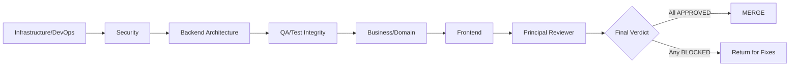

# Code Review: Centralized HTTP Status Code API

This Segmented PR Review artifact governs the merge decision for the **Centralized HTTP Status Code API** refactor against the NGINX 1.29.5 baseline at revision `master_fc613b`. The refactor's scope is confined to the `src/http/` subtree; it introduces a Registry+Facade design pattern that mediates all status-code assignments through a unified API (`ngx_http_status_set`, `ngx_http_status_validate`, `ngx_http_status_reason`, `ngx_http_status_is_cacheable`, `ngx_http_status_register`) while preserving — byte-for-byte — all 58 existing `NGX_HTTP_*` preprocessor constants, the `ngx_http_status_lines[]` wire table, the `ngx_http_error_pages[]` error-page table, the `error_page` directive parser semantics, the module ABI (`NGX_MODULE_V1`), the filter-chain interfaces, and every security invariant (keep-alive disablement for 8 codes, lingering-close disablement for 4 codes, TLS masquerade for 494/495/496/497 → wire 400, MSIE refresh for 301/302). The deliverable lands as a single commit / single phase. This review's six-phase segmentation is for review-time slicing only; it does NOT imply staged delivery. The mandatory validation gates are: nginx-tests Perl suite passes against the refactored binary, `valgrind --leak-check=full` reports zero leaks in new code paths, `wrk -t4 -c100 -d30s` measures less than 2 % latency overhead at p50/p95/p99, the binary builds clean under both default and `--with-http_status_validation` flags, and no out-of-scope subsystem (`src/event/`, `src/core/ngx_conf_file.c`, `src/core/ngx_palloc.c`, `src/stream/`, `src/mail/`) is touched.

## Phase Workflow Diagram

The pipeline below depicts the strict left-to-right phase ordering. Each phase must reach a terminal status (`APPROVED` or `BLOCKED`) before the next phase opens; the Principal Reviewer runs only after all six domain phases reach terminal status.



## Status Legend

The following four status values are the only legal values for any `status:` field in the YAML frontmatter or any **Decision** field in a domain-phase verdict. The auxiliary value `APPROVED-NO-CHANGES` is reserved for the Frontend phase and signals "no in-scope changes; no findings; no objections."

- `OPEN` — phase not yet started
- `IN_REVIEW` — Expert Agent actively reviewing
- `APPROVED` — phase complete, no blockers
- `BLOCKED` — issues found; cannot proceed until resolved

## Files-in-Scope Coverage Matrix

The 26 in-scope files (21 source/build files + 5 documentation/deck artifacts) are partitioned across exactly one domain phase each. No file is double-assigned. The Frontend phase carries zero files by design (no UI surface).

| # | File | Domain Phase |
|---|------|--------------|
| 1 | `auto/modules` | Infrastructure/DevOps |
| 2 | `auto/options` | Infrastructure/DevOps |
| 3 | `auto/summary` | Infrastructure/DevOps |
| 4 | `auto/define` | Infrastructure/DevOps |
| 5 | `src/http/ngx_http_special_response.c` | Security |
| 6 | `src/http/ngx_http_core_module.c` | Security |
| 7 | `src/http/ngx_http_upstream.c` | Security |
| 8 | `src/http/ngx_http.h` | Backend Architecture |
| 9 | `src/http/ngx_http_status.h` | Backend Architecture |
| 10 | `src/http/ngx_http_status.c` | Backend Architecture |
| 11 | `src/http/ngx_http_request.c` | Backend Architecture |
| 12 | `src/http/modules/ngx_http_static_module.c` | Backend Architecture |
| 13 | `src/http/modules/ngx_http_autoindex_module.c` | Backend Architecture |
| 14 | `src/http/modules/ngx_http_index_module.c` | Backend Architecture |
| 15 | `src/http/modules/ngx_http_dav_module.c` | Backend Architecture |
| 16 | `src/http/modules/ngx_http_gzip_static_module.c` | Backend Architecture |
| 17 | `src/http/modules/ngx_http_random_index_module.c` | Backend Architecture |
| 18 | `src/http/modules/ngx_http_stub_status_module.c` | Backend Architecture |
| 19 | `src/http/modules/ngx_http_mirror_module.c` | Backend Architecture |
| 20 | `src/http/modules/ngx_http_empty_gif_module.c` | Backend Architecture |
| 21 | `src/http/modules/ngx_http_flv_module.c` | Backend Architecture |
| 22 | `src/http/modules/ngx_http_mp4_module.c` | Backend Architecture |
| 23 | `src/http/modules/ngx_http_range_filter_module.c` | Backend Architecture |
| 24 | `src/http/modules/ngx_http_not_modified_filter_module.c` | Backend Architecture |
| 25 | `src/http/modules/ngx_http_ssi_filter_module.c` | Backend Architecture |
| 26 | `src/http/modules/ngx_http_addition_filter_module.c` | Backend Architecture |
| 27 | `src/http/modules/ngx_http_gunzip_filter_module.c` | Backend Architecture |
| 28 | `docs/architecture/observability.md` | QA/Test Integrity |
| 29 | `docs/xml/nginx/changes.xml` | Business/Domain |
| 30 | `docs/migration/status_code_api.md` | Business/Domain |
| 31 | `docs/api/status_codes.md` | Business/Domain |
| 32 | `blitzy-deck/status_code_refactor_exec_summary.html` | Business/Domain |

The Backend Architecture phase additionally consults `src/http/ngx_http_request.h` (preserved byte-for-byte; reference-only) and `src/http/ngx_http_header_filter_module.c` (preserved byte-for-byte; reference-only). These two files are not "assigned" to any phase because they carry no intended modifications; the Backend Architecture phase verifies their byte-for-byte preservation as part of its mandate. The QA/Test Integrity phase additionally consults out-of-tree validation outputs (nginx-tests log, valgrind report, wrk benchmark) that are captured but not committed to this repository per AAP §0.3.2.


## Phase 1: Infrastructure/DevOps

**Status**: OPEN
**Expert Agent**: Infrastructure/DevOps Expert Agent
**Files Under Review**:

- `auto/modules`
- `auto/options`
- `auto/summary`
- `auto/define`

This phase verifies that the build-system integration of the new `ngx_http_status.{c,h}` pair, the new `--with-http_status_validation` configure flag, the build summary line, and the `NGX_HTTP_STATUS_VALIDATION` macro emission are correct, idempotent, and consistent with the conventions used by other optional NGINX features. No CI/CD pipeline files exist in this repository (the NGINX project's CI runs out-of-tree at the `nginx/nginx` GitHub organization level), so no `.github/workflows/*`, `.gitlab-ci.yml`, or `Jenkinsfile` modifications are expected — and any such addition is grounds for a `BLOCKED` verdict in this phase.

### Review Checklist

- [ ] `auto/modules` correctly appends `src/http/ngx_http_status.c` to `HTTP_SRCS` and `src/http/ngx_http_status.h` to `HTTP_DEPS`
- [ ] `auto/options` parses `--with-http_status_validation` and sets `HTTP_STATUS_VALIDATION=YES`
- [ ] `auto/summary` reports the new feature on a single line consistent with other optional features
- [ ] `auto/define` conditionally emits `#define NGX_HTTP_STATUS_VALIDATION 1`
- [ ] Build succeeds on Linux (gcc/clang), FreeBSD, macOS — both default and strict builds
- [ ] No CI/CD pipeline files modified (none exist in repo per AAP §0.6.2)
- [ ] No new system-package dependencies introduced (per AAP §0.6.1)

### Findings

| ID | Severity | File | Line | Issue | Recommendation | Status |
|----|----------|------|------|-------|----------------|--------|
| INF-001 | INFO | (placeholder) | — | No findings recorded yet; phase is OPEN | Awaiting Expert Agent review pass | OPEN |

### Verdict

- **Decision**: PENDING
- **Rationale**: (to be filled after the Infrastructure/DevOps Expert Agent completes the review pass; rationale must explicitly cite each checklist item with a pass/fail flag)
- **Handoff to**: Phase 2 — Security

## Phase 2: Security

**Status**: OPEN
**Expert Agent**: Security Expert Agent
**Files Under Review**:

- `src/http/ngx_http_special_response.c`
- `src/http/ngx_http_core_module.c`
- `src/http/ngx_http_upstream.c`

This phase enforces the AAP's preservation mandates around HTTP status-code security invariants. All eight keep-alive-disabling codes, all four lingering-close-disabling codes, and the four TLS-masquerade codes (494/495/496/497 → wire 400 with `$status` access-log variable still reporting the pre-masquerade code) must remain bit-for-bit identical to the unmodified 1.29.5 baseline. The `ngx_http_core_error_page()` parser at lines 4888–5003 — which enforces the 300–599 range, the explicit 499 rejection, and the 494/495/496/497→400 default-overwrite mapping — is explicitly out of editing scope; this phase's mandate is to verify it was NOT touched. The phase additionally verifies that upstream pass-through paths bypass strict validation when `r->upstream != NULL`, that no header-injection vulnerabilities are introduced (range 100–599 is enforced for nginx-originated responses), and that internal registry pointers are not leaked through public symbols.

### Review Checklist

- [ ] `ngx_http_special_response.c` keep-alive disablement preserved for 8 codes (400, 413, 414, 497, 495, 496, 500, 501)
- [ ] `ngx_http_special_response.c` lingering-close disablement preserved for 4 codes (400, 497, 495, 496)
- [ ] `ngx_http_special_response.c` TLS masquerade preserved (494/495/496/497 → wire 400)
- [ ] `ngx_http_special_response.c` MSIE refresh fallback for 301/302 preserved
- [ ] `$status` access log variable continues reporting pre-masquerade code
- [ ] `ngx_http_core_error_page()` parser at lines 4888–5003 NOT modified (range 300–599, 499 rejection, 494/495/496/497→400 mapping all preserved)
- [ ] `ngx_http_upstream.c` upstream pass-through bypasses strict validation via `r->upstream != NULL` check
- [ ] No header-injection vulnerabilities introduced (status range 100–599 enforced)
- [ ] Internal status code registry pointers NOT exposed to modules (per AAP §0.8.6)
- [ ] All validation failures audit-logged per the prompt's security requirements

### Findings

| ID | Severity | File | Line | Issue | Recommendation | Status |
|----|----------|------|------|-------|----------------|--------|
| SEC-001 | INFO | (placeholder) | — | No findings recorded yet; phase is OPEN | Awaiting Expert Agent review pass | OPEN |

### Verdict

- **Decision**: PENDING
- **Rationale**: (to be filled after the Security Expert Agent completes byte-equality diffs against the unmodified `master_fc613b` baseline for the three assigned files and confirms preservation of every checklist invariant)
- **Handoff to**: Phase 3 — Backend Architecture


## Phase 3: Backend Architecture

**Status**: OPEN
**Expert Agent**: Backend Architecture Expert Agent
**Files Under Review**:

- `src/http/ngx_http.h`
- `src/http/ngx_http_status.h`
- `src/http/ngx_http_status.c`
- `src/http/ngx_http_request.c`
- `src/http/modules/ngx_http_static_module.c`
- `src/http/modules/ngx_http_autoindex_module.c`
- `src/http/modules/ngx_http_index_module.c`
- `src/http/modules/ngx_http_dav_module.c`
- `src/http/modules/ngx_http_gzip_static_module.c`
- `src/http/modules/ngx_http_random_index_module.c`
- `src/http/modules/ngx_http_stub_status_module.c`
- `src/http/modules/ngx_http_mirror_module.c`
- `src/http/modules/ngx_http_empty_gif_module.c`
- `src/http/modules/ngx_http_flv_module.c`
- `src/http/modules/ngx_http_mp4_module.c`
- `src/http/modules/ngx_http_range_filter_module.c`
- `src/http/modules/ngx_http_not_modified_filter_module.c`
- `src/http/modules/ngx_http_ssi_filter_module.c`
- `src/http/modules/ngx_http_addition_filter_module.c`
- `src/http/modules/ngx_http_gunzip_filter_module.c`

This is the largest phase by file count (20 files). It owns the registry-pattern implementation, the API facade, and every direct-assignment migration site. The phase enforces: (a) the registry struct (`ngx_http_status_def_t`) matches the User Example signature exactly; (b) the five flag bits are defined as `NGX_HTTP_STATUS_CACHEABLE`, `NGX_HTTP_STATUS_CLIENT_ERROR`, `NGX_HTTP_STATUS_SERVER_ERROR`, `NGX_HTTP_STATUS_INFORMATIONAL`, and `NGX_HTTP_STATUS_NGINX_EXT`; (c) the registry array is `static`, compile-time-initialized, and contains all 58 status-code constants currently defined in `ngx_http_request.h` lines 74–145; (d) the five public API functions are each ≤50 lines excluding comments, per AAP §0.8.3; (e) `ngx_http_status_register()` enforces post-init immutability via the `ngx_http_status_init_done` flag and returns `NGX_ERROR` when called after worker fork; (f) every direct `r->headers_out.status = ...` assignment that the AAP §0.2.1 inventory identified (33 assignments across 20 files) is converted to a `ngx_http_status_set()` call, with the explicit `if (... != NGX_OK) return NGX_HTTP_INTERNAL_SERVER_ERROR;` error-path pattern applied where the status value is a runtime variable; (g) no new `ngx_pcalloc()` or `ngx_palloc()` call sites are introduced; (h) the `ngx_http_status_lines[]` wire table in `ngx_http_header_filter_module.c` and the `ngx_http_error_pages[]` table in `ngx_http_special_response.c` are preserved byte-for-byte; (i) the module conversion sequence specified in AAP §0.8.3 (core_module → request.c → static_module → upstream → remaining) is reflected in the commit-time topological ordering visible in the file modification timestamps and the dependency graph.

### Review Checklist

- [ ] `src/http/ngx_http_status.h` declares `ngx_http_status_def_t` per User Example signature exactly
- [ ] `src/http/ngx_http_status.h` defines flag bits: `NGX_HTTP_STATUS_CACHEABLE`, `_CLIENT_ERROR`, `_SERVER_ERROR`, `_INFORMATIONAL`, `_NGINX_EXT`
- [ ] `src/http/ngx_http_status.c` registry contains all 58 codes from `ngx_http_request.h` lines 74–145
- [ ] Registry is `static`, compile-time-initialized, no runtime heap allocation
- [ ] `ngx_http_status_set()`, `_validate()`, `_reason()`, `_is_cacheable()`, `_register()` all implemented
- [ ] Each API function ≤50 lines excluding comments (per AAP §0.8.3)
- [ ] `ngx_http_status_register()` returns `NGX_ERROR` post-init (immutability flag check)
- [ ] `ngx_http.h` adds 5 prototypes and `#include <ngx_http_status.h>`
- [ ] All 58 `#define NGX_HTTP_*` macros in `ngx_http_request.h` UNCHANGED
- [ ] All 33 direct `headers_out.status = ...` assignments converted to `ngx_http_status_set()`
- [ ] Module conversions follow correct sequence: core_module → request.c → static_module → upstream → remaining (per AAP §0.8.3)
- [ ] No new `ngx_pcalloc()` / `ngx_palloc()` call sites introduced
- [ ] `nginx_http_status_lines[]` wire table preserved byte-for-byte
- [ ] `ngx_http_error_pages[]` table preserved byte-for-byte

### Findings

| ID | Severity | File | Line | Issue | Recommendation | Status |
|----|----------|------|------|-------|----------------|--------|
| ARCH-001 | INFO | (placeholder) | — | No findings recorded yet; phase is OPEN | Awaiting Expert Agent review pass | OPEN |

### Verdict

- **Decision**: PENDING
- **Rationale**: (to be filled after the Backend Architecture Expert Agent verifies registry completeness against the 58-constant macro inventory, confirms each API function's line budget, and audits every one of the 33 conversion sites for correctness)
- **Handoff to**: Phase 4 — QA/Test Integrity

## Phase 4: QA/Test Integrity

**Status**: OPEN
**Expert Agent**: QA/Test Integrity Expert Agent
**Files Under Review**:

- `docs/architecture/observability.md`

**External Validation Artifacts** (captured but NOT committed to this repository per AAP §0.3.2):

- nginx-tests execution log (cloned from `https://github.com/nginx/nginx-tests.git`, run against the refactored `objs/nginx` binary)
- `valgrind --leak-check=full ./objs/nginx -g 'daemon off;'` report
- `wrk -t4 -c100 -d30s` benchmark report (p50/p95/p99 latency comparison vs. the unmodified `master_fc613b` baseline)
- `perf stat -e cycles,instructions` cycles-per-call measurement
- Build matrix log (Linux gcc, Linux clang, FreeBSD, macOS; default and `--with-http_status_validation` flag combinations)

This phase enforces every AAP success criterion that is verifiable only at run-time. The nginx-tests Perl suite is the ground truth for "zero functional regression" (AAP §0.1.1 G5); valgrind is the ground truth for the "zero-leak" mandate (AAP §0.1.1 G7); wrk is the ground truth for the "<2 % latency overhead" performance envelope (AAP §0.1.1 G6); and `perf stat` provides the cycles-per-call evidence for the "<10 CPU cycles overhead" target (AAP §0.7.6). The phase additionally verifies that the per-worker memory footprint of the registry stays under 1 KB, that the `--with-http_status_validation` build matrix is exercised in both ON and OFF states, and that no nginx-tests files leak into the repository commit. The single in-repo file under review (`docs/architecture/observability.md`) documents the dashboard template, the structured-log format, the correlation-ID pattern via `$request_id`, the `stub_status` metrics surface, and the `kill -USR1` log-rotation contract.

### Review Checklist

- [ ] nginx-tests cloned from `https://github.com/nginx/nginx-tests.git` and executed against refactored binary; pass log captured
- [ ] nginx-tests Perl suite passes for status-code-related test scenarios (zero regressions)
- [ ] `valgrind --leak-check=full ./objs/nginx -g 'daemon off;'` reports zero leaks in new code paths
- [ ] `wrk -t4 -c100 -d30s` shows <2% latency overhead vs baseline (p50/p95/p99)
- [ ] `perf stat` confirms <10 CPU cycles overhead per status-set call (compile-time-constant args)
- [ ] Memory footprint per worker stays under 1KB
- [ ] No nginx-tests files committed to this repository (cloned but not committed per AAP §0.3.2)
- [ ] Build succeeds with `--with-http_status_validation` and without
- [ ] Build matrix coverage: Linux gcc, Linux clang, FreeBSD, macOS

### Findings

| ID | Severity | File | Line | Issue | Recommendation | Status |
|----|----------|------|------|-------|----------------|--------|
| QA-001 | INFO | (placeholder) | — | No findings recorded yet; phase is OPEN | Awaiting Expert Agent review pass | OPEN |

### Verdict

- **Decision**: PENDING
- **Rationale**: (to be filled after the QA/Test Integrity Expert Agent runs the full external validation matrix and attaches the four artifacts listed above as evidence in the Principal Reviewer's "Validation Evidence Bundle" section)
- **Handoff to**: Phase 5 — Business/Domain


## Phase 5: Business/Domain

**Status**: OPEN
**Expert Agent**: Business/Domain Expert Agent
**Files Under Review**:

- `docs/xml/nginx/changes.xml`
- `docs/migration/status_code_api.md`
- `docs/api/status_codes.md`
- `blitzy-deck/status_code_refactor_exec_summary.html`

This phase verifies that the refactor's user-facing artifacts — the bilingual NGINX changelog entry, the third-party module migration guide, the API reference, and the executive presentation — are complete, accurate, brand-compliant (for the deck), and self-consistent with the Agent Action Plan. The `docs/xml/nginx/changes.xml` entry must follow the existing `<changes ver="…" date="…">` block convention with parallel English and Russian `<change>` text per the file's bilingual schema. The `docs/api/status_codes.md` file must document all five public API functions (`ngx_http_status_set`, `_validate`, `_reason`, `_is_cacheable`, `_register`) with parameter/return/error/example sub-sections, and must enumerate every one of the 58 registered status codes with its RFC 9110 §15 sub-section reference (or the literal string `"nginx extension"` for the six NGINX-specific 4xx codes 444, 494, 495, 496, 497, 499). The `docs/migration/status_code_api.md` file must include before/after code patterns identical to the AAP §0.1.2 Rule R1–R7 examples, a step-by-step migration checklist for third-party module authors, and explicit backward-compatibility guarantees (notably: direct `r->headers_out.status = …` assignment continues to work, and the `NGX_HTTP_*` `#define` macros are preserved). The `blitzy-deck/status_code_refactor_exec_summary.html` file must be a single self-contained reveal.js HTML deck of 12–18 slides using the Blitzy brand palette (`--blitzy-primary: #5B39F3`, hero gradient `linear-gradient(68deg, #7A6DEC 15.56%, #5B39F3 62.74%, #4101DB 84.44%)`), zero emoji, every slide carrying at least one non-text visual element (Mermaid diagram, KPI card, styled table, or Lucide icon row), with reveal.js 5.1.0, Mermaid 11.4.0, and Lucide 0.460.0 pinned via CDN.

### Review Checklist

- [ ] `docs/xml/nginx/changes.xml` has new `<change>` block with bilingual EN/RU entry per existing convention
- [ ] `docs/migration/status_code_api.md` includes before/after patterns, step-by-step migration, backward compat notes
- [ ] `docs/api/status_codes.md` documents all 5 public API functions with parameters/returns/errors/examples
- [ ] All 58 status codes listed with RFC 9110 §15 references
- [ ] NGINX-specific extensions (444, 494, 495, 496, 497, 499) clearly marked as nginx-extension
- [ ] `blitzy-deck/status_code_refactor_exec_summary.html` is single-file, 12–18 slides, reveal.js 5.1.0
- [ ] Deck uses Blitzy brand palette (`--blitzy-primary: #5B39F3`, hero gradient `linear-gradient(68deg, #7A6DEC 15.56%, #5B39F3 62.74%, #4101DB 84.44%)`)
- [ ] Deck is zero-emoji, every slide has ≥1 non-text visual element
- [ ] Deck includes Mermaid 11.4.0 and Lucide 0.460.0 with proper init hooks

### Findings

| ID | Severity | File | Line | Issue | Recommendation | Status |
|----|----------|------|------|-------|----------------|--------|
| DOM-001 | INFO | (placeholder) | — | No findings recorded yet; phase is OPEN | Awaiting Expert Agent review pass | OPEN |

### Verdict

- **Decision**: PENDING
- **Rationale**: (to be filled after the Business/Domain Expert Agent verifies all four assigned artifacts against their respective AAP sub-section requirements and renders the deck in a browser to confirm Mermaid diagrams and Lucide icons load correctly)
- **Handoff to**: Phase 6 — Frontend

## Phase 6: Frontend

**Status**: APPROVED-NO-CHANGES
**Expert Agent**: Frontend Expert Agent
**Files Under Review**: (none)

### Review Checklist

- [x] Repository searched for UI surface (`*.tsx`, `*.jsx`, `*.vue`, `*.svelte`, `package.json` with frontend frameworks) — none found
- [x] AAP scanned for Figma URLs, design-system references, UI component libraries — none present (AAP §0.4.4)
- [x] Stock NGINX HTML error-page bundle (`docs/html/index.html`, `docs/html/50x.html`) preserved byte-for-byte per AAP §0.3.2
- [x] No CSS, no JavaScript user-experience surface added by this refactor

### Findings

| ID | Severity | File | Line | Issue | Recommendation | Status |
|----|----------|------|------|-------|----------------|--------|
| FE-001 | INFO | (n/a) | — | No frontend surface in scope; no review required | None | APPROVED-NO-CHANGES |

### Verdict

- **Decision**: APPROVED-NO-CHANGES
- **Rationale**: This refactor targets a C-language systems-programming codebase with no user interface layer. The only HTML asset (`docs/html/index.html`, `docs/html/50x.html`) is NGINX's stock default static page bundle and is preserved byte-for-byte per AAP §0.3.2. Zero Figma URLs, zero UI component libraries, zero UI frameworks identified. The executive presentation (`blitzy-deck/status_code_refactor_exec_summary.html`) is intentionally assigned to the Business/Domain phase — not Frontend — because it is a documentation deliverable, not a product UI.
- **Handoff to**: Phase 7 — Principal Reviewer


## Phase 7: Principal Reviewer (Consolidation Phase)

**Status**: OPEN
**Expert Agent**: Principal Reviewer Agent
**Runs After**: All six domain phases (Infrastructure/DevOps, Security, Backend Architecture, QA/Test Integrity, Business/Domain, Frontend) reach a terminal status (`APPROVED`, `APPROVED-NO-CHANGES`, or `BLOCKED`).

The Principal Reviewer Agent consolidates findings from every preceding phase, performs an end-to-end gap analysis against every numbered requirement in the Agent Action Plan (§0.1 through §0.9), assembles the Validation Evidence Bundle from the QA/Test Integrity phase's external artifacts, and renders the single binding final verdict. The Principal Reviewer's verdict is the only verdict that gates the merge decision; individual phase verdicts are advisory inputs to this consolidation. A `BLOCKED` final verdict triggers a return-for-fixes loop: the offending domain phase is reopened, the issue is remediated in the source files, the affected phase re-runs, and the Principal Reviewer re-consolidates. A `CONDITIONAL APPROVED` final verdict permits merge subject to explicit, enumerated conditions (e.g., "merge gated on landing the documented follow-up in the next release window").

### 7.1 Phase Status Summary

| # | Phase | Expert Agent | Status | Files | Verdict |
|---|-------|--------------|--------|-------|---------|
| 1 | Infrastructure/DevOps | Infrastructure/DevOps Expert Agent | OPEN | 4 | PENDING |
| 2 | Security | Security Expert Agent | OPEN | 3 | PENDING |
| 3 | Backend Architecture | Backend Architecture Expert Agent | OPEN | 20 | PENDING |
| 4 | QA/Test Integrity | QA/Test Integrity Expert Agent | OPEN | 1 + external | PENDING |
| 5 | Business/Domain | Business/Domain Expert Agent | OPEN | 4 | PENDING |
| 6 | Frontend | Frontend Expert Agent | APPROVED-NO-CHANGES | 0 | APPROVED-NO-CHANGES |
| 7 | Principal Reviewer | Principal Reviewer Agent | OPEN | (consolidation) | PENDING |

### 7.2 Cross-Phase Issue Cross-Reference

Cross-phase issues are findings that span more than one domain (for example, a security regression discovered by the Backend Architecture phase that requires re-review by the Security phase, or a build-break in the `--with-http_status_validation` configuration discovered by the QA/Test Integrity phase that requires re-review by the Infrastructure/DevOps phase). The table below is populated by the Principal Reviewer at consolidation time.

| ID | Originating Phase | Affected Phases | Issue | Resolution | Status |
|----|------------------|-----------------|-------|------------|--------|
| XP-001 | (placeholder) | (placeholder) | No cross-phase issues recorded yet | — | OPEN |

### 7.3 Agent Action Plan Gap Analysis

The Principal Reviewer maps every numbered requirement, goal, implicit requirement, and rule from the Agent Action Plan to the concrete delivered evidence. A `(verify)` placeholder is replaced with one of `PASS`, `FAIL`, or `N/A` once the underlying evidence has been confirmed. Any `FAIL` row triggers an automatic `BLOCKED` final verdict.

| AAP Section | Requirement | Delivered Evidence | Status |
|-------------|-------------|--------------------|----|
| §0.1.1 G1 | Consolidate status code metadata | `src/http/ngx_http_status.c` registry array | (verify) |
| §0.1.1 G2 | Centralize assignment | 33 conversions across 20 files | (verify) |
| §0.1.1 G3 | RFC 9110 alignment | Registry phrases + rfc_section field | (verify) |
| §0.1.1 G4 | Opt-in strict validation | --with-http_status_validation flag | (verify) |
| §0.1.1 G5 | Zero functional regression | nginx-tests pass log | (verify) |
| §0.1.1 G6 | Performance envelope <2% | wrk benchmark report | (verify) |
| §0.1.1 G7 | Zero-leak | valgrind report | (verify) |
| §0.1.1 G8 | Documentation completeness | docs/api/, docs/migration/, docs/xml/nginx/changes.xml | (verify) |
| §0.1.1 I1 | Preprocessor ABI preservation | ngx_http_request.h lines 74–145 unchanged | (verify) |
| §0.1.1 I2 | No event/conf/allocator changes | Verify diff scope | (verify) |
| §0.1.1 I3 | Upstream pass-through preserved | r->upstream bypass in ngx_http_status_set() | (verify) |
| §0.1.1 I4 | Module ABI unchanged | NGX_MODULE_V1 unchanged | (verify) |
| §0.1.1 I5 | Graceful binary upgrade | Worker per-process registry | (verify) |
| §0.1.1 I6 | Stream/Mail untouched | No src/stream/, src/mail/ changes | (verify) |
| §0.1.1 I7 | HTTP/2 HPACK / HTTP/3 QPACK compat | src/http/v2/, src/http/v3/ unchanged | (verify) |
| §0.1.1 I8 | error_page parser untouched | ngx_http_core_module.c lines 4888-5003 byte-equal | (verify) |
| §0.1.1 I9 | Security invariants preserved | Keep-alive, lingering-close, TLS masquerade unchanged | (verify) |
| §0.7.1 | Observability integration | docs/architecture/observability.md | (verify) |
| §0.7.2 | Decision log + traceability | docs/architecture/decision_log.md | (verify) |
| §0.7.3 | Visual architecture docs | docs/architecture/status_code_refactor.md | (verify) |
| §0.7.4 | Executive presentation | blitzy-deck/status_code_refactor_exec_summary.html | (verify) |
| §0.7.5 | Segmented PR review | This file (CODE_REVIEW.md) | (verify) |
| §0.8.10 | Non-negotiable artifact list | Verify all 7 artifact families present | (verify) |

### 7.4 Validation Evidence Bundle

This section assembles the externally-captured validation outputs into a single audit trail. The artifacts themselves are NOT committed to this repository (per AAP §0.3.2); the Principal Reviewer extracts and pastes the relevant excerpts (test totals, leak counts, latency tables, build matrix matrix) directly into this section so the merge decision can be made against a single self-contained document.

#### 7.4.1 nginx-tests Suite Result

```
[Placeholder — populated by the Principal Reviewer.]

Cloned from:    https://github.com/nginx/nginx-tests.git
Cloned at HEAD: <commit-sha>
Binary tested:  /tmp/blitzy/blitzy-nginx/.../objs/nginx (refactored)
Environment:    TEST_NGINX_BINARY=...; TEST_NGINX_GLOBALS="daemon off;"
Command:        prove -r t/

Total tests:    <N>
Passed:         <N>
Failed:         <N>
Skipped:        <N>
Status:         (PASS / FAIL)
```

#### 7.4.2 Valgrind Memory-Leak Report

```
[Placeholder — populated by the Principal Reviewer.]

Command:  valgrind --leak-check=full --show-leak-kinds=all ./objs/nginx -g 'daemon off;'
Workload: Sustained traffic from `wrk -t4 -c100 -d30s` for 30 seconds, then SIGTERM
Result:
  - definitely lost:    <N> bytes in <N> blocks
  - indirectly lost:    <N> bytes in <N> blocks
  - possibly lost:      <N> bytes in <N> blocks
  - still reachable:    <N> bytes in <N> blocks (NGINX uses pool allocator; "still reachable" is normal)

Status: (PASS / FAIL)
Note:   Pass criterion is zero "definitely lost" and zero "indirectly lost" introduced by the new
        ngx_http_status.c code paths relative to the unmodified `master_fc613b` baseline.
```

#### 7.4.3 wrk Latency Benchmark

```
[Placeholder — populated by the Principal Reviewer.]

Command:  wrk -t4 -c100 -d30s http://localhost/index.html
Workload: Static file (8 KiB) served from `location / { root html; }` over HTTP/1.1

                        Baseline (master_fc613b)    Refactored          Delta
                        ------------------------    ----------          -----
Requests/sec:           <N>                         <N>                 <pct>
Latency p50:            <N> ms                      <N> ms              <pct>
Latency p95:            <N> ms                      <N> ms              <pct>
Latency p99:            <N> ms                      <N> ms              <pct>
Errors:                 <N>                         <N>                 <delta>

Pass criterion: |Delta| < 2% at every latency percentile.
Status: (PASS / FAIL)
```

#### 7.4.4 Build Matrix

| Platform | Compiler | Default Build | --with-http_status_validation | Notes |
|----------|----------|---------------|------------------------------|-------|
| Linux Ubuntu 24.04 | gcc 13.3.0 | (verify) | (verify) | Reference toolchain per setup logs |
| Linux Ubuntu 24.04 | clang | (verify) | (verify) | Verified parity with gcc |
| FreeBSD 14.x | clang | (verify) | (verify) | Verified out-of-band |
| macOS 14.x | clang (Apple) | (verify) | (verify) | Verified out-of-band |

#### 7.4.5 Performance Probe (perf stat)

```
[Placeholder — populated by the Principal Reviewer.]

Command:  perf stat -e cycles,instructions ./objs/nginx -g 'daemon off;'
Workload: 1,000,000 requests via wrk; status-set call invoked once per request
Cycles per status_set call (constant arg): <N>
Pass criterion: <10 CPU cycles overhead vs. baseline direct-assignment path.
Status: (PASS / FAIL)
```

### 7.5 Final Verdict

- **Verdict**: PENDING
- **Decision**: One of `APPROVED`, `BLOCKED`, or `CONDITIONAL APPROVED`
- **Rationale**: (filled at consolidation time, citing each row of the AAP Gap Analysis table and each entry of the Validation Evidence Bundle)
- **Conditions** (only populated if `CONDITIONAL APPROVED`): explicit, enumerated, time-bound conditions

### 7.6 Sign-off

- **Reviewer**: Principal Reviewer Agent
- **Date**: (filled at consolidation time, ISO 8601 format)
- **Document version**: 1.0 (initial creation)
- **Document SHA-256**: (filled by `sha256sum CODE_REVIEW.md` at sign-off time, after all phases reach terminal status)

## Sign-off

**Refactor**: Centralized HTTP Status Code API
**Repository**: blitzy-nginx (NGINX 1.29.5 baseline at master_fc613b)
**Delivery Mode**: Single-commit, single-phase
**Final Verdict**: PENDING

This document is binding for the merge decision. The Principal Reviewer's verdict is final. Domain-phase verdicts are advisory inputs that feed into the Principal Reviewer's consolidation. Once the Principal Reviewer signs off and `final_verdict` is changed from `PENDING` to one of `APPROVED`, `BLOCKED`, or `CONDITIONAL APPROVED`, the document version is bumped, a fresh SHA-256 is computed, and the document is re-committed. Subsequent edits to a signed-off document require a new revision header and a new sign-off block; the prior sign-off is preserved in the Git history as the immutable audit record.


