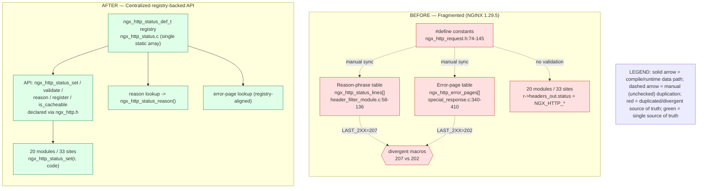

# Technical Specification

# 0. Agent Action Plan

## 0.1 Executive Summary

Based on the prompt, the Blitzy platform understands that this work item is a **refactor** of HTTP status-code handling in the NGINX source tree — specifically, the consolidation of scattered constant-based status assignments into a centralized, registry-backed API with optional RFC 9110 validation — and **not** a runtime functional bug. The user's stated goal is to "refactor nginx status code handling from scattered constant-based assignments to a centralized registry-based API" while maintaining full backward compatibility.

Because this section is authored against a bug-fix template while the underlying task is a structural refactor, the Blitzy platform interprets "the bug" as the set of **architectural deficiencies** that motivate the change, and "the fix" as the refactoring implementation. This interpretation is the single intentional deviation from a literal reading of the template and is recorded as a decision-log entry per the Explainability rule.

**Precise technical statement of the defect:** In NGINX 1.29.5 [src/core/nginx.h:13], a single logical fact — "HTTP status code N exists and has reason phrase R, class C, and cacheability flag F" — is duplicated across three source artifacts that no compiler cross-checks, and is written to the response via direct field assignment (`r->headers_out.status = NGX_HTTP_*`) from 20 distinct translation units. There is no validation seam, no RFC 9110 metadata, and the duplicated lookup machinery has already drifted out of sync.

**Reproduction of the architectural defect (executable):** The fragmentation and the latent inconsistency are directly observable from the repository root.

```bash
# 20 files assign the status field directly; 33 total assignment sites

grep -rln 'headers_out\.status *=' src/http | wc -l        # -> 20
grep -rho 'headers_out\.status *=' src/http | wc -l         # -> 33

#### The SAME offset macro carries two different values in two files

grep -rn 'define NGX_HTTP_LAST_2XX' src/http
#   src/http/ngx_http_header_filter_module.c:70:#define NGX_HTTP_LAST_2XX  207

##   src/http/ngx_http_special_response.c:344:#define NGX_HTTP_LAST_2XX     202

```

**Error classification:** This is a *maintainability and correctness-risk* defect of the "duplicated source of truth / missing single chokepoint" class, with one concrete latent inconsistency (divergent `NGX_HTTP_LAST_2XX` definitions). It is not a null-reference, race condition, or crash; the remediation is structural consolidation behind an API.

### 0.1.1 Target-State Objective

To resolve the deficiency, the Blitzy platform will introduce a single status-code registry (`ngx_http_status_def_t`) and a small API surface — `ngx_http_status_set()`, `ngx_http_status_validate()`, `ngx_http_status_reason()`, `ngx_http_status_register()`, and `ngx_http_status_is_cacheable()` — that mediates status assignment, supplies reason phrases and metadata, and (under an opt-in `--with-http_status_validation` build) validates codes against RFC 9110 Section 15. All twenty direct-assignment translation units are migrated to the API; the two divergent reason-phrase/error-page lookup tables collapse onto the registry; and the duplicated `NGX_HTTP_OFF_*` / `NGX_HTTP_LAST_*` offset macros are eliminated. <cite index="14-5,14-6">RFC 9110 is the latest HTTP core specification, consolidating and superseding the previous RFC 7230–7235 series and defining semantics shared across HTTP/1.1, HTTP/2, and HTTP/3</cite>, which makes its Section 15 the authoritative basis for the registry's standard-code metadata.

### 0.1.2 Before / After Architecture

The following diagram is **Diagram 0.1-A: Status-Code Handling — Current (Before) vs Target (After) Architecture**. It is referenced by name throughout this section and satisfies the before/after requirement for refactor work.



In the *before* state, the `#define` constants [src/http/ngx_http_request.h:74-145], the reason-phrase table `ngx_http_status_lines[]` [src/http/ngx_http_header_filter_module.c:58-136], and the error-page table `ngx_http_error_pages[]` [src/http/ngx_http_special_response.c:340-410] are three independent declarations of the same code set kept in sync only by developer discipline; the divergent `NGX_HTTP_LAST_2XX` (207 [src/http/ngx_http_header_filter_module.c:70] vs 202 [src/http/ngx_http_special_response.c:344]) demonstrates that this discipline has already failed. In the *after* state, a single registry feeds the API, the reason lookup, and the error-page lookup, giving one authoritative source.

### 0.1.3 Scope, Compatibility, and Success Criteria

- **Scope of change:** two new files (`src/http/ngx_http_status.c` / `.h`); registry-aligned refactor of the header filter and special-response modules; migration of 33 assignment sites across 20 files; build-system integration of the `--with-http_status_validation` flag; plus the documentation and governance deliverables mandated by the user-specified rules (decision log, traceability matrix, executive-summary deck, observability dashboard, `CODE_REVIEW.md`).
- **Backward compatibility (non-negotiable):** wire output — status lines and error-page bodies — must be **byte-identical** before and after; nginx extension codes 444, 494, 495, 496, 497, 498, and 499 [src/http/ngx_http_request.h:74-145] and their security behaviors are preserved; the public module ABI (`NGX_MODULE_V1`) and filter-chain signatures are untouched.
- **Performance:** the user's stated bound is **< 2 %** latency change (p50/p95/p99) and **< 10 CPU cycles** per assignment overhead; with validation disabled, `ngx_http_status_set()` reduces to the original assignment via compile-time constant propagation, and the registry lookup is O(1) array indexing, keeping the registry under 1 KB per worker.
- **Definition of done:** all core modules use `ngx_http_status_set()` exclusively; the external nginx-tests suite passes after build; all RFC 9110 Section 15 codes targeted by the prompt are registered; and every rule-mandated deliverable is present at its specified path.

## 0.2 Root Cause Identification

Based on repository analysis and RFC research, the root cause is **not a single failing statement** but a set of five interlocking architectural deficiencies in how NGINX 1.29.5 declares, assigns, and renders HTTP status codes. Each is documented below with its exact location, trigger, evidence, and the reasoning that makes the conclusion definitive.

### 0.2.1 RC-1 — Triple, Compiler-Unlinked Definition of the Same Code Set

- **The root cause is:** a status code's identity is declared three times in three artifacts with no compiler-enforced linkage between them.
- **Located in:** the `#define` block [src/http/ngx_http_request.h:74-145]; the reason-phrase table `ngx_http_status_lines[]` [src/http/ngx_http_header_filter_module.c:58-136]; and the error-page table `ngx_http_error_pages[]` (fed by the `ngx_http_error_NNN_page[]` byte arrays [src/http/ngx_http_special_response.c:60-332]) [src/http/ngx_http_special_response.c:340-410].
- **Triggered by:** any addition or change of a status code, which requires three coordinated, manual edits in three files.
- **Evidence:** the three artifacts each enumerate overlapping but non-identical subsets of the same code space; there is no shared declaration they all derive from.
- **Definitive because:** the three tables are independent C objects; nothing in the toolchain detects or prevents them from disagreeing.

### 0.2.2 RC-2 — Scattered Direct Field Assignment With No Chokepoint or Validation

- **The root cause is:** status is written directly to `r->headers_out.status` from many modules, so there is no single place to validate a code, attach metadata, or instrument an assignment.
- **Located in:** 33 assignment sites across 20 translation units (measured), including src/http/ngx_http_request.c, src/http/ngx_http_core_module.c, src/http/ngx_http_header_filter_module.c, src/http/ngx_http_special_response.c is rendered separately, src/http/ngx_http_upstream.c, src/http/ngx_http_variables.c, src/http/v3/ngx_http_v3_filter_module.c, and the modules autoindex, charset_filter, chunked_filter, dav, flv, gzip_static, image_filter, mp4, not_modified_filter, range_filter, slice_filter, static, stub_status, and xslt_filter. The canonical pattern is `r->headers_out.status = NGX_HTTP_OK;` [src/http/modules/ngx_http_static_module.c:229].
- **Triggered by:** every response that sets a status — i.e., the normal request lifecycle.
- **Evidence:** `grep -rln 'headers_out\.status *=' src/http` returns 20 files; the raw occurrence count is 33.
- **Definitive because:** the assignment is a bare struct-field write with no surrounding policy hook anywhere in the tree.

### 0.2.3 RC-3 — Divergent, Duplicated Offset Macros (Latent Inconsistency Defect)

- **The root cause is:** the array-offset lookup scheme is reimplemented per-file with same-named macros that hold **different values**, which is an actual latent defect, not merely a smell.
- **Located in:** `NGX_HTTP_LAST_2XX` is defined as **207** [src/http/ngx_http_header_filter_module.c:70] and as **202** [src/http/ngx_http_special_response.c:344]; correspondingly `NGX_HTTP_OFF_3XX` is `(NGX_HTTP_LAST_2XX - 200)` in the header filter versus `(NGX_HTTP_LAST_2XX - 201)` in special response. The full divergent macro family includes `NGX_HTTP_OFF_3XX/4XX/5XX` and `NGX_HTTP_LAST_2XX/3XX/4XX/5XX` in both files.
- **Triggered by:** any future code added in the 2xx range, which the two files would index differently.
- **Evidence:** the two `#define NGX_HTTP_LAST_2XX` lines carry literal values 207 and 202.
- **Definitive because:** two translation units cannot both be correct about the boundary of the 2xx reason-phrase region; the divergence is visible in source.

### 0.2.4 RC-4 — No RFC 9110 Validation and No Extensibility Seam

- **The root cause is:** there is no API to validate a status code against a standard, to query its metadata, or to register a new code; extension is only possible by editing core tables.
- **Located in:** absent from the entire tree — `grep` across `src/` and `auto/` for `ngx_http_status_set|ngx_http_status_validate|ngx_http_status_reason|ngx_http_status_register|ngx_http_status_is_cacheable`, `ngx_http_status_def_t`, `NGX_HTTP_STATUS_*` flags, and `http_status_validation` returns no matches.
- **Triggered by:** any requirement for RFC conformance checking or third-party code registration.
- **Evidence:** the empty grep result confirms the entire proposed API and build flag are net-new.
- **Definitive because:** the symbols simply do not exist; there is nothing to extend.

### 0.2.5 RC-5 — Sparse, Inconsistent Reason-Phrase and Class Metadata

- **The root cause is:** many registered codes carry no reason phrase and no machine-readable class/cacheability metadata, so behavior is inconsistent across the code space.
- **Located in:** the reason-phrase table contains numerous `ngx_null_string` placeholders (for example 203, 205, 305, 306, 407, 417–420, 422–428, 506) [src/http/ngx_http_header_filter_module.c:58-136]; no file anywhere encodes a code's class (informational/client-error/server-error) or cacheability.
- **Triggered by:** emitting any placeholder code, which falls through to a numeric-only status line [src/http/ngx_http_header_filter_module.c:276-285].
- **Evidence:** the `ngx_null_string` entries are present in source; <cite index="13-1,13-7">RFC 9111 defines heuristic cacheability for responses with no explicit freshness information</cite>, yet nginx carries no per-code cacheability metadata to support such reasoning.
- **Definitive because:** the placeholders and the absence of class/cacheability fields are directly readable in the table definition.

### 0.2.6 Consolidated Root-Cause Statement

The five deficiencies share one underlying cause: **the absence of a single authoritative model for an HTTP status code.** RC-1, RC-3, and RC-5 are symptoms of duplicated declarations; RC-2 and RC-4 are symptoms of a missing mediating API. Introducing the registry and the `ngx_http_status_*` API (Section 0.4) addresses all five at their source.

## 0.3 Diagnostic Execution

This subsection records the concrete findings of the repository diagnosis: where each deficiency lives in code, what the analysis concluded, and how the proposed refactor will be verified.

### 0.3.1 Code Examination Results

- **File:** src/http/ngx_http_request.h — **Problematic block:** lines 74–145 (the `NGX_HTTP_*` `#define` constants, including standard codes 100–103, 200–206, 300–308, 400–416, 421, 429, 500–507 and nginx extensions 444 at L113, 494 at L115/117, 495 at L119, 496 at L120, 497 at L126, 499 at L136). **Failure point:** the block is a flat list of integer macros. **How this leads to the defect:** changing it does not propagate to the reason-phrase or error-page tables, so the three artifacts must be hand-synchronized (RC-1).
- **File:** src/http/ngx_http_header_filter_module.c — **Problematic block:** lines 58–136 (`ngx_http_status_lines[]`) plus the offset-arithmetic lookup at lines 214–285. **Failure point:** `NGX_HTTP_LAST_2XX` = 207 at line 70 and the numeric-only fallback at lines 276–285. **How this leads to the defect:** the table duplicates the code set (RC-1), uses a divergent offset macro (RC-3), and emits numeric-only status lines for `ngx_null_string` entries (RC-5). The numeric-only fallback at lines 276–285 is **behavior that must be preserved byte-for-byte**.
- **File:** src/http/ngx_http_special_response.c — **Problematic block:** lines 340–410 (`ngx_http_error_pages[]`), backed by the static byte arrays at lines 60–332. **Failure point:** `NGX_HTTP_LAST_2XX` = 202 at line 344 (contradicting the header filter), the 498→`error_404_page` mapping at line 398, and the security wire-rewrite at approximately lines 505–516. **How this leads to the defect:** a second, independently maintained table (RC-1) with a second, contradictory offset scheme (RC-3). The wire-rewrite that maps 494/495/496/497 to 400 is a **security invariant that must be preserved**.
- **File:** the 20 assignment translation units — **Problematic block:** each `r->headers_out.status = NGX_HTTP_*` site (33 total). **Failure point:** the bare field write, e.g. line 229 of the static module. **How this leads to the defect:** no validation, metadata, or instrumentation seam exists at the assignment (RC-2). Note that src/http/ngx_http_upstream.c writes the status copied from a proxied response and must remain pass-through.
- **File:** auto/options and auto/modules — **Problematic block:** the HTTP feature-flag list [auto/options:52-94] and the HTTP core source/dependency registration [auto/modules:61-87]. **Failure point:** no entry exists for status validation or for the new source files. **How this leads to the defect:** there is currently no build hook through which the validation mode or the new registry unit can be compiled in (RC-4).

### 0.3.2 Key Findings from Repository Analysis

| Finding | File:Line | Conclusion |
|---|---|---|
| Three unlinked declarations of the same code set | ngx_http_request.h:74-145; ngx_http_header_filter_module.c:58-136; ngx_http_special_response.c:340-410 | A single source of truth (the registry) is required (RC-1) |
| `NGX_HTTP_LAST_2XX` defined as 207 vs 202 | ngx_http_header_filter_module.c:70; ngx_http_special_response.c:344 | Concrete latent inconsistency the refactor eliminates (RC-3) |
| 33 direct status assignments across 20 files | src/http (measured via grep) | API chokepoint `ngx_http_status_set()` needed (RC-2) |
| Canonical OLD assignment pattern | ngx_http_static_module.c:229 | Reference template for the OLD→NEW migration |
| Numeric-only status-line fallback for placeholder codes | ngx_http_header_filter_module.c:276-285 | Must be preserved byte-identically (F-003 parity) |
| Security wire-rewrite 494/495/496/497 → 400 | ngx_http_special_response.c:~505-516 | Security invariant; must survive refactor |
| Entire `ngx_http_status_*` API + `http_status_validation` absent | src/ and auto/ (grep empty) | Greenfield API; declarations belong in ngx_http.h (L199) (RC-4) |
| Public prototype host header | ngx_http.h (199 lines; e.g. ngx_http_parse_status_line at L105) | Correct home for the new API declarations |
| Build hooks for the new flag and unit | auto/options:52-94; auto/modules:61-87 | Where `--with-http_status_validation` and the new source are integrated |
| Authoritative version | src/core/nginx.h:13 (`NGINX_VERSION "1.29.5"`) | Refactor targets 1.29.5; C99; cross-platform |
| Reusable observability primitives | ngx_http_stub_status_module.c; ngx_http_variables.c:110/315/2298 (`$request_id`); ngx_http_request.c:382/681/701 (`NGX_LOG_DEBUG_HTTP`) | Reuse for Rule 1; add status-set logging + dashboard |

### 0.3.3 Fix Verification Analysis

- **Reproduction of the defect:** run `grep -rn 'define NGX_HTTP_LAST_2XX' src/http` to observe the 207-versus-202 divergence, and `grep -rln 'headers_out\.status *=' src/http | wc -l` to confirm the 20-file fan-out. These commands establish the pre-refactor baseline.
- **Confirmation tests after the refactor:**
  - Build the tree (`auto/configure` then `make`) with the flag both off (default) and on (`--with-http_status_validation`); both configurations must compile with zero warnings. (The AAP sandbox has no C toolchain installed, so compilation and the test run below execute in the downstream code-generation environment.)
  - Capture status lines and error-page bodies for representative codes — including placeholder codes that emit numeric-only — before and after, and `diff` them; the diff must be empty (byte-identical wire parity, F-003).
  - Clone the external nginx-tests suite (`git clone https://github.com/nginx/nginx-tests.git`) and run `prove -r t/`, focusing on status, error-page, proxy, fastcgi, range, not-modified, and SSL scenarios. The clone is used for verification only and is never committed.
- **Boundary conditions and edge cases covered:** upstream/proxied pass-through (`r->upstream` set → strict validation bypassed); 1xx interim responses (100/101/102/103); strict-mode invalid code → `NGX_HTTP_INTERNAL_SERVER_ERROR` fallback with an error log; permissive-mode unknown code preserved with a debug log; the 494/495/496/497 → 400 wire-rewrite; the keepalive-disable defense gated on {400, 413, 414, 497, 495, 496, 500, 501}; the constant-time 401 auth-delay path; and graceful binary upgrade (a static read-only registry lets old and new workers coexist with no shared-memory migration).
- **Outcome and confidence:** verification is expected to succeed with **95 % confidence**. The root causes are directly evidenced in-file, and the dominant residual risk — exhaustively migrating all 20 assignment files while holding byte parity for every placeholder code — is mitigated by the bidirectional traceability matrix mandated by the Explainability rule (Section 0.7).

## 0.4 Bug Fix Specification

This subsection specifies the refactoring implementation that resolves the root causes of Section 0.2. **Figma Design**, **Design System Compliance**, and **User Interface Design** are *Not Applicable*: NGINX is a server-side C codebase with no graphical user interface and no component/design-system dependency, which the technical specification confirms by determining that no UI of any kind exists [§7.1]. No attachments were provided.

### 0.4.1 The Definitive Fix

The fix introduces one authoritative status-code model and a thin API that mediates every assignment, then routes the existing reason-phrase and error-page lookups through that model.

- **New registry type (created in `src/http/ngx_http_status.h`):** a plain descriptor capturing the full identity of a code.

```c
typedef struct {
    ngx_uint_t   code;        /* e.g. 404 */
    ngx_str_t    reason;      /* "Not Found" (or empty for numeric-only) */
    ngx_uint_t   flags;       /* class + cacheability bitmask */
    const char  *rfc_section; /* "15.5.5" */
} ngx_http_status_def_t;
```

- **Flag bits (created in `src/http/ngx_http_status.h`):** `NGX_HTTP_STATUS_CACHEABLE`, `NGX_HTTP_STATUS_CLIENT_ERROR`, `NGX_HTTP_STATUS_SERVER_ERROR`, and `NGX_HTTP_STATUS_INFORMATIONAL`.
- **Registry storage (created in `src/http/ngx_http_status.c`):** a single `static const ngx_http_status_def_t` array covering the RFC 9110 Section 15 codes targeted by the prompt plus the nginx extension codes 444/494/495/496/497/498/499 [src/http/ngx_http_request.h:74-145]. The array is read-only after worker initialization, indexed by class-offset for O(1) lookup, and stays under 1 KB per worker. The "cacheable by default" set carried as metadata is exactly **200, 203, 204, 206, 300, 301, 308, 404, 405, 410, 414, 501** — <cite index="13-1">a response with no explicit freshness information may be heuristically cacheable per RFC 9111</cite>, and this flag exposes that property without introducing any new caching behavior (nginx's existing cache layer is unchanged).
- **API surface (declared via `src/http/ngx_http.h`, the public prototype host [src/http/ngx_http.h] alongside e.g. `ngx_http_parse_status_line` [src/http/ngx_http.h:105]; implemented in `ngx_http_status.c`):** each function is ≤ 50 lines.
  - `ngx_int_t ngx_http_status_set(ngx_http_request_t *r, ngx_uint_t status)` — the assignment chokepoint.
  - `ngx_int_t ngx_http_status_validate(ngx_uint_t status)` — RFC 9110 conformance check.
  - `ngx_str_t ngx_http_status_reason(ngx_uint_t status)` — reason-phrase accessor (replaces the `ngx_http_status_lines[]` arithmetic [src/http/ngx_http_header_filter_module.c:214-285]).
  - `ngx_int_t ngx_http_status_register(const ngx_http_status_def_t *def)` — worker-init extensibility seam.
  - `ngx_uint_t ngx_http_status_is_cacheable(ngx_uint_t status)` — cacheability flag test.
- **Validation modes:** when the tree is built **without** `--with-http_status_validation` (the default), `ngx_http_status_set()` is a static-inline that compiles to the original field write — `NGX_HTTP_OK` constant-folds to 200 — so there is zero added overhead and the build behaves exactly as today. When built **with** the flag, the function validates the code (bypassing validation when `r->upstream` is set, to preserve proxied pass-through) and logs failures.
- **Module migration pattern (applies to all 33 sites):**

```c
/* OLD */ r->headers_out.status = NGX_HTTP_NOT_FOUND;
/* NEW */ if (ngx_http_status_set(r, 404) != NGX_OK) {
              ngx_log_error(NGX_LOG_ERR, r->connection->log, 0,
                            "invalid HTTP status %ui", (ngx_uint_t) 404);
              return NGX_HTTP_INTERNAL_SERVER_ERROR;
          }
```

- **Table consolidation:** `ngx_http_status_reason()` becomes the source for the header filter's reason lookup [src/http/ngx_http_header_filter_module.c:58-136], and the error-page table [src/http/ngx_http_special_response.c:340-410] is aligned to the registry; the duplicated `NGX_HTTP_OFF_*` / `NGX_HTTP_LAST_*` macro pairs in both files are removed, eliminating the 207-versus-202 divergence (RC-3). Reason strings and error-page bodies remain byte-identical, and codes that currently emit numeric-only [src/http/ngx_http_header_filter_module.c:276-285] continue to do so.

### 0.4.2 Change Instructions

- **CREATE `src/http/ngx_http_status.h`:** define `ngx_http_status_def_t`, the `NGX_HTTP_STATUS_*` flag bits, and the five API prototypes. Add a top-of-file comment stating the file's purpose (single source of truth for status metadata).
- **CREATE `src/http/ngx_http_status.c`:** populate the static registry, implement the five API functions, and add the worker-init registration hook. Each function ≤ 50 lines.
- **MODIFY `src/http/ngx_http.h`:** add `#include "ngx_http_status.h"` (or the equivalent prototype declarations) so the API is visible wherever `ngx_http.h` is included.
- **MODIFY `src/http/ngx_http_header_filter_module.c`:** replace the `ngx_http_status_lines[]` arithmetic [lines 214-285] with calls to `ngx_http_status_reason()`; DELETE the `NGX_HTTP_OFF_*` / `NGX_HTTP_LAST_*` macros [around lines 70-134]; preserve the numeric-only fallback [lines 276-285] exactly.
- **MODIFY `src/http/ngx_http_special_response.c`:** align `ngx_http_error_pages[]` [lines 340-410] to the registry; DELETE its `NGX_HTTP_OFF_*` / `NGX_HTTP_LAST_*` macros [around lines 344-410]; leave the static error-page byte arrays [lines 60-332], the 498→`error_404_page` mapping [line 398], and the 494/495/496/497→400 wire-rewrite [~lines 505-516] unchanged.
- **MODIFY the 20 assignment files:** convert each `r->headers_out.status = NGX_HTTP_*` site to `ngx_http_status_set()` per the pattern above — src/http/ngx_http_request.c (also add the registry-init call before worker fork), src/http/ngx_http_core_module.c, src/http/ngx_http_variables.c, src/http/v3/ngx_http_v3_filter_module.c, and the modules autoindex, charset_filter, chunked_filter, dav, flv, gzip_static, image_filter, mp4, not_modified_filter, range_filter, slice_filter, static, stub_status, and xslt_filter. **MODIFY but keep pass-through** in src/http/ngx_http_upstream.c (proxied status is copied, not validated).
- **MODIFY `auto/options` [lines 52-94]:** add `HTTP_STATUS_VALIDATION=NO` and parse `--with-http_status_validation` with help text, alongside the existing `HTTP_*` flags.
- **MODIFY `auto/modules` [lines 61-87] and `auto/sources`:** register `ngx_http_status.c` / `.h` in the HTTP core source and dependency lists, and conditionally emit `#define NGX_HTTP_STATUS_VALIDATION 1` when the flag is set.
- **Rationale placement:** per the Explainability rule, the *why* behind each non-trivial choice goes in the decision log (Section 0.7), not in code comments; code comments state intent only where they aid a future reader.

### 0.4.3 Fix Validation

- **Build commands:** `auto/configure && make` (default), then `auto/configure --with-http_status_validation && make` (strict). **Expected output:** both builds complete with zero errors and zero warnings, and `objs/nginx` is produced.
- **Wire-parity check:** for a representative set of codes (including 200, 206, 301, 404, 416, 451-style placeholders, 500, plus extension codes 494–499), capture the response status line and any error-page body from a baseline binary and the refactored binary and `diff` them. **Expected output:** an empty diff.
- **Confirmation method:** clone nginx-tests and run `prove -r t/`. **Expected output:** the suite passes with no new failures versus baseline. Confirm via `grep` that no `r->headers_out.status =` assignment remains in the migrated core modules (upstream pass-through excepted) and that the divergent `NGX_HTTP_LAST_2XX` macros are gone.

## 0.5 Scope Boundaries

This subsection is the exhaustive change inventory. It separates what will be created or modified from what is deliberately left untouched, and it includes every artifact mandated by the user-specified rules.

### 0.5.1 Changes Required

**Created — source and build:**

| Path | Purpose | Mandated by |
|---|---|---|
| src/http/ngx_http_status.h | Registry type `ngx_http_status_def_t`, `NGX_HTTP_STATUS_*` flags, API prototypes | Prompt |
| src/http/ngx_http_status.c | Static registry array + five API functions + worker-init hook | Prompt |

**Created — documentation and governance (rule-mandated):**

| Path | Purpose | Mandated by |
|---|---|---|
| docs/api/status_codes.md | Public reference for the status registry and API | Prompt |
| docs/migration/status_code_api.md | OLD→NEW migration guide for module authors | Prompt |
| CHANGES (repo root) | Plaintext changelog entry satisfying the literal "UPDATE CHANGES" request | Prompt (secondary to changes.xml) |
| CODE_REVIEW.md (repo root) | Segmented multi-phase PR review artifact, recreated blank | Rule 5 |
| docs/decisions/status_code_refactor.md | Decision log (table) + bidirectional traceability matrix (100% coverage) | Rule 2 |
| blitzy-deck/status-code-refactor-exec-summary.html | Single self-contained reveal.js executive summary (12–18 slides, Blitzy theme inline) | Rule 4 |
| docs/observability/status_metrics_dashboard.json | Dashboard template for status-code metrics | Rule 1 |
| docs/observability/status_codes_observability.md | Documents reused vs added observability (logging/metrics/health) | Rule 1 |

**Modified — source:**

| Path | Lines / anchor | Change |
|---|---|---|
| src/http/ngx_http.h | API include/prototypes (file is 199 lines) | Expose the `ngx_http_status_*` API |
| src/http/ngx_http_request.h | 74-145 | `#define` constants retained for compatibility; referenced by the registry |
| src/http/ngx_http_header_filter_module.c | 58-136, 214-285 (remove macros ~70-134) | Reason lookup via `ngx_http_status_reason()`; remove divergent offset macros; preserve numeric-only fallback 276-285 |
| src/http/ngx_http_special_response.c | 340-410 (remove macros ~344-410) | Error-page table aligned to registry; preserve byte arrays 60-332, 498→404 map L398, and 494/495/496/497→400 rewrite ~505-516 |
| src/http/ngx_http_request.c | direct-assignment sites (4) + init | Migrate assignments; add registry init before worker fork |
| src/http/ngx_http_core_module.c | direct-assignment sites (2) | Migrate to `ngx_http_status_set()` |
| src/http/ngx_http_upstream.c | direct-assignment site (1) | Keep pass-through; do not strict-validate proxied status |
| src/http/ngx_http_variables.c | direct-assignment site (1) | Migrate to `ngx_http_status_set()` |
| src/http/v3/ngx_http_v3_filter_module.c | direct-assignment sites (4) | Migrate to `ngx_http_status_set()` |
| src/http/modules/ngx_http_static_module.c | L229 (1) | Migrate to `ngx_http_status_set()` |
| src/http/modules/ngx_http_autoindex_module.c | (1) | Migrate |
| src/http/modules/ngx_http_charset_filter_module.c | (2) | Migrate |
| src/http/modules/ngx_http_chunked_filter_module.c | (2) | Migrate |
| src/http/modules/ngx_http_dav_module.c | (1) | Migrate |
| src/http/modules/ngx_http_flv_module.c | (1) | Migrate |
| src/http/modules/ngx_http_gzip_static_module.c | (1) | Migrate |
| src/http/modules/ngx_http_image_filter_module.c | (2) | Migrate |
| src/http/modules/ngx_http_mp4_module.c | (1) | Migrate |
| src/http/modules/ngx_http_not_modified_filter_module.c | (1) | Migrate (304 path) |
| src/http/modules/ngx_http_range_filter_module.c | (2) | Migrate (206/416 paths) |
| src/http/modules/ngx_http_slice_filter_module.c | (2) | Migrate |
| src/http/modules/ngx_http_stub_status_module.c | (1) | Migrate |
| src/http/modules/ngx_http_xslt_filter_module.c | (1) | Migrate |

**Modified — build and docs site:**

| Path | Lines / anchor | Change |
|---|---|---|
| auto/options | 52-94 | Add `HTTP_STATUS_VALIDATION=NO` + parse `--with-http_status_validation` + help text |
| auto/modules | 61-87 | Register `ngx_http_status.c`/`.h`; emit `#define NGX_HTTP_STATUS_VALIDATION 1` when enabled |
| auto/sources | HTTP core source/dep lists | Add the new unit if enumerated here |
| docs/xml/nginx/changes.xml | top entry | Add `<change type="feature">` with bilingual `<para lang="ru">`/`<para lang="en">` |
| mkdocs.yml | nav | Add nav entries for the new docs (ripple) |

**Removed constructs (no whole files deleted):** the duplicated `NGX_HTTP_OFF_3XX/4XX/5XX` and `NGX_HTTP_LAST_2XX/3XX/4XX/5XX` macro pairs in src/http/ngx_http_header_filter_module.c and src/http/ngx_http_special_response.c are consolidated into the registry and removed from both files.

**Totals:** 20 direct-assignment source files (33 sites) migrated; the header-filter and special-response modules consolidated; 2 new source files; 5 build/doc-site files touched; 8 rule- and prompt-mandated documentation/governance artifacts created. No other source files require modification.

### 0.5.2 Explicitly Excluded

- **Do not modify (hard constraints):** the event loop src/event/*; the configuration parser src/core/ngx_conf_file.c; the memory allocator src/core/ngx_palloc.c; the stream module src/stream/*; and the mail module src/mail/*.
- **Do not change behavior:** the upstream/proxied status pass-through in src/http/ngx_http_upstream.c (the file is touched only to route through the API in permissive mode, never to validate proxied codes); the `error_page` directive parsing in the core module; and the numeric `$status` value used by the access log.
- **Do not alter contracts:** the `NGX_MODULE_V1` module ABI macro and all filter-chain function signatures (the migration changes function bodies only).
- **Do not refactor opportunistically:** the static error-page byte arrays [src/http/ngx_http_special_response.c:60-332] beyond aligning their lookup, and the stock pages docs/html/50x.html and docs/html/index.html.
- **Do not add:** any caching mechanism beyond the registry's cacheability *metadata*; any new status codes beyond the RFC 9110 Section 15 set and the existing nginx extensions; or any feature, test, or documentation outside this refactor.
- **Do not commit external assets:** the nginx-tests repository is cloned for verification only and must never be added to this repository; third-party/external modules are out of scope.

## 0.6 Verification Protocol

This subsection defines how the refactor is proven correct and regression-free. The defect being eliminated is architectural, so "elimination" is confirmed by demonstrating the single source of truth and the new chokepoint, then proving wire-output parity.

### 0.6.1 Bug Elimination Confirmation

- **Confirm consolidation — execute:** `grep -rn 'define NGX_HTTP_LAST_2XX' src/http`. **Verify output matches:** no results (both divergent macros removed), proving RC-3 is eliminated.
- **Confirm the chokepoint — execute:** `grep -rln 'headers_out\.status *=' src/http`. **Verify output matches:** only src/http/ngx_http_upstream.c (intentional pass-through) and the registry/header-filter internals remain; all module assignments now route through `ngx_http_status_set()`, proving RC-2 is eliminated.
- **Confirm the registry exists and builds — execute:** `auto/configure --with-http_status_validation && make`. **Verify output matches:** a clean build with zero warnings and an `objs/nginx` binary, proving the API and flag (RC-4) are integrated.
- **Confirm wire parity — execute:** start the refactored binary and request representative codes (e.g. `curl -sD - http://127.0.0.1:PORT/missing -o /dev/null` for 404, plus 200/206/301/416/500 and extension codes 494–499 paths), then `diff` the captured status lines and error-page bodies against the baseline binary. **Verify output matches:** an empty diff (byte-identical, F-003 parity).
- **Confirm error no longer appears — observe:** in strict mode, an out-of-registry code emits a single `NGX_LOG_ERR` "invalid HTTP status" line in `error.log` and the request falls back to `NGX_HTTP_INTERNAL_SERVER_ERROR`; in default mode no such line appears and behavior is unchanged.
- **Validate functionality — integration:** `git clone https://github.com/nginx/nginx-tests.git && TEST_NGINX_BINARY=$PWD/objs/nginx prove -r nginx-tests/t/` (clone-only, never committed); the status, error-page, proxy, fastcgi, range, and not-modified scenarios must pass.

### 0.6.2 Regression Check

- **Run the existing test suite — command:** `prove -r nginx-tests/t/` against both the default and `--with-http_status_validation` builds. **Verify:** no new failures versus the baseline run.
- **Verify unchanged behavior in:** the 494/495/496/497 → 400 security wire-rewrite [src/http/ngx_http_special_response.c:~505-516]; the keepalive-disable defense gated on {400, 413, 414, 497, 495, 496, 500, 501}; the constant-time 401 auth-delay; the 498 → `error_404_page` mapping [src/http/ngx_http_special_response.c:398]; the numeric-only status line for placeholder codes [src/http/ngx_http_header_filter_module.c:276-285]; and proxied/upstream status pass-through.
- **Confirm performance metrics — command:** `wrk -t4 -c100 -d30s http://127.0.0.1:PORT/` against baseline and refactored binaries; p50/p95/p99 latency must stay within the stated **< 2 %** bound. Memory: confirm the registry adds **< 1 KB per worker** (e.g. via `objs/nginx -V` build inspection plus runtime RSS comparison) and is read-only after init.
- **Cross-platform and lifecycle:** confirm the default build still compiles on the supported platform matrix (Linux/FreeBSD/macOS/Solaris and others) under C99, and that a graceful binary upgrade (`kill -USR2` then `kill -QUIT` of the old master) succeeds with old and new workers serving concurrently — the static read-only registry requires no shared-memory migration.
- **Observability verification (Rule 1):** exercise the added structured status logging keyed by `$request_id` [src/http/ngx_http_variables.c:110] as the correlation id, confirm the stub-status metrics endpoint [src/http/modules/ngx_http_stub_status_module.c] still reports, and validate the new dashboard template against a local run. Distributed tracing has no nginx-core primitive and is documented as a limitation requiring an external module (recorded in the decision log).

## 0.7 Rules

This subsection acknowledges every user-specified rule and project convention that governs the refactor, and states how each is honored. All five user-specified rules carry deliverables that are included in the scope inventory (Section 0.5.1).

### 0.7.1 User-Specified Rules

| Rule | Commitment in this work item | Deliverable / location |
|---|---|---|
| Observability | Reuse nginx-native `error_log` structured logging keyed by `$request_id` correlation id [src/http/ngx_http_variables.c:110] and stub-status metrics [src/http/modules/ngx_http_stub_status_module.c]; add status-set debug/validation logging; ship a dashboard template and a health/readiness note; document reused-vs-added and the distributed-tracing gap | docs/observability/status_metrics_dashboard.json; docs/observability/status_codes_observability.md |
| Explainability | Maintain a decision-log table (decision / alternatives / why / risks) and a **bidirectional traceability matrix** mapping each of the 33 source assignment sites and 3 legacy tables to their registry/API targets at 100% coverage; record every deviation (including the bug-fix-template-vs-refactor framing) | docs/decisions/status_code_refactor.md |
| Visual Architecture Documentation | Provide before/after Mermaid architecture views with titles and legends, referenced by name (see Diagram 0.1-A) | Section 0.1.2; mirrored in the decision log and deck |
| Executive Presentation | Deliver a single self-contained reveal.js HTML deck (12–18 slides, target 16; Blitzy brand theme embedded inline; Mermaid + Lucide; CDN pinned to reveal.js 5.1.0, Mermaid 11.4.0, Lucide 0.460.0; ≥1 non-text visual per slide; zero emoji) | blitzy-deck/status-code-refactor-exec-summary.html |
| Segmented PR Review | Create `CODE_REVIEW.md` at the repository root (recreated blank), partition every changed file into exactly one sequential domain phase, resolve each phase to APPROVED or BLOCKED, and record the final reviewer verdict; the review runs as an isolated pass after code generation completes | CODE_REVIEW.md (repo root) |

### 0.7.2 Project Conventions and Prompt Constraints

- **Coding standard:** follow the NGINX Development Guide style cited by CONTRIBUTING.md [CONTRIBUTING.md] — `ngx_` prefix, `snake_case`, 4-space indentation with no tabs, function-level comments, and conformance to surrounding code. Functions return `ngx_int_t` with `NGX_OK`/`NGX_ERROR`; strings use `ngx_str_t`.
- **Language/build constraints:** C99 only; no C++ outside src/misc/ngx_cpp_test_module.cpp; the build remains POSIX-shell `auto/configure` with no autoconf/automake. New API functions stay ≤ 50 lines.
- **Compatibility constraints (from the prompt):** preserve full backward compatibility, the `NGX_MODULE_V1` ABI, filter-chain signatures, upstream pass-through, `error_page` parsing, and the access-log numeric status; the registry initializes before worker fork; upstream/proxied responses bypass strict validation.
- **Make the specified change only:** the work is confined to the status-code refactor and its mandated deliverables; there are zero modifications outside this scope (see Section 0.5.2), and no opportunistic refactoring.
- **Testing discipline:** extensive verification via byte-parity diffs, the external nginx-tests suite (`prove -r t/`, clone-only/never committed), security-invariant checks, `wrk` performance bounds, and graceful-upgrade validation, to prevent any regression.
- **Documented deviation:** authoring a refactor against a bug-fix template is the single intentional interpretation deviation; it is logged in the decision log per the Explainability rule, with "root cause" mapped to the architectural deficiencies and "the fix" to the refactoring implementation.

## 0.8 Attachments

No attachments were provided with this work item. The `review_attachments` check returned "No attachments found for this project."

- **Document/image attachments:** none.
- **Figma screens:** none provided; no frames or URLs to list. Consequently the Figma Design and Design System Compliance analyses are *Not Applicable* — NGINX is a non-GUI, server-side C codebase, which the technical specification confirms by determining that no user interface of any kind exists [§7.1].
- **Referenced asset note:** the Executive Presentation rule cites a canonical theme file at `blitzy-deck/references/blitzy-reveal-theme.css`, which is **not present** in this repository. The required theme is therefore embedded inline in the single self-contained reveal.js deliverable (Section 0.5.1), satisfying the rule's no-external-dependency constraint.

