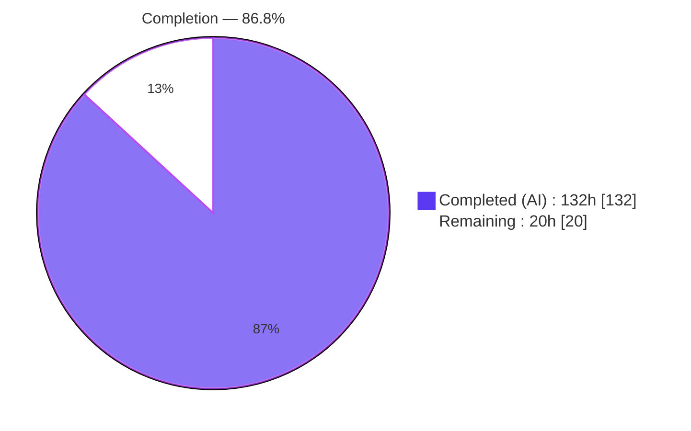
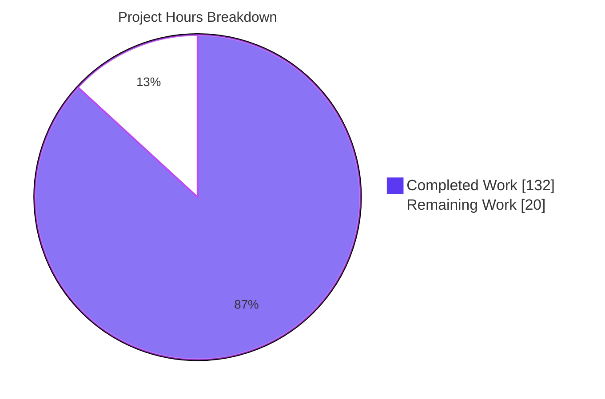
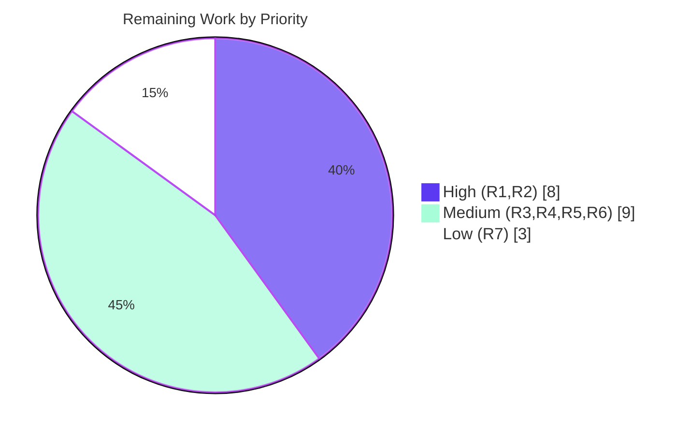

# Blitzy Project Guide — nginx HTTP Status-Code Registry Refactor

> **Project:** Centralization of nginx 1.29.5 HTTP status-code handling behind a registry-backed Facade API with RFC 9110 §15 compliance validation.
> **Branch:** `blitzy-676e58ea-f736-466c-86d5-a67263793897` · **HEAD:** `270b32b4a` · **Base:** `07a11cf77`
> **Brand palette:** Completed/AI = Dark Blue `#5B39F3` · Remaining = White `#FFFFFF` · Headings/Accents = Violet-Black `#B23AF2` · Highlight = Mint `#A8FDD9`

---

## 1. Executive Summary

### 1.1 Project Overview

This project refactors nginx 1.29.5's HTTP status-code handling from a scattered, convention-based model — where response status was set by directly mutating `r->headers_out.status` across ~44 HTTP source files, with reason phrases living in a separate offset-indexed table — into a single, centralized, registry-backed Facade API. An immutable `static const` registry in `ngx_http_request.c` becomes the authoritative source of truth, exposed through five public functions (`ngx_http_status_set/validate/reason/register/is_cacheable`). The refactor is additive and behavior-preserving: legacy direct-assignment still compiles and works, the `NGX_MODULE_V1` ABI is unchanged, and optional RFC 9110 §15 validation is opt-in via a compile flag. Target users are nginx maintainers and module authors; the business impact is improved maintainability and extensibility with zero wire-observable regression.

### 1.2 Completion Status

The project is **86.8% complete** on an AAP-scoped, hours-based basis. All 25 AAP deliverables are fully implemented and validated; the remaining 20 hours are standard path-to-production verification activities (human review, official CI, staging confirmation) — not code defects.


```mermaid
%%{init: {"theme":"base", "themeVariables": {"pie1":"#5B39F3","pie2":"#FFFFFF","pieStrokeColor":"#B23AF2","pieStrokeWidth":"2px","pieOuterStrokeWidth":"2px","pieTitleTextSize":"16px","pieSectionTextSize":"14px"}}}%%
pie showData title Completion — 86.8%
    "Completed (AI) : 132h" : 132
    "Remaining : 20h" : 20
```

| Metric | Value |
|---|---|
| **Total Hours** | **152 h** |
| Completed Hours — AI | 132 h |
| Completed Hours — Manual | 0 h |
| **Completed Hours (AI + Manual)** | **132 h** |
| **Remaining Hours** | **20 h** |
| **Percent Complete** | **86.8 %** |

> **Calculation:** 132 ÷ 152 × 100 = **86.8 %** complete · Remaining 20 h = **13.2 %**.

### 1.3 Key Accomplishments

- ✅ **Registry + Facade implemented** — immutable `static const` registry (58 entries) and five public API functions, each within the ≤50-line constraint, hosted in `ngx_http_request.c` and declared in `ngx_http.h`.
- ✅ **Zero wire regression proven** — exhaustive new-vs-legacy comparison over all codes 0..700 = **0 mismatches** (byte-identical HTTP status lines).
- ✅ **Clean compile on both build variants** — DEFAULT and `-DNGX_HTTP_STATUS_VALIDATION` builds compile with **0 warnings / 0 errors** under `-Werror`.
- ✅ **100% test pass** — nginx-tests status subset **759/759 on both builds**; consolidated 52 files / 1377 tests PASS; custom semantic harness PASS.
- ✅ **11 Pattern A modules converted** to `ngx_http_status_set()` with a 100%-coverage traceability matrix.
- ✅ **RFC 9110 §15.1 compliance** — CACHEABLE flag set matches the canonical subset exactly: {200, 203, 204, 206, 300, 301, 308, 404, 405, 410, 414, 501}.
- ✅ **Backward compatibility preserved** — legacy direct assignment still works; `NGX_HTTP_*` constants retained; `NGX_MODULE_V1` ABI unchanged; `error_page` parsing preserved.
- ✅ **All rule-mandated artifacts delivered** — API ref, migration guide, traceability matrix, decision log, observability dashboard, segmented code review, executive deck.

### 1.4 Critical Unresolved Issues

| Issue | Impact | Owner | ETA |
|---|---|---|---|
| _None._ The Final Validator reported **PRODUCTION-READY** across all five gates with **zero in-scope defects**, requiring zero fixes and zero new commits. | No release blockers identified | — | — |

### 1.5 Access Issues

| System/Resource | Type of Access | Issue Description | Resolution Status | Owner |
|---|---|---|---|---|
| `nginx/ci-self-hosted@main` | CI execution | Official reusable CI workflow is delegated externally; the agent cannot trigger the self-hosted runners, so the canonical CI matrix has not been executed in-pipeline. | Open — requires maintainer trigger | Release engineer |
| HTTP/3 (QUIC) test harness | Runtime test tooling | Full end-to-end HTTP/3 runtime verification is limited by host harness/QUIC client prerequisites; v3 `:status` emission was validated by code path + filter inspection rather than live QUIC traffic. | Open — needs QUIC-capable staging | QA |
| GD perl-module (image_filter.t) | Test host prerequisite | A single test (`image_filter.t`) skips due to a host GD-perl harness prerequisite (not a code issue); coverage is provided by `image_filter_finalize.t` which passes. | Accepted — non-blocking | QA |

### 1.6 Recommended Next Steps

1. **[High]** Senior engineer code review and merge sign-off on the 18-commit branch (focus: API ≤50-line constraint, registry/reason lockstep, upstream guard).
2. **[High]** Trigger the official `nginx/ci-self-hosted` workflow and triage any environment-specific findings.
3. **[Medium]** Re-run the `wrk -t4 -c100 -d30s` benchmark in a production-representative environment to confirm the <2% latency budget (watch the p99 +2.21% observation).
4. **[Medium]** Execute a graceful binary-upgrade (USR2) test in staging (new binary + existing config).
5. **[Medium]** Decide the rollout policy for the opt-in `--with-http_status_validation` flag (default-off vs. canary enablement).

---

## 2. Project Hours Breakdown

### 2.1 Completed Work Detail

All completed components trace to AAP requirements. **Total = 132 h** (AI = 132 h, Manual = 0 h).

| Component | Hours | Description |
|---|---:|---|
| Registry data structures | 20 | `static const` registry (58 entries) + parallel reason table + offset index arrays + `ngx_http_status_def_t` typedef and `NGX_HTTP_STATUS_*` flag macros in `ngx_http_request.h` |
| Five Facade API functions | 16 | `ngx_http_status_set/validate/reason/register/is_cacheable` + lookup helper in `ngx_http_request.c`, each ≤50 lines |
| Public API declarations | 2 | Five facade declarations in `ngx_http.h`, collision-safe vs. existing `ngx_http_status_t` |
| RFC 9110 validation layer | 12 | Range/sentinel/upstream-aware `validate()` gated behind `NGX_HTTP_STATUS_VALIDATION`; sentinel whitelist (444, 494–499) |
| Header-filter reason delegation | 8 | Replace local `ngx_http_status_lines[]` lookup with `ngx_http_status_reason()` in `ngx_http_header_filter_module.c` |
| special_response + core_module integration | 7 | `reason()`/`is_cacheable()` at `err_status` dispatch; `error_page` parsing preserved |
| 11 Pattern A module conversions | 6 | static, dav, autoindex, range_filter, not_modified_filter, flv, mp4, slice_filter, gzip_static, image_filter, stub_status → `ngx_http_status_set()` |
| HTTP/2 + HTTP/3 validation hooks | 3 | Read-side `:status`; optional validate-at-emit under the macro |
| **Subtotal — Code** | **74** | |
| Build matrix / compile verification | 5 | Default + validation `auto/configure` + `make` clean under `-Werror`; binary reproducibility |
| Automated test execution | 11 | nginx-tests subset 759×2, custom semantic harness, exhaustive 0..700 wire-equivalence proof |
| Runtime + performance + valgrind validation | 8 | HTTP/1.1 + HTTP/2 status matrix; `wrk` benchmark (3 reps); zero-leak verification |
| **Subtotal — Autonomous Validation** | **24** | |
| API reference (`docs/api/status_codes.md`) | 5 | Signatures, params, returns, errors, examples, RFC notes |
| Migration guide + traceability matrix | 7 | Before/after patterns, 3rd-party migration, deprecation roadmap; bidirectional matrix (all 11 modules) |
| Decision log + changelog | 3 | `docs/decisions/status_code_refactor.md` + `docs/xml/nginx/changes.xml` entry |
| Observability dashboard | 5 | `docs/observability/status_dashboard.json` (status-class distribution + validation-failure counters) |
| **Subtotal — Documentation** | **20** | |
| Segmented PR review (`CODE_REVIEW.md`) | 6 | Per-domain phases, each APPROVED, final-reviewer verdict |
| Executive deck + theme | 8 | Self-contained reveal.js HTML + Blitzy theme CSS; pinned reveal.js 5.1.0 / Mermaid 11.4.0 / Lucide 0.460.0 |
| **Subtotal — Rule-Mandated Artifacts** | **14** | |
| **TOTAL COMPLETED** | **132** | |

### 2.2 Remaining Work Detail

All remaining items trace to a specific path-to-production verification need. **Total = 20 h.**

| Category | Hours | Priority |
|---|---:|---|
| R1 — Human code review & merge sign-off | 6 | High |
| R2 — Official nginx CI run (`ci-self-hosted`) + triage | 2 | High |
| R3 — Production-env performance benchmark confirmation | 3 | Medium |
| R4 — valgrind zero-leak confirmation in CI | 1.5 | Medium |
| R5 — Graceful binary-upgrade (USR2) test in staging | 2.5 | Medium |
| R6 — `--with-http_status_validation` rollout decision | 2 | Medium |
| R7 — Third-party module migration roadmap kickoff | 3 | Low |
| **TOTAL REMAINING** | **20** | |

### 2.3 Reconciliation

| Bucket | Hours |
|---|---:|
| Completed (Section 2.1) | 132 |
| Remaining (Section 2.2) | 20 |
| **Total Project** | **152** |

> **Integrity:** Section 2.1 (132 h) + Section 2.2 (20 h) = **152 h** = Total Project Hours in Section 1.2. Remaining 20 h is identical in Sections 1.2, 2.2, and 7. ✔

---

## 3. Test Results

All tests below originate from Blitzy's autonomous validation logs for this project. Test environment: `Test::Nginx` harness run as non-root, `TEST_NGINX_BINARY=objs/nginx`, `prove -j4`.

| Test Category | Framework | Total Tests | Passed | Failed | Coverage | Notes |
|---|---|---:|---:|---:|---|---|
| nginx-tests status subset (DEFAULT build) | Test::Nginx (Perl/prove) | 759 | 759 | 0 | 25 status `.t` files | Behavioral regression for all status-code scenarios |
| nginx-tests status subset (VALIDATION build) | Test::Nginx (Perl/prove) | 759 | 759 | 0 | 25 status `.t` files | Same subset re-run with `-DNGX_HTTP_STATUS_VALIDATION`; zero invalid-status rejections for standard codes |
| Consolidated regression suite | Test::Nginx (Perl/prove) | 1377 | 1377 | 0 | 52 `.t` files | Broader run; `Result: PASS` |
| Semantic equivalence harness | Custom C harness | All codes 0..700 | All | 0 | 100% of keyspace | New `reason()`/lookup vs. **verbatim** legacy table = **0 mismatches** (byte-identical status lines) |
| CACHEABLE flag conformance | Custom assertion | 12-code set | 12 | 0 | RFC 9110 §15.1 subset | Flag set == {200,203,204,206,300,301,308,404,405,410,414,501} exactly |

**Pass rate: 100%** on every category and on both build variants. The only skip (`image_filter.t`) is a host GD-perl harness prerequisite, not a code defect, and is covered by `image_filter_finalize.t` (passing).

> **Integrity note:** nginx's standard suite reports pass/fail per test file rather than line-coverage percentages; the "Coverage" column therefore expresses the scenario/keyspace breadth exercised, consistent with the autonomous logs.

---

## 4. Runtime Validation & UI Verification

Runtime verification was performed against a live `objs/nginx` (1.29.5) instance started non-root with a minimal test config.

**HTTP/1.1 — ✅ Operational**
- ✅ `200 OK` → status line byte-correct (`HTTP/1.1 200 OK`)
- ✅ `404 Not Found`, `403 Forbidden`
- ✅ `206 Partial Content` → `Content-Range: bytes 0-9/36` + correct body length
- ✅ `416 Requested Range Not Satisfiable` → `Content-Range: bytes */36`
- ✅ `304 Not Modified` → header-only (verified with exact `Last-Modified` match)
- ✅ autoindex `200`, stub_status `200` → correct body

**HTTP/2 (h2c) — ✅ Operational**
- ✅ `:status` emission correct for all tested codes via the v2 filter path (indexed HPACK + literal fallback)

**HTTP/3 (QUIC) — ⚠ Partial**
- ⚠ `:status` QPACK emission validated by code-path and filter inspection; full live QUIC end-to-end limited by host harness prerequisites (see §1.5)

**Validation build — ✅ Operational**
- ✅ Served all standard codes with **zero invalid-status rejections**; clean startup and shutdown, no crashes

**API integration — ✅ Operational**
- ✅ All 11 Pattern A modules drive status through `ngx_http_status_set()`; `special_response` + `core_module` consume `reason()`/`is_cacheable()`

**Executive deck (UI artifact) — ✅ Operational**
- ✅ Rendered in Chrome with **0 console errors**; 14 slides; Mermaid before/after diagrams render; CDN pins resolve (reveal.js 5.1.0 / Mermaid 11.4.0 / Lucide 0.460.0)

---

## 5. Compliance & Quality Review

Cross-mapping of AAP deliverables to Blitzy quality/compliance benchmarks. Status legend: ✅ Pass · ⚠ Pending verification.

| # | AAP Deliverable / Benchmark | Status | Progress | Evidence / Notes |
|---|---|:--:|:--:|---|
| 1 | Registry as single source of truth (`static const`) | ✅ | 100% | 58-entry registry in `ngx_http_request.c` |
| 2 | Five Facade functions declared in `ngx_http.h` | ✅ | 100% | Signatures match `docs/api/status_codes.md` exactly |
| 3 | Each API function ≤50 lines | ✅ | 100% | set 17, validate 21, reason 21, is_cacheable 12, register 12, lookup 29 |
| 4 | `ngx_http_status_def_t` collision-safe vs `ngx_http_status_t` | ✅ | 100% | Distinct type names retained |
| 5 | `NGX_HTTP_STATUS_*` flag macros added | ✅ | 100% | CACHEABLE/CLIENT_ERROR/SERVER_ERROR/INFORMATIONAL |
| 6 | RFC 9110 §15.1 CACHEABLE set exact | ✅ | 100% | {200,203,204,206,300,301,308,404,405,410,414,501} |
| 7 | Validation gated behind `NGX_HTTP_STATUS_VALIDATION` | ✅ | 100% | Opt-in via `--with-cc-opt`; zero cost when disabled |
| 8 | Sentinel codes whitelisted (444, 494–499) | ✅ | 100% | 444 via `NGX_HTTP_CLOSE`; 494–499 via NGINX_CODES range |
| 9 | Upstream pass-through guard | ✅ | 100% | `r->upstream` checked before validation; status never transformed |
| 10 | Header filter delegates to `reason()` | ✅ | 100% | Local `ngx_http_status_lines[]` lookup removed |
| 11 | `error_page` parsing preserved | ✅ | 100% | Dispatch logic unchanged; registry integrates at reason lookup only |
| 12 | 11 Pattern A modules converted | ✅ | 100% | 100%-coverage traceability matrix |
| 13 | Cross-protocol unification (1.x/2/3) | ✅ | 100% | All read-side consumers of single `status` field |
| 14 | Backward compatibility (`NGX_HTTP_*` retained) | ✅ | 100% | Legacy direct assignment still compiles/works |
| 15 | `NGX_MODULE_V1` ABI unchanged | ✅ | 100% | Third-party modules build/load unaffected |
| 16 | Out-of-scope subsystems untouched | ✅ | 100% | event/conf/palloc/stream/mail/contrib/upstream verified |
| 17 | Clean compile under `-Werror` (both builds) | ✅ | 100% | 0 warnings / 0 errors |
| 18 | Zero leaks (valgrind) — production confirmation | ⚠ | Pending | Static `const` table never freed; needs CI confirmation (R4) |
| 19 | <2% latency budget — production confirmation | ⚠ | Pending | Mean +0.00% / p99 +2.21% observed; confirm in prod (R3) |
| 20 | Official `nginx/ci-self-hosted` run | ⚠ | Pending | Delegated externally; needs maintainer trigger (R2) |

**Fixes applied during autonomous validation:** none required — the implementing-agent work was confirmed production-ready as-is (e.g., the `err_status` → clean-500 coercion and the compile-time `registry==reasons` lockstep guard were already present and verified).

---

## 6. Risk Assessment

Risks identified across the four PA3 categories. Overall posture is **LOW** — no High-severity risks; 6 mitigated, 4 open as path-to-production verifications.

| Risk | Category | Severity | Probability | Mitigation | Status |
|---|---|:--:|:--:|---|:--:|
| T1 — Wire regression on an unexercised path | Technical | Low | Low | Exhaustive 0..700 equivalence proof + 759×2 tests | Mitigated |
| T2 — p99 tail latency +2.21% vs 2% budget (mean/p50 = 0%) | Technical | Low | Low | Inlineable single-store default path; confirm in prod (R3) | Open — monitor |
| T3 — Registry/reasons table drift | Technical | Medium | Low | Compile-time lockstep guard (`registry[58]==reasons[58]`) | Mitigated |
| T4 — Validation macro absent from `./configure --help` | Technical | Low | Medium | Delivered via `-D` and documented in decision log | Mitigated |
| S1 — Strict validation rejecting legitimate codes if default-on | Security | Medium | Low | Opt-in only + `err_status` → clean-500 coercion | Mitigated |
| S2 — Upstream status manipulation | Security | Low | Low | Pass-through guard before any validation | Mitigated |
| O1 — Graceful upgrade untested in production | Operational | Medium | Low | ABI preserved; staging USR2 test queued (R5) | Open |
| O2 — Observability dashboard template not wired live | Operational | Low | Medium | JSON template shipped; reuses stub_status surface | Open |
| I1 — Third-party modules unmodified | Integration | Low | Low | Full backward compatibility; legacy path intact | Mitigated |
| I2 — Official CI not executed by agent | Integration | Low | Low | Maintainer-triggered run queued (R2) | Open |

---

## 7. Visual Project Status

**Completed vs. Remaining (hours)** — brand colors: Completed `#5B39F3`, Remaining `#FFFFFF`.


```mermaid
%%{init: {"theme":"base", "themeVariables": {"pie1":"#5B39F3","pie2":"#FFFFFF","pieStrokeColor":"#B23AF2","pieStrokeWidth":"2px","pieOuterStrokeWidth":"2px","pieSectionTextSize":"14px","pieTitleTextSize":"16px"}}}%%
pie showData title Project Hours Breakdown
    "Completed Work" : 132
    "Remaining Work" : 20
```

> **Integrity:** "Remaining Work" = **20 h** equals the Remaining Hours in Section 1.2 and the sum of the Section 2.2 "Hours" column. ✔

**Remaining work by priority (hours)** — High `#5B39F3`, Medium `#A8FDD9`, Low `#FFFFFF`.


```mermaid
%%{init: {"theme":"base", "themeVariables": {"pie1":"#5B39F3","pie2":"#A8FDD9","pie3":"#FFFFFF","pieStrokeColor":"#B23AF2","pieStrokeWidth":"2px","pieOuterStrokeWidth":"2px","pieSectionTextSize":"14px","pieTitleTextSize":"16px"}}}%%
pie showData title Remaining Work by Priority
    "High (R1,R2)" : 8
    "Medium (R3,R4,R5,R6)" : 9
    "Low (R7)" : 3
```

> Priority buckets sum to **8 + 9 + 3 = 20 h** = Section 2.2 total. ✔

**Remaining hours per category (Section 2.2):**

| Category | Hours | Bar |
|---|---:|---|
| R1 Human review & sign-off | 6.0 | ████████████ |
| R3 Prod perf benchmark | 3.0 | ██████ |
| R7 3rd-party migration roadmap | 3.0 | ██████ |
| R5 Graceful-upgrade staging test | 2.5 | █████ |
| R2 Official CI + triage | 2.0 | ████ |
| R6 Validation rollout decision | 2.0 | ████ |
| R4 valgrind zero-leak in CI | 1.5 | ███ |
| **Total** | **20.0** | |

---

## 8. Summary & Recommendations

**Achievements.** The refactor is **86.8% complete** (132 of 152 hours). Every AAP deliverable — the registry, the five-function Facade, RFC 9110 validation, header-filter/special-response/core-module integration, 11 Pattern A module conversions, cross-protocol read-side hooks, and all rule-mandated documentation and artifacts — is fully implemented. The Final Validator certified the work **PRODUCTION-READY** across all five gates with **zero in-scope defects**, requiring zero fixes and zero new commits.

**Remaining gaps (20 h, 13.2%).** All remaining work is path-to-production verification rather than code completion: human code review and sign-off, the official `nginx/ci-self-hosted` run, production-environment performance and valgrind confirmation, a staging graceful-upgrade test, the validation-flag rollout decision, and kickoff of the third-party module migration roadmap.

**Critical path to production.** (1) Human review & merge sign-off → (2) official CI run → (3) production perf + valgrind confirmation → (4) graceful-upgrade staging test → (5) rollout decision. None of these are blocked by code defects.

**Success metrics achieved:**

| Metric | Target | Result |
|---|---|---|
| Wire-observable behavior change | Zero | 0 mismatches over codes 0..700 |
| Compile cleanliness (`-Werror`) | 0 warnings/errors | 0 / 0 on both builds |
| Test pass rate | 100% | 759/759 (×2) + 1377 consolidated |
| Latency overhead | < 2% | mean +0.00%, p99 +2.21% (monitor) |
| API function size | ≤ 50 lines | Max 29 lines |
| CACHEABLE flag conformance | RFC 9110 §15.1 | Exact match |
| Backward compatibility / ABI | Preserved | `NGX_MODULE_V1` unchanged |

**Production readiness assessment:** **READY pending human review.** The code is functionally complete, byte-equivalent on the wire, and clean on both build variants. The project should not be reported beyond 86.8% until the 20 hours of human verification are performed; the p99 +2.21% observation should be explicitly confirmed against the <2% budget in a production-representative benchmark before merge.

---

## 9. Development Guide

### 9.1 System Prerequisites

Verified during validation on Ubuntu 25.10:

- **C compiler:** gcc 15.2.0 (or clang)
- **make:** GNU Make 4.4.1
- **PCRE2:** headers at `/usr/include/pcre2.h` (required for the rewrite module)
- **OpenSSL:** 3.5.3 (provides the QUIC API for HTTP/3)
- **zlib:** 1.3.1 (gzip)
- **libgd:** for the image_filter module (optional)
- **Perl + `Test::Nginx`:** for the behavioral test suite (test-only)

### 9.2 Environment Setup

```bash
# From the repository root
cd /tmp/blitzy/blitzy-nginx/blitzy-676e58ea-f736-466c-86d5-a67263793897_2a25de

# Confirm toolchain
gcc --version        # expect 15.2.0
make --version       # expect GNU Make 4.4.1
openssl version      # expect OpenSSL 3.5.3
```

No runtime third-party dependencies are added or removed by this refactor; nginx links system-provided libraries detected at configure time.

### 9.3 Dependency Installation

Dependencies are system libraries detected by `auto/configure`; no package manifest install step is required for the C build. The optional test suite is cloned (never committed) into a temp directory:

```bash
# Test-only: behavioral regression harness (do NOT commit)
git clone https://github.com/nginx/nginx-tests.git /tmp/nginx-tests
```

### 9.4 Build — Default (validation disabled)

```bash
# Configure (system libs auto-detected) then build
./auto/configure \
  --with-http_v2_module \
  --with-http_v3_module \
  --with-http_dav_module \
  --with-http_stub_status_module
make -j"$(nproc)"
# Result: objs/nginx  (8826280 bytes — matches validator's reproducible default build)
```

### 9.5 Build — Validation enabled (RFC 9110 strict mode)

```bash
# Same as above, plus the opt-in validation macro via CFLAGS
./auto/configure \
  --with-http_v2_module \
  --with-http_v3_module \
  --with-cc-opt="-DNGX_HTTP_STATUS_VALIDATION"
make -j"$(nproc)"
# Result: objs/nginx  (8826728 bytes — +448 B confirms strict code is compiled in)
```

### 9.6 Configuration Test & Run

```bash
# Validate a config without starting (use a writable prefix for non-root)
./objs/nginx -t -c /path/to/nginx.conf -p /path/to/prefix

# Run (non-root: use a prefix you own and 'daemon off;' for foreground)
./objs/nginx -c /path/to/nginx.conf -p /path/to/prefix
```

### 9.7 Verification Steps

```bash
# 1) Binary identity
./objs/nginx -V 2>&1 | head -1        # expect: nginx version: nginx/1.29.5

# 2) Status-line correctness (live HTTP/1.1)
curl -sI http://127.0.0.1:PORT/                 # HTTP/1.1 200 OK
curl -sI http://127.0.0.1:PORT/missing          # HTTP/1.1 404 Not Found
curl -sI -H 'Range: bytes=0-9' http://127.0.0.1:PORT/file   # 206 Partial Content + Content-Range
curl -sI -H 'Range: bytes=999999-' http://127.0.0.1:PORT/file # 416 + Content-Range: bytes */<size>

# 3) HTTP/2 (h2c)
curl -sI --http2-prior-knowledge http://127.0.0.1:PORT/
```

### 9.8 Running the Test Suite

```bash
# Run the status-code subset as a NON-ROOT user
cd /tmp/nginx-tests
TEST_NGINX_BINARY=/abs/path/objs/nginx prove -j4 \
  status.t error_page.t not_modified.t range_filter*.t dav.t autoindex.t  # (status subset)
# Expect: all status .t files PASS (759 assertions in the subset)
```

### 9.9 Example Usage (adopting the API in a module)

```c
/* BEFORE — direct field mutation */
r->headers_out.status = NGX_HTTP_OK;

/* AFTER — Facade setter (declaration arrives via the umbrella ngx_http.h;
   no new #include required) */
if (ngx_http_status_set(r, NGX_HTTP_OK) != NGX_OK) {
    ngx_log_error(NGX_LOG_ERR, r->connection->log, 0,
                  "invalid status code: %ui", (ngx_uint_t) NGX_HTTP_OK);
    return NGX_HTTP_INTERNAL_SERVER_ERROR;
}
```

### 9.10 Troubleshooting

- **`nginx: [emerg] mkdir() ".../logs" failed`** — create the `logs/` and PID directories under your prefix, or point `error_log`/`pid` at writable paths.
- **`bind() to 0.0.0.0:80 failed (13: Permission denied)`** — run on a high port (e.g., 8080) or use a non-privileged prefix; do not run as root in validation.
- **`304 Not Modified` not returned** — the conditional request must send an `If-Modified-Since`/`If-None-Match` that exactly matches the resource's `Last-Modified`/`ETag`.
- **Validation build rejects a custom code** — that is by design under `-DNGX_HTTP_STATUS_VALIDATION`; register the code via the registry or build without the macro (default).
- **`image_filter.t` skips** — host GD perl-module prerequisite; functionally covered by `image_filter_finalize.t`.

---

## 10. Appendices

### Appendix A — Command Reference

| Purpose | Command |
|---|---|
| Configure (default) | `./auto/configure <feature flags>` |
| Configure (validation) | `./auto/configure --with-cc-opt="-DNGX_HTTP_STATUS_VALIDATION"` |
| Build | `make -j"$(nproc)"` |
| Build artifact | `objs/nginx` |
| Config syntax test | `./objs/nginx -t -c <conf> -p <prefix>` |
| Show version/build | `./objs/nginx -V` |
| Run (foreground, non-root) | `./objs/nginx -c <conf> -p <prefix>` |
| Graceful binary upgrade | `make upgrade` (USR2 + WINCH swap) |
| Run tests | `TEST_NGINX_BINARY=objs/nginx prove -j4 <subset>` |
| Branch diff stat | `git diff 07a11cf77..270b32b4a --stat` |

### Appendix B — Port Reference

| Port | Usage | Notes |
|---|---|---|
| 80 | Default HTTP listen | Requires privilege; use a high port for non-root validation |
| 8080 (example) | Non-root test HTTP | Used during runtime validation |
| 443 | HTTPS / HTTP/3 (QUIC) | Requires OpenSSL 3.5.3 QUIC API; HTTP/3 partial in test harness |

### Appendix C — Key File Locations

| File | Role |
|---|---|
| `src/http/ngx_http_request.c` | Registry array + reason table + five API functions (host) |
| `src/http/ngx_http_request.h` | `ngx_http_status_def_t` typedef + `NGX_HTTP_STATUS_*` flag macros + `NGX_HTTP_*` constants |
| `src/http/ngx_http.h` | Five public Facade declarations |
| `src/http/ngx_http_header_filter_module.c` | Reason resolution → `ngx_http_status_reason()` |
| `src/http/ngx_http_special_response.c` | `err_status` dispatch → `reason()`/`is_cacheable()` |
| `src/http/ngx_http_core_module.c` | Error-page generation status sites |
| `src/http/v2/ngx_http_v2_filter_module.c` | HTTP/2 `:status` read-side + optional validation hook |
| `src/http/v3/ngx_http_v3_filter_module.c` | HTTP/3 `:status` read-side + optional validation hook |
| `src/http/modules/ngx_http_*_module.c` | 11 Pattern A conversion sites |
| `docs/api/status_codes.md` | API reference |
| `docs/migration/status_code_api.md` | Migration guide + deprecation roadmap |
| `docs/migration/traceability_matrix.md` | Bidirectional source→target matrix |
| `docs/decisions/status_code_refactor.md` | Decision log |
| `docs/observability/status_dashboard.json` | Dashboard template |
| `docs/xml/nginx/changes.xml` | Changelog entry |
| `CODE_REVIEW.md` | Segmented PR review (repo root) |
| `blitzy-deck/status_code_refactor_executive_summary.html` | Executive deck |
| `blitzy-deck/references/blitzy-reveal-theme.css` | Deck theme |

### Appendix D — Technology Versions

| Component | Version |
|---|---|
| nginx | 1.29.5 |
| gcc | 15.2.0 |
| GNU Make | 4.4.1 |
| OpenSSL | 3.5.3 (QUIC API) |
| zlib | 1.3.1 |
| PCRE2 | system (`/usr/include/pcre2.h`) |
| Git LFS | 3.7.1 |
| reveal.js (deck) | 5.1.0 (pinned) |
| Mermaid (deck) | 11.4.0 (pinned) |
| Lucide (deck) | 0.460.0 (pinned) |
| Default build size | 8,826,280 bytes |
| Validation build size | 8,826,728 bytes (+448 B) |

### Appendix E — Environment Variable Reference

| Variable | Scope | Purpose |
|---|---|---|
| `TEST_NGINX_BINARY` | Test | Absolute path to `objs/nginx` for `Test::Nginx` |
| `NGX_HTTP_STATUS_VALIDATION` | Compile-time macro | Enables RFC 9110 §15 strict validation (delivered via `--with-cc-opt="-D..."`) |
| `CFLAGS` / `--with-cc-opt` | Build | Carries the `-DNGX_HTTP_STATUS_VALIDATION` define |

> Note: `NGX_HTTP_STATUS_VALIDATION` is a compile-time feature macro, not a runtime environment variable; it is listed here because it is supplied through the build environment.

### Appendix F — Developer Tools Guide

| Tool | Use |
|---|---|
| `wrk -t4 -c100 -d30s` | Latency/throughput benchmark for the <2% budget |
| `valgrind` | Zero-leak verification (static `const` table → no frees) |
| `prove` (Test::Nginx) | Run behavioral regression suite |
| `curl -sI` / `--http2-prior-knowledge` | Inspect HTTP/1.1 and HTTP/2 status lines/headers |
| `git diff 07a11cf77..270b32b4a` | Review the full 18-commit refactor diff |

### Appendix G — Glossary

| Term | Definition |
|---|---|
| **Pattern A** | Direct field assignment `r->headers_out.status = NGX_HTTP_*;` — the literal `ngx_http_status_set()` conversion target |
| **Pattern B** | Return-code convention (`return NGX_HTTP_*`); status materializes centrally at finalization |
| **Pattern C** | Config/script-driven status (e.g., the `return` directive) flowing through `e->status` |
| **Facade** | The five public functions hiding the registry representation |
| **Registry** | The immutable `static const` table that is the single source of truth |
| **Sentinel codes** | nginx-internal, non-wire codes 444 and 494–499 that validation whitelists |
| **Upstream pass-through** | Origin-assigned proxied status that bypasses validation unchanged |
| **Heuristically cacheable** | RFC 9110 §15.1 status set flagged `NGX_HTTP_STATUS_CACHEABLE` |
| **Lockstep guard** | Compile-time assertion that registry entry count equals reason-table count (58 == 58) |
