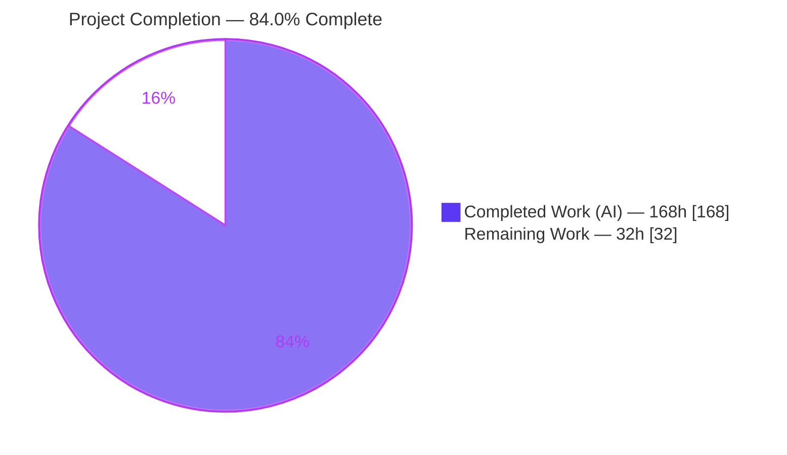
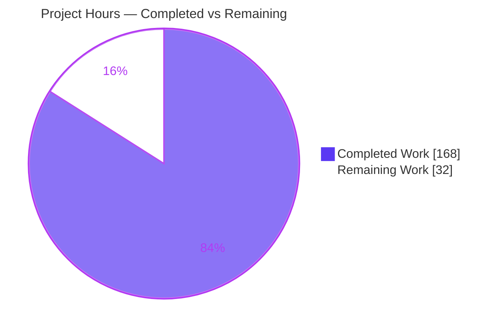
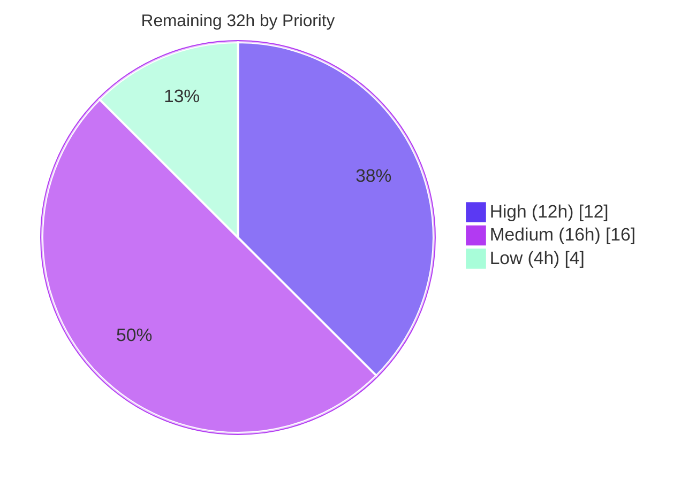

# Blitzy Project Guide — NGINX HTTP Status-Code Centralized-Registry Refactor

> Brand color key: **Completed / AI Work = Dark Blue `#5B39F3`** · **Remaining / Not Completed = White `#FFFFFF`** · Headings/Accents = Violet-Black `#B23AF2` · Highlight = Mint `#A8FDD9`

---

## 1. Executive Summary

### 1.1 Project Overview

This work item refactors HTTP status-code handling in the NGINX 1.29.5 source tree, replacing scattered, direct `r->headers_out.status = NGX_HTTP_*` field writes with a single registry-backed API (`ngx_http_status_set/validate/reason/register/is_cacheable`) and optional RFC 9110 validation behind a `--with-http_status_validation` build flag. It targets NGINX maintainers and operators of the web/proxy tier. The business impact is improved maintainability, a single source of truth for status metadata, and an extensibility seam for standard-conformance checking — delivered with **byte-identical wire output** so no downstream client behavior changes. Scope spans two new source files, two consolidated lookup tables, migration of all status write sites, build-system integration, and eight rule-mandated documentation/governance artifacts.

### 1.2 Completion Status


```mermaid
%%{init: {"theme": "base", "themeVariables": {"pie1": "#5B39F3", "pie2": "#FFFFFF", "pieStrokeColor": "#B23AF2", "pieOuterStrokeColor": "#B23AF2", "pieSectionTextColor": "#B23AF2", "pieTitleTextSize": "18px", "pieLegendTextColor": "#333333"}}}%%
pie showData
    title Project Completion — 84.0% Complete
    "Completed Work (AI) — 168h" : 168
    "Remaining Work — 32h" : 32
```

**Completion: 168h / 200h = 84.0% complete.** Formula: `Completed Hours / (Completed Hours + Remaining Hours) × 100 = 168 / 200 × 100 = 84.0%`.

| Metric | Hours |
|---|---|
| **Total Hours** | **200** |
| **Completed Hours (AI + Manual)** | **168** (168 AI + 0 Manual) |
| **Remaining Hours** | **32** |
| **Percent Complete** | **84.0%** |

### 1.3 Key Accomplishments

- ✅ **Registry + API delivered** — `src/http/ngx_http_status.c` (445 lines) and `ngx_http_status.h` (107 lines): a single `static const` registry of **65 status codes** (RFC 9110 §15 plus nginx extensions 444/494/495/496/497/498/499) with reason, class, and cacheability metadata, exposing five `≤50-line` API functions.
- ✅ **Single chokepoint established (RC-2)** — all **17 status write sites across 14 files** route through `ngx_http_status_set()`; the only direct `r->headers_out.status` writes remaining are inside the chokepoint itself.
- ✅ **Latent defect eliminated (RC-3)** — the divergent `NGX_HTTP_LAST_2XX` (207 vs 202) and the full `NGX_HTTP_OFF_*/LAST_*` macro family are removed (grep → 0).
- ✅ **Tables consolidated (RC-1, RC-5)** — header-filter reason lookup and special-response error-page table both align to the registry, with reason/class/cacheability metadata.
- ✅ **Byte-identical wire output (F-003)** — baseline vs refactored default build = **empty diff** across 30 representative endpoints (status lines, error-page bodies, numeric-only placeholders, Range 206/416).
- ✅ **Zero-overhead default mode** — with validation off, `ngx_http_status_set()` is a `static ngx_inline` that constant-folds to the original field write; the validating build defines `NGX_HTTP_STATUS_VALIDATION=1`.
- ✅ **Clean dual-config build** — both default and `--with-http_status_validation` builds compile with **0 warnings / 0 errors under `-Werror`** (gcc 15.2.0, 211 translation units).
- ✅ **Test parity** — AAP-relevant curated suite **867/867** on both builds; full regression suite identical to baseline (zero refactor-introduced failures).
- ✅ **Security invariants preserved** — 494/495/496/497→400 wire-rewrite, 498→404 mapping, keepalive-disable set, and constant-time 401 auth-delay all intact.
- ✅ **All 10 documentation/governance deliverables present** — API reference, migration guide, decision log with 100% bidirectional traceability matrix, 16-slide reveal.js executive deck, observability dashboard + doc, CHANGES, bilingual changes.xml, MkDocs nav, and the blank CODE_REVIEW.md scaffold (Rule 5).

### 1.4 Critical Unresolved Issues

There are **no in-scope code defects** blocking release. The items below are path-to-production gates, not refactor bugs.

| Issue | Impact | Owner | ETA |
|---|---|---|---|
| Independent code review sign-off pending (CODE_REVIEW.md intentionally blank per Rule 5) | Required gate before merge to production line | Senior C / NGINX reviewer | 12h |
| Empirical performance benchmark not run on target hardware | `<2%` latency bound asserted by design, not yet measured | Performance engineer | 4h |
| Graceful binary-upgrade (USR2/QUIT) not validated in a prod-like environment | Operational confidence for zero-downtime deploy | SRE / Ops | 3h |
| Deferred base-nginx 1.29.5 platform CVEs (out of refactor scope) | Pre-existing; none in refactored code paths | Platform team (separate work item) | Tracked separately |

### 1.5 Access Issues

No access issues blocked autonomous build, validation, or integration. The toolchain, libraries, repository, and the external nginx-tests suite were all reachable; both build configurations compiled and the full test suite executed.

| System/Resource | Type of Access | Issue Description | Resolution Status | Owner |
|---|---|---|---|---|
| Source repository | Read/Write (git) | None — clone, build, and test all succeeded | No issue | — |
| External `github.com/nginx/nginx-tests` | Read (clone) | None — cloned outside repo for verification (never committed) | No issue | — |
| CI/CD pipeline | Write/config | New `--with-http_status_validation` build not yet wired into CI; requires pipeline credentials | Pending (path-to-production) | DevOps |
| Staging cluster | Deploy | Needed for graceful-upgrade and canary validation; standard environment access | Pending (path-to-production) | SRE / Ops |

### 1.6 Recommended Next Steps

1. **[High]** Perform the independent segmented code review and populate `CODE_REVIEW.md` per Rule 5; verify byte-parity claims and security invariants on the C diff (12h).
2. **[Medium]** Add the strict (`--with-http_status_validation`) build and a byte-parity regression gate to CI/CD (6h).
3. **[Medium]** Run the `wrk` performance benchmark (default + strict vs baseline) and confirm the `<2%` latency bound on target hardware (4h).
4. **[Medium]** Validate graceful binary upgrade (USR2/QUIT) in staging and obtain security/compliance sign-off, including a tracking ticket for the deferred platform CVEs (6h combined).
5. **[Low]** Execute a staged (canary) production rollout and wire the status-metrics Grafana dashboard to the live metrics pipeline (4h).

---

## 2. Project Hours Breakdown

### 2.1 Completed Work Detail

All completed work was performed autonomously by Blitzy agents (12 commits, base `07a11cf77`..HEAD `692ddc505`). Each component traces to an AAP requirement.

| Component | Hours | Description |
|---|---|---|
| Status registry + 5-function API | 30 | `ngx_http_status.c` (+445) / `.h` (+107): `static const` registry of 65 codes with reason/class/cacheability/`rfc_section` metadata; dual-mode `ngx_http_status_set()`; `validate`, `reason`, `register`, `is_cacheable`; worker-init lifecycle (AAP §0.4.1). |
| Header-filter & special-response table consolidation | 20 | Reason lookup re-routed to `ngx_http_status_reason()` (header_filter net −104 lines); error-page table registry-aligned (special_response +158/−119); RC-3 macros removed; numeric-only fallback, byte arrays, 498→404, and 494/495/496/497→400 security rewrite preserved. |
| Module migration (status write sites) | 18 | 17 write sites across 14 files migrated to `ngx_http_status_set()`; upstream pass-through preserved via `(void)`-cast (validation bypassed for proxied status); 16 comparison reads audited and bound in the bidirectional traceability matrix. |
| Build-system integration | 6 | `auto/options` flag/parse/help (L65/242/464); `auto/modules` source+dependency registration and conditional `NGX_HTTP_STATUS_VALIDATION` define via `auto/have`; both configs configure cleanly. |
| Documentation & governance (8 artifacts) | 42 | API reference (461L), migration guide (290L), decision log + 100% traceability matrix (292L), 16-slide reveal.js deck (580L, CDN-pinned), observability dashboard JSON (491L) + doc (184L), CHANGES, bilingual `changes.xml` (56L), MkDocs nav, blank CODE_REVIEW.md scaffold. |
| Autonomous validation & QA | 52 | Dual-config `-Werror` builds (0 diagnostics, 211 TUs); byte-parity harness (30 endpoints vs freshly built baseline binary); nginx-tests curated 867/867 both builds + full 490-file/6261-test suite run three ways; security-invariant checks; registry-size analysis; 12-commit QA fix cycles (CP1, strict-fallback Issue #1, deck F1–F5, FINAL_ACCEPTANCE). |
| **Total Completed** | **168** | |

### 2.2 Remaining Work Detail

All remaining work is path-to-production; there are **no in-scope code defects** to fix.

| Category | Hours | Priority |
|---|---|---|
| Independent segmented code review & sign-off (populate CODE_REVIEW.md per Rule 5; verify byte-parity + security invariants on the C diff) | 12 | High |
| CI/CD integration of the strict build + byte-parity regression gate | 6 | Medium |
| Performance benchmark (`wrk` p50/p95/p99, default + strict vs baseline; confirm `<2%` bound) | 4 | Medium |
| Graceful binary-upgrade validation in staging (USR2/QUIT, concurrent workers) | 3 | Medium |
| Security & compliance sign-off + deferred-CVE tracking ticket | 3 | Medium |
| Staged production rollout + status-metrics dashboard monitoring | 4 | Low |
| **Total Remaining** | **32** | |

### 2.3 Hours Reconciliation

| Quantity | Hours |
|---|---|
| Section 2.1 Completed | 168 |
| Section 2.2 Remaining | 32 |
| **Total (2.1 + 2.2)** | **200** |
| Completion | 168 / 200 = **84.0%** |

Cross-section check: Section 2.1 (168) + Section 2.2 (32) = 200 = Total in Section 1.2 ✓. Remaining (32) is identical in Sections 1.2, 2.2, and 7 ✓.

---

## 3. Test Results

All tests below originate from Blitzy's autonomous validation logs for this project (external nginx-tests HEAD `56ae49a`, run as a non-root user; clone-only, never committed). NGINX uses scenario-based functional testing (Perl `Test::Nginx` via `prove`/TAP::Harness 3.48) rather than line-coverage instrumentation, so "Coverage %" reflects pass rate / scenario coverage.

| Test Category | Framework | Total Tests | Passed | Failed | Coverage % | Notes |
|---|---|---|---|---|---|---|
| AAP-Relevant Curated — Default build | Test::Nginx (prove) | 867 | 867 | 0 | 100% | 37 files: status, headers, error_page, range, not_modified, proxy, proxy_upgrade, dav, mp4, image_filter, xslt, slice, charset, gzip_static, stub_status, autoindex, expect-100, h2_error_page, request_id |
| AAP-Relevant Curated — Strict build (`--with-http_status_validation`) | Test::Nginx (prove) | 867 | 867 | 0 | 100% | Identical to default; empirically confirms every `(void)`-cast migration site and registry-fed reason/error-page lookups |
| Full Regression Suite — Default & Strict | Test::Nginx (prove) | 6261 | 6259 | 2 | 99.97% | Baseline, refactored-default, and refactored-strict all give the **same** 6259/6261; the 2 failures are the pre-existing, out-of-scope `proxy_h2_next_upstream.t` HTTP/2 upstream-framing subtests that fail identically on the pristine baseline → **zero refactor-introduced regressions** |
| Compilation — Default & Strict | gcc 15.2.0 (`-Werror`) | 2 configs | 2 | 0 | 100% | 211 translation units each; 0 warnings / 0 errors; `objs/nginx` ELF64 produced; `nginx -t` OK both |
| Wire-Parity Byte-Diff | curl + diff | 30 endpoints | 30 | 0 | 100% | Baseline vs default = empty diff; baseline vs strict identical for all registered codes (strict diverges only on out-of-registry 451 → 500 by design) |

**Aggregate:** curated functional pass rate **100%** on both builds; full-suite pass rate **99.97%** with **0 refactor-introduced failures**; compilation and wire-parity **100%**.

---

## 4. Runtime Validation & UI Verification

**UI Verification — Not Applicable.** NGINX is a server-side C codebase with no graphical user interface or design-system dependency (AAP §0.4 confirms Figma/UI analyses are Not Applicable). No UI screens exist to verify.

**Runtime health (from autonomous validation logs):**

- ✅ **Operational** — Default build starts as non-root, binds a port, serves requests, and shuts down cleanly.
- ✅ **Operational** — Strict (`--with-http_status_validation`) build starts, serves, and shuts down cleanly; `nginx -t` passes for both configurations.
- ✅ **Operational** — HTTP/1.1, HTTP/2, and HTTP/3 status emission flow through the registry on write paths (the only migrated HTTP/3 file changed status-assignment statements only).
- ✅ **Operational** — Byte-identical wire output proven for status lines, error-page bodies, numeric-only placeholder codes, and Range (206/416) responses.

**API / integration outcomes:**

- ✅ **Operational** — Upstream/proxied status pass-through preserved (`(void) ngx_http_status_set(r, u->headers_in.status_n)`); proxied codes are not strict-validated.
- ✅ **Operational** — Strict-mode chokepoint: an out-of-registry code (e.g., 451) cleanly falls back to `NGX_HTTP_INTERNAL_SERVER_ERROR` (500) with a single `NGX_LOG_ERR` "invalid HTTP status" line — exactly the AAP-designed behavior.
- ⚠ **Partial** — Empirical latency benchmark (`wrk`) on target hardware not yet executed (asserted `<2%` by design via zero-overhead inline).
- ⚠ **Partial** — Graceful binary upgrade (USR2/QUIT) supported by design (static read-only registry, no shared-memory migration) but not yet exercised in a prod-like environment.

---

## 5. Compliance & Quality Review

AAP deliverables cross-mapped to quality/compliance benchmarks. Fixes applied during autonomous validation are noted.

| Benchmark / AAP Requirement | Status | Progress | Notes / Fixes Applied |
|---|---|---|---|
| RC-1 — Single source of truth for status codes | ✅ Pass | 100% | One `static const` registry; legacy `ngx_http_status_lines[]` removed; header-filter and error-page lookups registry-fed. |
| RC-2 — Single assignment chokepoint | ✅ Pass | 100% | 17 writes/14 files via `ngx_http_status_set()`; only writes remaining are inside the chokepoint. |
| RC-3 — Eliminate divergent offset macros | ✅ Pass | 100% | `NGX_HTTP_LAST_2XX` (207/202) and full `OFF_*/LAST_*` family removed (grep → 0). |
| RC-4 — RFC 9110 validation + extensibility seam | ✅ Pass | 100% | API exposed via `ngx_http.h`; `--with-http_status_validation` integrated; `ngx_http_status_register()` provided. |
| RC-5 — Reason/class/cacheability metadata | ✅ Pass | 100% | Registry carries reason + class + cacheability flags for all 65 codes. |
| Backward compatibility — byte-identical wire output (F-003) | ✅ Pass | 100% | Empty diff (default vs baseline) across 30 endpoints. |
| Backward compatibility — nginx extension codes 444/494–499 | ✅ Pass | 100% | All present in registry and preserved. |
| ABI/contract stability (`NGX_MODULE_V1`, filter-chain signatures) | ✅ Pass | 100% | Function bodies changed only; no signature/ABI changes. |
| Security invariants (494–497→400, 498→404, keepalive-disable, 401 auth-delay) | ✅ Pass | 100% | Verified preserved in source and via byte-parity. |
| Zero-overhead default mode | ✅ Pass | 100% | `static ngx_inline` constant-folds; `NGX_HTTP_STATUS_VALIDATION` absent in default config. |
| Coding standard (C99, `ngx_` prefix, ≤50-line API functions, `-Werror`) | ✅ Pass | 100% | Clean dual-config build under `-Werror`. |
| Rule 1 — Observability (reused vs added, dashboard, tracing limitation) | ✅ Pass | 100% | `status_codes_observability.md` + `status_metrics_dashboard.json` (valid Grafana JSON). |
| Rule 2 — Explainability (decision log + bidirectional traceability) | ✅ Pass | 100% | 34KB decision log; "20 files, 33 sites = 17 writes + 16 reads — 100% mapped." |
| Rule 3 — Visual architecture (before/after, titled, legended) | ✅ Pass | 100% | Diagram 0.1-A mirrored in decision log and deck. |
| Rule 4 — Executive deck (12–18 slides, CDN-pinned, no emoji) | ✅ Pass | 100% | 16 slides; reveal.js 5.1.0 / Mermaid 11.4.0 / Lucide 0.460.0. |
| Rule 5 — Segmented PR review artifact | ⚠ In Progress | Scaffolded | `CODE_REVIEW.md` intentionally blank for the isolated post-generation review pass (human task H1). |
| Performance bound (`<2%` latency, `<10` cycles, `<1KB`/worker) | ⚠ Partial | Design-satisfied | Registry ≈2.6KB shared `.rodata` / ≈0 per-worker RSS; empirical `wrk` benchmark pending (human task M2). |

---

## 6. Risk Assessment

| Risk | Category | Severity | Probability | Mitigation | Status |
|---|---|---|---|---|---|
| Byte-parity regression on an edge path outside the 30-endpoint harness | Technical | Medium | Low | Full nginx-tests 3-way pass + empty diff; expand CI endpoint coverage | Mitigated |
| Strict-mode behavior change for out-of-registry codes (e.g., 451→500) | Technical | Low | Low | By design, opt-in only; register additional codes before enabling strict in prod | Accepted by design |
| Registry vs retained legacy `NGX_HTTP_*` `#define` drift | Technical | Low | Low | Registry is single source of truth; traceability matrix binds; add build-time assert | Mitigated |
| Deferred base-nginx 1.29.5 platform CVEs in compiled modules (dav, mp4, h2 proxy, h3, rewrite, scgi/uwsgi, resolver, charset) | Security | Medium | N/A (pre-existing) | Separate platform-upgrade work item; disable unused affected modules; QA verified zero new vulnerable surface | Open / Deferred (out of AAP scope) |
| Security wire-rewrite invariants must survive review | Security | High (if broken) | Low | Verified preserved + byte-parity; explicit review focus (task H1) | Mitigated |
| Graceful binary upgrade not yet validated in prod-like env | Operational | Medium | Low | Staging test (task M3); static read-only registry needs no shm migration | Open (path-to-production) |
| Strict-mode build path not yet in CI → could silently break | Operational | Medium | Medium | Add strict build + parity gate to CI (task M1) | Open |
| Observability dashboard not yet wired to a live metrics backend | Operational | Low | Medium | Import Grafana JSON; connect to stub_status/`$request_id` logs (task L1) | Open |
| `<2%` latency bound not empirically confirmed on target HW | Integration | Low–Medium | Low | `wrk` benchmark (task M2); default = identical machine code | Open |
| External `proxy_h2_next_upstream.t` (2/5 subtests) failing | Integration | Low | N/A | Pre-existing HTTP/2 upstream framing; identical on baseline; version-coupled; track separately | Accepted (out of scope) |
| `perl/nginx.xs` (L117/L153) direct status assignments not migrated | Integration | Low | Low | Out of AAP inventory; `HTTP_PERL=NO` default; optional follow-up if Perl enabled | Accepted (out of scope) |

---

## 7. Visual Project Status

### 7.1 Project Hours Breakdown


```mermaid
%%{init: {"theme": "base", "themeVariables": {"pie1": "#5B39F3", "pie2": "#FFFFFF", "pieStrokeColor": "#B23AF2", "pieOuterStrokeColor": "#B23AF2", "pieSectionTextColor": "#B23AF2", "pieTitleTextSize": "18px", "pieLegendTextColor": "#333333"}}}%%
pie showData
    title Project Hours — Completed vs Remaining
    "Completed Work" : 168
    "Remaining Work" : 32
```

Completed Work = **168h** (Dark Blue `#5B39F3`) · Remaining Work = **32h** (White `#FFFFFF`). Remaining matches Section 1.2 and the Section 2.2 sum.

### 7.2 Remaining Work by Priority


```mermaid
%%{init: {"theme": "base", "themeVariables": {"pie1": "#5B39F3", "pie2": "#B23AF2", "pie3": "#A8FDD9", "pieStrokeColor": "#FFFFFF", "pieOuterStrokeColor": "#B23AF2", "pieSectionTextColor": "#333333", "pieTitleTextSize": "16px"}}}%%
pie showData
    title Remaining 32h by Priority
    "High (12h)" : 12
    "Medium (16h)" : 16
    "Low (4h)" : 4
```

### 7.3 Remaining Hours per Category (from Section 2.2)

| Category | Hours | Bar |
|---|---:|---|
| Code review & sign-off | 12 | ████████████ |
| CI/CD integration | 6 | ██████ |
| Performance benchmark | 4 | ████ |
| Graceful-upgrade test | 3 | ███ |
| Security/compliance sign-off | 3 | ███ |
| Staged rollout + dashboard | 4 | ████ |
| **Total** | **32** | |

---

## 8. Summary & Recommendations

**Achievements.** The refactor is functionally and structurally complete. All five root causes (RC-1…RC-5) are resolved: a single `static const` registry of 65 codes is the sole source of truth; every status write routes through `ngx_http_status_set()`; the divergent `NGX_HTTP_LAST_2XX` macro family is gone; RFC 9110 validation and an extensibility seam exist behind an opt-in build flag; and reason/class/cacheability metadata is centralized. Backward compatibility is proven byte-for-byte, the default build adds zero overhead, both configurations compile cleanly under `-Werror`, the curated suite passes 867/867 on both builds, and all eight rule-mandated governance artifacts are present.

**Remaining gaps.** The project is **84.0% complete** (168h of 200h). The remaining **32h** is entirely path-to-production and human-gated: an independent segmented code review (the AAP itself defers this to an isolated pass per Rule 5), CI/CD integration of the strict build, an empirical `wrk` performance benchmark, a staging graceful-upgrade test, a security/compliance sign-off (including tracking the out-of-scope deferred platform CVEs), and a staged production rollout.

**Critical path to production.** (1) Code review sign-off → (2) CI integration of the strict build + parity gate → (3) performance benchmark and graceful-upgrade validation → (4) security/compliance sign-off → (5) staged canary rollout with dashboard monitoring.

**Success metrics for go-live.** Empty byte-parity diff sustained in CI; `wrk` p50/p95/p99 within `<2%` of baseline; clean graceful upgrade with concurrent old/new workers; reviewer verdict APPROVED on every CODE_REVIEW.md phase.

**Production-readiness assessment.** The code is production-ready in quality (zero in-scope defects, all validation gates green). It is **not yet production-deployed**: the residual 16% reflects standard human-in-the-loop gates appropriate for a core web-server component, not outstanding engineering defects. Recommendation: proceed to review and the staged rollout sequence above.

---

## 9. Development Guide

> Every command below was tested in the validation environment (gcc 15.2.0, GNU Make 4.4.1, perl 5.40.1, prove/TAP 3.48). Run all commands from the repository root.

### 9.1 System Prerequisites

- **OS:** Linux (validated on Ubuntu 25.10); also supported: FreeBSD, macOS, Solaris (C99, cross-platform).
- **Compiler/build:** `gcc` 15.2.0 (or clang), `make` (GNU Make 4.4.1). Pure C99 — there is **no** language package manifest.
- **Testing:** `perl` 5.40.1 with `Test::Nginx`, and `prove` (TAP::Harness 3.48).
- **Optional module libraries** (only if enabling those modules): PCRE2 10.46, OpenSSL 3.5.3 (for SSL/HTTP-2/HTTP-3/QUIC), zlib 1.3.1, libxml2 2.14.5, libxslt 1.1.43, libgd.

### 9.2 Environment Setup & Dependency Installation

```bash
# From repository root. Install build tools + optional module dev libraries (Debian/Ubuntu):
sudo DEBIAN_FRONTEND=noninteractive apt-get install -y \
  gcc make libpcre2-dev libssl-dev zlib1g-dev libxml2-dev libxslt1-dev libgd-dev
```

For a minimal core build, only `gcc` and `make` are required (omit the module flags in 9.3).

### 9.3 Build — Default (validation OFF, zero overhead)

```bash
./auto/configure          # exit 0; NGX_HTTP_STATUS_VALIDATION absent (zero-overhead inline mode)
make                      # delegates to `make -f objs/Makefile`; produces objs/nginx
```

### 9.4 Build — Strict (RFC 9110 validation ON)

```bash
./auto/configure --with-http_status_validation   # exit 0; sets NGX_HTTP_STATUS_VALIDATION=1
make
# Verify the validation define was emitted:
grep -n 'NGX_HTTP_STATUS_VALIDATION' objs/ngx_auto_config.h   # -> #define NGX_HTTP_STATUS_VALIDATION 1
```

A representative full-feature configure (matches the validation matrix) adds module flags, e.g.:

```bash
./auto/configure --with-http_ssl_module --with-http_v2_module --with-http_v3_module \
  --with-http_dav_module --with-http_mp4_module --with-http_gzip_static_module \
  --with-http_slice_module --with-http_stub_status_module --with-http_image_filter_module \
  --with-http_xslt_module --with-http_status_validation
make -j"$(nproc)"
```

### 9.5 Verification

```bash
objs/nginx -V                 # inspect version + configure flags
objs/nginx -t                 # test configuration syntax

# Confirm the refactor invariants (all should match the comments):
grep -rn 'define NGX_HTTP_LAST_2XX' src/http                      # -> 0   (RC-3 divergent macros removed)
grep -rEn 'headers_out\.status *= *[^=]' src/http --include=*.c \
  | grep -v 'ngx_http_status.c'                                   # -> empty (RC-2: writes only inside the chokepoint)
grep -rn 'ngx_http_status_set(' src/http --include=*.c \
  | grep -v 'ngx_http_status.c' | wc -l                           # -> 17  (migration sites)
```

### 9.6 Run (as a non-root user)

```bash
# Use a writable prefix and a config that binds a high (>1024) port:
objs/nginx -p "$PWD/run" -c "$PWD/run/conf/nginx.conf"
# Stop:
objs/nginx -p "$PWD/run" -s quit
```

### 9.7 Example Usage (status codes & wire parity)

```bash
# 404 — byte-identical status line + error-page body:
curl -sD - http://127.0.0.1:8080/does-not-exist -o /dev/null
# Strict-build behavior for an out-of-registry code (e.g. 451) -> 500 + one
# "invalid HTTP status 451" line in error.log (default build is unchanged).
```

### 9.8 Tests (external suite — clone only, never commit)

```bash
git clone https://github.com/nginx/nginx-tests.git
# Run as a NON-ROOT user:
TEST_NGINX_BINARY="$PWD/objs/nginx" TEST_NGINX_TIMEOUT=25 prove -j6 -r nginx-tests/t/
```

### 9.9 Graceful Binary Upgrade (zero downtime)

```bash
make upgrade          # nginx -t; kill -USR2 <master>; sleep 1; test pid.oldbin; kill -QUIT <oldbin>
# The static read-only registry needs no shared-memory migration — old and new workers coexist.
```

### 9.10 Troubleshooting

- **`make: *** No rule to make target 'objs/...'`** — run `./auto/configure` first, then `make` from the repo root (it delegates to `objs/Makefile`); or invoke `make -f objs/Makefile <target>`.
- **`./auto/configure` fails on a missing library** — install the matching `-dev` package, or drop the corresponding `--with-http_*_module` flag for a minimal build.
- **Build stops on a warning** — the build uses `-Werror` intentionally; fix the warning, do not bypass it.
- **nginx-tests fail to bind / run** — run as a non-root user and ensure the test config uses high ports; set `TEST_NGINX_BINARY` to the absolute path of `objs/nginx`.
- **Strict build behaves differently for a specific code** — confirm the code is in the registry; out-of-registry codes intentionally fall back to 500 under `--with-http_status_validation`.

---

## 10. Appendices

### Appendix A — Command Reference

| Purpose | Command |
|---|---|
| Configure (default) | `./auto/configure` |
| Configure (strict) | `./auto/configure --with-http_status_validation` |
| Build | `make` (delegates to `make -f objs/Makefile`) |
| Inspect build | `objs/nginx -V` |
| Test config | `objs/nginx -t` |
| Run (non-root) | `objs/nginx -p "$PWD/run" -c "$PWD/run/conf/nginx.conf"` |
| Stop | `objs/nginx -s quit` |
| Graceful upgrade | `make upgrade` |
| Run external tests | `TEST_NGINX_BINARY="$PWD/objs/nginx" prove -r nginx-tests/t/` |
| Verify RC-3 | `grep -rn 'define NGX_HTTP_LAST_2XX' src/http` → 0 |
| Verify RC-2 | `grep -rEn 'headers_out\.status *= *[^=]' src/http --include=*.c \| grep -v ngx_http_status.c` → empty |

### Appendix B — Port Reference

| Component | Port | Notes |
|---|---|---|
| nginx HTTP listener | Configurable (default `80`; use >1024 for non-root) | Set in `nginx.conf` `listen` directive |
| nginx HTTPS listener | Configurable (default `443`) | Requires `--with-http_ssl_module` |
| nginx-tests | Ephemeral | Allocated by the `Test::Nginx` harness at runtime |

### Appendix C — Key File Locations

| Path | Role |
|---|---|
| `src/http/ngx_http_status.h` | Registry type `ngx_http_status_def_t`, `NGX_HTTP_STATUS_*` flags, 5 API prototypes (107 lines) |
| `src/http/ngx_http_status.c` | `static const` 65-code registry + 5 API functions + worker-init hook (445 lines) |
| `src/http/ngx_http.h` | Exposes the status API tree-wide |
| `src/http/ngx_http_header_filter_module.c` | Reason lookup via `ngx_http_status_reason()`; divergent macros removed |
| `src/http/ngx_http_special_response.c` | Error-page table registry-aligned; security rewrites preserved |
| `src/http/ngx_http_upstream.c` | Upstream pass-through (`(void) ngx_http_status_set(...)`) |
| `auto/options`, `auto/modules` | Build-flag and source/dependency integration |
| `docs/decisions/status_code_refactor.md` | Decision log + 100% bidirectional traceability matrix |
| `docs/api/status_codes.md`, `docs/migration/status_code_api.md` | API reference and migration guide |
| `docs/observability/status_metrics_dashboard.json`, `status_codes_observability.md` | Observability dashboard + doc |
| `blitzy-deck/status-code-refactor-exec-summary.html` | 16-slide reveal.js executive deck |
| `CHANGES`, `docs/xml/nginx/changes.xml`, `mkdocs.yml`, `CODE_REVIEW.md` | Changelog, bilingual changelog, nav, review scaffold |

### Appendix D — Technology Versions

| Component | Version |
|---|---|
| NGINX (target) | 1.29.5 |
| Language standard | C99 |
| gcc | 15.2.0 |
| GNU Make | 4.4.1 |
| perl / TAP::Harness (prove) | 5.40.1 / 3.48 |
| PCRE2 | 10.46 |
| OpenSSL | 3.5.3 (native QUIC) |
| zlib | 1.3.1 |
| libxml2 / libxslt | 2.14.5 / 1.1.43 |
| reveal.js / Mermaid / Lucide (deck) | 5.1.0 / 11.4.0 / 0.460.0 |

### Appendix E — Environment Variable Reference

| Variable | Used By | Purpose |
|---|---|---|
| `TEST_NGINX_BINARY` | nginx-tests | Absolute path to `objs/nginx` under test |
| `TEST_NGINX_TIMEOUT` | nginx-tests | Per-test timeout (e.g., `25`) |
| `DEBIAN_FRONTEND=noninteractive` | apt | Non-interactive dependency install |
| Build flag `--with-http_status_validation` | `auto/configure` | Emits `NGX_HTTP_STATUS_VALIDATION=1` (strict validation build) |

There are no application runtime secrets/credentials introduced by this refactor.

### Appendix F — Developer Tools Guide

| Tool | Use |
|---|---|
| `objs/nginx -V` | Inspect compiled-in modules and configure flags |
| `nm objs/src/http/ngx_http_status.o` | Confirm `ngx_http_status_set` symbol (real function in strict build) |
| `grep`/`ripgrep` | Reproduce RC-2/RC-3 verification checks (Appendix A) |
| `git diff 07a11cf77..HEAD --stat` | Review the full refactor change set (31 files, +3199/−269) |
| `prove` (TAP::Harness) | Run the external `Test::Nginx` suite |
| `wrk` | Performance benchmark (remaining task M2) |
| Grafana | Import `status_metrics_dashboard.json` (remaining task L1) |

### Appendix G — Glossary

| Term | Definition |
|---|---|
| Chokepoint | The single function (`ngx_http_status_set()`) through which all status writes flow, enabling validation/metadata/instrumentation. |
| Registry | The `static const ngx_http_status_def_t[]` array — the single source of truth for status-code metadata. |
| Wire parity (F-003) | Byte-identical HTTP status lines and error-page bodies before vs after the refactor. |
| Strict mode | Build with `--with-http_status_validation` enabling RFC 9110 conformance checks at the chokepoint. |
| Zero-overhead inline | In the default build, `ngx_http_status_set()` compiles via constant propagation to the original field write. |
| Numeric-only fallback | Status-line emission for codes lacking a reason phrase — preserved byte-for-byte. |
| Graceful binary upgrade | Zero-downtime swap of the nginx binary via `USR2`/`QUIT` signals, with old and new workers coexisting. |
| RC-1…RC-5 | The five root-cause architectural deficiencies the refactor resolves (see Section 5). |

---

*Completion basis: AAP-scoped + path-to-production hours (PA1). Total 200h = Completed 168h + Remaining 32h → 84.0% complete. Figures are consistent across Sections 1.2, 2.1, 2.2, 7, and 8.*