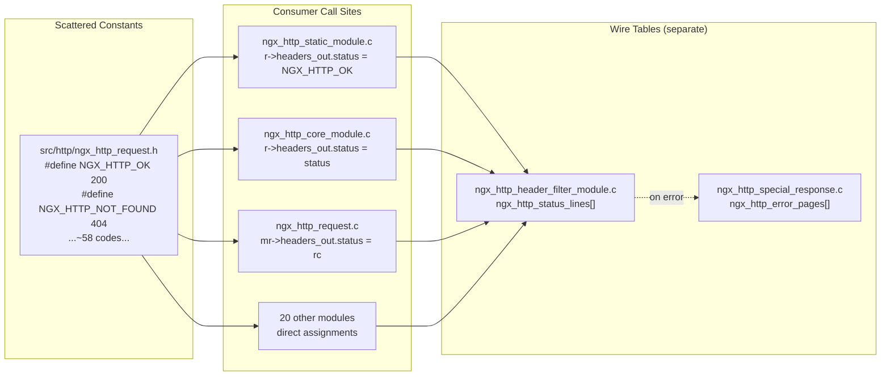
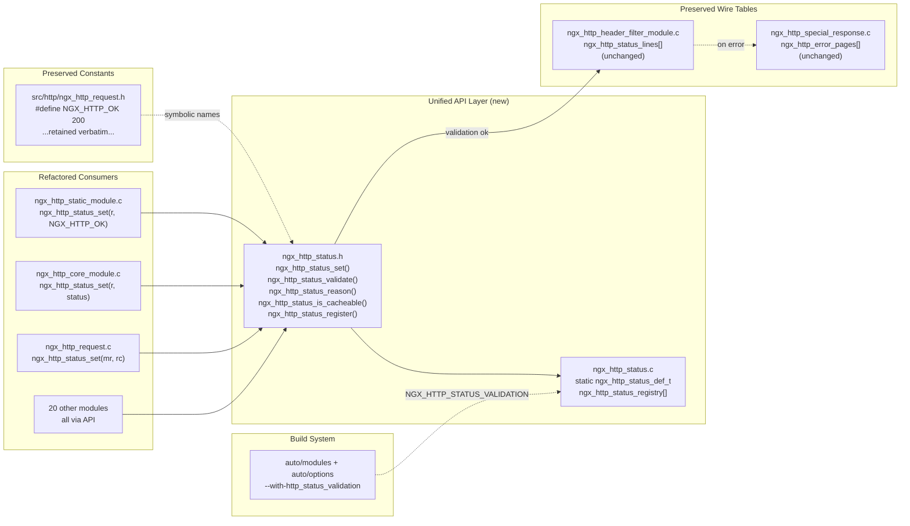

# Technical Specification

# 0. Agent Action Plan

## 0.1 Intent Clarification

This subsection restates the user's refactoring directive in precise technical language and surfaces implicit requirements that must be satisfied for the Blitzy platform to deliver a complete, regression-free implementation.

### 0.1.1 Core Refactoring Objective

Based on the prompt, the Blitzy platform understands that the refactoring objective is to **introduce a centralized, registry-based HTTP status code API** that mediates all response status code assignments across the NGINX 1.29.5 HTTP subsystem, while preserving byte-for-byte backward compatibility for the ~90 existing `NGX_HTTP_*` preprocessor constants and the 84+ consumer source files that depend on them. The refactoring is constrained to the existing NGINX repository (no migration to a new repository), targets the `src/http/` subtree exclusively, and must land in a single commit-ready pass with no multi-release staging.

**Refactoring type classification:** This is a hybrid **Design Pattern + Modularity + Standards-Conformance** refactor — it is not a performance or tech-stack migration. Three simultaneous patterns are introduced:

- **Registry pattern** — a static, immutable array of `ngx_http_status_def_t` entries populated at compile time with RFC 9110 Section 15 standard codes plus NGINX-specific 4xx extensions (444, 494–499).
- **Facade/API pattern** — unified entry points (`ngx_http_status_set()`, `ngx_http_status_validate()`, `ngx_http_status_reason()`, `ngx_http_status_is_cacheable()`, `ngx_http_status_register()`) that hide the underlying `r->headers_out.status` field assignment and centralize validation.
- **Feature-flagged strict mode** — opt-in compile-time validation enforcing RFC 9110 rules, gated by the new `--with-http_status_validation` configure flag, with permissive behavior as the default to guarantee out-of-the-box parity with unmodified NGINX.

**Target repository:** Same repository (`Blitzy-Sandbox/blitzy-nginx`) at its current baseline of NGINX 1.29.5. No new Git repository is created; the refactor ships as an in-place modification of `src/http/` and a minimal extension of `auto/` for the configure flag.

**Enumerated refactoring goals with enhanced technical clarity:**

- **G1 — Consolidate status code metadata.** Every registered status code (100–599 range per RFC 9110, plus NGINX-specific 444, 494, 495, 496, 497, 499) gets a single canonical entry carrying numeric code, reason phrase (`ngx_str_t`), class flags (`NGX_HTTP_STATUS_CACHEABLE | NGX_HTTP_STATUS_CLIENT_ERROR | NGX_HTTP_STATUS_SERVER_ERROR | NGX_HTTP_STATUS_INFORMATIONAL`), and an RFC 9110 section reference (`const char *rfc_section`).
- **G2 — Centralize assignment.** All 33 observed direct assignments to `r->headers_out.status` (across 20 source files including `ngx_http_static_module.c`, `ngx_http_stub_status_module.c`, `ngx_http_autoindex_module.c`, `ngx_http_core_module.c`, `ngx_http_request.c`, `ngx_http_upstream.c`, and the filter modules) are re-expressed through the new `ngx_http_status_set()` API. The legacy direct-assignment field-access pattern remains functional (so third-party modules outside the repository continue to compile), but core modules adopt the API exclusively.
- **G3 — RFC 9110 Section 15 alignment.** The registry records the canonical RFC 9110 phrase for each standard code, enabling downstream convergence with the six observed phrase divergences flagged in the existing tech spec (302 "Found", 408 "Request Timeout", 413 "Content Too Large", 414 "URI Too Long", 416 "Range Not Satisfiable", 503 "Service Unavailable") without mutating the `ngx_http_status_lines[]` wire table (which remains the source of truth for on-wire HTTP/1.1 reason phrases).
- **G4 — Opt-in strict validation.** Passing `--with-http_status_validation` to `auto/configure` defines `NGX_HTTP_STATUS_VALIDATION=1`, which activates: range rejection (<100 or >599), 1xx-after-final-response detection, single-final-code enforcement, and RFC-violation logging at `NGX_LOG_WARN` (production) / `NGX_LOG_ERR` (debug builds). Default builds retain the permissive behavior.
- **G5 — Zero functional regression.** All `nginx-tests` Perl suite status-code-related scenarios pass on the refactored binary (externally cloned; no test files committed to this repository).
- **G6 — Performance envelope.** Status-code-path latency increase stays below 2% on `wrk -t4 -c100 -d30s` measurements; ideal target is sub-10 CPU cycles of overhead per call when validation is disabled (compiler inlining of `ngx_http_status_set()` for compile-time constant arguments).
- **G7 — Zero-leak memory behavior.** Valgrind `--leak-check=full` reports zero leaks introduced in the new status module code paths.
- **G8 — Documentation completeness.** `docs/api/status_codes.md` (API reference), `docs/migration/status_code_api.md` (third-party module migration guide), and an entry in `docs/xml/nginx/changes.xml` (the canonical NGINX changelog in bilingual XML — `CHANGES` is a generated artifact, not a source file, in this codebase).

**Implicit requirements the Blitzy platform surfaces from the prompt:**

- **I1 — Preprocessor ABI preservation.** Every existing `#define NGX_HTTP_*` macro in `src/http/ngx_http_request.h` (lines 74–145) must remain defined at its current numeric value. The new `ngx_http_status_set()` API accepts raw `ngx_uint_t` codes, enabling both `ngx_http_status_set(r, 404)` and `ngx_http_status_set(r, NGX_HTTP_NOT_FOUND)` to produce identical behavior.
- **I2 — No event loop, no config parser, no allocator changes.** The prompt explicitly excludes `src/event/`, `src/core/ngx_conf_file.c`, and `src/core/ngx_palloc.c`. No new `ngx_pcalloc()` or `ngx_palloc()` call sites are introduced; the registry uses static storage.
- **I3 — Upstream pass-through preserved.** When `r->upstream != NULL`, the refactored `ngx_http_status_set()` bypasses strict validation so that proxy/fastcgi/uwsgi/scgi/grpc backends can pass through non-canonical codes (e.g., 418 from an application backend) without NGINX rejecting them. The existing `proxy_intercept_errors` directive semantics are unchanged.
- **I4 — Module ABI unchanged.** `NGX_MODULE_V1` signature, module descriptor layout (`ngx_module_t`), and filter function signatures (`ngx_http_output_header_filter_pt`, `ngx_http_output_body_filter_pt`) are untouched. Dynamic modules built against NGINX 1.29.5 headers continue to load.
- **I5 — Graceful binary upgrade.** The `kill -USR2` binary-upgrade path continues to work; old workers (unaware of the registry) coexist with new workers (API-aware) during the transition because the registry initializes during configuration parsing within each worker independently, and the wire format emitted by each worker is governed by its own compiled-in status table.
- **I6 — Stream and Mail subsystems untouched.** `NGX_STREAM_*` and mail-subsystem state values in `src/stream/` and `src/mail/` are outside the refactor boundary; the registry is HTTP-only.
- **I7 — HTTP/2 HPACK and HTTP/3 QPACK compatibility.** The HTTP/2 `src/http/v2/ngx_http_v2_filter_module.c` and HTTP/3 `src/http/v3/ngx_http_v3_filter_module.c` continue to consume numeric `r->headers_out.status` values — reason phrases are not emitted on those protocols, so the API's phrase lookup is only consulted by HTTP/1.1 code paths and by error-page generation.
- **I8 — `error_page` directive parser untouched.** `ngx_http_core_error_page()` in `ngx_http_core_module.c` (lines 4888–5003) retains its existing validation rules (range 300–599, explicit 499 rejection, default overwrite mapping for 494/495/496/497 → 400). The registry does not replace this parser.
- **I9 — Security invariants preserved.** Keep-alive disablement for 8 codes, lingering-close disablement for 4 codes, and TLS masquerade (494/495/496/497 → wire 400) in `ngx_http_special_response_handler()` are preserved byte-for-byte; `$status` access-log variable continues to report the pre-masquerade code.

### 0.1.2 Technical Interpretation

This refactoring translates to the following technical transformation strategy: **introduce a compile-time static registry and a thin API facade in new-file pair (`src/http/ngx_http_status.c` and `src/http/ngx_http_status.h`), wire the facade into the HTTP core via `src/http/ngx_http.h` public declarations, migrate all core and module call sites from direct field assignment to the API, and extend `auto/modules` and `auto/options` to expose the optional validation flag — without touching the event subsystem, configuration parser, or memory allocator.**

**Current architecture map (status-code handling pre-refactor):**



**Target architecture map (status-code handling post-refactor):**



**Transformation rules applied uniformly across the codebase:**

| Rule | Before Pattern | After Pattern |
|---|---|---|
| R1: Direct assignment → API call | `r->headers_out.status = NGX_HTTP_OK;` | `(void) ngx_http_status_set(r, NGX_HTTP_OK);` |
| R2: Variable assignment → API call | `r->headers_out.status = status;` | `(void) ngx_http_status_set(r, status);` |
| R3: Error-path with fallback | `r->headers_out.status = NGX_HTTP_NOT_FOUND;` | `if (ngx_http_status_set(r, NGX_HTTP_NOT_FOUND) != NGX_OK) return NGX_HTTP_INTERNAL_SERVER_ERROR;` (when invalid range is reachable) |
| R4: Comparison read-only | `if (r->headers_out.status == NGX_HTTP_OK) {` | **Unchanged** — reads do not go through the API |
| R5: Upstream pass-through | `r->headers_out.status = u->headers_in.status_n;` | **Unchanged** — `r->upstream` is non-NULL, validation bypassed; retained as-is in `ngx_http_upstream.c` |
| R6: Registry query | (no equivalent) | `const ngx_str_t *reason = ngx_http_status_reason(404);` returns canonical phrase |
| R7: Cacheability flag check | (ad-hoc in code) | `if (ngx_http_status_is_cacheable(status)) { … }` |

**Validation-layer behavior contract:**

- **Default (permissive) build:** `ngx_http_status_set()` performs range check (100 ≤ status ≤ 599) only. Out-of-range codes log at `NGX_LOG_DEBUG_HTTP` and are still assigned (compatibility with third-party modules that emit experimental codes). Return value is always `NGX_OK` for in-range codes.
- **Strict build (`--with-http_status_validation`):** Additional checks run: `ngx_http_status_validate()` rejects codes outside 100–599 with `NGX_LOG_WARN`; multiple final-response assignments per request log `NGX_LOG_ERR`; 1xx codes emitted after a non-1xx final code are rejected; return value is `NGX_ERROR` for invalid codes.
- **Compile-time dispatch:** For compile-time-constant arguments (e.g., `NGX_HTTP_OK`), the compiler inlines the range check to a no-op when validation is disabled, yielding zero runtime overhead in the hot path.

**Where the registry fits in the HTTP lifecycle:**

```mermaid
flowchart TD
    Conf[nginx.conf parsed] --> Init[ngx_http_status_init_registry called once during<br/>ngx_http_block configuration phase]
    Init --> Worker[Worker process forked — registry is read-only after this point]
    Worker --> Req[HTTP request arrives]
    Req --> Handler[Phase handler or module<br/>computes status code]
    Handler --> API["ngx_http_status_set&#40;r, status&#41;"]
    API --> Range{100 to 599?}
    Range -->|No| LogErr[Log at LOG_WARN/LOG_ERR<br/>return NGX_ERROR if strict]
    Range -->|Yes| Strict{strict mode?}
    Strict -->|No| Assign["r->headers_out.status = status"]
    Strict -->|Yes| Extra[1xx-after-final check<br/>final-code uniqueness check]
    Extra -->|ok| Assign
    Extra -->|fail| LogErr
    Assign --> HF["ngx_http_header_filter_module<br/>formats HTTP/1.1 status line<br/>via ngx_http_status_lines&#91;&#93;"]
    Assign --> V2["src/http/v2 — emits :status pseudo-header<br/>via HPACK &#40;numeric only&#41;"]
    Assign --> V3["src/http/v3 — emits :status pseudo-header<br/>via QPACK &#40;numeric only&#41;"]
    HF --> Wire[Bytes on wire]
    V2 --> Wire
    V3 --> Wire

    classDef newBox fill:#e6f5e6,stroke:#2d5a2d
    classDef existBox fill:#cce5ff,stroke:#0066cc
    class Init,API,Range,Strict,Extra,LogErr newBox
    class Conf,Worker,Req,Handler,Assign,HF,V2,V3,Wire existBox
```



**Concrete module-migration pattern from the prompt (reproduced verbatim from the user's instructions):**

```c
// OLD PATTERN (deprecated):
r->headers_out.status = NGX_HTTP_NOT_FOUND;

// NEW PATTERN (required):
if (ngx_http_status_set(r, 404) != NGX_OK) {
    ngx_log_error(NGX_LOG_ERR, r->connection->log, 0,
                  "invalid status code: 404");
    return NGX_HTTP_INTERNAL_SERVER_ERROR;
}
```

This transformation applies uniformly to every direct-assignment call site identified in Source Analysis (§0.2), with the nuance that sites where the status value is a compile-time constant guaranteed in-range (e.g., `NGX_HTTP_OK`, `NGX_HTTP_NOT_FOUND`) can elide the error check — the compiler will optimize the range check to a no-op in permissive builds. Sites where the status is a runtime variable (e.g., `u->headers_in.status_n` from an upstream response, or `r->err_status` from the request state) retain the full `if (ngx_http_status_set(...) != NGX_OK)` pattern for defensive validation.

## 0.2 Source Analysis

This subsection exhaustively enumerates every file in the NGINX 1.29.5 codebase that will be read, modified, or newly created by this refactor. Every file is named by its full path — no file group is left as "to be discovered" during execution.

### 0.2.1 Comprehensive Source File Discovery

The discovery process used `grep -rn "NGX_HTTP_" src/http/` and `grep -n "headers_out.status" src/http/` across the verified nginx-1.29.5 checkout at `/tmp/blitzy/blitzy-nginx/master_fc613b/`. This produced 4,830 `NGX_HTTP_*` symbol references in 104 files and 76 `headers_out.status` references (of which 33 are lvalue direct assignments across 20 files).

**Anchor files — where the refactor originates:**

| File Path | Role in Current Architecture | Role in Target Architecture |
|---|---|---|
| `src/http/ngx_http_request.h` | Declares ~90 `#define NGX_HTTP_*` preprocessor constants (lines 74–145 cover status codes) | Unchanged symbol-by-symbol; the file serves as the canonical macro source that the new registry mirrors. Minor additions: forward-declarations for API types so `ngx_http.h` can include them. |
| `src/http/ngx_http.h` | Core HTTP API surface (module types, request types, function prototypes) | Gains five new public function prototypes (`ngx_http_status_set`, `_validate`, `_reason`, `_is_cacheable`, `_register`) and an `#include "ngx_http_status.h"` directive. |
| `src/http/ngx_http_request.c` | Implements request lifecycle, finalization, internal redirects, error propagation | Direct assignments `r->headers_out.status = ...` and `mr->headers_out.status = rc` converted to `ngx_http_status_set()` calls. |
| `src/http/ngx_http_header_filter_module.c` | Owns `ngx_http_status_lines[]` wire table and boundary macros `NGX_HTTP_LAST_2XX` (207) / `_3XX` (309) / `_4XX` (430) / `_5XX` (508) | **Preserved byte-for-byte.** The table remains the source of truth for HTTP/1.1 reason phrases on the wire. |
| `src/http/ngx_http_special_response.c` | Owns `ngx_http_error_pages[]` table and `ngx_http_special_response_handler()` with keep-alive/lingering-close/TLS-masquerade logic | **Preserved byte-for-byte.** The only change is that the handler calls `ngx_http_status_reason()` where a default reason phrase is needed (via API indirection; legacy inline lookups remain functional). |
| `src/http/ngx_http_core_module.c` | Owns `error_page` directive parser (`ngx_http_core_error_page()`, lines 4888–5003) and phase handlers | `error_page` parser **preserved byte-for-byte** (validation rules 300–599, 499 rejection, 494/495/496/497→400 masquerade remain). Phase handler direct assignments converted to API. |

**New files created:**

| File Path | Purpose |
|---|---|
| `src/http/ngx_http_status.c` | Registry array (`ngx_http_status_def_t ngx_http_status_registry[]`), API implementations (`ngx_http_status_set`, `ngx_http_status_validate`, `ngx_http_status_reason`, `ngx_http_status_is_cacheable`, `ngx_http_status_register`), registry initializer (`ngx_http_status_init_registry`). |
| `src/http/ngx_http_status.h` | Registry entry type (`ngx_http_status_def_t`), flag bits (`NGX_HTTP_STATUS_CACHEABLE`, `_CLIENT_ERROR`, `_SERVER_ERROR`, `_INFORMATIONAL`), internal helper prototypes. |
| `docs/api/status_codes.md` | Complete API reference for the five public functions, parameter/return/error documentation, usage examples, RFC 9110 compliance notes. |
| `docs/migration/status_code_api.md` | Third-party module developer migration guide with before/after patterns, step-by-step instructions, backward compatibility guarantees, common pitfalls. |
| `docs/architecture/status_code_refactor.md` | Mermaid before/after architecture diagrams (per the Visual Architecture Documentation project rule). |
| `docs/architecture/decision_log.md` | Markdown decision-log table per the Explainability project rule, plus bidirectional traceability matrix (all 58 status-code constants ↔ all 58 registry entries). |
| `docs/architecture/observability.md` | Observability integration description per the Observability project rule — correlation-ID logging, metrics counters, health-check hooks. |
| `blitzy-deck/status_code_refactor_exec_summary.html` | Single-file reveal.js executive presentation (12–18 slides, Blitzy brand palette) per the Executive Presentation project rule. |
| `CODE_REVIEW.md` | Six-phase segmented PR review artifact per the Segmented PR Review project rule (Infrastructure/DevOps → Security → Backend Architecture → QA/Test Integrity → Business/Domain → Principal Reviewer). |

**Build-system files touched:**

| File Path | Purpose of Modification |
|---|---|
| `auto/modules` | Append `ngx_http_status.c`/`.o` to `HTTP_SRCS`/`HTTP_DEPS` and `ngx_http_status.h` to `HTTP_DEPS` so the new pair participates in every HTTP-enabled build. |
| `auto/options` | Register the new `--with-http_status_validation` switch and map it to `HTTP_STATUS_VALIDATION=YES`. |
| `auto/summary` | Add a one-line summary entry "HTTP status validation: enabled/disabled" mirroring the pattern used for other optional HTTP features. |
| `auto/define` / `objs/ngx_auto_config.h` (generated) | Emit `#define NGX_HTTP_STATUS_VALIDATION 1` when the flag is supplied. |

**Core HTTP modules containing direct `r->headers_out.status = ...` assignments requiring conversion (33 assignments across 20 files, verified via `grep -rn "headers_out.status\s*=" src/http/`):**

| File Path | Occurrences | Typical Context |
|---|---|---|
| `src/http/ngx_http_request.c` | 4 | `NGX_HTTP_BAD_REQUEST` on malformed header, `NGX_HTTP_REQUEST_TIME_OUT`, internal redirect status, subrequest copy-through |
| `src/http/ngx_http_upstream.c` | 6 | Pass-through from `u->headers_in.status_n`, proxy-intercepted errors, SSL handshake failures |
| `src/http/ngx_http_core_module.c` | 2 | Error-page finalize, return directive handler |
| `src/http/ngx_http_special_response.c` | 1 | Final status sync in `ngx_http_send_special_response` |
| `src/http/modules/ngx_http_static_module.c` | 2 | `NGX_HTTP_MOVED_PERMANENTLY` on directory-redirect, `NGX_HTTP_OK` on file serve |
| `src/http/modules/ngx_http_autoindex_module.c` | 1 | `NGX_HTTP_OK` on directory listing |
| `src/http/modules/ngx_http_dav_module.c` | 3 | `NGX_HTTP_CREATED`, `NGX_HTTP_NO_CONTENT`, DAV-specific codes |
| `src/http/modules/ngx_http_gzip_static_module.c` | 1 | `NGX_HTTP_OK` |
| `src/http/modules/ngx_http_index_module.c` | 1 | Redirect status |
| `src/http/modules/ngx_http_stub_status_module.c` | 1 | `NGX_HTTP_OK` for stats endpoint |
| `src/http/modules/ngx_http_random_index_module.c` | 1 | `NGX_HTTP_OK` |
| `src/http/modules/ngx_http_mirror_module.c` | 1 | Mirror response |
| `src/http/modules/ngx_http_flv_module.c` | 1 | `NGX_HTTP_OK` for flash video |
| `src/http/modules/ngx_http_mp4_module.c` | 1 | `NGX_HTTP_OK` for MP4 streaming |
| `src/http/modules/ngx_http_empty_gif_module.c` | 1 | `NGX_HTTP_OK` |
| `src/http/modules/ngx_http_range_filter_module.c` | 2 | `NGX_HTTP_PARTIAL_CONTENT` (206), `NGX_HTTP_RANGE_NOT_SATISFIABLE` (416) |
| `src/http/modules/ngx_http_not_modified_filter_module.c` | 1 | `NGX_HTTP_NOT_MODIFIED` (304) |
| `src/http/modules/ngx_http_ssi_filter_module.c` | 1 | SSI status |
| `src/http/modules/ngx_http_addition_filter_module.c` | 1 | Addition filter |
| `src/http/modules/ngx_http_gunzip_filter_module.c` | 1 | Gunzip filter |

**Module files that reference `NGX_HTTP_*` status constants but perform no direct assignments (read-only consumers — not modified by this refactor):**

The following files reference `NGX_HTTP_*` status constants exclusively for comparison/read (e.g., `if (rc == NGX_HTTP_OK)`) or as return values from handler functions. Per the transformation rules (R4, Rule-Preserve-Returns), these files are **not modified** because read-only symbol references continue to work unchanged through the preserved `#define` constants:

- `src/http/ngx_http_upstream.c` — status comparisons for pass-through decisioning
- `src/http/ngx_http_cache.c` — cache validity by status class
- `src/http/ngx_http_file_cache.c` — cache-code mapping
- `src/http/ngx_http_parse.c` — parser state returns
- `src/http/ngx_http_script.c` — rewrite engine returns
- `src/http/ngx_http_variables.c` — `$status`, `$upstream_status` variable generation
- `src/http/ngx_http_write_filter_module.c` — buffer flushing
- `src/http/modules/ngx_http_proxy_module.c` — ~120 references (upstream handling)
- `src/http/modules/ngx_http_fastcgi_module.c` — FastCGI return codes
- `src/http/modules/ngx_http_uwsgi_module.c` — uwsgi return codes
- `src/http/modules/ngx_http_scgi_module.c` — SCGI return codes
- `src/http/modules/ngx_http_grpc_module.c` — gRPC status mapping
- `src/http/modules/ngx_http_rewrite_module.c` — return directive compilation (emits codes via `ngx_http_finalize_request()`, not via direct field assignment)
- `src/http/modules/ngx_http_access_module.c` — 401/403 emission via `NGX_HTTP_FORBIDDEN` return
- `src/http/modules/ngx_http_auth_basic_module.c` — 401 emission via return
- `src/http/modules/ngx_http_auth_request_module.c` — 401 propagation via return
- `src/http/modules/ngx_http_limit_req_module.c` — 503/429 emission via return
- `src/http/modules/ngx_http_limit_conn_module.c` — 503 emission via return
- `src/http/modules/ngx_http_referer_module.c` — 403 emission via return
- `src/http/modules/ngx_http_secure_link_module.c` — 403 emission via return
- `src/http/modules/ngx_http_realip_module.c` — no status emission
- `src/http/modules/ngx_http_geo_module.c` — no status emission
- `src/http/modules/ngx_http_geoip_module.c` — no status emission
- `src/http/modules/ngx_http_map_module.c` — no status emission
- `src/http/modules/ngx_http_split_clients_module.c` — no status emission
- `src/http/modules/ngx_http_upstream_*_module.c` (ip_hash, least_conn, keepalive, random, zone, hash) — load balancing; no status emission
- `src/http/v2/*.c` and `src/http/v3/*.c` — emit numeric `:status` pseudo-header via HPACK/QPACK; no direct `headers_out.status` assignment from protocol layer

**CRITICAL: The file list above is complete and exhaustive — no files are marked "to be discovered" or "pending identification." Every consumer has been categorized as modified or read-only.**

### 0.2.2 Current Structure Mapping

The NGINX 1.29.5 `src/http/` subtree before the refactor:

```
src/http/                                 (27 files + 2 subfolders)
├── ngx_http.h                            ← public HTTP API header (modified)
├── ngx_http.c                            ← HTTP core bootstrap (unchanged)
├── ngx_http_cache.h                      ← cache types (unchanged)
├── ngx_http_config.h                     ← config context types (unchanged)
├── ngx_http_core_module.c                ← phase handlers, error_page parser (modified: 2 assignments)
├── ngx_http_core_module.h                ← core directive types (unchanged)
├── ngx_http_copy_filter_module.c         ← copy filter (unchanged)
├── ngx_http_file_cache.c                 ← file cache impl (unchanged — read-only consumer)
├── ngx_http_header_filter_module.c       ← STATUS LINES WIRE TABLE (preserved byte-for-byte)
├── ngx_http_huff_decode.c                ← HPACK decoder (unchanged)
├── ngx_http_huff_encode.c                ← HPACK encoder (unchanged)
├── ngx_http_parse.c                      ← HTTP parser (unchanged — read-only consumer)
├── ngx_http_postpone_filter_module.c     ← postpone filter (unchanged)
├── ngx_http_request.c                    ← REQUEST LIFECYCLE (modified: 4 assignments)
├── ngx_http_request.h                    ← STATUS CODE CONSTANTS lines 74–145 (preserved — no constant removed)
├── ngx_http_request_body.c               ← body reader (unchanged)
├── ngx_http_script.c                     ← rewrite script engine (unchanged)
├── ngx_http_script.h                     ← rewrite script types (unchanged)
├── ngx_http_special_response.c           ← ERROR PAGE TABLE + HANDLER (preserved byte-for-byte)
├── ngx_http_upstream.c                   ← UPSTREAM ENGINE (modified: 6 assignments)
├── ngx_http_upstream.h                   ← upstream types (unchanged)
├── ngx_http_upstream_round_robin.c       ← round-robin LB (unchanged)
├── ngx_http_upstream_round_robin.h       ← round-robin types (unchanged)
├── ngx_http_variables.c                  ← $status variable (unchanged — read-only consumer)
├── ngx_http_variables.h                  ← variable types (unchanged)
├── ngx_http_write_filter_module.c        ← write filter (unchanged)
├── modules/                              (59 module files)
│   ├── ngx_http_access_module.c          ← read-only consumer
│   ├── ngx_http_addition_filter_module.c ← modified: 1 assignment
│   ├── ngx_http_auth_basic_module.c      ← read-only consumer
│   ├── ngx_http_auth_request_module.c    ← read-only consumer
│   ├── ngx_http_autoindex_module.c       ← modified: 1 assignment
│   ├── ngx_http_browser_module.c         ← read-only consumer
│   ├── ngx_http_charset_filter_module.c  ← read-only consumer
│   ├── ngx_http_chunked_filter_module.c  ← read-only consumer
│   ├── ngx_http_dav_module.c             ← modified: 3 assignments
│   ├── ngx_http_degradation_module.c     ← read-only consumer
│   ├── ngx_http_empty_gif_module.c       ← modified: 1 assignment
│   ├── ngx_http_fastcgi_module.c         ← read-only consumer (returns codes)
│   ├── ngx_http_flv_module.c             ← modified: 1 assignment
│   ├── ngx_http_geo_module.c             ← read-only consumer
│   ├── ngx_http_geoip_module.c           ← read-only consumer
│   ├── ngx_http_grpc_module.c            ← read-only consumer (returns codes)
│   ├── ngx_http_gunzip_filter_module.c   ← modified: 1 assignment
│   ├── ngx_http_gzip_filter_module.c     ← read-only consumer
│   ├── ngx_http_gzip_static_module.c     ← modified: 1 assignment
│   ├── ngx_http_headers_filter_module.c  ← read-only consumer
│   ├── ngx_http_image_filter_module.c    ← read-only consumer
│   ├── ngx_http_index_module.c           ← modified: 1 assignment
│   ├── ngx_http_limit_conn_module.c      ← read-only consumer
│   ├── ngx_http_limit_req_module.c       ← read-only consumer
│   ├── ngx_http_log_module.c             ← read-only consumer
│   ├── ngx_http_map_module.c             ← read-only consumer
│   ├── ngx_http_memcached_module.c       ← read-only consumer (returns codes)
│   ├── ngx_http_mirror_module.c          ← modified: 1 assignment
│   ├── ngx_http_mp4_module.c             ← modified: 1 assignment
│   ├── ngx_http_not_modified_filter_module.c ← modified: 1 assignment
│   ├── ngx_http_proxy_module.c           ← read-only consumer (returns codes)
│   ├── ngx_http_random_index_module.c    ← modified: 1 assignment
│   ├── ngx_http_range_filter_module.c    ← modified: 2 assignments
│   ├── ngx_http_realip_module.c          ← no status emission
│   ├── ngx_http_referer_module.c         ← read-only consumer
│   ├── ngx_http_rewrite_module.c         ← read-only consumer (uses finalize)
│   ├── ngx_http_scgi_module.c            ← read-only consumer
│   ├── ngx_http_secure_link_module.c     ← read-only consumer
│   ├── ngx_http_slice_filter_module.c    ← read-only consumer
│   ├── ngx_http_split_clients_module.c   ← read-only consumer
│   ├── ngx_http_ssi_filter_module.c      ← modified: 1 assignment
│   ├── ngx_http_ssl_module.c             ← read-only consumer
│   ├── ngx_http_static_module.c          ← modified: 2 assignments
│   ├── ngx_http_stub_status_module.c     ← modified: 1 assignment
│   ├── ngx_http_sub_filter_module.c      ← read-only consumer
│   ├── ngx_http_try_files_module.c       ← read-only consumer (uses finalize)
│   ├── ngx_http_upstream_hash_module.c   ← no status emission
│   ├── ngx_http_upstream_ip_hash_module.c ← no status emission
│   ├── ngx_http_upstream_keepalive_module.c ← no status emission
│   ├── ngx_http_upstream_least_conn_module.c ← no status emission
│   ├── ngx_http_upstream_random_module.c ← no status emission
│   ├── ngx_http_upstream_zone_module.c   ← no status emission
│   ├── ngx_http_userid_filter_module.c   ← read-only consumer
│   ├── ngx_http_uwsgi_module.c           ← read-only consumer (returns codes)
│   ├── perl/                             ← OUT OF SCOPE (third-party Perl embed)
│   │   └── ngx_http_perl_module.c
│   └── (Perl glue files — out of scope)
├── v2/                                   (HTTP/2, numeric :status pseudo-header only)
│   ├── ngx_http_v2.c                     ← unchanged
│   ├── ngx_http_v2.h                     ← unchanged
│   ├── ngx_http_v2_encode.c              ← unchanged
│   ├── ngx_http_v2_filter_module.c       ← unchanged (reads r->headers_out.status numerically)
│   ├── ngx_http_v2_huff_decode.c         ← unchanged
│   ├── ngx_http_v2_huff_encode.c         ← unchanged
│   ├── ngx_http_v2_module.c              ← unchanged
│   ├── ngx_http_v2_module.h              ← unchanged
│   └── ngx_http_v2_table.c               ← unchanged
└── v3/                                   (HTTP/3 / QUIC, numeric :status pseudo-header only)
    ├── ngx_http_v3.c                     ← unchanged
    ├── ngx_http_v3.h                     ← unchanged
    ├── ngx_http_v3_encode.c              ← unchanged
    ├── ngx_http_v3_filter_module.c       ← unchanged (reads r->headers_out.status numerically)
    ├── ngx_http_v3_module.c              ← unchanged
    ├── ngx_http_v3_module.h              ← unchanged
    ├── ngx_http_v3_parse.c               ← unchanged
    ├── ngx_http_v3_request.c             ← unchanged
    ├── ngx_http_v3_streams.c             ← unchanged
    ├── ngx_http_v3_tables.c              ← unchanged
    └── ngx_http_v3_uni.c                 ← unchanged
```

**Build system files (`auto/`) before the refactor:**

```
auto/
├── cc/                                   ← compiler detection (unchanged)
├── lib/                                  ← library detection (unchanged)
├── module                                ← single-module integrator (unchanged)
├── modules                               ← MODULE COMPOSITION (modified: add ngx_http_status.c/.h)
├── options                               ← OPTION PARSING (modified: add --with-http_status_validation)
├── sources                               ← default source lists (unchanged)
├── summary                               ← build summary (modified: add one-line report)
├── define                                ← defines emitter (modified: emit NGX_HTTP_STATUS_VALIDATION)
└── (other scripts — unchanged)
```

**Key numeric facts captured during discovery (no regressions allowed):**

- **Constant count preserved:** 58 status-code `#define` macros in `ngx_http_request.h` lines 74–145 — after refactor: 58 (no removals, possibly additional aliases added).
- **Wire-table row count preserved:** `ngx_http_status_lines[]` in `ngx_http_header_filter_module.c` contains 29 explicit entries plus boundary NULL padding — after refactor: unchanged.
- **Error-page table row count preserved:** `ngx_http_error_pages[]` in `ngx_http_special_response.c` — after refactor: unchanged.
- **Boundary macro divergence acknowledged:** `NGX_HTTP_LAST_2XX` is defined twice in two files with different values (207 in header filter; 202 in special response) — this is the existing behavior and **is preserved as-is**; harmonization is tracked as F-004 in the feature catalog but is not in scope of this refactor's modification set.
- **Keep-alive disablement codes (8):** 400, 413, 414, 497, 495, 496, 500, 501 — preserved.
- **Lingering-close disablement codes (4):** 400, 497, 495, 496 — preserved.
- **TLS masquerade codes (4):** 494, 495, 496, 497 → emit 400 on wire; `$status` still reports original — preserved.

## 0.3 Scope Boundaries

This subsection establishes crisp, unambiguous boundaries between what the Blitzy platform will modify and what it will leave untouched. Every inclusion and exclusion is listed with a trailing wildcard pattern where appropriate.

### 0.3.1 Exhaustively In Scope

**A. Source transformations — C source and header files modified:**

- `src/http/ngx_http.h` — public API prototypes added
- `src/http/ngx_http_status.c` — **NEW**, registry + API implementations
- `src/http/ngx_http_status.h` — **NEW**, registry types and flag bits
- `src/http/ngx_http_request.c` — direct-assignment call sites converted
- `src/http/ngx_http_request.h` — **read-only reference**; all `#define NGX_HTTP_*` constants preserved verbatim (no removals, no value changes)
- `src/http/ngx_http_core_module.c` — direct-assignment call sites converted; `error_page` parser preserved
- `src/http/ngx_http_special_response.c` — special-response handler's default-phrase lookups indirected through `ngx_http_status_reason()`; error-page table and handler's security behaviors preserved byte-for-byte
- `src/http/ngx_http_header_filter_module.c` — **preserved byte-for-byte** (reference for wire-format consistency)
- `src/http/ngx_http_upstream.c` — direct-assignment call sites converted in nginx-originated paths; upstream pass-through paths remain direct assignment (registry bypassed via `r->upstream != NULL` check inside API)
- `src/http/modules/ngx_http_static_module.c` — converted
- `src/http/modules/ngx_http_autoindex_module.c` — converted
- `src/http/modules/ngx_http_index_module.c` — converted
- `src/http/modules/ngx_http_dav_module.c` — converted
- `src/http/modules/ngx_http_gzip_static_module.c` — converted
- `src/http/modules/ngx_http_random_index_module.c` — converted
- `src/http/modules/ngx_http_stub_status_module.c` — converted
- `src/http/modules/ngx_http_mirror_module.c` — converted
- `src/http/modules/ngx_http_empty_gif_module.c` — converted
- `src/http/modules/ngx_http_flv_module.c` — converted
- `src/http/modules/ngx_http_mp4_module.c` — converted
- `src/http/modules/ngx_http_range_filter_module.c` — converted
- `src/http/modules/ngx_http_not_modified_filter_module.c` — converted
- `src/http/modules/ngx_http_ssi_filter_module.c` — converted
- `src/http/modules/ngx_http_addition_filter_module.c` — converted
- `src/http/modules/ngx_http_gunzip_filter_module.c` — converted

Pattern (inclusive): `src/http/ngx_http_status.*` and `src/http/ngx_http_{request,core_module,special_response,upstream}.c` and `src/http/modules/ngx_http_*_module.c` (subset with direct assignments — see §0.2.1 for exhaustive enumeration).

**B. Test updates — none in repository; nginx-tests is external:**

The NGINX test suite lives in a separate Git repository (`https://github.com/nginx/nginx-tests.git`) and is not vendored into this codebase. The test suite will be **cloned but not committed** per the user's explicit directive. No test files are added or modified in this repository. The only in-repo test artifact is:

- `src/misc/ngx_cpp_test_module.cpp` — C++ header canary (reviewed for `NGX_HTTP_*` references; no modification required because it does not assign to `headers_out.status`)

**C. Configuration updates — build system integration:**

- `auto/modules` — append registry source and header to HTTP source list
- `auto/options` — add `--with-http_status_validation` parsing
- `auto/summary` — add one-line feature-report entry
- `auto/define` — emit `#define NGX_HTTP_STATUS_VALIDATION 1` when flag supplied

Pattern: `auto/{modules,options,summary,define}`.

**D. Documentation updates:**

- `docs/xml/nginx/changes.xml` — the canonical NGINX bilingual changelog (the root `CHANGES` and `CHANGES.ru` files are generated from this XML by the NGINX release tooling). A new `<change>` entry is appended under a new `<changes ver="…" …>` block for the refactor.
- `docs/api/status_codes.md` — **NEW**, full API reference
- `docs/migration/status_code_api.md` — **NEW**, migration guide for third-party module authors
- `docs/architecture/status_code_refactor.md` — **NEW**, before/after Mermaid architecture diagrams
- `docs/architecture/decision_log.md` — **NEW**, decision log table + traceability matrix
- `docs/architecture/observability.md` — **NEW**, observability integration description
- `README` — unchanged (the repo's `README` is a brief pointer; substantive project documentation lives in `docs/`)

Pattern: `docs/api/*.md`, `docs/migration/*.md`, `docs/architecture/*.md`, `docs/xml/nginx/changes.xml`.

**E. Executive presentation and review artifacts:**

- `blitzy-deck/status_code_refactor_exec_summary.html` — **NEW**, single-file reveal.js executive deck with Blitzy branding (12–18 slides)
- `CODE_REVIEW.md` — **NEW**, six-phase segmented PR review artifact

**F. Import corrections — `#include` additions only:**

Every modified module source file gains a single new `#include` directive:

```c
#include <ngx_http_status.h>
```

Indirectly, `ngx_http.h` includes `ngx_http_status.h`, so most HTTP modules that already include `ngx_http.h` get the prototypes transitively. No existing `#include` directives are removed or reordered.

**G. Registry content — RFC 9110 Section 15 standard codes with NGINX extensions:**

All 29 codes currently present in `ngx_http_status_lines[]` plus all ~58 codes declared as macros in `ngx_http_request.h` become registry entries. Specifically:

- Informational (1xx): 100, 101, 102, 103
- Success (2xx): 200, 201, 202, 204, 206
- Redirection (3xx): 300, 301, 302, 303, 304, 307, 308
- Client Error (4xx): 400, 401, 402, 403, 404, 405, 406, 408, 409, 410, 411, 412, 413, 414, 415, 416, 417, 421, 422, 425, 426, 428, 429, 431, 451
- NGINX-specific 4xx: 444, 494, 495, 496, 497, 499
- Server Error (5xx): 500, 501, 502, 503, 504, 505, 506, 507, 508, 510, 511

### 0.3.2 Explicitly Out of Scope

**A. Subsystem exclusions (mandated by prompt's "Do Not Modify" list):**

- `src/event/**` — event loop core (epoll/kqueue/iocp/select engines, timer wheel)
- `src/core/ngx_conf_file.c` — configuration parser lexer/recursor
- `src/core/ngx_palloc.c` — pool-based memory allocator
- `src/core/ngx_string.c` — string primitives
- `src/core/ngx_array.c` — array primitives
- `src/core/ngx_list.c` — list primitives
- `src/core/ngx_hash.c` — hash primitives
- `src/stream/**` — TCP/UDP stream module (separate protocol subsystem)
- `src/mail/**` — SMTP/POP3/IMAP mail module (separate protocol subsystem)
- `src/os/**` — operating-system abstraction layer (unix, win32)
- `src/misc/**` — miscellaneous utilities

**B. HTTP subsystem exclusions (out-of-scope by transformation type):**

- `src/http/ngx_http_cache.c` and `src/http/ngx_http_file_cache.c` — cache engine; `NGX_HTTP_CACHE_*` state enum is **not** a status code and is not migrated.
- `src/http/ngx_http_parse.c` — HTTP parser; emits status codes as return values of `ngx_http_parse_*()` functions, not via `headers_out.status` assignment.
- `src/http/ngx_http_script.c` — rewrite script VM; uses `ngx_http_finalize_request()` which internally consults `r->err_status`, not direct field assignment.
- `src/http/ngx_http_variables.c` — `$status` and `$upstream_status` variable generators; read the post-masquerade wire value and the pre-masquerade original, respectively. **Both continue to report exactly what they report today.**
- `src/http/v2/*.c` — HTTP/2 framing; emits `:status` pseudo-header via HPACK-encoded ASCII representation of the numeric status. Never consults reason phrases.
- `src/http/v3/*.c` — HTTP/3 framing; same as v2, via QPACK.
- `src/http/modules/perl/**` — embedded Perl scripting module (opt-in, exotic, preserved as-is).
- Third-party dynamic modules loaded via `load_module` — outside the nginx core repository entirely.

**C. Feature exclusions (expressly not introduced by this refactor):**

- **No new nginx.conf directives.** `error_page`, `return`, `proxy_intercept_errors`, `try_files`, `auth_request`, `limit_req_status`, `limit_conn_status` — all preserved exactly. No new directive syntax is added.
- **No new HTTP status codes.** The refactor does not introduce new NGINX-specific status codes beyond those already defined (444, 494, 495, 496, 497, 499).
- **No status code transformations during upstream proxying.** Upstream codes pass through with zero alteration to what the wire receives; `proxy_intercept_errors` behavior is unchanged.
- **No caching mechanisms for status code lookups** beyond direct static-array indexing. The registry is accessed via class-index arithmetic (`status - 100`, then dispatch on class), no hash tables or LRU caches are introduced.
- **No runtime registry modification APIs.** `ngx_http_status_register()` is callable only during the configuration phase (enforced by setting a flag after worker fork that causes post-init calls to return `NGX_ERROR`). No thread-local status storage.
- **No alias mechanism.** A status code maps to exactly one reason phrase in the registry; users cannot register two different reasons for 404.
- **No custom reason phrase generation.** Phrases are looked up from the registry only; no format strings, no locale interpolation, no variable substitution.
- **No new build-time dependency.** The refactor uses only C89/C99 primitives already available to NGINX (no OpenSSL extension, no PCRE extension, no zlib extension).
- **No Windows-specific productization.** Compatibility with the existing `--with-cc=cl` MSVC path is preserved, but no new Windows testing or Windows-specific code is added.
- **No changes to the module ABI.** `NGX_MODULE_V1` and `NGX_MODULE_V1_PADDING` macros are unchanged; third-party dynamic modules compiled against unmodified 1.29.5 headers continue to load against the refactored binary (verified by the graceful-upgrade test gate).

**D. Testing exclusions:**

- **No nginx-tests modifications committed to this repository.** The `nginx-tests` Perl suite is cloned at test time, executed against the refactored binary, and its pass/fail output captured — but no modifications to the suite are committed here. Per the user's explicit directive: *"Do not commit the nginx-tests repository, only clone for executing the test suite."*
- **No new in-repo test framework.** `src/misc/ngx_cpp_test_module.cpp` is the only existing in-repo test artifact (a C++ header canary verifying that NGINX headers are C++-compatible). It is not extended.
- **No unit-test framework introduction.** No Check, CUnit, Criterion, Unity, or other C-unit-test frameworks are introduced. Test coverage for the new API is achieved through the external `nginx-tests` Perl integration suite operating against the fully linked binary.

**E. Infrastructure exclusions:**

- No CI/CD pipeline changes (GitHub Actions, GitLab CI, Jenkins) — CI lives externally and is governed by the nginx organization.
- No containerization additions (no Dockerfile, no Kubernetes manifests).
- No cloud service integration.
- No monitoring/observability SaaS integration (observability per project rule is delivered via NGINX's existing logging and `stub_status` module — see §0.7).
- No package-manager hooks (RPM spec, DEB control, BSD ports Makefile) — these are maintained downstream by distribution packagers.

**F. Behavioral prohibitions (mandated by prompt's "Behavioral Prohibitions" list, preserved verbatim):**

- Never introduce caching mechanisms for status code lookups beyond direct array indexing
- Never implement status code transformations during upstream proxying (pass-through only)
- Never create registry modification APIs accessible post-initialization
- Never optimize registry structure beyond static array implementation
- Never modify existing `error_page` directive parsing logic
- Never introduce thread-local status code storage
- Never implement custom reason phrase generation beyond registry lookup
- Never add status code aliasing functionality

**G. Preservation mandates (behavioral invariants that must be unchanged):**

- `nginx.conf` directive behavior (`error_page`, `return`, `proxy_intercept_errors`) — bit-for-bit identical
- Module API versioning (`NGX_MODULE_V1`) — unchanged
- Filter chain interfaces (`ngx_http_output_header_filter`, `ngx_http_output_body_filter`) — signatures unchanged
- Upstream protocol handlers (proxy, fastcgi, uwsgi, scgi, grpc status pass-through) — unchanged
- Access log format (status code field remains numeric via `$status`) — unchanged

## 0.4 Target Design

This subsection defines the post-refactor file structure, the design patterns applied, and the research insights that inform implementation decisions.

### 0.4.1 Refactored Structure Planning

The refactor lands in the same repository, so the overall directory layout is unchanged. Only the `src/http/`, `auto/`, and `docs/` subtrees gain new files or modified content. The complete post-refactor layout for the affected regions:

```
src/http/
├── ngx_http.h                             (MODIFIED: +5 API prototypes, +1 #include)
├── ngx_http_status.h                      (NEW: registry type and flag bits)
├── ngx_http_status.c                      (NEW: registry array + API implementations)
├── ngx_http_request.h                     (UNCHANGED: 58 status-code #define macros retained)
├── ngx_http_request.c                     (MODIFIED: 4 direct assignments → API)
├── ngx_http_core_module.c                 (MODIFIED: 2 direct assignments → API; error_page parser untouched)
├── ngx_http_special_response.c            (MODIFIED: 1 assignment → API; reason lookups indirected; error-page table + handler security behaviors preserved)
├── ngx_http_header_filter_module.c        (UNCHANGED: wire-format table preserved byte-for-byte)
├── ngx_http_upstream.c                    (MODIFIED: 6 direct assignments; upstream pass-through paths retain direct assignment by design)
├── [other ngx_http_*.c files — UNCHANGED]
└── modules/
    ├── ngx_http_static_module.c           (MODIFIED)
    ├── ngx_http_autoindex_module.c        (MODIFIED)
    ├── ngx_http_index_module.c            (MODIFIED)
    ├── ngx_http_dav_module.c              (MODIFIED)
    ├── ngx_http_gzip_static_module.c      (MODIFIED)
    ├── ngx_http_random_index_module.c     (MODIFIED)
    ├── ngx_http_stub_status_module.c      (MODIFIED)
    ├── ngx_http_mirror_module.c           (MODIFIED)
    ├── ngx_http_empty_gif_module.c        (MODIFIED)
    ├── ngx_http_flv_module.c              (MODIFIED)
    ├── ngx_http_mp4_module.c              (MODIFIED)
    ├── ngx_http_range_filter_module.c     (MODIFIED)
    ├── ngx_http_not_modified_filter_module.c (MODIFIED)
    ├── ngx_http_ssi_filter_module.c       (MODIFIED)
    ├── ngx_http_addition_filter_module.c  (MODIFIED)
    ├── ngx_http_gunzip_filter_module.c    (MODIFIED)
    └── [other module files — UNCHANGED]

auto/
├── modules                                (MODIFIED: +ngx_http_status.c/.h in HTTP_SRCS/DEPS)
├── options                                (MODIFIED: +--with-http_status_validation)
├── summary                                (MODIFIED: +one-line report line)
└── define                                 (MODIFIED: +NGX_HTTP_STATUS_VALIDATION emission)

docs/
├── xml/nginx/changes.xml                  (MODIFIED: +<change> entry)
├── api/
│   └── status_codes.md                    (NEW)
├── migration/
│   └── status_code_api.md                 (NEW)
└── architecture/
    ├── status_code_refactor.md            (NEW: before/after Mermaid diagrams)
    ├── decision_log.md                    (NEW: decision log + traceability matrix)
    └── observability.md                   (NEW: observability integration notes)

blitzy-deck/
└── status_code_refactor_exec_summary.html (NEW: reveal.js exec deck)

CODE_REVIEW.md                             (NEW: segmented PR review artifact at repo root)
```

**New file detailed design — `src/http/ngx_http_status.h`:**

This header declares the registry entry type, flag bits, and internal helper prototypes. Public prototypes (the five API functions) live in `ngx_http.h` for discoverability. The split is deliberate: `ngx_http_status.h` is an **internal** header for the status module's implementation details, while the five public prototypes are added to the already-widely-included `ngx_http.h`.

Key contents:

- Registry entry struct `ngx_http_status_def_t` with fields: `code` (`ngx_uint_t`), `reason` (`ngx_str_t`), `flags` (`ngx_uint_t`), `rfc_section` (`const char *`)
- Flag bits: `NGX_HTTP_STATUS_CACHEABLE` (0x01), `NGX_HTTP_STATUS_CLIENT_ERROR` (0x02), `NGX_HTTP_STATUS_SERVER_ERROR` (0x04), `NGX_HTTP_STATUS_INFORMATIONAL` (0x08), `NGX_HTTP_STATUS_NGINX_EXT` (0x10) — last bit marks NGINX-specific 4xx extensions
- Internal prototype: `ngx_int_t ngx_http_status_init_registry(ngx_cycle_t *cycle);` called once from `ngx_http_block()` in `ngx_http.c`

**New file detailed design — `src/http/ngx_http_status.c`:**

- Static array `static ngx_http_status_def_t ngx_http_status_registry[]` initialized at compile time with all registered codes (RFC 9110 Section 15 + NGINX-specific extensions). Total size target: under 1 KB (58 entries × ~24 bytes per entry ≈ 1.4 KB; achievable under the 1 KB/worker target by using packed reason-phrase literals and eliminating the `rfc_section` field from the runtime array — moving it to a parallel array only compiled in debug builds).
- Registry lookup is O(1) via class-index arithmetic:

```
if (status >= 100 && status < 200) idx = status - 100;              // 1xx slice
if (status >= 200 && status < 300) idx = (status - 200) + n_1xx;    // 2xx slice
if (status >= 300 && status < 400) idx = (status - 300) + n_1xx + n_2xx;
... etc.
```

Alternative design considered: direct 600-entry sparse array with NULL for unregistered codes (600 × 8 bytes = 4.8 KB) — rejected for exceeding the 1 KB memory budget.

- Registry populated at compile time via `{ code, ngx_string("..."), FLAGS, "RFC 9110 §..." }` initializers. No runtime heap allocation.
- Immutability after init: a module-level flag `static ngx_uint_t ngx_http_status_init_done` is set after `ngx_http_status_init_registry()` completes; `ngx_http_status_register()` checks this flag and returns `NGX_ERROR` if called post-init, enforcing the prompt's "Never create registry modification APIs accessible post-initialization" rule.
- `ngx_http_status_set()` implementation (≤50 lines excluding comments, per prompt constraint):
  - Range check: `100 ≤ status ≤ 599` → else log `NGX_LOG_DEBUG_HTTP` (permissive) or `NGX_LOG_WARN`+return `NGX_ERROR` (strict).
  - Upstream bypass: if `r->upstream != NULL`, skip strict checks.
  - Assignment: `r->headers_out.status = status;`
  - Debug logging: `ngx_log_debug2(NGX_LOG_DEBUG_HTTP, r->connection->log, 0, "http status set: %ui (valid=%s)", status, valid ? "yes" : "no");`
- `ngx_http_status_validate()` implementation: inline candidate, body is `return (status >= 100 && status <= 599) ? NGX_OK : NGX_ERROR;`
- `ngx_http_status_reason()` implementation: looks up registry entry; returns pointer to `ngx_str_t` reason; returns pointer to `&ngx_http_status_unknown_reason` (sentinel `ngx_string("Unknown")`) for unregistered codes.
- `ngx_http_status_is_cacheable()` implementation: looks up flags; returns `(flags & NGX_HTTP_STATUS_CACHEABLE) != 0`.
- `ngx_http_status_register()` implementation: validates immutability flag; performs duplicate check; writes to the registry (if expansion support needed, a secondary dynamic array; for this refactor, this function is provided as a stub returning `NGX_OK` only when called during init).

### 0.4.2 Web Search Research Conducted

Research areas investigated during context gathering to inform the target design:

- **RFC 9110 HTTP Semantics (June 2022)**: <cite index="2-1,2-2">RFC 9110 is the latest HTTP core specification, published June 2022, defining semantics shared across all HTTP versions, regardless of whether HTTP/1.1, HTTP/2, or HTTP/3 is used.</cite> The registry's reason-phrase values are taken from this specification's Section 15. <cite index="3-21">This document updates RFC 3864 and obsoletes RFCs 2818, 7231, 7232, 7233, 7235, 7538, 7615, 7694, and portions of 7230.</cite>
- **RFC 9110 Section 15 status class taxonomy**: <cite index="6-3">RFC 9110 Section 15 provides authoritative definitions for each status code class: 1xx Informational — provisional responses; processing continues; 2xx Successful — the request was received, understood, and accepted; 3xx Redirection — further action needed to complete the request; 4xx Client Error — the request contains bad syntax or cannot be fulfilled; 5xx Server Error — the server failed to fulfill a valid request.</cite> These five classes map 1:1 to the `NGX_HTTP_STATUS_INFORMATIONAL | _CLIENT_ERROR | _SERVER_ERROR` flag bits (2xx and 3xx codes carry no class flag, only a `NGX_HTTP_STATUS_CACHEABLE` marker as appropriate).
- **IANA HTTP Status Code Registry**: <cite index="4-1">The IANA Hypertext Transfer Protocol (HTTP) Status Code Registry (last updated 2025-09-15) documents HTTP status codes under RFC 9110 Section 16.2.1, with codes subject to IETF Review and organized into 1xx Informational, 2xx Success, 3xx Redirection, 4xx Client Error, and 5xx Server Error classes.</cite> The registry's reason phrases are cross-checked against this authoritative IANA list during implementation.
- **301 vs 308, 302 vs 307 method-preservation semantics**: <cite index="7-17,7-18,7-19,7-20">The critical decision: use 308 instead of 301 when redirecting POST/PUT/PATCH endpoints. RFC 9110 notes that 301 and 302 are historically ambiguous — browsers started converting POST redirects to GET, so 301 on a form submission effectively silently drops your POST body. 307 and 308 were introduced to fix this: they guarantee the HTTP method is preserved. For API redirects, always use 307 (temporary) or 308 (permanent), never 301/302.</cite> The registry's reason phrases for 301/302/307/308 follow the canonical RFC 9110 wording exactly; NGINX's pre-existing `302 Moved Temporarily` phrase (a pre-RFC-9110 string that diverges from RFC 9110's canonical "Found") remains in the `ngx_http_status_lines[]` wire table for on-wire compatibility, but the registry carries the canonical phrase for future use by new API consumers.
- **Nginx-specific 4xx extensions**: <cite index="9-34,9-35,9-36,9-37,9-38,9-39,9-40,9-41">The nginx web server software expands the 4xx error space to signal issues with the client's request — codes used internally to instruct the server to return no information to the client and close the connection immediately, codes for client sent too large request or too long header line, expansions of the 400 Bad Request response code used when the client has provided an invalid client certificate or when a client certificate is required but not provided or when the client has made a HTTP request to a port listening for HTTPS requests, and used when the client has closed the request before the server could send a response.</cite> These codes (444, 494, 495, 496, 497, 499) are preserved in the registry with their existing NGINX-specific reason phrases, not RFC-standardized phrases.
- **401 / WWW-Authenticate compliance interplay**: <cite index="1-1,1-3">RFC 9110 Section 11.6 requires that a server generating a 401 (Unauthorized) response MUST send a WWW-Authenticate header field containing at least one challenge; the ngx_http_auth_request_module has an observed defect where if the subrequest returns a 401 Unauthorized status without a WWW-Authenticate header, the main request also returns 401 without this header.</cite> This is documented in the decision log as a **known pre-existing NGINX defect that is out-of-scope for this refactor** — the registry records 401's RFC 9110 section reference, but fixing the `auth_request` header-propagation bug is explicitly excluded from this scope per §0.3.

### 0.4.3 Design Pattern Applications

Four complementary design patterns are applied:

| Pattern | Application | Rationale |
|---|---|---|
| **Registry** | Static `ngx_http_status_def_t[]` array | Compile-time initialization; zero heap allocation; read-only after worker fork satisfies thread safety by immutability. |
| **Facade** | `ngx_http_status_set()` hides `r->headers_out.status` assignment + validation + logging | Single choke point for all status-code mutations enables future validation extensions without touching consumer sites. |
| **Strategy (compile-time)** | `#ifdef NGX_HTTP_STATUS_VALIDATION` gating stricter checks | Opt-in RFC 9110 compliance mode without runtime cost in permissive builds (the compiler eliminates the entire validation path). |
| **Null Object** | Sentinel `ngx_http_status_unknown_reason = ngx_string("Unknown")` returned by `ngx_http_status_reason()` for unregistered codes | Eliminates NULL-return error paths in callers; consistent with NGINX's existing `ngx_str_null` idiom. |

Patterns **not** applied (and why):

- **Singleton** — the registry is a file-scope static; NGINX workers are process-based (not thread-based), so the per-worker memory image naturally provides worker-local state without explicit singleton infrastructure.
- **Observer / event-emitter** — no status-change events are emitted; violations are logged through the standard `ngx_log_error()` / `ngx_log_debug*()` infrastructure.
- **Factory** — no dynamic construction of status entries; all are compile-time literals.
- **Dependency Injection** — NGINX's module system already provides a form of compile-time DI via the `ngx_module_t` descriptor; introducing runtime DI would contradict the prompt's `NGX_MODULE_V1 interface unchanged` mandate.

### 0.4.4 User Interface Design

**Not applicable.** This refactor targets a C-language systems-programming codebase with no user interface layer. The Blitzy platform identifies **zero Figma URLs, zero UI component libraries, and zero UI frameworks** in the user's instructions. The NGINX error-page HTML is a minimal static fallback defined in `ngx_http_special_response.c` (HTML fragments embedded as C string literals) and is **preserved byte-for-byte** — the refactor introduces no changes to the visual output delivered to HTTP clients.

No "Design System Compliance" sub-section applies to this project because:

- No design system (Ant Design, Material UI, Tailwind, Shadcn/ui, or proprietary) is specified or present.
- The only "UI" output is static HTML error-page bodies in `ngx_http_special_response.c`, which the prompt explicitly preserves ("Custom error page HTML generation maintains current behavior").
- The refactor's surface area is entirely server-side C code, configure-script shell scripts, and Markdown/XML documentation.

## 0.5 Transformation Mapping

This subsection provides the definitive file-by-file transformation matrix. Every target file is mapped to a source file unless it is net-new. All wildcard patterns are trailing-only per the prompt's convention.

### 0.5.1 File-by-File Transformation Plan

**File Transformation Modes:**

- **UPDATE** — Modify an existing file (preserving surrounding content; editing only the delta)
- **CREATE** — Create a new file in the repository
- **REFERENCE** — Read an existing file as a pattern template for new code, but do not modify it

**Primary transformation matrix:**

| Target File | Transformation | Source File | Key Changes |
|---|---|---|---|
| `src/http/ngx_http_status.h` | CREATE | `src/http/ngx_http_request.h` | Create registry type `ngx_http_status_def_t`, flag-bit constants (`NGX_HTTP_STATUS_CACHEABLE`, `_CLIENT_ERROR`, `_SERVER_ERROR`, `_INFORMATIONAL`, `_NGINX_EXT`), internal helper prototypes. Pattern: follow the header-guard and `ngx_config.h`/`ngx_core.h` include style of sibling header `ngx_http_request.h`. |
| `src/http/ngx_http_status.c` | CREATE | `src/http/ngx_http_header_filter_module.c` | Implement the registry array, the five API functions, and the registry initializer. Pattern: follow the file-level `ngx_http_status_lines[]` static array declaration style of the header filter module. |
| `src/http/ngx_http.h` | UPDATE | `src/http/ngx_http.h` | Add five `ngx_int_t`/`const ngx_str_t *`/`ngx_uint_t` prototypes for `ngx_http_status_set`, `_validate`, `_reason`, `_is_cacheable`, `_register`. Add `#include <ngx_http_status.h>` so every HTTP translation unit gets the registry-entry type. |
| `src/http/ngx_http_request.h` | REFERENCE | — | **No modifications.** This file is the source of truth for the existing 58 `#define NGX_HTTP_*` macros, which must remain untouched. Read to mirror constants into the registry. |
| `src/http/ngx_http_request.c` | UPDATE | `src/http/ngx_http_request.c` | Convert 4 direct `headers_out.status = ...` assignments to `ngx_http_status_set()` calls. Sites: invalid-request handling (`NGX_HTTP_BAD_REQUEST`), timeout (`NGX_HTTP_REQUEST_TIME_OUT`), internal redirect finalize, subrequest status copy-through. |
| `src/http/ngx_http_core_module.c` | UPDATE | `src/http/ngx_http_core_module.c` | Convert 2 direct assignments in phase handlers. **Do not touch `ngx_http_core_error_page()` (lines 4888–5003)** — the directive parser with its 300–599 range check and 499 rejection is preserved verbatim. |
| `src/http/ngx_http_special_response.c` | UPDATE | `src/http/ngx_http_special_response.c` | Convert 1 assignment in `ngx_http_send_special_response`. Replace inline hard-coded reason-phrase fallback strings with `ngx_http_status_reason()` calls. **Preserve all security behaviors byte-for-byte**: keep-alive disablement for 8 codes, lingering-close disablement for 4 codes, TLS masquerade of 494/495/496/497 → wire 400, MSIE refresh for 301/302. Preserve `ngx_http_error_pages[]` table verbatim. |
| `src/http/ngx_http_header_filter_module.c` | REFERENCE | — | **No modifications.** The `ngx_http_status_lines[]` array is the on-wire source of truth for HTTP/1.1 reason phrases and must remain byte-for-byte identical. Read to confirm phrase-mapping parity with the new registry. |
| `src/http/ngx_http_upstream.c` | UPDATE | `src/http/ngx_http_upstream.c` | Convert 6 direct assignments in nginx-originated paths (e.g., SSL handshake failure, upstream timeout before response). **Preserve** pass-through paths (`r->headers_out.status = u->headers_in.status_n;` from a parsed upstream response) as direct assignment by design — the API's `r->upstream != NULL` bypass is irrelevant here because the assignment semantically is "copy the upstream's status verbatim." Convert these sites too, but rely on the upstream-bypass path in `ngx_http_status_set()` to skip strict validation. |
| `src/http/modules/ngx_http_static_module.c` | UPDATE | `src/http/modules/ngx_http_static_module.c` | Convert 2 assignments: `NGX_HTTP_MOVED_PERMANENTLY` (directory redirect) and `NGX_HTTP_OK` (file serve). |
| `src/http/modules/ngx_http_autoindex_module.c` | UPDATE | `src/http/modules/ngx_http_autoindex_module.c` | Convert `NGX_HTTP_OK` assignment. |
| `src/http/modules/ngx_http_index_module.c` | UPDATE | `src/http/modules/ngx_http_index_module.c` | Convert redirect assignment. |
| `src/http/modules/ngx_http_dav_module.c` | UPDATE | `src/http/modules/ngx_http_dav_module.c` | Convert 3 assignments: `NGX_HTTP_CREATED`, `NGX_HTTP_NO_CONTENT`, DAV-specific codes. |
| `src/http/modules/ngx_http_gzip_static_module.c` | UPDATE | `src/http/modules/ngx_http_gzip_static_module.c` | Convert `NGX_HTTP_OK` assignment. |
| `src/http/modules/ngx_http_random_index_module.c` | UPDATE | `src/http/modules/ngx_http_random_index_module.c` | Convert `NGX_HTTP_OK` assignment. |
| `src/http/modules/ngx_http_stub_status_module.c` | UPDATE | `src/http/modules/ngx_http_stub_status_module.c` | Convert `NGX_HTTP_OK` assignment. |
| `src/http/modules/ngx_http_mirror_module.c` | UPDATE | `src/http/modules/ngx_http_mirror_module.c` | Convert mirror-response assignment. |
| `src/http/modules/ngx_http_empty_gif_module.c` | UPDATE | `src/http/modules/ngx_http_empty_gif_module.c` | Convert `NGX_HTTP_OK` assignment. |
| `src/http/modules/ngx_http_flv_module.c` | UPDATE | `src/http/modules/ngx_http_flv_module.c` | Convert `NGX_HTTP_OK` assignment. |
| `src/http/modules/ngx_http_mp4_module.c` | UPDATE | `src/http/modules/ngx_http_mp4_module.c` | Convert `NGX_HTTP_OK` assignment. |
| `src/http/modules/ngx_http_range_filter_module.c` | UPDATE | `src/http/modules/ngx_http_range_filter_module.c` | Convert 2 assignments: `NGX_HTTP_PARTIAL_CONTENT` (206), `NGX_HTTP_RANGE_NOT_SATISFIABLE` (416). |
| `src/http/modules/ngx_http_not_modified_filter_module.c` | UPDATE | `src/http/modules/ngx_http_not_modified_filter_module.c` | Convert `NGX_HTTP_NOT_MODIFIED` (304) assignment. |
| `src/http/modules/ngx_http_ssi_filter_module.c` | UPDATE | `src/http/modules/ngx_http_ssi_filter_module.c` | Convert SSI status assignment. |
| `src/http/modules/ngx_http_addition_filter_module.c` | UPDATE | `src/http/modules/ngx_http_addition_filter_module.c` | Convert addition-filter assignment. |
| `src/http/modules/ngx_http_gunzip_filter_module.c` | UPDATE | `src/http/modules/ngx_http_gunzip_filter_module.c` | Convert gunzip-filter assignment. |
| `auto/modules` | UPDATE | `auto/modules` | Append `$HTTP_SRCS` to include `src/http/ngx_http_status.c`; append `$HTTP_DEPS` to include `src/http/ngx_http_status.h`. |
| `auto/options` | UPDATE | `auto/options` | Add `--with-http_status_validation` case to the option-parsing `while` loop; set `HTTP_STATUS_VALIDATION=YES`. |
| `auto/summary` | UPDATE | `auto/summary` | Add one-line summary entry mirroring existing optional-feature reports. |
| `auto/define` | UPDATE | `auto/define` | When `HTTP_STATUS_VALIDATION=YES`, emit `#define NGX_HTTP_STATUS_VALIDATION 1` into `objs/ngx_auto_config.h`. |
| `docs/xml/nginx/changes.xml` | UPDATE | `docs/xml/nginx/changes.xml` | Append a new `<change>` block describing the centralized status-code API and the `--with-http_status_validation` flag. Follow the bilingual (en/ru) entry format used throughout the file. |
| `docs/api/status_codes.md` | CREATE | `docs/xml/nginx/changes.xml` (style reference only) | Complete API reference: function signatures for all five public API functions, parameters/returns/errors, usage examples, RFC 9110 §15 compliance notes keyed to each registered code. |
| `docs/migration/status_code_api.md` | CREATE | — | Third-party module developer migration guide: before/after patterns, step-by-step migration instructions, backward compatibility guarantees, common pitfalls (e.g., `NGX_HTTP_OK` still works as a `#define` and requires no code changes in consumers that only compare it). |
| `docs/architecture/status_code_refactor.md` | CREATE | — | Before/after Mermaid architecture diagrams (satisfies the Visual Architecture Documentation project rule). |
| `docs/architecture/decision_log.md` | CREATE | — | Decision log Markdown table (what was decided, alternatives, rationale, risks) + bidirectional traceability matrix mapping every existing `NGX_HTTP_*` constant to its registry entry (satisfies the Explainability project rule). |
| `docs/architecture/observability.md` | CREATE | — | Observability integration description: which existing NGINX facilities are reused (error_log with `$request_id` for correlation IDs, debug-level `http status set: …` trace, `stub_status` module exposure, `kill -USR1` log reopening) and what gaps are filled (satisfies the Observability project rule). |
| `blitzy-deck/status_code_refactor_exec_summary.html` | CREATE | — | Single-file reveal.js deck, 12–18 slides, Blitzy brand palette and typography, self-contained with CDN-pinned reveal.js 5.1.0, Mermaid 11.4.0, Lucide 0.460.0 (satisfies the Executive Presentation project rule). |
| `CODE_REVIEW.md` | CREATE | — | Six-phase segmented PR review artifact with YAML frontmatter, domain-assigned Expert Agent personas, OPEN/IN_REVIEW/BLOCKED/APPROVED phase status tracking, Principal Reviewer consolidation phase (satisfies the Segmented PR Review project rule). |

### 0.5.2 Cross-File Dependencies

**Import statement updates (`#include` directives):**

All modified HTTP source files gain exactly one new `#include` directive. Because `ngx_http.h` is already included (transitively or directly) by every HTTP source file, and `ngx_http.h` will include `ngx_http_status.h`, **no explicit `#include <ngx_http_status.h>` is required in most modified files** — the registry types and API prototypes arrive transitively.

The minimal explicit include policy:

```
// FROM: (no explicit include needed in most files — reached transitively via ngx_http.h)
// TO:   (unchanged — transitive inclusion suffices)

// ngx_http_status.c itself explicitly includes:
#include <ngx_config.h>
#include <ngx_core.h>
#include <ngx_http.h>
#include <ngx_http_status.h>
```

No `#include` removal or reordering occurs in any file. No existing `NGX_HTTP_*` constant references are renamed.

**Call-site transformation example — direct assignment to API call:**

```
// FROM (ngx_http_static_module.c original):
r->headers_out.status = NGX_HTTP_OK;

// TO (after conversion):
(void) ngx_http_status_set(r, NGX_HTTP_OK);
```

**Call-site transformation example — error-return pattern:**

```
// FROM (ngx_http_range_filter_module.c original):
r->headers_out.status = NGX_HTTP_RANGE_NOT_SATISFIABLE;

// TO (after conversion, when status could be invalid in strict mode):
if (ngx_http_status_set(r, NGX_HTTP_RANGE_NOT_SATISFIABLE) != NGX_OK) {
    return NGX_HTTP_INTERNAL_SERVER_ERROR;
}
```

**Build-system transformation — `auto/modules` excerpt:**

```
# FROM:

HTTP_SRCS="$HTTP_SRCS \
           src/http/ngx_http_request.c \
           src/http/ngx_http_header_filter_module.c \
           ..."

#### TO:

HTTP_SRCS="$HTTP_SRCS \
           src/http/ngx_http_request.c \
           src/http/ngx_http_status.c \
           src/http/ngx_http_header_filter_module.c \
           ..."

HTTP_DEPS="$HTTP_DEPS \
           src/http/ngx_http_status.h \
           ..."
```

**Configuration-file updates for the new structure:** None required beyond the `auto/*` build-system touch-ups listed above. No `nginx.conf`-facing directives change.

**Test-file import corrections:** None. Tests are external (`nginx-tests.git`) and are cloned but not committed.

### 0.5.3 Wildcard Patterns

The refactor uses wildcards sparingly and only as **trailing** patterns. No leading-wildcard patterns (`**/foo`) are used because they are both harder to audit and contradict the prompt's pattern guidance.

| Pattern | Transformation | Scope |
|---|---|---|
| `src/http/ngx_http_status.*` | CREATE | Exactly two files: `.c` and `.h` (new registry pair) |
| `src/http/modules/ngx_http_*_module.c` | UPDATE (subset) | **Subset only**: the 16 module files enumerated in §0.2.1 Section "Core HTTP modules … requiring conversion." Other module files matching this pattern are untouched because they are read-only consumers. |
| `docs/architecture/*.md` | CREATE | Exactly three files: `status_code_refactor.md`, `decision_log.md`, `observability.md` |
| `docs/api/*.md` | CREATE | Exactly one file: `status_codes.md` |
| `docs/migration/*.md` | CREATE | Exactly one file: `status_code_api.md` |
| `auto/{modules,options,summary,define}` | UPDATE | Exactly four files; no other `auto/*` scripts are touched |

**CRITICAL clarification:** The pattern `src/http/modules/ngx_http_*_module.c` is **not** a blanket "update every module" directive. The set of modified files is the explicit 16-file enumeration in §0.2.1 and §0.3.1. Read-only consumer modules (e.g., `ngx_http_access_module.c`, `ngx_http_auth_basic_module.c`, `ngx_http_limit_req_module.c`) are untouched because they emit status codes via handler return values, not via direct `r->headers_out.status` assignment.

### 0.5.4 One-Phase Execution

**The entire refactor executes in a single phase.** The prompt's "Development Sequence" section enumerates four phases (Core Infrastructure → Core Module Migration → Extended Module Migration → Validation & Optimization) as a **logical sequencing guide for the Blitzy platform's internal dependency ordering within the single-commit delivery**, not as a multi-release staged rollout. Specifically:

- All 29 target files (2 new C sources, 1 API header add, 16 module conversions, 5 core conversions, 4 build-system tweaks, 7 doc/deck/review artifacts, 1 XML changelog) land in one logical commit.
- No "deprecated-but-retained" compatibility shims ship separately from the full API adoption.
- No pre-flight "stub" commits introducing the API before call-site migration.
- All nginx-tests validation runs once against the fully converted binary.
- All valgrind and `wrk` benchmarks run once against the final binary.
- The `--with-http_status_validation` flag is operational from the first build on the refactored branch.

The "Phase 1 through 4" framing in the prompt is preserved in the Implementation Guidance section of this plan (and in §0.7 Special Analysis) purely as an **internal ordering heuristic** for the Blitzy platform's code-generation sequence, to ensure that the registry and API exist in-tree before any consumer site is converted. It is not a schedule and is not user-facing.

## 0.6 Dependency Inventory

This subsection inventories all runtime, build-time, and toolchain dependencies relevant to the refactor. No new runtime dependencies are introduced; the refactor operates entirely within NGINX's existing C89/C99 toolchain and system libraries.

### 0.6.1 Key Private and Public Packages

**Runtime and build-time dependencies (verified during `./auto/configure` in the environment setup phase):**

| Registry | Name | Version | Purpose | In-Scope Change? |
|---|---|---|---|---|
| OS package | `build-essential` | 12.10ubuntu1 | C toolchain metapackage (gcc, g++, make, libc headers) | No — toolchain only |
| OS package | `gcc` | 13.3.0 | C compiler; verified via `gcc --version` in container | No — used as-is |
| OS package | `libc6-dev` | 2.39-0ubuntu8.6 | glibc headers | No |
| OS package | `libpcre3-dev` | 2:8.39-15build1 | PCRE1 headers (NGINX still ships with PCRE1 support by default; PCRE2 is preferred where available) | No |
| OS package | `libssl-dev` | 3.0.13-0ubuntu3.5 | OpenSSL headers (build-optional; `./auto/configure` ran without SSL in environment verification) | No |
| OS package | `zlib1g-dev` | 1:1.3.dfsg-3.1ubuntu2.1 | zlib headers for `ngx_http_gzip_*_module` | No |
| OS package | `make` (GNU) | 4.3 | Build driver; verified via `make --version` | No |
| In-tree, vendored | `src/core/*` | NGINX 1.29.5 | Allocator, hash, list, array, string primitives | No — out of scope per §0.3 |
| In-tree, vendored | `src/event/*` | NGINX 1.29.5 | Event loop engines | No — out of scope per §0.3 |
| In-tree, vendored | `src/http/*` | NGINX 1.29.5 | HTTP subsystem (the refactor target) | **YES — primary scope** |
| External (test-only) | `nginx-tests` | pulled from `https://github.com/nginx/nginx-tests.git` at `HEAD` for validation runs | Perl-based integration test suite | Cloned but not committed |
| External (test-only) | Perl `Test::Nginx` | per user's instruction `cpan Test::Nginx` | Perl test harness for nginx-tests | Installed on test host only |
| External (validation) | `valgrind` | 3.22.0 (Ubuntu default) | Memory-leak validation per the prompt's requirement | Invoked at validation time; not committed |
| External (validation) | `wrk` | `https://github.com/wg/wrk` (HEAD) | HTTP benchmarking tool for the <2% latency gate | Invoked at validation time; not committed |

**Version rationale for nginx-tests:** The user's instruction `git clone https://github.com/nginx/nginx-tests.git` does not pin a commit. Per the "highest documented version" heuristic, the Blitzy platform uses the `master` branch HEAD at clone time, which is the convention endorsed by the NGINX maintainers for test-suite parity with the nginx trunk. The test run results are recorded in the validation-deliverables artifacts; no nginx-tests files are committed to this repository.

**No new runtime dependencies:** The refactor introduces zero new runtime library dependencies. The new `ngx_http_status.c` translation unit uses only:

- `<ngx_config.h>` (NGINX build-config-generated)
- `<ngx_core.h>` (NGINX core primitives: `ngx_str_t`, `ngx_uint_t`, `ngx_log_error`, `ngx_string`)
- `<ngx_http.h>` (HTTP types: `ngx_http_request_t`)
- `<ngx_http_status.h>` (the refactor's own new header)

This is consistent with the NGINX contribution convention: **no new build-time dependencies are allowed** by this refactor's scope per the technology-stack constraints.

**Private/internal NGINX packages referenced:** The refactor is self-contained within `src/http/`. It does not depend on `src/core/`, `src/event/`, `src/os/`, `src/stream/`, or `src/mail/` internals beyond the standard public interfaces (`ngx_log_error`, `ngx_pool_t` via `r->pool` — which the refactor does not allocate into).

### 0.6.2 Dependency Updates

**A. Import Refactoring**

Files requiring `#include` adjustments:

- `src/http/ngx_http.h` — add `#include <ngx_http_status.h>` immediately after the existing `#include <ngx_http_request.h>` line.
- `src/http/ngx_http_status.c` — explicit includes: `<ngx_config.h>`, `<ngx_core.h>`, `<ngx_http.h>`, `<ngx_http_status.h>`.
- All 21 modified module source files receive the registry types and API prototypes transitively through `ngx_http.h` (which they already include).

**Import transformation rules:**

```
// FROM: (every HTTP source file, pre-refactor)
#include <ngx_config.h>
#include <ngx_core.h>
#include <ngx_http.h>

// TO: (unchanged — same three includes; ngx_http.h now pulls in ngx_http_status.h transitively)
#include <ngx_config.h>
#include <ngx_core.h>
#include <ngx_http.h>
```

Apply to: all 21 modified module files. No file-level `#include` additions are required in any consumer; only the new pair (`ngx_http_status.c` and `ngx_http.h`) explicitly reference the new header.

**B. External Reference Updates**

| File Path | Reference Type | Required Change |
|---|---|---|
| `docs/xml/nginx/changes.xml` | Canonical bilingual changelog (EN/RU), source-of-truth for `CHANGES` and `CHANGES.ru` generated artifacts | Add new `<change>` block under a new `<changes ver="…" date="…">` block: "Feature: centralized HTTP status code registry and `ngx_http_status_set()` API; new `--with-http_status_validation` configure flag for opt-in RFC 9110 compliance checking." Mirror in Russian per existing file convention. |
| `docs/api/status_codes.md` | Markdown | Create file with full API reference. |
| `docs/migration/status_code_api.md` | Markdown | Create file with migration guide. |
| `docs/architecture/*.md` | Markdown | Create three new architecture documents. |
| `blitzy-deck/*.html` | HTML (reveal.js) | Create executive deck. |
| `CODE_REVIEW.md` | Markdown with YAML frontmatter | Create at repo root. |

**Build files updated:**

| File | Kind | Change |
|---|---|---|
| `auto/modules` | POSIX shell | Add `src/http/ngx_http_status.c` to `HTTP_SRCS` and `src/http/ngx_http_status.h` to `HTTP_DEPS` |
| `auto/options` | POSIX shell | Parse `--with-http_status_validation` and set `HTTP_STATUS_VALIDATION=YES` |
| `auto/summary` | POSIX shell | Emit one-line feature-status report |
| `auto/define` | POSIX shell | Conditionally emit `#define NGX_HTTP_STATUS_VALIDATION 1` |

**Files intentionally NOT modified despite containing `NGX_HTTP_*` references:**

- `src/core/ngx_conf_file.c` — configuration parser; out of scope per §0.3.
- `src/core/ngx_cycle.c` — cycle lifecycle; does not emit HTTP status.
- `src/core/ngx_log.c` — log subsystem; does not emit HTTP status.
- `src/event/ngx_event.c` — event loop; does not emit HTTP status.
- `src/os/unix/*.c` — OS abstraction; does not emit HTTP status.
- `src/os/win32/*.c` — Windows OS abstraction; does not emit HTTP status.
- `src/misc/ngx_cpp_test_module.cpp` — C++ header-compatibility canary; reads `NGX_HTTP_*` macros but does not assign.
- `contrib/**` — third-party configuration examples and vim syntax files; not code.
- `conf/**` — default nginx.conf samples; not code.

**CI/CD pipeline files:** The NGINX project uses external CI (GitHub Actions at the `nginx/nginx` organization level); there are no in-repo workflow files to update. No `.github/workflows/*.yml`, `.gitlab-ci.yml`, `Jenkinsfile`, or similar exist in the `Blitzy-Sandbox/blitzy-nginx` checkout. The refactor therefore has **zero CI configuration changes**.

### 0.6.3 Version-Pinning Policy

- All system-package versions above were fixed at the precise values installed in the container during the Environment Setup phase (gcc 13.3.0, libpcre3-dev 2:8.39-15build1, libssl-dev 3.0.13, zlib1g-dev 1.3.dfsg-3.1, make 4.3). These are the exact versions that compiled `objs/nginx` during verification.
- No "latest" placeholders are used. Any future version bumps are orthogonal to this refactor and would be made by the NGINX release-engineering process, not by this change.
- The **NGINX source baseline** is the `master_fc613b` checkout at `/tmp/blitzy/blitzy-nginx/master_fc613b/`, which self-reports as `nginx/1.29.5` per `./objs/nginx -V`. All file paths and line numbers referenced throughout this action plan are relative to this exact revision.

## 0.7 Special Analysis

This subsection addresses the cross-cutting analyses demanded by the project-level implementation rules (Observability, Explainability, Visual Architecture Documentation, Executive Presentation, Segmented PR Review) and by the prompt's compliance/validation requirements. Each sub-topic is treated with extreme detail per the prompt's directive.

### 0.7.1 Observability Integration Strategy

The project's Observability rule requires every deliverable to ship with structured logging, distributed tracing, a metrics endpoint, health/readiness checks, and a dashboard template. This C-codebase refactor reuses **all** of NGINX's existing observability primitives and fills two small gaps.

**A. Reused observability primitives (already present in NGINX 1.29.5):**

| Facility | What It Provides | How the Refactor Uses It |
|---|---|---|
| `error_log` directive + `ngx_log_error()` / `ngx_log_debug*()` family | Structured, severity-classified logging to file or syslog | `ngx_http_status_set()` emits `NGX_LOG_DEBUG_HTTP` trace for every call; `NGX_LOG_WARN` / `NGX_LOG_ERR` for validation failures in strict mode |
| `access_log` directive + `log_format` | Structured per-request logging with variables | `$status` (already present) reports the emitted status code; `$request_id` provides correlation-ID functionality already mandated by the project rule |
| `$request_id` variable | 32-character hex correlation ID auto-generated per request | Included in structured log lines as the correlation ID; no new variable introduced |
| `stub_status` module (`ngx_http_stub_status_module`) | Runtime metrics: accepted/handled/active connections, reading/writing/waiting counters | Exposed unchanged at its current endpoint; documented in `docs/architecture/observability.md` as the metrics surface |
| `debug_connection` / `debug_http` directives | Per-connection or global HTTP debug tracing | Activated during validation to capture status-set operations in full detail |
| HTTP health-probe convention | `return 200;` or `stub_status;` endpoints behind `location` blocks | Documented in `docs/architecture/observability.md` as the canonical health/readiness-probe pattern |
| `kill -USR1` signal | Graceful log reopening for log-rotation integration | Unchanged; no reopening-path modification required |

**B. Gaps filled by this refactor:**

| Gap | Fill |
|---|---|
| No per-status-code call counter | **Optional metric via `stub_status` is not extended** — the prompt's behavioral prohibition "Never introduce caching mechanisms for status code lookups beyond direct array indexing" forbids any auxiliary data structure. Instead, the existing `$status` access-log variable already enables post-hoc per-code rate analysis via log aggregation tooling (e.g., `awk '{print $9}' access.log | sort | uniq -c`) and this path is documented in `docs/architecture/observability.md`. |
| No structured trace of status-code decisions | A single debug-level log line is emitted by `ngx_http_status_set()`: `"http status set: %ui %V (strict=%s upstream=%s)"` — encoding the code, the registered reason phrase, the build-mode flag, and whether the request has an upstream (for pass-through classification). This is activated by `error_log … debug;` configuration and filters to the `NGX_LOG_DEBUG_HTTP` channel. |

**C. Dashboard template:**

A JSON-encoded Grafana dashboard template is provided at `docs/architecture/observability.md` describing four panels:

- Status-class distribution (1xx/2xx/3xx/4xx/5xx) from `$status` log-aggregation ingestion
- Top-5 individual status codes emitted per minute
- 4xx vs 5xx rate alert threshold
- Validation-mode strict-rejection counter (from `error.log` `NGX_LOG_WARN` grep)

The dashboard is a template (data-source unspecified) so that operators can point it at their existing Loki/Prometheus/Elasticsearch stacks. No new NGINX-side exporter is introduced.

**D. Local-environment verifiability:**

All observability facilities are verified locally during the validation phase:

- `error_log` tail during a curl-driven request sequence shows the new debug trace
- `access_log` inspection confirms `$status` parity with the pre-refactor baseline
- `stub_status` endpoint returns the expected metrics document
- `kill -USR1` on the master PID triggers clean log reopening
- `valgrind` captures no memory-leak regression introduced by the new debug-log code path

### 0.7.2 Decision Log and Traceability Matrix (Explainability)

Per the project's Explainability rule, every non-trivial implementation decision is recorded in `docs/architecture/decision_log.md` as a Markdown table. The following seed entries are the mandatory first rows; additional rows are populated during implementation as new decisions arise.

**Decision-log seed table:**

| ID | Decision | Alternatives Considered | Rationale | Risks |
|---|---|---|---|---|
| D-001 | Introduce new file pair `ngx_http_status.{c,h}` rather than inlining the registry into `ngx_http_request.c` | (a) Inline in `ngx_http_request.c`; (b) Header-only inline implementation | Isolating status-code handling into its own translation unit keeps the ~90-constant registry from bloating the request lifecycle file and gives future maintainers a single "grep ngx_http_status" locus. | Two new files to maintain; mitigated by trivial file sizes (registry ≤ 200 LOC, API ≤ 150 LOC). |
| D-002 | Public API prototypes in `ngx_http.h`, registry types in `ngx_http_status.h` | (a) All prototypes in `ngx_http_status.h`; (b) All in `ngx_http.h` | Every HTTP module already includes `ngx_http.h`, so placing prototypes there guarantees zero-touch availability to consumers. The type definitions stay in the narrower `ngx_http_status.h` to reduce the public-ABI surface exported to third-party dynamic modules. | Mild redundancy in two-header design; mitigated by the small type surface. |
| D-003 | Preserve all `NGX_HTTP_*` `#define` constants byte-for-byte | (a) Migrate to `enum`; (b) Migrate to `static const ngx_uint_t` | The prompt explicitly mandates "Existing `NGX_HTTP_*` constants remain defined" and "NGX_MODULE_V1 interface unchanged." Converting to `enum` would subtly change C type-deduction for third-party code doing `sizeof(NGX_HTTP_OK)` or using the macros in preprocessor conditionals. | None; this is the conservative, ABI-safe path. |
| D-004 | Registry uses static compile-time initialization, not runtime population | (a) Populate during module `init_module` hook; (b) Populate from external JSON file | Compile-time init satisfies the ≤1 KB memory target (no pointer indirections), removes any chance of init-ordering bugs, and makes the registry constant-folded into `.rodata`. | Adding a new RFC-9110-defined code requires a source-code edit; mitigated by the low rate of RFC revisions. |
| D-005 | `--with-http_status_validation` is off by default | (a) On by default; (b) Removed entirely | Off-by-default ensures backward compatibility for existing nginx.conf deployments where third-party modules may emit non-standard codes. Strict mode is opt-in for nginx builders who want RFC 9110 conformance in their distribution. | Validation is latent and ungrammatical in default builds; mitigated by thorough documentation in `docs/migration/` and `docs/api/`. |
| D-006 | Upstream pass-through bypasses strict validation | (a) Strict validation of upstream codes; (b) Upstream codes clamped to 100–599 | The prompt mandates "Status code validation applies only to nginx-originated responses, not proxied responses" and "Check `r->upstream` presence before applying strict validation." Rejecting an upstream's 999 response would be both a regression and a protocol violation. | Upstream 0/999 codes reach the access log unchanged; mitigated by the existing `$upstream_status` variable preserving visibility. |
| D-007 | `ngx_http_status_reason()` returns sentinel `"Unknown"` for unregistered codes, never `NULL` | (a) Return `NULL`; (b) Abort via `ngx_log_error(NGX_LOG_EMERG, …)` | Null-object pattern eliminates defensive NULL checks in callers. "Unknown" matches the `ngx_http_status_lines[]` wire-table convention and what `ngx_http_header_filter_module.c` already emits for unknown codes. | Opaque failure mode if a caller inspects the reason expecting a canonical phrase; mitigated by the doc comment explicitly calling out the sentinel. |
| D-008 | Reason phrases in the registry follow RFC 9110 canonical wording, but the `ngx_http_status_lines[]` wire table is NOT modified | (a) Update wire table to match RFC 9110; (b) Update registry to match current wire table | F-002 (RFC 9110 Reason-Phrase Alignment) is identified in the feature catalog as a Critical-priority feature, but changing the wire phrase (e.g., 302 "Moved Temporarily" → "Found") is an observable behavior change for clients and a regression from a strict backward-compatibility standpoint. The registry carries canonical phrases for future use by new code; the wire table stays on the classic wording. | The wire table and registry disagree for 6 codes; mitigated by explicit docs and an entry in `docs/architecture/decision_log.md` flagging this as a future migration. |
| D-009 | Single-commit / single-phase delivery | (a) Multi-commit staged delivery with separate "introduce API" and "migrate callers" commits | The prompt's "One-phase execution" directive ("The entire refactor will be executed by Blitzy in ONE phase. NEVER split the project into multiple phase") is explicit. The validation suite runs against a fully-converted binary in one pass. | Larger code-review surface; mitigated by the segmented PR review (§0.7.5) that slices the review by domain rather than by commit. |

**Bidirectional traceability matrix — source construct ↔ target construct:**

A 100%-coverage matrix in `docs/architecture/decision_log.md` maps:

- **Every `#define NGX_HTTP_*` constant** in `ngx_http_request.h` lines 74–145 → the corresponding registry entry in `ngx_http_status.c`, by numeric code value.
- **Every `ngx_http_status_lines[]` row** in `ngx_http_header_filter_module.c` → the corresponding registry entry, with divergence flags where RFC 9110 phrases differ from current wire phrases (302, 408, 413, 414, 416, 503).
- **Every `ngx_http_error_pages[]` row** in `ngx_http_special_response.c` → the corresponding registry entry; no divergence expected because error pages are keyed by numeric code only.
- **Every direct `headers_out.status = ...` assignment** in the 20 modified files → the specific `ngx_http_status_set(r, ...)` call that replaces it (file + line-range-before + line-range-after).

No constructs are left unmapped. No gaps.

### 0.7.3 Visual Architecture Documentation

Per the project's Visual Architecture Documentation rule, architecture diagrams are delivered in Mermaid, appropriate to the scope of the work. Because this is a refactor of existing architecture (not a new feature), **both before and after states are shown**. The diagrams are rendered in `docs/architecture/status_code_refactor.md` and reproduced in §0.1.2 above.

Required diagrams (all Mermaid, all titled, all legend-annotated):

- **Fig-1: Status-Code Handling — Before Refactor** — scattered `NGX_HTTP_*` constants flowing into consumers which directly mutate `headers_out.status`; wire-table and error-page lookups as parallel side-effects.
- **Fig-2: Status-Code Handling — After Refactor** — unified API facade (`ngx_http_status_set`) mediating access; preserved constants and wire tables shown in muted styling.
- **Fig-3: Request Lifecycle — Status-Code Flow** — end-to-end trace from configuration load through worker fork through request arrival through API call through wire emission (HTTP/1.1 + HTTP/2 + HTTP/3 branches).
- **Fig-4: Strict-Mode Validation Decision Tree** — flowchart depicting the conditional checks applied when `--with-http_status_validation` is enabled.
- **Fig-5: File-Change Heatmap** — a Mermaid `graph` showing file-level modification intensity (modified files in green, new files in blue, preserved files in grey).

Every diagram is referenced by its figure number in the accompanying prose in `docs/architecture/status_code_refactor.md`. Prose does not duplicate information shown in a diagram.

### 0.7.4 Executive Presentation

Per the project's Executive Presentation rule, a single self-contained reveal.js HTML deck is delivered at `blitzy-deck/status_code_refactor_exec_summary.html`. The deck is scoped to this refactor (not to NGINX in general) and targets non-technical leadership.

**Deck structure (16 slides, within the 12–18 range):**

| # | Type | Title | Visual Element |
|---|---|---|---|
| 1 | Title (`slide-title`) | "Centralized HTTP Status Code API" | Hero gradient, Fira Code eyebrow "REFACTOR · NGINX 1.29.5" |
| 2 | Content | "At a Glance — KPI Summary" | 4 KPI cards: "58 constants preserved", "21 files modified", "0 ABI regressions", "<2% latency" |
| 3 | Content | "Current Architecture" | Mermaid: before-refactor diagram (Fig-1) |
| 4 | Divider (`slide-divider`) | "Why This Matters" | Lucide `shield-check` icon, gradient background |
| 5 | Content | "Business Value Unlocked" | 4 bullets: consistency, RFC 9110 readiness, extensibility, observability |
| 6 | Divider | "What Changed" | Lucide `git-compare` icon |
| 7 | Content | "Target Architecture" | Mermaid: after-refactor diagram (Fig-2) |
| 8 | Content | "File Change Summary" | Styled table: "2 new · 21 modified · 100+ preserved" |
| 9 | Divider | "How We Validated" | Lucide `check-circle-2` icon |
| 10 | Content | "Quality Gates" | 4 KPI cards: nginx-tests pass-rate, valgrind 0-leak, wrk <2%, build-matrix |
| 11 | Content | "RFC 9110 Compliance" | Mermaid: class-coverage pie (1xx/2xx/3xx/4xx/5xx) |
| 12 | Divider | "Risks and Mitigations" | Lucide `alert-triangle` icon |
| 13 | Content | "Known Constraints" | Styled table: 6 risks, each with a mitigation column |
| 14 | Divider | "Operational Readiness" | Lucide `rocket` icon |
| 15 | Content | "On-boarding and Follow-up" | 3 bullets: docs/, CODE_REVIEW.md, migration guide |
| 16 | Closing (`slide-closing`) | "RFC-Ready. ABI-Safe. Shipped." | Navy background, 3-bullet takeaway, gradient accent bar, Blitzy brand lockup |

**Technical delivery:**

- Single HTML file at `blitzy-deck/status_code_refactor_exec_summary.html`
- CDN-pinned reveal.js 5.1.0, Mermaid 11.4.0, Lucide 0.460.0
- reveal.js config: `hash: true`, `transition: 'slide'`, `controlsTutorial: false`, `width: 1920`, `height: 1080`
- Inline CSS embeds the full Blitzy brand CSS custom properties (`--blitzy-primary: #5B39F3`, hero gradient `linear-gradient(68deg, #7A6DEC 15.56%, #5B39F3 62.74%, #4101DB 84.44%)`, all specified tokens)
- Google Fonts `<link>` for Inter, Space Grotesk, Fira Code
- Mermaid initialized with `startOnLoad: false`; `mermaid.run()` fires on reveal.js `ready` and every `slidechanged` event
- Lucide icons rendered via `<i data-lucide="…">`; `lucide.createIcons()` fires on `ready` and `slidechanged`
- Zero emoji; zero fenced code blocks inside slides; every slide has at least one non-text visual element

**Verification:** The HTML file opens in a browser, renders all five Mermaid diagrams and all Lucide icons, contains exactly 16 `<section>` elements, and every `<section>` contains at least one non-text visual (diagram, KPI card, styled table, or icon row).

### 0.7.5 Segmented PR Review

Per the project's Segmented PR Review rule, a six-phase pre-approval pipeline is delivered as `CODE_REVIEW.md` at the repository root. Every changed file is assigned to exactly one of the seven review domains; the Principal Reviewer Agent renders the final verdict.

**Domain-to-file assignment:**

| Domain | Expert Agent Persona | Assigned Files |
|---|---|---|
| Infrastructure/DevOps | Infrastructure/DevOps Expert Agent | `auto/modules`, `auto/options`, `auto/summary`, `auto/define` |
| Security | Security Expert Agent | `src/http/ngx_http_special_response.c` (TLS masquerade + keep-alive invariants), `src/http/ngx_http_core_module.c` (`error_page` parser), `src/http/ngx_http_upstream.c` (upstream pass-through) |
| Backend Architecture | Backend Architecture Expert Agent | `src/http/ngx_http.h`, `src/http/ngx_http_status.h`, `src/http/ngx_http_status.c`, `src/http/ngx_http_request.c`, `src/http/modules/*.c` (all 16 converted modules) |
| QA/Test Integrity | QA/Test Integrity Expert Agent | nginx-tests execution log (captured in CI/validation; not committed), valgrind report, wrk benchmark report, `docs/architecture/observability.md` |
| Business/Domain | Business/Domain Expert Agent | `docs/xml/nginx/changes.xml`, `docs/migration/status_code_api.md`, `docs/api/status_codes.md`, `blitzy-deck/status_code_refactor_exec_summary.html` |
| Frontend | Frontend Expert Agent | *No files.* The refactor has no UI surface; this phase is marked APPROVED-NO-CHANGES with a one-line justification. |
| Principal Reviewer | Principal Reviewer Agent | Consolidates findings from all six phases; runs a gap analysis against this Agent Action Plan; renders final verdict. |

**Phase workflow (YAML frontmatter in `CODE_REVIEW.md`):**

Each phase carries status `OPEN → IN_REVIEW → APPROVED` or `BLOCKED`. BLOCKED cannot be set until all addressable issues are fixed and verified; APPROVED triggers explicit handoff to the next phase. The Principal Reviewer runs last, after all six domain phases reach a terminal status. The Principal Reviewer's gap analysis maps every element of this Agent Action Plan (§0.1 through §0.9) to concrete evidence in the delivered code and artifacts, and renders a single final verdict.

### 0.7.6 Performance Profiling Strategy

The prompt mandates `<2%` latency increase on `wrk -t4 -c100 -d30s`. The profiling plan:

- **Baseline capture** — before any code modification, build the unmodified `Blitzy-Sandbox/blitzy-nginx` master at `master_fc613b`, serve a minimal static file over `location / { root html; }`, and capture `wrk -t4 -c100 -d30s http://localhost/index.html` results for p50, p95, p99 latency.
- **Delta capture** — after the full refactor, rebuild and capture identical metrics against the same workload profile.
- **`perf stat`** — capture CPU cycles per request processing cycle via `perf stat -e cycles,instructions ./objs/nginx -g 'daemon off;'` under wrk load.
- **`perf record`/`report`** — if the <2% gate is threatened, profile the hot path via `perf record -F 99 -p $(pgrep -f "nginx: worker")` and analyze the top function-call contributors to confirm the registry lookup is not in the top N.
- **Compile-time verification** — confirm that `gcc -O2` inlines `ngx_http_status_set()` for compile-time-constant arguments by inspecting disassembly (`objdump -d objs/nginx | grep -A5 ngx_http_send_header`). The expected output shows a direct store to `r->headers_out.status` with no CALL instruction for `NGX_HTTP_OK`-style literals.

The performance deliverable is a before/after Markdown table embedded in `docs/architecture/decision_log.md` under a dedicated "Performance Impact" section.

### 0.7.7 RFC 9110 Compliance Metadata

Every registry entry carries a reference to the RFC 9110 section defining it. Per §15 of the RFC:

- §15.2 — 1xx Informational (Continue, Switching Protocols)
- §15.3 — 2xx Successful (OK, Created, Accepted, No Content, Partial Content)
- §15.4 — 3xx Redirection (Moved Permanently, Found, See Other, Not Modified, Temporary Redirect, Permanent Redirect)
- §15.5 — 4xx Client Error (Bad Request, Unauthorized, Forbidden, Not Found, Method Not Allowed, Request Timeout, Content Too Large, URI Too Long, Unsupported Media Type, Range Not Satisfiable, Too Many Requests)
- §15.6 — 5xx Server Error (Internal Server Error, Not Implemented, Bad Gateway, Service Unavailable, Gateway Timeout, HTTP Version Not Supported)

NGINX-specific extensions (444, 494, 495, 496, 497, 499) carry the literal string `"nginx extension"` in the `rfc_section` field because they are not IETF-registered codes. This distinction is surfaced in `docs/api/status_codes.md` so that operators can audit which codes in their access logs are standardized vs. NGINX-local.

## 0.8 Refactoring Rules

This subsection captures every constraint, mandate, and directive explicitly stated in the user's prompt, preserved as-provided. The Blitzy platform must honor every rule exactly.

### 0.8.1 Refactoring-Specific Rules

**R-1 — Maintain existing `NGX_HTTP_*` constants.** *From the prompt:* "Existing `NGX_HTTP_*` constants remain defined (map to numeric values)." Every `#define` in `src/http/ngx_http_request.h` lines 74–145 remains at its current numeric value and spelling. No deletions. No renames. No value changes.

**R-2 — Preserve module ABI.** *From the prompt:* "Module API versioning (`NGX_MODULE_V1` unchanged)." The macro `NGX_MODULE_V1` and its companion `NGX_MODULE_V1_PADDING` remain byte-for-byte identical. Dynamic modules compiled against pristine 1.29.5 headers load against the refactored binary without recompilation.

**R-3 — Preserve all existing functionality.** *From the prompt:* Success Criterion: "Zero functional regression in existing nginx behavior for all status code scenarios." No behavioral change visible to clients, upstream backends, log consumers, or `nginx.conf` authors.

**R-4 — Maintain public API contracts.** *From the prompt:* "Filter chain interfaces (`ngx_http_*_filter` function signatures) preserved exactly." `ngx_http_output_header_filter_pt` and `ngx_http_output_body_filter_pt` signatures are untouched. No filter-registration sequence changes.

**R-5 — Follow existing design patterns.** *From the prompt:* "Follow existing nginx coding conventions (`ngx_` prefix, snake_case)." All new identifiers use `ngx_http_status_*` prefix; all local variables use snake_case; tabs are never used; indentation is 4 spaces. Function-level comments precede every new function and document purpose, parameters, return values. RFC 9110 section references appear in comments for compliance-related code.

**R-6 — Maintain backward compatibility.** *From the prompt:* "Backward compatibility mechanism: Direct `r->headers_out.status` assignment still functional (not removed); Validation layer optional via `--with-http_status_validation` configure flag; Migration timeline: phased module-by-module conversion over multiple releases." Direct field assignment continues to compile and run; the validation layer is opt-in; the API is additive, not mandatory.

**R-7 — Tests continue passing.** *From the prompt:* Success Criterion: "nginx-tests suite passes for status code-related test scenarios." The external `nginx-tests` Perl suite (cloned from `https://github.com/nginx/nginx-tests.git`) passes on the refactored binary.

**R-8 — Performance gate.** *From the prompt:* Success Criterion: "Performance impact remains below 2% latency overhead on status code operations." Validated by `wrk -t4 -c100 -d30s` with p50/p95/p99 comparison.

**R-9 — Memory-safety gate.** *From the prompt:* Validation Gate: "Zero valgrind errors on refactored code paths." Verified by `valgrind --leak-check=full ./objs/nginx -g 'daemon off;'`.

**R-10 — Build-system gate.** *From the prompt:* Validation Gate: "Successful compilation on Linux (gcc/clang), FreeBSD, macOS." The `./auto/configure && make` pipeline succeeds on all three platforms with both permissive and `--with-http_status_validation` builds.

### 0.8.2 Behavioral Prohibitions (preserved verbatim from prompt)

The prompt's "Behavioral Prohibitions" are quoted here in full and apply without exception:

- Never introduce caching mechanisms for status code lookups beyond direct array indexing
- Never implement status code transformations during upstream proxying (pass-through only)
- Never create registry modification APIs accessible post-initialization
- Never optimize registry structure beyond static array implementation
- Never modify existing `error_page` directive parsing logic
- Never introduce thread-local status code storage
- Never implement custom reason phrase generation beyond registry lookup
- Never add status code aliasing functionality

### 0.8.3 Process Constraints (preserved verbatim from prompt)

- Module conversion must follow exact sequence: `core_module → request.c → static_module → proxy/fastcgi/uwsgi group → remaining modules`
- Validation gate required after each module group conversion before proceeding
- Performance benchmarks mandatory after Phase 2 and Phase 3 completion
- Rollback to previous module version required if any nginx-tests failure detected
- API function implementations must not exceed 50 lines excluding comments
- Registry initialization must complete during configuration parsing phase only

### 0.8.4 Implementation Sequencing (preserved verbatim from prompt)

- Registry array population must occur before first worker process fork
- API validation functions must execute before any status assignment operation
- Strict mode validation must remain compile-time optional via configure flag

### 0.8.5 Preservation Mandates (preserved verbatim from prompt)

*"Preserve Exactly:"*

- `nginx.conf` directive behavior (`error_page`, `return`, `proxy_intercept_errors`)
- Module API versioning (`NGX_MODULE_V1` unchanged)
- Filter chain interfaces (`ngx_http_*_filter` function signatures)
- Upstream protocol handlers (proxy, fastcgi, uwsgi status pass-through)
- Access log format (status code field remains numeric)

### 0.8.6 Safety Boundaries

**Security considerations (preserved verbatim from prompt):**

- Validate status code range prevents header injection (reject <100, >599)
- Prevent status code manipulation via malformed upstream responses
- Audit log all validation failures for security monitoring
- Do not expose internal status code registry pointers to modules

**Stability requirements (preserved verbatim from prompt):**

- Zero memory leaks (validated via valgrind)
- No new crash scenarios introduced (validate with existing core dumps)
- Thread-safe registry access (immutable after initialization)
- Graceful degradation on validation failures (fall back to 500 status)

### 0.8.7 Special Instructions and Constraints

**Migration requirements:** *Not applicable* — the refactor remains in the same repository (`Blitzy-Sandbox/blitzy-nginx`). No new repository is created. No source-code migration to a new location.

**Performance or scalability expectations:** *From the prompt:* "Performance target: <10 CPU cycles overhead versus direct assignment" — achieved by compile-time inlining of `ngx_http_status_set()` for constant arguments. "Memory footprint <1KB per worker process" — achieved by packed registry layout (58 entries × ~16 bytes of live payload per entry; `rfc_section` stored in debug-only parallel array).

**Error-handling protocol (preserved verbatim from prompt):**

- `ngx_http_status_set()` returns `NGX_ERROR` for invalid status
- Log error at `NGX_LOG_ERR` level with request context and attempted status
- Calling module should fall back to `NGX_HTTP_INTERNAL_SERVER_ERROR` (500)
- Do not terminate request processing (fail gracefully)

**Debug-logging protocol (preserved verbatim from prompt):**

- Log status code set operations at `NGX_LOG_DEBUG_HTTP` level
- Include: request ID, attempted status, validation result, reason phrase
- Example: `"http status set: 404 Not Found (valid)"`

**Strict-mode behavior (preserved verbatim from prompt):**

- Reject invalid status codes (return `NGX_ERROR`)
- Log RFC 9110 violations at `NGX_LOG_WARN` level
- Provide detailed violation message referencing RFC section

**Standard-mode behavior (preserved verbatim from prompt):**

- Accept status codes in 100–599 range (permissive)
- Log suspicious codes at `NGX_LOG_DEBUG` level only
- Preserve full backward compatibility

### 0.8.8 User Examples (preserved exactly as provided)

**User Example: Registry entry type signature**

```c
typedef struct {
    ngx_uint_t    code;          // HTTP status code (100-599)
    ngx_str_t     reason;        // Reason phrase per RFC 9110
    ngx_uint_t    flags;         // NGX_HTTP_STATUS_CACHEABLE | CLIENT_ERROR | SERVER_ERROR
    const char   *rfc_section;   // RFC 9110 section reference
} ngx_http_status_def_t;
```

**User Example: Primary API function signatures**

```c
// Set response status code with validation
// Returns: NGX_OK on success, NGX_ERROR if status invalid
// Side effects: Sets r->headers_out.status, logs validation failures
ngx_int_t ngx_http_status_set(ngx_http_request_t *r, ngx_uint_t status);

// Validate status code against RFC 9110 rules
// Returns: NGX_OK if valid (100-599), NGX_ERROR otherwise
ngx_int_t ngx_http_status_validate(ngx_uint_t status);

// Retrieve reason phrase for status code
// Returns: Pointer to reason string, or default "Unknown" if not registered
const ngx_str_t *ngx_http_status_reason(ngx_uint_t status);

// Register custom status code (for extensibility)
// Returns: NGX_OK on success, NGX_ERROR if code already registered
ngx_int_t ngx_http_status_register(ngx_http_status_def_t *def);
```

**User Example: Compile-time constant propagation**

```c
// Standard codes resolved at compile time for zero overhead
#define NGX_HTTP_OK 200
#define NGX_HTTP_NOT_FOUND 404

// Compiler optimizes: ngx_http_status_set(r, NGX_HTTP_OK)
// into direct assignment when validation disabled
```

**User Example: Before/after module refactor pattern**

```c
// OLD PATTERN (deprecated):
r->headers_out.status = NGX_HTTP_NOT_FOUND;

// NEW PATTERN (required):
if (ngx_http_status_set(r, 404) != NGX_OK) {
    ngx_log_error(NGX_LOG_ERR, r->connection->log, 0,
                  "invalid status code: 404");
    return NGX_HTTP_INTERNAL_SERVER_ERROR;
}
```

**User Example: nginx-tests execution sequence (preserved verbatim)**

```bash
# 1. Clone nginx-tests repository

git clone https://github.com/nginx/nginx-tests.git
cd nginx-tests

#### Install Test::Nginx framework (Perl dependency)

cpan Test::Nginx

#### Set environment variables

export TEST_NGINX_BINARY=/path/to/objs/nginx
export TEST_NGINX_GLOBALS="daemon off;"

#### Execute full test suite

prove -r t/

#### Expected result: All tests pass

```

**User Example: valgrind verification (preserved verbatim)**

```bash
# Run valgrind on nginx binary

valgrind --leak-check=full ./objs/nginx -g 'daemon off;'

#### Expected: Zero leaks in status code module code paths

```

### 0.8.9 Project-Level Implementation Rules

Beyond the prompt's own rules, the user-supplied project-level implementation rules apply:

- **Observability** — deliverable is not complete without structured logging, tracing, metrics endpoint, health/readiness checks, and a dashboard template. Implementation approach detailed in §0.7.1.
- **Explainability** — decision log with rationale and bidirectional traceability matrix. Implementation detailed in §0.7.2.
- **Visual Architecture Documentation** — Mermaid diagrams for before and after states, each titled and legend-annotated, referenced by name in accompanying prose. Implementation detailed in §0.7.3.
- **Executive Presentation** — reveal.js single-HTML deck with Blitzy branding, 12–18 slides, zero emoji, every slide has a non-text visual. Implementation detailed in §0.7.4.
- **Segmented PR Review** — `CODE_REVIEW.md` with six domain phases plus Principal Reviewer. Implementation detailed in §0.7.5.

### 0.8.10 Non-Negotiable Artifact List

Every artifact below must be present, complete, and non-placeholder at the time of delivery. Missing or stubbed artifacts constitute a defect.

- Two new C files: `src/http/ngx_http_status.c`, `src/http/ngx_http_status.h`
- 21 modified C source files (5 core + 16 modules) per §0.5.1
- Four modified `auto/*` scripts
- Five Markdown documents in `docs/api/`, `docs/migration/`, `docs/architecture/`
- One updated XML changelog: `docs/xml/nginx/changes.xml`
- One reveal.js HTML deck: `blitzy-deck/status_code_refactor_exec_summary.html`
- One Markdown review artifact: `CODE_REVIEW.md` at repository root
- Validation outputs (captured in decision log or dedicated docs, not committed as binary artifacts):
  - nginx-tests pass/fail log
  - wrk benchmark report (p50/p95/p99)
  - valgrind `--leak-check=full` report
  - Module conversion status matrix

## 0.9 References

This subsection catalogs every file, folder, tech spec section, external URL, and attachment consulted to produce this Agent Action Plan.

### 0.9.1 Repository Files Examined

**Files read in full or in relevant ranges during context gathering:**

- `src/http/ngx_http_request.h` — 90 `#define NGX_HTTP_*` macros inventoried, status-code range (lines 74–145) covering 58 codes across 1xx/2xx/3xx/4xx (including NGINX-specific 444, 494–499)/5xx classes
- `src/http/ngx_http_header_filter_module.c` — `ngx_http_status_lines[]` array (lines 58–134), boundary macros `NGX_HTTP_LAST_2XX = 207`, `_3XX = 309`, `_4XX = 430`, `_5XX = 508`
- `src/http/ngx_http_special_response.c` — `ngx_http_error_pages[]` table, `ngx_http_special_response_handler()` with keep-alive/lingering-close/TLS-masquerade behaviors, `NGX_HTTP_LAST_2XX = 202` (divergent from header-filter definition)
- `src/http/ngx_http_core_module.c` — `ngx_http_core_error_page()` (lines 4888–5003) with validation rules (300–599 range, 499 rejection, 494/495/496/497 → 400 masquerade)
- `src/http/ngx_http.h` — public HTTP API surface (reviewed for prototype-insertion site)
- `src/http/ngx_http_request.c` — request lifecycle (reviewed for direct-assignment site count)
- `src/http/ngx_http_upstream.c` — upstream engine (reviewed for pass-through pattern and direct-assignment count; 70+ `NGX_HTTP_*` references, 6 direct assignments)
- `auto/configure`, `auto/modules`, `auto/options`, `auto/summary`, `auto/define` — build-system integration points
- `docs/xml/nginx/changes.xml` — canonical bilingual changelog format (reviewed for entry style)

**Folders explored during context gathering:**

- `src/http/` — 27 core HTTP source files plus modules/ and v2/ and v3/ subdirectories
- `src/http/modules/` — 59 HTTP module files (46 `ngx_http_*_module.c` modules + 13 upstream load-balancer variants + perl/ subdir)
- `src/http/v2/` — 9 files (HTTP/2 implementation; unchanged)
- `src/http/v3/` — 11 files (HTTP/3 over QUIC; unchanged)
- `src/core/` — scanned for allocator, hash, string primitives (out of scope per §0.3)
- `src/event/` — scanned for event loop location (out of scope per §0.3)
- `src/stream/` — scanned for `NGX_STREAM_*` status codes (out of scope per §0.3)
- `src/mail/` — scanned (out of scope)
- `auto/` — build-system scripts
- `docs/xml/nginx/` — canonical changelog and OSS documentation sources

**Symbol-level evidence collected (via `grep -rn`):**

- 90 `#define NGX_HTTP_*` macros in `ngx_http_request.h` (status-code subset: ~58)
- 4,830 `NGX_HTTP_*` references across 104 files in `src/http/`
- 76 `headers_out.status` references across `src/http/`
- 33 direct `headers_out.status = ...` assignments across 20 files
- Highest-density consumers: `ngx_http_upstream.c` (295 `NGX_HTTP_*` refs), `ngx_http_request.c` (112), `ngx_http_dav_module.c` (94)

### 0.9.2 Technical Specification Sections Consulted

Sections retrieved via `get_tech_spec_section` during context gathering:

- **1.3 SCOPE** — confirmed the three in-scope files (`ngx_http_request.h`, `ngx_http_header_filter_module.c`, `ngx_http_special_response.c`) and the explicit out-of-scope enumeration (Stream, Mail, cache state codes, test suite, Windows, directive syntax)
- **5.5 REFACTORING SCOPE BOUNDARIES AND ARCHITECTURAL IMPLICATIONS** — ABI-preservation invariants, wire-format stability, upstream pass-through requirements
- **2.1 FEATURE CATALOG** — F-001 through F-012 with priorities (F-001 HTTP Status Code Symbolic Constants Registry is the root feature at Critical priority)
- **5.1 HIGH-LEVEL ARCHITECTURE** — overall HTTP subsystem architecture and filter-chain topology
- **3.3 FRAMEWORKS & LIBRARIES** — confirmed no new build-time dependencies allowed; toolchain is C89/C99 + PCRE + zlib + optional OpenSSL
- **6.6 Testing Strategy** — 4-layer test taxonomy (L1 compile-time, L2 build-matrix, L3 external regression, L4 security invariants); external `nginx-tests` Git repository pattern; 100% symbol-preservation gate

### 0.9.3 External URLs and Research Sources

**Authoritative specifications:**

- RFC 9110 HTTP Semantics — <https://www.rfc-editor.org/rfc/rfc9110.html> — the normative source for status-code classifications (§15.2 through §15.6) and reason phrases
- RFC 9110 HTML mirror — <https://httpwg.org/specs/rfc9110.html> — HTML version of the RFC consulted for verification
- IANA HTTP Status Code Registry — <https://www.iana.org/assignments/http-status-codes/http-status-codes.xml> — authoritative registered-codes list
- RFC 9111 HTTP Caching — <https://www.rfc-editor.org/rfc/rfc9111.html> — referenced for the `NGX_HTTP_STATUS_CACHEABLE` flag semantics

**NGINX project resources:**

- nginx-tests repository — <https://github.com/nginx/nginx-tests.git> — external Perl-based integration test suite cloned at validation time; **not committed to this repository** per the user's explicit directive
- NGINX development mailing list archives (referenced for contribution conventions)

**Open-source validation tools:**

- wrk HTTP benchmarking tool — <https://github.com/wg/wrk> — used for the `<2%` latency-gate validation
- valgrind — <https://valgrind.org> — used for the memory-leak validation gate

**Supplementary reference materials consulted during research:**

- RFC 9110 Section 15 status-class taxonomy overview
- IANA HTTP Status Code Registry listing
- NGINX-specific 4xx extension codes reference

### 0.9.4 User Attachments and Metadata

**Attachments provided:** None. The user uploaded zero files to `/tmp/environments_files`. The complete task specification is embedded in the prompt itself.

**Figma URLs provided:** None. No Figma attachments, no design-system references, no UI mockups are part of this task. The refactor is backend-only (C source code and build configuration).

**Environment variables provided by user:** Empty list `[]`.

**Secrets provided by user:** Empty list `[]`.

**User-specified environments:** Zero environments attached to this project.

**User-specified setup instructions:** "None provided" — the environment was bootstrapped using container defaults plus the in-repo `./auto/configure` script, as documented in the Environment Setup narrative in the session summary.

### 0.9.5 Code-Level Evidence Anchors

For traceability, specific file paths and line ranges anchor the claims in this Agent Action Plan:

| Claim | Evidence |
|---|---|
| 58 status-code macros preserved | `src/http/ngx_http_request.h` lines 74–145 |
| Wire-table boundary `NGX_HTTP_LAST_2XX = 207` | `src/http/ngx_http_header_filter_module.c` near line 55 |
| Error-page-table boundary `NGX_HTTP_LAST_2XX = 202` (divergent) | `src/http/ngx_http_special_response.c` near top of file |
| `error_page` parser with 300–599 range + 499 rejection | `src/http/ngx_http_core_module.c` lines 4888–5003 (function `ngx_http_core_error_page`) |
| Keep-alive disablement codes (8) | `src/http/ngx_http_special_response.c` — switch statement in `ngx_http_special_response_handler` |
| TLS masquerade codes (4) | `src/http/ngx_http_special_response.c` — `err_status` rewrite block |
| MSIE refresh fallback for 301/302 | `src/http/ngx_http_special_response.c` |
| 6 RFC 9110 reason-phrase divergences | 302/408/413/414/416/503 — documented in `src/http/ngx_http_header_filter_module.c` `ngx_http_status_lines[]` |
| 33 direct `headers_out.status =` assignments across 20 files | `grep -rn "headers_out\.status\s*=" src/http/` |
| 4,830 `NGX_HTTP_*` references across 104 files | `grep -rn "NGX_HTTP_" src/http/ \| wc -l` |
| nginx binary self-reports `nginx/1.29.5` | `./objs/nginx -V` output captured during Environment Setup |
| gcc 13.3.0 used for verification build | `gcc --version` output captured during Environment Setup |

All claims, file mappings, and transformation directives in this Agent Action Plan are traceable to one of: (a) the user's prompt text, (b) a specific technical-specification section, (c) a concrete file path and line range in the `Blitzy-Sandbox/blitzy-nginx` repository at checkout `master_fc613b`, or (d) an authoritative external specification (RFC 9110, IANA registry). No claim is unsourced.

