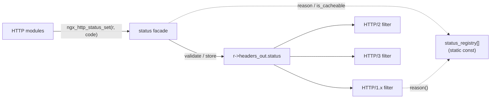

# HTTP Status Code API Reference

> **blitzy-nginx — NGINX HTTP status code registry refactoring with RFC 9110 compliance.**

This document is the authoritative API reference for the HTTP status-code
**registry + facade** introduced into the nginx HTTP core. It describes the
finalized public API exactly as implemented in `src/http/`: the five facade
functions declared in `src/http/ngx_http.h`, the `ngx_http_status_def_t`
registry record type and the `NGX_HTTP_STATUS_*` classification flags defined in
`src/http/ngx_http_request.h`, and the immutable registry table that backs them
in `src/http/ngx_http_request.c`.

## Design Overview — Registry + Facade

The refactor replaces a scattered, convention-based model — in which response
status was set by directly mutating `r->headers_out.status` at call sites spread
across the HTTP source tree, while reason phrases lived in a separate
offset-indexed table — with a single centralized, registry-backed API.

- **Single source of truth.** A single **immutable `static const` registry
  array** (`status_registry[]`, an array of `ngx_http_status_def_t` records)
  hosted in `src/http/ngx_http_request.c` is the authoritative record for every
  modeled status code: its numeric value, default reason phrase, classification
  flags, and the RFC 9110 section that defines it.
- **Facade.** A facade of **five functions** hides the table representation.
  Modules call `ngx_http_status_set(r, code)` instead of touching
  `r->headers_out.status` directly; the table is never indexed by callers.
- **No new includes.** The facade declarations live in the **umbrella public
  header `src/http/ngx_http.h`**, which is already `#include`d by every HTTP
  module. Adopting the API therefore requires **no new `#include`** in any
  module.
- **Lock-free thread safety.** The registry is `static const` — populated at
  compile time, read-only after worker initialization, and mapped once into each
  forked worker's shared read-only image. Thread safety is achieved by
  **immutability alone**: there are **no locks and no thread-local storage**.

Centralizing the **write** of `r->headers_out.status` through the facade — while
the HTTP/1.x, HTTP/2, and HTTP/3 encoders all continue to **read** that same
single field — is what unifies status emission across all three protocols
without editing any per-protocol encoder.

### RFC grounding

Status-code classifications in this API follow **RFC 9110 §15** (HTTP
Semantics). The heuristically-cacheable subset marked by the
`NGX_HTTP_STATUS_CACHEABLE` flag follows **RFC 9110 §15.1** and is consumed by
**RFC 9111** (HTTP Caching). These semantics are shared across HTTP/1.1,
HTTP/2, and HTTP/3.

---

## Registry Record Type

Each entry in the registry is described by the `ngx_http_status_def_t` record,
defined in `src/http/ngx_http_request.h`:

```c
typedef struct {
    ngx_uint_t    code;
    ngx_str_t     reason;
    ngx_uint_t    flags;
    const char   *rfc_section;
} ngx_http_status_def_t;
```

| Field         | Type            | Meaning |
|---------------|-----------------|---------|
| `code`        | `ngx_uint_t`    | The numeric HTTP status code (in the range **100–599**). |
| `reason`      | `ngx_str_t`     | The default reason phrase, expressed as nginx's length+data string. It holds the **full status-line text** (e.g. `200 OK` — see [`ngx_http_status_reason()`](#ngx_http_status_reason)), and is **empty** for codes that have no registered phrase. |
| `flags`       | `ngx_uint_t`    | OR-combined classification bits drawn from the `NGX_HTTP_STATUS_*` set (see [Classification Flags](#classification-flags)). |
| `rfc_section` | `const char *`  | The RFC 9110 section reference string that defines the code (e.g. `"15.3.x"`). |

!!! warning "Type collision: `ngx_http_status_def_t` vs `ngx_http_status_t`"
    `ngx_http_status_def_t` is the **registry record** type introduced by this
    refactor. It is **distinct from** the pre-existing, unrelated
    `ngx_http_status_t` struct declared in `src/http/ngx_http.h` (with fields
    `http_version`, `code`, `count`, `start`, `end`), which is used to **parse
    upstream response status lines**. The two types serve entirely different
    purposes and must not be confused.

---

## Classification Flags

The four classification bits are defined in `src/http/ngx_http_request.h`:

```c
#define NGX_HTTP_STATUS_CACHEABLE      0x0001
#define NGX_HTTP_STATUS_CLIENT_ERROR   0x0002
#define NGX_HTTP_STATUS_SERVER_ERROR   0x0004
#define NGX_HTTP_STATUS_INFORMATIONAL  0x0008
```

| Flag                            | Hex      | Meaning |
|---------------------------------|----------|---------|
| `NGX_HTTP_STATUS_CACHEABLE`     | `0x0001` | The code is **heuristically cacheable** per RFC 9110 §15.1 (see the *Cacheability* section below). |
| `NGX_HTTP_STATUS_CLIENT_ERROR`  | `0x0002` | The code is in the **4xx** (client error) class. |
| `NGX_HTTP_STATUS_SERVER_ERROR`  | `0x0004` | The code is in the **5xx** (server error) class. |
| `NGX_HTTP_STATUS_INFORMATIONAL` | `0x0008` | The code is in the **1xx** (informational) class. |

The flags are **non-overlapping power-of-two bits** and are **OR-combined** in
the `flags` field of each `ngx_http_status_def_t` record. A single code may
therefore carry more than one flag. For example:

- `404` carries `NGX_HTTP_STATUS_CLIENT_ERROR | NGX_HTTP_STATUS_CACHEABLE`.
- `501` carries `NGX_HTTP_STATUS_SERVER_ERROR | NGX_HTTP_STATUS_CACHEABLE`.

---

## Function Reference

The facade consists of five functions, declared in `src/http/ngx_http.h` and
implemented in `src/http/ngx_http_request.c`. Throughout, `r` is the
`ngx_http_request_t *`, `NGX_OK` / `NGX_ERROR` are nginx's return sentinels, and
`ngx_str_t` is nginx's length+data string.

```c
ngx_int_t   ngx_http_status_set(ngx_http_request_t *r, ngx_uint_t code);
ngx_int_t   ngx_http_status_validate(ngx_uint_t code);
ngx_str_t  *ngx_http_status_reason(ngx_uint_t code);
ngx_int_t   ngx_http_status_register(const ngx_http_status_def_t *def);
ngx_uint_t  ngx_http_status_is_cacheable(ngx_uint_t code);
```

### `ngx_http_status_set`

```c
ngx_int_t ngx_http_status_set(ngx_http_request_t *r, ngx_uint_t code);
```

Sets `r->headers_out.status` to `code`. This is the facade replacement for the
legacy `r->headers_out.status = code;` direct assignment.

**Parameters**

- `r` — the request whose response status is being set.
- `code` — the status code to set (an `NGX_HTTP_*` constant or a numeric
  literal).

**Behavior**

- **Upstream pass-through.** The function **checks `r->upstream` first**. For
  proxied/origin responses, the origin-assigned status is stored and passed
  through **unchanged**, **bypassing strict validation** — an upstream status is
  never transformed or rejected.
- **Local responses.** For a locally-generated response, when validation is
  enabled (see [Validation Build Flag](#validation-build-flag)) it calls
  `ngx_http_status_validate(code)` before storing the value.

**Returns**

- `NGX_OK` on success.
- A **non-`NGX_OK`** value (`NGX_ERROR`) when validation rejects the code.

**Error conditions**

- Validation rejection only occurs when the binary was built with
  `NGX_HTTP_STATUS_VALIDATION`; in the default build the function always returns
  `NGX_OK` for non-upstream responses.

**Performance**

In the **default build (validation disabled)** this function compiles to
essentially the **same single field store** as the legacy direct assignment. It
is inlineable and stays within the project's ≤2% latency budget.

**Example** — see the canonical error-handling form in
[Canonical Usage Example](#canonical-usage-example).

### `ngx_http_status_validate`

```c
ngx_int_t ngx_http_status_validate(ngx_uint_t code);
```

Validates a status code without setting it.

**Parameters**

- `code` — the status code to validate.

**Behavior**

- Performs a **range check of 100–599**.
- **Whitelists the nginx-internal sentinel codes 444 and 494–499** — these
  always return `NGX_OK`. They are internal, non-wire-emitted codes
  (`NGX_HTTP_CLOSE` is 444; the 494–499 range covers internal nginx codes up to
  `NGX_HTTP_CLIENT_CLOSED_REQUEST`) and must never be rejected. The sentinel
  whitelist is checked **first**, before the range check.
- **Strict RFC 9110 §15 conformance checks** (that the code is one nginx models
  in the registry) are compiled in **only under
  `#if NGX_HTTP_STATUS_VALIDATION`**. In the default build the function is
  effectively a cheap range + sentinel check with ~zero cost.

**Returns**

- `NGX_OK` for acceptable codes (including the whitelisted sentinels).
- A **non-`NGX_OK`** value (`NGX_ERROR`) otherwise — i.e. a code outside 100–599,
  or, under strict mode, a code nginx does not model.

**Example**

```c
/* reject anything the server cannot model before acting on it */
if (ngx_http_status_validate(code) != NGX_OK) {
    /* code is out of range (or, in strict mode, not modeled) */
}
```

### `ngx_http_status_reason`

```c
ngx_str_t *ngx_http_status_reason(ngx_uint_t code);
```

Resolves the default reason phrase for a status code. This is the drop-in
replacement for the old `ngx_http_status_lines[]` offset lookup in
`ngx_http_header_filter_module.c`.

**Parameters**

- `code` — the status code to resolve.

**Returns**

- A **pointer into the static-const registry** to the default reason phrase.
- **`NULL`** for unknown (unmodeled) codes.
- A **zero-length `ngx_str_t`** for codes that are modeled but have **no
  registered phrase** (nginx emits these numeric-only).

!!! note "Reason format: full status-line text"
    The returned `ngx_str_t` holds the **full status-line text in
    `CODE SP phrase` form**, not a bare phrase. For example:

    - `ngx_http_status_reason(200)` → `200 OK`
    - `ngx_http_status_reason(404)` → `404 Not Found`
    - `ngx_http_status_reason(301)` → `301 Moved Permanently`

The **HTTP/1.x header filter treats `NULL` and empty identically** — in both
cases it emits a **numeric-only status line** (e.g. `HTTP/1.1 203 \r\n`). Because
the registry reuses the exact legacy reason strings (including the empty
entries), the wire output is byte-identical to the pre-refactor header filter.

**Example**

```c
/* reason lookup (returns the full status-line text, e.g. "200 OK") */
ngx_str_t  *reason;

reason = ngx_http_status_reason(r->headers_out.status);
if (reason == NULL || reason->len == 0) {
    /* no registered phrase -> header filter emits a numeric-only line */
}
```

### `ngx_http_status_register`

```c
ngx_int_t ngx_http_status_register(const ngx_http_status_def_t *def);
```

A **compile/init-time entry point only**. It is the uniform, validating hook
that expresses the intent to add a status code, and it is the documented
extension point for third-party code.

**Parameters**

- `def` — a pointer to the candidate `ngx_http_status_def_t` definition.

**Behavior**

- It **never mutates the `static const` registry at runtime.** Immutability is
  the registry's thread-safety guarantee, so there is **no post-init / runtime
  registration API**. New status codes are added by **extending the
  `status_registry[]` table in `ngx_http_request.c` at compile time**; this
  function validates a candidate definition for that intent and performs no
  mutation whatsoever.

**Returns**

- `NGX_ERROR` if `def` is `NULL`, or if `def->code` is outside **100–599**.
- `NGX_OK` otherwise.

**Example**

```c
/* validate a candidate definition (compile/init-time intent) */
static const ngx_http_status_def_t  my_def = {
    226, ngx_string("226 IM Used"), NGX_HTTP_STATUS_CACHEABLE, "15.3.x"
};

if (ngx_http_status_register(&my_def) != NGX_OK) {
    /* NULL definition or code outside 100-599 */
}
```

### `ngx_http_status_is_cacheable`

```c
ngx_uint_t ngx_http_status_is_cacheable(ngx_uint_t code);
```

Reports whether a status code is heuristically cacheable (RFC 9110 §15.1 / RFC
9111).

**Parameters**

- `code` — the status code to test.

**Returns**

- **Non-zero** if and only if the code carries the `NGX_HTTP_STATUS_CACHEABLE`
  flag in its registry record.
- **`0`** otherwise — **including `0` for unknown (unmodeled) codes**.

**Example**

```c
/* cacheability test */
if (ngx_http_status_is_cacheable(r->headers_out.status)) {
    /* code is heuristically cacheable per RFC 9110 §15.1 */
}
```

---

## Canonical Usage Example

The canonical conversion replaces a direct field assignment with a guarded call
to `ngx_http_status_set()`. The user-mandated canonical form is:

```c
if (ngx_http_status_set(r, 404) != NGX_OK) {
    ngx_log_error(NGX_LOG_ERR, r->connection->log, 0, "invalid status code: 404");
    return NGX_HTTP_INTERNAL_SERVER_ERROR;
}
```

### Before / after

```c
/* BEFORE — direct field mutation */
r->headers_out.status = NGX_HTTP_NOT_FOUND;
```

```c
/* AFTER — guarded facade call */
if (ngx_http_status_set(r, 404) != NGX_OK) {
    ngx_log_error(NGX_LOG_ERR, r->connection->log, 0, "invalid status code: 404");
    return NGX_HTTP_INTERNAL_SERVER_ERROR;
}
```

Real call sites typically log the offending code with the `%ui` format specifier
and a `(ngx_uint_t)` cast, and pass the symbolic `NGX_HTTP_*` constant rather
than a numeric literal:

```c
if (ngx_http_status_set(r, NGX_HTTP_OK) != NGX_OK) {
    ngx_log_error(NGX_LOG_ERR, r->connection->log, 0,
                  "invalid status code: %ui", (ngx_uint_t) NGX_HTTP_OK);
    return NGX_HTTP_INTERNAL_SERVER_ERROR;
}
```

---

## Cacheability (RFC 9110 §15.1 / RFC 9111)

The `NGX_HTTP_STATUS_CACHEABLE` flag marks **exactly these 12
heuristically-cacheable codes — and no others**:

| Code | Code | Code | Code |
|------|------|------|------|
| 200  | 203  | 204  | 206  |
| 300  | 301  | 308  | 404  |
| 405  | 410  | 414  | 501  |

That is: **200, 203, 204, 206, 300, 301, 308, 404, 405, 410, 414, 501** (count =
12). **No other status code is marked cacheable.**

These are the codes that RFC 9110 §15.1 defines as **heuristically cacheable**
(formerly "cacheable by default"); RFC 9111 (HTTP Caching) consumes this set when
deciding whether a response may be stored without explicit freshness
information. `ngx_http_status_is_cacheable(code)` returns non-zero exactly for
the codes in this list.

---

## RFC 9110 §15 Status Classes

Status codes are organized into five classes, each defined in its own RFC 9110
§15 subsection:

| Class | Name           | RFC 9110 section | Classification flag                |
|-------|----------------|------------------|------------------------------------|
| 1xx   | Informational  | §15.2            | `NGX_HTTP_STATUS_INFORMATIONAL`    |
| 2xx   | Successful     | §15.3            | —                                  |
| 3xx   | Redirection    | §15.4            | —                                  |
| 4xx   | Client Error   | §15.5            | `NGX_HTTP_STATUS_CLIENT_ERROR`     |
| 5xx   | Server Error   | §15.6            | `NGX_HTTP_STATUS_SERVER_ERROR`     |

These semantics are **shared across HTTP/1.1, HTTP/2, and HTTP/3**. That is
precisely why centralizing the single `r->headers_out.status` **write** through
`ngx_http_status_set()` unifies status emission across all three protocols: the
HTTP/1.x, HTTP/2, and HTTP/3 encoders all remain **read-side consumers** of that
one field.



*Diagram — the facade funnels the status **write** into one registry, while all
three protocol encoders remain read-side consumers of the single
`r->headers_out.status` field.*

---

## Validation Build Flag

Strict validation is **opt-in** at build time.

- The configure flag **`--with-http_status_validation`** sets the compile-time
  macro **`NGX_HTTP_STATUS_VALIDATION`**, delivered as a
  **`-DNGX_HTTP_STATUS_VALIDATION`** define in `CFLAGS`.
- The **default build is permissive** with **effectively zero overhead**: the
  strict-conformance code is wrapped in `#if NGX_HTTP_STATUS_VALIDATION`, so when
  the macro is absent the block compiles away entirely.
- In **strict mode**, non-conforming codes are detected **at the point they are
  set** — `ngx_http_status_set()` calls `ngx_http_status_validate()` and returns
  `NGX_ERROR` for a rejected code. The **HTTP/2 and HTTP/3 encoders log (never
  reject)** non-conforming statuses at emit time.

```bash
# enable strict RFC 9110 §15 validation
./configure --with-http_status_validation

# or, equivalently, deliver the macro via CFLAGS:
./configure --with-cc-opt="-DNGX_HTTP_STATUS_VALIDATION"
```

Because the trimmed `auto/` build-option wiring is absent from this tree, the
`CFLAGS` / `--with-cc-opt="-DNGX_HTTP_STATUS_VALIDATION"` delivery is the
supported path for enabling the macro.

---

## Backward Compatibility

The facade is **additive**. All of the following guarantees hold:

- **All existing `NGX_HTTP_*` numeric constants remain defined** (e.g.
  `NGX_HTTP_OK`, `NGX_HTTP_NOT_FOUND`, …) and may still be passed to
  `ngx_http_status_set()`.
- **Direct `r->headers_out.status = …;` assignment still works.** The facade
  coexists with the legacy direct-assignment path; nothing is removed.
- **Validation is strictly opt-in** and is off by default.
- **The module ABI (`NGX_MODULE_V1`) is unchanged**, so third-party modules
  continue to build and load without modification.
