# Centralized HTTP Status Code API — Architecture Diagrams

**Project:** NGINX 1.29.5 Centralized HTTP Status Code Refactor
**Scope:** `src/http/` subsystem
**Companion documents:** [decision log](./decision_log.md), [observability](./observability.md)

## Overview

This document visualizes the architectural change introduced by the centralized HTTP status code refactor. Five diagrams depict:

| Figure | Topic | Purpose |
|---|---|---|
| [Fig-1](#fig-1--status-code-handling-before-refactor) | Before-refactor status-code flow | Shows the pre-refactor pattern where direct `r->headers_out.status` mutations are spread across 20 source files containing 33 assignments (per AAP §0.2.1 empirical inventory), with wire-table and error-page lookups occurring as parallel side effects downstream. |
| [Fig-2](#fig-2--status-code-handling-after-refactor) | After-refactor status-code flow | Shows the post-refactor unified API facade (`ngx_http_status_set`) mediating all nginx-originated status-code assignments; preserved constants and wire tables are shown in muted styling. |
| [Fig-3](#fig-3--request-lifecycle-status-code-flow) | End-to-end status-code flow | Traces the status-code journey from configuration load to worker fork to request arrival to API call to wire emission (HTTP/1.1 + HTTP/2 + HTTP/3 branches). |
| [Fig-4](#fig-4--strict-mode-validation-decision-tree) | Strict-mode validation decision tree | Depicts the conditional checks applied when `--with-http_status_validation` is enabled: range check, upstream bypass, 1xx-after-final detection, single-final-code enforcement. |
| [Fig-5](#fig-5--file-change-heatmap) | File-change heatmap | Visualizes file-level modification intensity: new files in green, modified files in blue, preserved files in grey. |

Every diagram is followed by a brief prose annotation explaining **what is NOT shown** in the diagram (to avoid duplication) and what reader takeaway is intended. Full implementation details live in the [decision log](./decision_log.md) and the [API reference](../api/status_codes.md).

**Diagram conventions:** Per the project-level Visual Architecture Documentation rule, all diagrams use Mermaid syntax embedded in fenced ```` ```mermaid ```` blocks. They render natively on GitHub, GitLab, and most Markdown viewers without external image dependencies. See [Legend Conventions](#legend-conventions) for color and shape semantics.

## Fig-1 — Status-Code Handling: Before Refactor

The pre-refactor architecture has scattered `NGX_HTTP_*` macro constants flowing into ~20 consumer modules, each of which directly mutates `r->headers_out.status`. Wire-table and error-page lookups occur as parallel side effects downstream, with no single choke point for validation, logging, or observability.

```mermaid
flowchart LR
    subgraph Constants["Scattered Constants"]
        direction TB
        A1["src/http/ngx_http_request.h<br/>#define NGX_HTTP_OK 200<br/>#define NGX_HTTP_NOT_FOUND 404<br/>43 NGX_HTTP_* + 2 NGX_HTTPS_* macros"]
    end

    subgraph Consumers["Consumer Modules - 20 files, ~33 direct assignments (AAP §0.2.1 inventory)"]
        direction TB
        B1["ngx_http_static_module.c<br/>r->headers_out.status = NGX_HTTP_OK"]
        B2["ngx_http_core_module.c<br/>r->headers_out.status = status"]
        B3["ngx_http_request.c<br/>r->headers_out.status = rc"]
        B4["ngx_http_upstream.c<br/>pass-through from upstream"]
        B5["~16 other modules<br/>(many filter/index modules)<br/>direct assignments"]
    end

    subgraph WireTables["Wire Tables - Parallel Side Effects"]
        direction TB
        C1["ngx_http_header_filter_module.c<br/>ngx_http_status_lines&#91;&#93;<br/>29 wire phrases"]
        C2["ngx_http_special_response.c<br/>ngx_http_error_pages&#91;&#93;<br/>34 HTML templates"]
    end

    A1 --> B1
    A1 --> B2
    A1 --> B3
    A1 --> B4
    A1 --> B5
    B1 --> C1
    B2 --> C1
    B3 --> C1
    B4 --> C1
    B5 --> C1
    C1 -. on error .-> C2

    classDef constBox fill:#fff4ce,stroke:#8f6b00,color:#3d2b00
    classDef consumerBox fill:#f5d0c5,stroke:#8f3b00,color:#3d1a00
    classDef wireBox fill:#dce9f7,stroke:#2a5a8a,color:#0b2a4a
    class A1 constBox
    class B1,B2,B3,B4,B5 consumerBox
    class C1,C2 wireBox
```



**Figure 1 depicts:** the three-layer pre-refactor flow — constants flowing into consumers and consumers feeding the wire tables. Each arrow represents a compile-time symbol reference or a runtime field write. No validation, no centralized logging, no observability hook.

**What Fig-1 does NOT show:** the specific line numbers of each direct assignment (see [decision log](./decision_log.md) traceability matrix), the HTTP/2 and HTTP/3 codepaths (they read `r->headers_out.status` numerically and are out of scope for Fig-1), and the dependency on `r->err_status` (an internal state field, surfaced in Fig-3).

**Reader takeaway:** The pre-refactor architecture has 19 independent write sites with no shared validation or logging. Each module is a potential source of drift from NGINX's documented status-code contract.

## Fig-2 — Status-Code Handling: After Refactor

The post-refactor architecture introduces a unified API facade (`ngx_http_status_set`) that all nginx-originated status-code assignments flow through. The facade performs range validation, optional strict-mode checks, debug logging, and upstream-bypass decisioning. Preserved constants and wire tables are shown in muted styling to emphasize that they are unchanged from before.

```mermaid
flowchart LR
    subgraph API["Unified API Layer - NEW"]
        direction TB
        D1["ngx_http_status.h<br/>ngx_http_status_set<br/>ngx_http_status_validate<br/>ngx_http_status_reason<br/>ngx_http_status_is_cacheable<br/>ngx_http_status_register"]
        D2["ngx_http_status.c<br/>static ngx_http_status_def_t<br/>ngx_http_status_registry&#91;59&#93;"]
    end

    subgraph Constants["Preserved Constants - UNCHANGED"]
        direction TB
        A1["src/http/ngx_http_request.h<br/>#define NGX_HTTP_OK 200<br/>#define NGX_HTTP_NOT_FOUND 404<br/>43 NGX_HTTP_* + 2 NGX_HTTPS_* retained verbatim"]
    end

    subgraph Consumers["Refactored Consumers - 12 files, 15 conversions"]
        direction TB
        B1["ngx_http_static_module.c<br/>ngx_http_status_set&#40;r, NGX_HTTP_OK&#41;"]
        B2["ngx_http_core_module.c<br/>ngx_http_status_set&#40;r, status&#41;"]
        B3["ngx_http_request.c<br/>ngx_http_status_set&#40;r, rc&#41;"]
        B4["ngx_http_upstream.c<br/>upstream bypass via r->upstream"]
        B5["8 other modules<br/>autoindex, dav, flv, gzip_static,<br/>mp4, not_modified_filter,<br/>range_filter, stub_status<br/>all via API"]
    end

    subgraph WireTables["Preserved Wire Tables - UNCHANGED"]
        direction TB
        C1["ngx_http_header_filter_module.c<br/>ngx_http_status_lines&#91;&#93;<br/>29 wire phrases - byte-for-byte"]
        C2["ngx_http_special_response.c<br/>ngx_http_error_pages&#91;&#93;<br/>34 HTML templates - byte-for-byte"]
    end

    subgraph Build["Build System - NEW flag"]
        direction TB
        E1["auto/options<br/>--with-http_status_validation<br/>gates NGX_HTTP_STATUS_VALIDATION"]
    end

    A1 -.symbolic names.-> D1
    D1 --> D2
    B1 --> D1
    B2 --> D1
    B3 --> D1
    B4 --> D1
    B5 --> D1
    D1 -- validation ok --> C1
    C1 -. on error .-> C2
    E1 -. NGX_HTTP_STATUS_VALIDATION .-> D2

    classDef newBox fill:#cfe8cf,stroke:#2d5a2d,color:#0b2e0b
    classDef preservedBox fill:#e8e8e8,stroke:#666666,color:#333333
    classDef consumerBox fill:#cfe8cf,stroke:#2d5a2d,color:#0b2e0b
    classDef wireBox fill:#e8e8e8,stroke:#666666,color:#333333
    classDef buildBox fill:#dce9f7,stroke:#2a5a8a,color:#0b2a4a
    class D1,D2 newBox
    class A1 preservedBox
    class B1,B2,B3,B4,B5 consumerBox
    class C1,C2 wireBox
    class E1 buildBox
```



**Figure 2 depicts:** the new architecture with the API facade as a single choke point. Green boxes are new or modified (API layer + 12 refactored consumer files containing 15 call sites: 3 core HTTP files contributing 5 calls — `ngx_http_core_module.c` (2), `ngx_http_request.c` (2), `ngx_http_upstream.c` (1) — plus 9 modules contributing 10 calls — `ngx_http_range_filter_module.c` (2) and 1 each in autoindex, dav, flv, gzip_static, mp4, not_modified_filter, static, stub_status). Grey boxes are explicitly preserved (constants + wire tables + error-page table). Blue indicates the new optional build flag.

**What Fig-2 does NOT show:** the internal implementation of `ngx_http_status_set` (see Fig-4), the HTTP/2 and HTTP/3 wire-emission paths (see Fig-3), and the compile-time inlining behavior (see [decision log](./decision_log.md) Performance Impact section).

**Reader takeaway:** Every nginx-originated status-code assignment now passes through a single, audited function. Third-party dynamic modules that continue using direct `r->headers_out.status = X;` assignment remain functional because the field and its symbols are preserved (backward compatibility mandate per [decision D-003](./decision_log.md)).

## Fig-3 — Request Lifecycle: Status-Code Flow

This flow diagram traces the journey of a status code from configuration-load time through worker-fork, request arrival, API invocation, and wire emission. The HTTP/1.1, HTTP/2, and HTTP/3 branches are shown in a single flow because they share the same `r->headers_out.status` numeric value; they diverge only in how the value is serialized on the wire.

```mermaid
flowchart TD
    Conf["nginx.conf parsed"] --> InitRegistry["ngx_http_status_init_registry<br/>static compile-time init<br/>no runtime allocation"]
    InitRegistry --> WorkerFork["Worker process forked<br/>registry is read-only<br/>copy-on-write shared"]
    WorkerFork --> Req["HTTP request arrives<br/>ngx_http_request_t allocated"]
    Req --> Phase["Phase handler or module<br/>computes status code"]
    Phase --> API["ngx_http_status_set&#40;r, status&#41;"]
    API --> UpstreamCheck{"r->upstream<br/>non-NULL?"}
    UpstreamCheck -->|Yes - pass-through| LogDbgU["ngx_log_debug3<br/>http status set: N reason<br/>upstream=yes"]
    UpstreamCheck -->|No - nginx-originated| Range{"100 &lt;= status<br/>&lt;= 599?"}
    Range -->|No - out of range| StrictA{"strict mode?<br/>NGX_HTTP_STATUS_VALIDATION"}
    StrictA -->|Yes| LogWarn["ngx_log_error LOG_WARN<br/>return NGX_ERROR"]
    StrictA -->|No - permissive| LogDbgOOR["ngx_log_debug1<br/>out-of-range; permissive<br/>still assigns"]
    Range -->|Yes - in range| StrictB{"strict mode?"}
    StrictB -->|Yes| Extra["1xx-after-final check<br/>single-final-code check"]
    StrictB -->|No - permissive| Assign["r->headers_out.status = status<br/>return NGX_OK"]
    Extra -->|ok| Assign
    Extra -->|fail| LogErr["ngx_log_error LOG_ERR<br/>return NGX_ERROR"]
    LogDbgU --> Assign
    LogDbgOOR --> Assign
    Assign --> HeaderFilter["ngx_http_header_filter_module<br/>formats HTTP/1.1 status line<br/>via ngx_http_status_lines&#91;&#93;"]
    Assign --> V2Filter["src/http/v2<br/>emits :status pseudo-header<br/>via HPACK numeric only"]
    Assign --> V3Filter["src/http/v3<br/>emits :status pseudo-header<br/>via QPACK numeric only"]
    HeaderFilter --> Wire["Bytes on wire"]
    V2Filter --> Wire
    V3Filter --> Wire
    LogWarn --> Fallback["Caller falls back to<br/>NGX_HTTP_INTERNAL_SERVER_ERROR<br/>per error-handling protocol"]
    LogErr --> Fallback

    classDef newBox fill:#cfe8cf,stroke:#2d5a2d,color:#0b2e0b
    classDef existBox fill:#dce9f7,stroke:#2a5a8a,color:#0b2a4a
    classDef errorBox fill:#f5d0c5,stroke:#8f3b00,color:#3d1a00
    class InitRegistry,API,UpstreamCheck,Range,StrictA,StrictB,Extra,LogDbgU,LogDbgOOR newBox
    class Conf,WorkerFork,Req,Phase,Assign,HeaderFilter,V2Filter,V3Filter,Wire existBox
    class LogWarn,LogErr,Fallback errorBox
```



**Figure 3 depicts:** the end-to-end control flow. Green diamonds and rectangles are new behavior introduced by this refactor. Blue rectangles are preserved existing behavior. Red rectangles indicate strict-mode error paths.

**Key observations from Fig-3:**

- **Registry initialization** happens ONCE at compile time (static array init in `.rodata`) and is inherited by every worker via fork. No per-worker heap allocation.
- **Upstream bypass** is the first branch point — if `r->upstream != NULL`, the call short-circuits past all validation (preserves pass-through semantics per [decision D-006](./decision_log.md)).
- **Permissive vs. strict mode** is a compile-time switch: permissive builds log at DEBUG level and always assign; strict builds log at WARN/ERR and return `NGX_ERROR` on violation.
- **Wire emission** is protocol-agnostic at the `r->headers_out.status` field level — HTTP/1.1 uses the preserved `ngx_http_status_lines[]` table for the textual reason phrase; HTTP/2 and HTTP/3 emit the numeric code only via HPACK/QPACK.

**What Fig-3 does NOT show:** the specific data-flow inside HPACK/QPACK encoders (out of scope; see [RFC 7541 § 4](https://www.rfc-editor.org/rfc/rfc7541) for HPACK and [RFC 9204](https://www.rfc-editor.org/rfc/rfc9204) for QPACK), the error-page-generation path for error status codes (triggered by `ngx_http_special_response_handler`, which is preserved byte-for-byte), and the `$status` variable generation in the access log (governed by `src/http/ngx_http_variables.c`, unchanged).

## Fig-4 — Strict-Mode Validation Decision Tree

When compiled with `--with-http_status_validation`, `ngx_http_status_set()` enforces a decision tree that rejects invalid or out-of-protocol status code assignments. This diagram shows the exact check order and the possible outcomes.

```mermaid
flowchart TD
    Entry["ngx_http_status_set&#40;r, status&#41;<br/>STRICT BUILD ONLY"] --> Upstream{"r->upstream<br/>non-NULL?"}
    Upstream -->|Yes| Bypass["Bypass validation<br/>assign unconditionally<br/>log at DEBUG"]
    Upstream -->|No| RangeCheck{"100 &lt;= status<br/>&lt;= 599?"}
    RangeCheck -->|No| RangeFail["Log LOG_WARN:<br/>out of RFC 9110 range<br/>return NGX_ERROR"]
    RangeCheck -->|Yes| InformCheck{"status is 1xx<br/>AND<br/>r->headers_out.status<br/>is 2xx-5xx already?"}
    InformCheck -->|Yes - 1xx-after-final violation| InformFail["Log LOG_ERR:<br/>1xx after final response<br/>return NGX_ERROR"]
    InformCheck -->|No| FinalCheck{"new is final 200-599 AND<br/>existing is non-200 final 200-599 AND<br/>existing != new?<br/>filter-chain exception:<br/>existing == 200 is allowed"}
    FinalCheck -->|Yes - genuine override conflict| FinalFail["Log LOG_ERR:<br/>final response N after final M<br/>single-final-code rule violated<br/>return NGX_ERROR"]
    FinalCheck -->|No - allowed transition| LookupReason["ngx_http_status_reason&#40;status&#41;<br/>linear scan of 59-entry registry"]
    LookupReason --> LogDbg["Log LOG_DEBUG_HTTP:<br/>http status set: N reason<br/>strict=yes upstream=no"]
    LogDbg --> Assign["r->headers_out.status = status<br/>return NGX_OK"]
    Bypass --> Assign

    classDef strictBox fill:#cfe8cf,stroke:#2d5a2d,color:#0b2e0b
    classDef failBox fill:#f5d0c5,stroke:#8f3b00,color:#3d1a00
    classDef okBox fill:#dce9f7,stroke:#2a5a8a,color:#0b2a4a
    class Entry,RangeCheck,InformCheck,FinalCheck,LookupReason,LogDbg strictBox
    class RangeFail,InformFail,FinalFail failBox
    class Upstream,Bypass,Assign okBox
```



**Figure 4 depicts:** the full strict-mode decision tree. Green diamonds and rectangles are the decision points and logging actions introduced in strict mode. Red rectangles are the three failure modes that return `NGX_ERROR`. Blue rectangles are the success paths.

**Decision-tree invariants:**

1. **Upstream pass-through always bypasses validation.** Even in strict mode, if `r->upstream != NULL`, the code is assigned unconditionally. This is a hard contract per [decision D-006](./decision_log.md) — NGINX MUST NOT second-guess upstream response codes.
2. **Range check is the first substantive check** when `r->upstream == NULL`. Codes outside 100–599 are rejected in strict mode and logged at WARN. Permissive mode (not shown in this figure; see Fig-3) logs at DEBUG and still assigns.
3. **1xx-after-final detection** runs only after the range check succeeds. It examines the current `r->headers_out.status` field to determine whether a final (2xx–5xx) response has already been recorded; if so, a new 1xx assignment is a protocol violation per RFC 9110 § 15.2 (clients are required to be able to parse one or more 1xx responses received prior to a final response — the converse of 1xx after final is disallowed).
4. **Single-final-code enforcement with filter-chain exception.** A new final (200–599) code that overrides a different existing _non-200_ final code is rejected (e.g., a 404 erroneously overridden by a 500 indicates a logic bug). However, transitions FROM `NGX_HTTP_OK` (200) to any other final code are **always permitted** because NGINX's filter chain is fundamentally override-based: content handlers set an initial 200 OK and downstream header filters (`range_filter`, `not_modified_filter`, `error_page` handler) override it to the request-appropriate final code (206/304/416/4xx/5xx). These overrides happen in-memory before any byte is transmitted, so exactly ONE final status reaches the client. Filter modules guard their overrides with explicit `r->headers_out.status == NGX_HTTP_OK` checks before calling `ngx_http_status_set()` (see `range_filter_module.c:156`, `not_modified_filter_module.c:57`). Identical reassignment of the same code is also permitted.
5. **Debug logging** is unconditional in strict mode — every successful `ngx_http_status_set` call emits a `NGX_LOG_DEBUG_HTTP` line. This line is the observability anchor per the [observability document](./observability.md).

**What Fig-4 does NOT show:** the permissive-mode equivalent (simpler — only the range check logs at DEBUG; see Fig-3), the caller's error-handling contract (the caller should fall back to `NGX_HTTP_INTERNAL_SERVER_ERROR` on `NGX_ERROR` per the AAP error-handling protocol), and the registry-lookup internals (linear scan over 59 entries; see [decision D-007](./decision_log.md)).

**Reader takeaway:** Strict-mode validation is opt-in, fails closed (returns `NGX_ERROR`) on violations, and logs richly for post-mortem analysis. Default builds retain permissive behavior for backward compatibility.

## Fig-5 — File-Change Heatmap

This graph visualizes the modification intensity at the file level. Modified files are blue, new files are green, and preserved (unchanged) files are grey. The relative size of each node in a Mermaid `graph` does not encode change magnitude — categorical row grouping is used instead, with invisible edges (`~~~`) chaining the six subgraphs into a vertical stack ordered from new (top) to preserved (bottom).

```mermaid
graph TD
    subgraph NewFiles["New Files - 9 total"]
        direction TB
        N1["src/http/ngx_http_status.c"]
        N2["src/http/ngx_http_status.h"]
        N3["docs/api/status_codes.md"]
        N4["docs/migration/status_code_api.md"]
        N5["docs/architecture/status_code_refactor.md"]
        N6["docs/architecture/decision_log.md"]
        N7["docs/architecture/observability.md"]
        N8["blitzy-deck/<br/>status_code_refactor_exec_summary.html"]
        N9["CODE_REVIEW.md"]
    end

    subgraph CoreModified["Modified - Core HTTP Files - 5"]
        direction TB
        M1["src/http/ngx_http.c"]
        M2["src/http/ngx_http.h"]
        M3["src/http/ngx_http_request.c"]
        M4["src/http/ngx_http_core_module.c"]
        M5["src/http/ngx_http_upstream.c"]
    end

    subgraph ModuleModified["Modified - HTTP Modules - 9"]
        direction TB
        ML1["ngx_http_static_module.c"]
        ML2["ngx_http_autoindex_module.c"]
        ML3["ngx_http_dav_module.c"]
        ML4["ngx_http_gzip_static_module.c"]
        ML5["ngx_http_stub_status_module.c"]
        ML6["ngx_http_flv_module.c"]
        ML7["ngx_http_mp4_module.c"]
        ML8["ngx_http_range_filter_module.c"]
        ML9["ngx_http_not_modified_filter_module.c"]
    end

    subgraph BuildModified["Modified - Build System - 3"]
        direction TB
        B1["auto/modules"]
        B2["auto/options"]
        B3["auto/summary"]
    end

    subgraph DocsModified["Modified - Changelog - 1"]
        D1["docs/xml/nginx/changes.xml"]
    end

    subgraph Preserved["Preserved Byte-for-Byte - key files"]
        direction TB
        P1["src/http/ngx_http_request.h<br/>43 NGX_HTTP_* + 2 NGX_HTTPS_* macros retained"]
        P2["src/http/ngx_http_header_filter_module.c<br/>ngx_http_status_lines&#91;&#93; wire table"]
        P3["src/http/ngx_http_special_response.c<br/>error_pages table + security handlers"]
        P4["src/http/v2/<br/>HTTP/2 codepath - numeric pass-through"]
        P5["src/http/v3/<br/>HTTP/3 codepath - numeric pass-through"]
        P6["src/http/modules/perl/<br/>out of scope per AAP 0.3.2"]
        P7["src/core src/event src/stream<br/>src/mail src/os<br/>out of scope - not HTTP subsystem"]
    end

    %% Invisible edges to force vertical stacking of the six categorical subgraphs
    NewFiles ~~~ CoreModified
    CoreModified ~~~ ModuleModified
    ModuleModified ~~~ BuildModified
    BuildModified ~~~ DocsModified
    DocsModified ~~~ Preserved

    classDef newBox fill:#cfe8cf,stroke:#2d5a2d,color:#0b2e0b
    classDef modifiedBox fill:#dce9f7,stroke:#2a5a8a,color:#0b2a4a
    classDef preservedBox fill:#e8e8e8,stroke:#666666,color:#333333
    class N1,N2,N3,N4,N5,N6,N7,N8,N9 newBox
    class M1,M2,M3,M4,M5,ML1,ML2,ML3,ML4,ML5,ML6,ML7,ML8,ML9,B1,B2,B3,D1 modifiedBox
    class P1,P2,P3,P4,P5,P6,P7 preservedBox
```



**Figure 5 depicts:** every file touched (or explicitly preserved) by the refactor, grouped by change category. Green nodes are new; blue nodes are modified; grey nodes are explicitly preserved despite their proximity to the change.

**Change-intensity summary (aggregated):**

| Category | File Count | Character of Change |
|---|---|---|
| NEW files | 9 | `src/http/ngx_http_status.{c,h}` (API implementation + header); 7 documentation/review artifacts |
| MODIFIED core HTTP files | 5 | Direct-assignment conversions and registry initializer wiring in `ngx_http.c`, `ngx_http.h`, `ngx_http_request.c`, `ngx_http_core_module.c`, `ngx_http_upstream.c` |
| MODIFIED HTTP module files | 9 | Direct-assignment conversions; 1–3 lines each. Files: `ngx_http_static_module.c`, `ngx_http_autoindex_module.c`, `ngx_http_dav_module.c`, `ngx_http_gzip_static_module.c`, `ngx_http_stub_status_module.c`, `ngx_http_flv_module.c`, `ngx_http_mp4_module.c`, `ngx_http_range_filter_module.c`, `ngx_http_not_modified_filter_module.c` |
| MODIFIED build-system scripts | 3 | `auto/modules`, `auto/options`, `auto/summary` (no change to `auto/define` was required because the `--with-http_status_validation` flag is exposed via `auto/options` and emitted via `auto/feature` indirection) |
| MODIFIED changelog | 1 | `docs/xml/nginx/changes.xml` entry |
| PRESERVED byte-for-byte | dozens | `src/http/ngx_http_request.h` (43 NGX_HTTP_* + 2 NGX_HTTPS_* macros), `ngx_http_header_filter_module.c` (wire table), `ngx_http_special_response.c` (error-pages table + security handler logic), HTTP/2, HTTP/3, Perl module, and all non-HTTP subsystems |

**What Fig-5 does NOT show:** file-level line counts or diff magnitudes (see [decision log](./decision_log.md) for conversion-by-conversion detail), the cross-file dependency graph (implicit via `#include` — `ngx_http_status.h` is included by `ngx_http.h`, which is included by every modified consumer transitively), and the tests/validation artifacts (external `nginx-tests` per AAP § 0.3.2, not committed to this repository).

**Reader takeaway:** The refactor is focused and surgical. Of the ~1,800 files in the NGINX source tree, fewer than 40 are touched. The HTTP subsystem's interface contract with the rest of the codebase is preserved exactly — no ABI breakage, no directive-syntax change, no wire-format change.

## Legend Conventions

All diagrams use a consistent multi-color palette to signal modification status. The five figures share these CSS classes (defined inline via Mermaid `classDef`):

| Color | CSS Class | Meaning |
|---|---|---|
| Green (light, `#cfe8cf`) | `newBox` / `consumerBox` (Fig-2) / `strictBox` (Fig-4) | New construct introduced by the refactor (new files, new API functions, new decision points, refactored call sites) |
| Blue (light, `#dce9f7`) | `existBox` / `modifiedBox` / `okBox` / `wireBox` (Fig-1) / `buildBox` (Fig-2) | Existing construct preserved or modified in place; blue also marks successful paths in decision trees and modified files in Fig-5 |
| Grey (light, `#e8e8e8`) | `preservedBox` / `wireBox` (Fig-2) | Construct explicitly preserved byte-for-byte (per AAP § 0.3.1 preservation mandates) |
| Red/Peach (light, `#f5d0c5`) | `failBox` / `errorBox` / `consumerBox` (Fig-1) | Error / failure / rejection path; in Fig-1 only, also denotes pre-refactor consumer code awaiting conversion |
| Yellow (light, `#fff4ce`) | `constBox` (Fig-1) | Constants and macros (pre-refactor view) |

**Shape conventions:**

- Rectangles (`[...]` or `["..."]`): code constructs, files, or actions
- Diamonds (`{...}` or `{"..."}`): decision points (used in Fig-3 and Fig-4)
- Rounded subgraph borders (`subgraph Name["display"]`): logical groupings of related nodes; subgraph borders themselves are not styled by the class palette

**Edge conventions:**

- **Solid arrows** (`-->`) indicate always-on data or control flow.
- **Dashed arrows** (`-. text .->` or `-.->`) indicate weak, optional, or side-effect dependencies (e.g., error-page lookup triggered only on error codes).
- **Labeled arrows** (`-->|text|`) annotate the condition or data flowing on the edge.

**Rendering note:** These diagrams render correctly in GitHub's Markdown viewer (GitHub supports Mermaid natively in Markdown since 2022). The repository's `mkdocs.yml` configures the `mermaid2` plugin so the diagrams also render under the MkDocs site. If a rendering target does not support Mermaid, readers can extract the fenced ```` ```mermaid ```` blocks and paste them into the [Mermaid Live Editor](https://mermaid.live/) to view.

## See Also

- [`decision_log.md`](./decision_log.md) — Design decisions, architectural rationale, and 100% bidirectional traceability matrix
- [`observability.md`](./observability.md) — Observability integration and Grafana dashboard template
- [`../api/status_codes.md`](../api/status_codes.md) — Full API reference for the five new `ngx_http_status_*` functions
- [`../migration/status_code_api.md`](../migration/status_code_api.md) — Migration guide for third-party module authors
- [`../../CODE_REVIEW.md`](../../CODE_REVIEW.md) — Segmented PR review artifact
- [RFC 9110 § 15](https://www.rfc-editor.org/rfc/rfc9110.html#name-status-codes) — HTTP Status Codes specification (normative reference for reason phrases and class semantics)
- [IANA HTTP Status Code Registry](https://www.iana.org/assignments/http-status-codes/http-status-codes.xml) — Authoritative list of registered HTTP status codes
- [NGINX development guide](https://nginx.org/en/docs/dev/development_guide.html) — NGINX coding conventions referenced by this refactor
- [Mermaid Live Editor](https://mermaid.live/) — For rendering these diagrams outside a GitHub or MkDocs context

