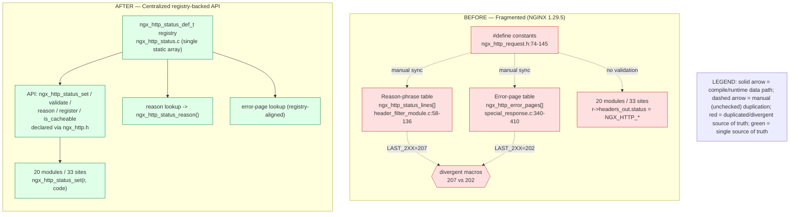

# Decision Log & Traceability Matrix — HTTP Status-Code Registry Refactor

This document satisfies **Rule 2 (Explainability)** — a decision log plus a
bidirectional traceability matrix — and **Rule 3 (Visual Architecture
Documentation)** — a mirrored before/after architecture diagram — for the
refactor that introduces a centralized, registry-backed HTTP status-code API
(`ngx_http_status_*`) with optional RFC 9110 validation, targeting **NGINX
1.29.5** (`src/core/nginx.h:13`). It is the governance artifact for the change
and the authoritative record of every non-trivial design choice and every
migrated assignment site.

The goal of the refactor is to consolidate three duplicated and
unsynchronized declarations of the HTTP status-code set — the `NGX_HTTP_*`
`#define` block, the reason-phrase table, and the error-page table — behind a
single `static const` registry and a small API, while preserving
**byte-identical wire output** and full backward compatibility. The work is a
structural refactor, not a runtime functional fix; accordingly, "root cause"
is mapped to a set of architectural deficiencies and "the fix" to the
refactoring implementation (this framing is itself recorded as a decision
below).

## Root Causes (referenced throughout this document)

The five interlocking deficiencies that motivate the refactor are referenced
by ID across the decision log and the traceability matrix:

- **RC-1** — Triple, compiler-unlinked definition of the same code set (the
  `#define` block, the reason-phrase table, and the error-page table are three
  independent C objects that no toolchain cross-checks).
- **RC-2** — Scattered direct `r->headers_out.status =` assignment with no
  chokepoint and no validation seam.
- **RC-3** — Divergent, duplicated offset macros: `NGX_HTTP_LAST_2XX` is
  defined as **207** in the header filter
  (`src/http/ngx_http_header_filter_module.c:70`) but as **202** in special
  response (`src/http/ngx_http_special_response.c:344`) — the one concrete,
  in-source latent defect.
- **RC-4** — No RFC 9110 validation and no extensibility seam for registering
  new codes.
- **RC-5** — Sparse and inconsistent reason-phrase and class/cacheability
  metadata.

## The API Being Documented

The refactor introduces one authoritative status-code model and a thin API
that mediates every assignment. The descriptor type is defined in
`src/http/ngx_http_status.h`:

```c
typedef struct {
    ngx_uint_t   code;        /* e.g. 404 */
    ngx_str_t    reason;      /* "404 Not Found" (or empty for numeric-only) */
    ngx_uint_t   flags;       /* class + cacheability bitmask */
    const char  *rfc_section; /* "15.5.5" */
} ngx_http_status_def_t;
```

The `flags` field is a bitmask of the following metadata bits, also defined in
`src/http/ngx_http_status.h`:

| Flag | Value | Meaning |
|---|---|---|
| `NGX_HTTP_STATUS_CACHEABLE` | `0x0001` | Code is cacheable by default (metadata only) |
| `NGX_HTTP_STATUS_CLIENT_ERROR` | `0x0002` | RFC 9110 4xx class |
| `NGX_HTTP_STATUS_SERVER_ERROR` | `0x0004` | RFC 9110 5xx class |
| `NGX_HTTP_STATUS_INFORMATIONAL` | `0x0008` | RFC 9110 1xx class |

The API surface is declared in `src/http/ngx_http_status.h` (which is included
by `src/http/ngx_http.h`, so the API is visible wherever `ngx_http.h` is
included) and implemented in `src/http/ngx_http_status.c`. Each function is
≤ 50 lines:

| Function | Signature | Role |
|---|---|---|
| `ngx_http_status_set` | `ngx_int_t ngx_http_status_set(ngx_http_request_t *r, ngx_uint_t status)` | The assignment chokepoint (replaces direct field writes). |
| `ngx_http_status_validate` | `ngx_int_t ngx_http_status_validate(ngx_uint_t status)` | RFC 9110 structural conformance check (accepts 100–599). |
| `ngx_http_status_reason` | `ngx_str_t ngx_http_status_reason(ngx_uint_t status)` | Reason-phrase accessor (replaces the header filter's `ngx_http_status_lines[]` offset arithmetic). |
| `ngx_http_status_register` | `ngx_int_t ngx_http_status_register(const ngx_http_status_def_t *def)` | Worker-init extensibility seam. |
| `ngx_http_status_is_cacheable` | `ngx_uint_t ngx_http_status_is_cacheable(ngx_uint_t status)` | Cacheability-flag test. |
| `ngx_http_status_init` | `ngx_int_t ngx_http_status_init(void)` | Idempotent registry finalization hook (called from the HTTP core module's `init_module` hook, `ngx_http_core_init_module` in `ngx_http_core_module.c`, after all HTTP postconfiguration and before worker fork). |

**Build modes.** Without `--with-http_status_validation` (the default),
`ngx_http_status_set()` is a `static ngx_inline` that compiles to the original
`r->headers_out.status = status;` write — constants such as `NGX_HTTP_OK`
constant-fold to `200` — so there is zero added overhead and the generated
code is byte-for-byte identical to the legacy assignment. With the flag
(`#if (NGX_HTTP_STATUS_VALIDATION)`), `ngx_http_status_set()` validates the
code before storing it, bypassing validation when `r->upstream` is set to
preserve proxied pass-through, and signals failures.

**Registry storage.** The registry is a single `static const
ngx_http_status_def_t` array in `src/http/ngx_http_status.c` (65 descriptors,
~2.6 KB of static data), read-only after initialization and looked up in O(1)
by class-offset indexing. Because each descriptor holds pointers (the reason
string and `rfc_section`), the toolchain places the table in `.data.rel.ro`
(relocated once at load, then made read-only — RELRO), which is immutable at
runtime just like `.rodata`. As it is never written after load, its pages are
shared copy-on-write across workers and never fault, so the **incremental
resident memory each worker adds for the registry is effectively zero** — this
is the sense in which the "< 1 KB per worker" budget is met (a per-worker
incremental bound, not a bound on the table's total static size). The small
mutable registration table (`ngx_http_status_register()`, 8 slots = 320 bytes
in `.bss`) is written at most once before fork and is likewise shared. There is
no per-worker copy and no shared-memory migration, so graceful binary upgrade is
safe.

**Cacheable-by-default metadata set.** Exactly twelve codes carry the
`NGX_HTTP_STATUS_CACHEABLE` flag: **200, 203, 204, 206, 300, 301, 308, 404,
405, 410, 414, 501**. This is metadata only and introduces no new caching
behavior; nginx's existing cache layer is unchanged.

---

## Part 1 — Decision Log

The table below records each non-trivial design choice for the refactor: the
decision, the alternatives that were considered, the reasoning, and the
residual risks together with their mitigations. Root-cause IDs (RC-1..RC-5)
are referenced where a decision resolves a specific deficiency.

| Decision | Alternatives considered | Why | Risks (and mitigation) |
|---|---|---|---|
| **Centralized `static const` registry (`ngx_http_status_def_t[]`) as the single source of truth** | Keep the three duplicated, hand-synchronized tables: the `#define` block, `ngx_http_status_lines[]`, and `ngx_http_error_pages[]`. | One authoritative model eliminates RC-1 (triple definition), RC-3 (divergent offset macros), and RC-5 (sparse metadata); a code's identity — number, reason, class, cacheability, and RFC section — lives in exactly one place. | Byte-parity regression if any reason string or error-page index differs from legacy. *Mitigation:* copy reason strings verbatim from `ngx_http_status_lines[]` and verify wire output with byte-diff tests against a baseline binary. |
| **`ngx_http_status_set()` assignment chokepoint (static-inline by default, validating under the build flag)** | Keep bare `r->headers_out.status = NGX_HTTP_*` field writes scattered across modules. | A single mediating seam (RC-2) at which a code can be validated, metadata attached, and assignments instrumented or logged. | Per-assignment performance overhead. *Mitigation:* compile to the identical single field write via a zero-overhead `static ngx_inline` with compile-time constant folding when validation is disabled (target < 10 CPU cycles, < 2 % p50/p95/p99 latency change). |
| **Opt-in `--with-http_status_validation` (OFF by default)** | Always-on RFC 9110 validation. | Preserves full backward compatibility and guarantees zero overhead and byte-identical behavior in the default build; validation is a deliberate, additive build-time choice. | Two build configurations must be tested (flag off and on). *Mitigation:* run the build plus the external nginx-tests suite under both configurations. |
| **O(1) class-offset array indexing for registry lookup** | A hash map, or a linear search over the code set. | The simplest, fastest, allocation-free lookup; the `static const` table (~2.6 KB) is placed by the toolchain in read-only `.data.rel.ro` (RELRO — immutable at runtime, since the descriptors hold pointers) and shared copy-on-write across workers, so its incremental per-worker resident cost is effectively zero (the per-worker "< 1 KB" budget), and it is graceful-upgrade safe (no shared-memory migration, because the table is static and read-only). | The index function must stay in lock-step with the array order. *Mitigation:* group codes by class range with explicit bounds and unit-style reasoning, and exercise every class with byte-parity tests. |
| **Retain the legacy `NGX_HTTP_*` `#define` constants (`src/http/ngx_http_request.h:74-145`)** | Remove them in favor of registry lookups. | They are part of the public/source ABI used throughout the tree and by third-party modules; removing them would break source compatibility. | The `#define`s and the registry could drift. *Mitigation:* the registry is the single source of truth for reason and metadata while the `#define`s remain plain numeric aliases with no behavior attached; the Part 2 traceability matrix keeps the mapping explicit. |
| **Upstream/proxied pass-through bypass (`r->upstream` set ⇒ no strict validation)** | Validate proxied status codes exactly like locally generated ones. | A backend may legitimately return any code, and nginx must pass it through unchanged (AAP §0.5.2 hard constraint); `ngx_http_status_set()` detects `r->upstream != NULL` and assigns without strict validation. | An out-of-spec upstream code could pass through. *Mitigation:* accepted by design (pass-through fidelity); the textual status line received from the upstream is preserved verbatim. |
| **Documented interpretation deviation: bug-fix template vs. structural refactor** *(required by Rule 2)* | Author the work strictly against the literal bug-fix template. | The underlying task is a structural refactor, not a runtime bug; "root cause" is therefore mapped to the architectural deficiencies **RC-1..RC-5** and "the fix" to the refactoring implementation (registry + API). This is the single intentional template deviation, recorded here per the Explainability rule. | Reviewers may expect a one-line runtime fix. *Mitigation:* this explicit decision-log entry and the before/after diagram in Part 3 make the framing and its scope unambiguous. |
| **Distributed-tracing limitation** *(required)* | Add full distributed-trace context propagation for status assignments. | nginx-core has **no** distributed-tracing primitive; the refactor reuses native `error_log` structured logging keyed by the `$request_id` correlation id and stub-status metrics, but full trace-context propagation would require an external module and is out of scope. | Incomplete end-to-end tracing. *Mitigation:* accepted and recorded as a known limitation, documented in the observability notes; an external module is the recommended path if it is needed later. |
| **Deck dependency: retain the AAP-pinned Mermaid 11.4.0 and harden it with `securityLevel: 'strict'` (no version change)** *(CVE acceptance, recorded per Rule 2)* | Upgrade to Mermaid 11.15.0 (the first release clearing every flagged advisory); or drop the Mermaid diagrams from the deck. | AAP §0.7.1 (Executive Presentation rule) **explicitly pins** the CDN dependency to Mermaid 11.4.0, and the feedback-resolution precedence aligns code to the AAP when a finding's suggested fix conflicts with it — so the version pin is preserved rather than bumped. The flagged advisories — CVE-2025-54881 (KaTeX-label XSS, fixed 11.10.0) and CVE-2026-41148 / CVE-2026-41149 (`classDef`/label CSS-and-DOM injection, fixed 11.15.0) — all require **attacker-controlled diagram source**. Every diagram in this deck is static and authored in-repo with no untrusted input, so those injection vectors are unreachable in this deliverable. For defense-in-depth without touching the pinned version, Mermaid's `securityLevel` was raised from `'loose'` to `'strict'`, which routes all rendered output through Mermaid's bundled DOMPurify sanitizer (the vendor-documented hardening). The advisories also name `securityLevel:'sandbox'` (iframe isolation) as a workaround; it was empirically compared against `'strict'` in-browser and rejected for this deck, because sandbox renders each diagram inside a cross-origin `data:` URL iframe that (a) emits a *"Page layout may be unexpected due to Quirks Mode"* console issue (the iframe srcdoc carries no `<!DOCTYPE html>`), versus **zero** console messages under `'strict'`; (b) isolates diagram content from the parent document, degrading screen-reader traversal and preventing computed-style verification; and (c) depends on Mermaid's iframe-height heuristic, a documented sizing fragility. `'strict'` keeps diagrams inline (verifiable and accessible) while still applying DOMPurify, so it is the better-integrated mitigation here; both modes equally neutralize the (already-unreachable) injection vectors. The change is confined to the deck; no production nginx code is touched. (Raising `securityLevel` also makes per-node `classDef` colors win over the deck's base paragraph ink, which — together with a scoped `.mermaid .nodeLabel { color: inherit }` rule — resolved the low-contrast node-label defect on the architecture/flow diagrams.) | The library bytes themselves remain the pre-patch 11.4.0 release. *Mitigation:* (a) `securityLevel:'strict'` DOMPurify sanitization; (b) all diagram source is static/self-authored, so no untrusted-input path exists; (c) exact, immutable HTTPS version pin on a CORS-enabled CDN; (d) all six diagrams re-verified in a browser rendering correctly with corrected label contrast and **zero console errors** under 11.4.0 + `'strict'`. Residual risk is explicitly **accepted** for this internal, static deck; if the AAP pin is ever lifted, upgrading to Mermaid 11.15.0+ is the recommended next step. This entry supersedes any earlier note that described upgrading to 11.15.0. |
| **Deck supply-chain hardening: Subresource Integrity (SRI) on CDN resources** | Continue loading CDN resources without integrity hashes (the prior state). | sha384 SRI digests plus `crossorigin="anonymous"` on the three tag-based resources (`reveal.css`, `reveal.js`, `lucide.min.js`) make the browser apply/execute them only if their bytes are unaltered, defeating a CDN compromise or MITM. Additive hardening that does not change the AAP-pinned versions. | SRI cannot be attached to the Mermaid ES-module specifier: a bare `import` carries no integrity attribute, and the entrypoint dynamically imports 20+ sub-chunks that a single hash could not cover. *Mitigation:* the limitation is documented inline in the deck; Mermaid is mitigated by the exact, immutable HTTPS pin on a CORS-enabled CDN path. All hashes verified in-browser (resources load 200, zero integrity errors). |
| **Defer the nginx base-version CVE remediation (rebase to 1.30.1+/1.31.0+) — out of this refactor's scope** | Rebase the whole tree onto nginx 1.30.1+/1.31.0+ inside this work item; or bump only the `NGINX_VERSION` string. | The AAP freezes the target at nginx 1.29.5 (`src/core/nginx.h:13`; "Refactor targets 1.29.5") and §0.5.2 ("Make the specified change only") confines the work to the status-code refactor. The 12 post-release CVEs are pre-existing base-version issues in code paths this refactor never touches (rewrite / mp4 / dav / mail / stream / HTTP3 / proxy / scgi-uwsgi / charset / resolver) — not refactor regressions. Bumping only the version string without the upstream patches would falsely advertise a fixed build. | Shipping on 1.29.5 leaves the base CVEs (incl. CVE-2026-42945 "NGINX Rift", public-exploit unauth RCE) unmitigated. *Mitigation (downstream release-management work item):* rebase onto nginx 1.30.1+ (stable) or 1.31.0+ (mainline), which collectively fix all 12, then re-run this refactor's byte-parity + T6-invariant + external nginx-tests suite against the upgraded base. |

Per the Explainability rule, the rationale behind each non-trivial choice
lives here, in the decision log, rather than in code comments. Code comments
state intent only where they aid a future reader; the *why* — the alternatives
weighed, the trade-offs accepted, and the risks mitigated — is captured in the
table above so that the reasoning survives independently of any single source
file.

---

## Part 2 — Bidirectional Traceability Matrix

**100 % coverage: all 33 source assignment sites across 20 in-scope files and
all 3 legacy tables are mapped to their registry/API targets, and back.** The
forward matrix (2b) maps every source site and legacy table to its target; the
legacy-table sub-table (2b) and the reverse matrix (2c) close the mapping in
the opposite direction; and the exclusion note (2d) records the one file that
is deliberately out of scope.

### 2a. Methodology

The inventory was measured directly from the **pre-refactor baseline tree**
with:

```bash
grep -rn 'headers_out\.status *=' src/http
```

On that baseline this yields **36 matches across 21 files**. Excluding the
out-of-scope Perl XS module `src/http/modules/perl/nginx.xs` (3 matches; see the
exclusion note in 2d) leaves **exactly 33 sites across 20 files**. (After the
refactor, the true-write sites no longer match this pattern because they have
been migrated to `ngx_http_status_set()` calls; the enumeration here is the
baseline that drove the migration, so the same `grep` on a post-refactor tree
will return fewer raw `= ` writes.)

The grep pattern intentionally matches **both** true writes (`status = …`,
migrated to `ngx_http_status_set()`) **and** equality-comparison reads
(`status == …`, which now observe the field that the chokepoint sets). Both
kinds are listed for completeness so that coverage is provably 100 %. The two
classes are distinguished reproducibly with:

```bash
# 17 true writes (single '=' assignment), excluding the Perl module
grep -rnE 'headers_out\.status *= *[^=]' src/http | grep -v 'perl/nginx.xs' | wc -l   # -> 17

# 16 comparison reads (the '==' operator), excluding the Perl module
grep -rnE 'headers_out\.status *==' src/http | grep -v 'perl/nginx.xs' | wc -l        # -> 16
```

Thus the 33 in-scope sites comprise **17 true writes + 16 comparison reads**.
The true writes are migrated to `ngx_http_status_set()`; the comparison reads
require no rewrite — they simply observe the `r->headers_out.status` field that
the chokepoint now sets — but they are enumerated here so the mapping is
exhaustive and independently verifiable. (Line numbers below are stated against
the pre-refactor baseline so that each migrated site can be located in the
original tree.)

### 2b. Forward matrix — sites and tables → registry/API targets

| # | Source file | Sites | Line(s) | Kind | Target / migration |
|---|---|---|---|---|---|
| 1 | `src/http/ngx_http_request.c` | 4 | L2837 (read), L2838 (write), L3914 (read), L3915 (write) | finalize/terminate paths | Writes → `ngx_http_status_set()` **permissive** (`(void)`-cast on the finalize path). |
| 2 | `src/http/ngx_http_core_module.c` | 2 | L1781, L1859 | true writes | `ngx_http_status_set()` (standard pattern: on a `!= NGX_OK` return, log and return `NGX_HTTP_INTERNAL_SERVER_ERROR`). This file also hosts the **`ngx_http_status_init()`** registry finalization, invoked from its `init_module` hook (`ngx_http_core_init_module`) after all HTTP postconfiguration and before worker fork — which is what makes `ngx_http_status_register()` usable from a third-party module's postconfiguration. |
| 3 | `src/http/ngx_http_header_filter_module.c` | 2 | L386, L562 | comparison reads (`== NGX_HTTP_SWITCHING_PROTOCOLS`) | Reads observe the chokepoint-set field (unchanged); **this file also hosts legacy table #2** (see the legacy-table sub-table and the reverse matrix). |
| 4 | `src/http/ngx_http_upstream.c` | 1 | L3165 | true write (proxied copy) | `ngx_http_status_set()` **pass-through** — `r->upstream` set ⇒ no strict validation; the proxied status is copied, not validated. |
| 5 | `src/http/ngx_http_variables.c` | 1 | L2048 | comparison read (SWITCHING_PROTOCOLS / `$connection_upgrade`) | Reads the chokepoint-set field; routed via the API per the AAP §0.5.1 inventory. |
| 6 | `src/http/v3/ngx_http_v3_filter_module.c` | 4 | L132, L141, L152, L334 | comparison reads (NO_CONTENT / NOT_MODIFIED / OK) | Read the chokepoint-set field; HTTP/3 status emission flows through `ngx_http_status_set()` on the write paths. |
| 7 | `src/http/modules/ngx_http_static_module.c` | 1 | L229 (canonical OLD pattern) | true write (`= NGX_HTTP_OK`) | `ngx_http_status_set(r, 200)` — the reference template for the OLD→NEW migration. |
| 8 | `src/http/modules/ngx_http_autoindex_module.c` | 1 | L258 | true write | `ngx_http_status_set()` |
| 9 | `src/http/modules/ngx_http_charset_filter_module.c` | 2 | L497, L498 | comparison reads (MOVED_PERMANENTLY / MOVED_TEMPORARILY) | Read the chokepoint-set field. |
| 10 | `src/http/modules/ngx_http_chunked_filter_module.c` | 2 | L65, L66 | comparison reads (NOT_MODIFIED / NO_CONTENT) | Read the chokepoint-set field. |
| 11 | `src/http/modules/ngx_http_dav_module.c` | 1 | L296 | true write (`= status`) | `ngx_http_status_set()` |
| 12 | `src/http/modules/ngx_http_flv_module.c` | 1 | L187 | true write | `ngx_http_status_set()` |
| 13 | `src/http/modules/ngx_http_gzip_static_module.c` | 1 | L227 | true write | `ngx_http_status_set()` |
| 14 | `src/http/modules/ngx_http_image_filter_module.c` | 2 | L227 (read), L594 (write) | read + true write | Write → `ngx_http_status_set()`; the read observes the chokepoint-set field. |
| 15 | `src/http/modules/ngx_http_mp4_module.c` | 1 | L678 | true write | `ngx_http_status_set()` |
| 16 | `src/http/modules/ngx_http_not_modified_filter_module.c` | 1 | L94 | true write (304 path) | `ngx_http_status_set(r, 304)` |
| 17 | `src/http/modules/ngx_http_range_filter_module.c` | 2 | L234 (206), L618 (416) | true writes | `ngx_http_status_set()` (the 206 and 416 paths). |
| 18 | `src/http/modules/ngx_http_slice_filter_module.c` | 2 | L176 (write), L200 (read) | true write + read | Write → `ngx_http_status_set()`; the read observes the chokepoint-set field. |
| 19 | `src/http/modules/ngx_http_stub_status_module.c` | 1 | L137 | true write | `ngx_http_status_set(r, 200)` |
| 20 | `src/http/modules/ngx_http_xslt_filter_module.c` | 1 | L210 | comparison read (NOT_MODIFIED) | Reads the chokepoint-set field. |

**Tally: 20 files, 33 sites (17 writes + 16 comparison reads) — 100 % mapped.**
Note that `src/http/ngx_http_header_filter_module.c` is the 20th in-scope file
(its 2 comparison sites at L386/L562 complete the 33) **and** is simultaneously
the host of legacy table #2 below.

In addition to the 33 sites, the **3 legacy tables** — the duplicated
declarations at the heart of RC-1 — are mapped to their targets:

| # | Legacy table | Location | Target |
|---|---|---|---|
| 1 | `NGX_HTTP_*` `#define` constant block | `src/http/ngx_http_request.h:74-145` | **Registry** (`ngx_http_status_def_t[]`). The constants are retained for compatibility as plain numeric aliases; the registry becomes the single source of truth for reason text and metadata. |
| 2 | `ngx_http_status_lines[]` reason-phrase table | `src/http/ngx_http_header_filter_module.c:58-136` | **`ngx_http_status_reason()`**. The offset-arithmetic lookup at L214-285 is removed, along with the divergent `NGX_HTTP_OFF_*` / `NGX_HTTP_LAST_*` macros (including `NGX_HTTP_LAST_2XX` = **207** at L70). |
| 3 | `ngx_http_error_pages[]` error-page table | `src/http/ngx_http_special_response.c:340-410` | **Registry-aligned error-page lookup via `ngx_http_status_index()`**: the table is rebuilt as a slot-for-slot parallel of the registry (`ngx_http_status_defs[]`), so a code's body slot is exactly `ngx_http_status_index(code)`, resolved through the new `ngx_http_error_page_index()` helper. Both the divergent `NGX_HTTP_OFF_*` / `NGX_HTTP_LAST_*` macros (including `NGX_HTTP_LAST_2XX` = **202** at L344) **and** the file's previously independent hardcoded region bounds (`309`/`430`/`508`) and base offsets (`1`/`9`/`39`) are removed; the MSIE-padding boundary is re-expressed as `r->err_status >= NGX_HTTP_BAD_REQUEST`. The static error-page byte arrays (L60-332), the 498 → `ngx_http_error_404_page` mapping (L398), and the 494/495/496/497 → 400 security wire-rewrite (~L511-515) are all preserved unchanged (verified byte-identical). |

### 2c. Reverse matrix — registry/API targets → sources

The reverse direction makes the mapping bidirectional: each registry/API
target is traced back to the sites and legacy tables it replaces or serves.

| Registry/API target | Replaces / serves |
|---|---|
| `ngx_http_status_def_t[]` (registry, `src/http/ngx_http_status.c`) | Supersedes legacy tables #1, #2, and #3 as the single source of truth for code identity, reason text, and metadata. |
| `ngx_http_status_set()` | All true-write assignment sites across the 20 files (the 17 writes), including the **permissive** variant on the finalize path in `ngx_http_request.c` and the **pass-through** variant in `ngx_http_upstream.c`. |
| `ngx_http_status_reason()` | Replaces `ngx_http_status_lines[]` and its offset arithmetic in the header filter (legacy table #2). |
| `ngx_http_status_validate()` | New RFC 9110 structural conformance check (no prior equivalent; gated by `--with-http_status_validation`). |
| `ngx_http_status_is_cacheable()` | New cacheability-metadata accessor (cacheable-by-default set: 200, 203, 204, 206, 300, 301, 308, 404, 405, 410, 414, 501). |
| `ngx_http_status_register()` / `ngx_http_status_init()` | New extensibility seam and pre-fork initialization hook (no prior equivalent). |
| Error-page index (`src/http/ngx_http_special_response.c`) | Registry-aligned lookup (legacy table #3); the divergent offset macros are removed while all error-page bodies and security behaviors are preserved. |

### 2d. Exclusion note

**`src/http/modules/perl/nginx.xs`** also assigns `headers_out.status` (3
sites: L117, L152, and L153, where L152 is itself a `== 0` comparison read) but
is **intentionally excluded** from this matrix and from the refactor scope
because it is a Perl XS module (out of scope per the AAP and the
`docs/decisions/` folder requirement). The 100 % coverage claim applies to the
**33 in-scope C sites plus the 3 legacy tables**; the 3 Perl XS sites are not
counted and are not migrated.

---

## Part 3 — Diagram 0.1-A: Status-Code Handling — Current (Before) vs Target (After) Architecture

*Diagram 0.1-A* mirrors the before/after architecture view from AAP §0.1.2.
**Legend:** a solid arrow is a compile-time or run-time data path; a dashed
arrow is manual, unchecked duplication; red nodes are a duplicated or divergent
source of truth; green nodes are a single source of truth.



In the **BEFORE** state, the `#define` constants
(`ngx_http_request.h:74-145`), the reason-phrase table
`ngx_http_status_lines[]` (`ngx_http_header_filter_module.c:58-136`), and the
error-page table `ngx_http_error_pages[]`
(`ngx_http_special_response.c:340-410`) are three independent declarations of
the same code set, kept in sync only by developer discipline. The divergent
`NGX_HTTP_LAST_2XX` — **207** in the header filter versus **202** in special
response — proves that the discipline has already failed (RC-3), and the 33
direct assignment sites across 20 modules have no validation or instrumentation
seam (RC-2). In the **AFTER** state, a single `static const` registry feeds the
API, the reason lookup, and the error-page lookup, yielding one authoritative
source of truth while the wire output (status lines and error-page bodies)
stays byte-identical.

**Legend (restated for renderers that do not display the in-graph legend
node):**

- **Solid arrow** — a compile-time or run-time data path.
- **Dashed arrow** — manual, unchecked duplication (synchronized only by
  developer discipline).
- **Red node** — a duplicated or divergent source of truth.
- **Green node** — a single source of truth.
