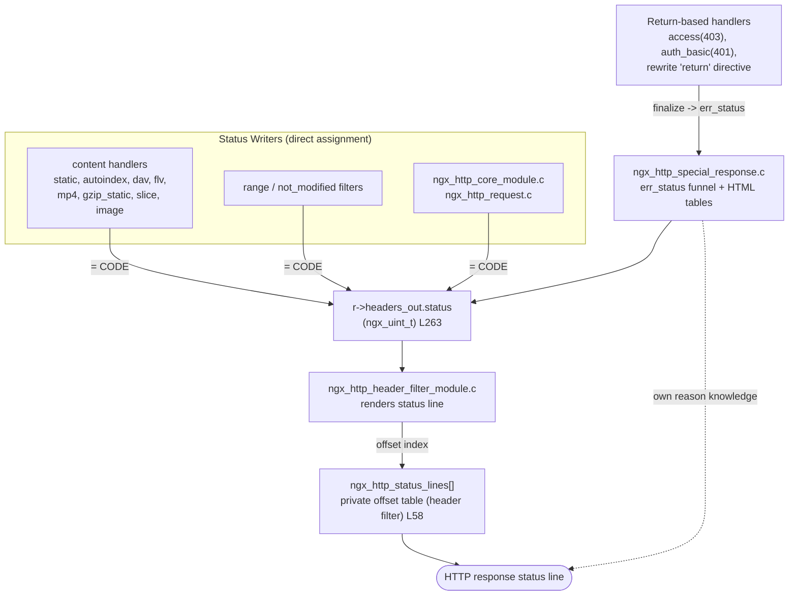
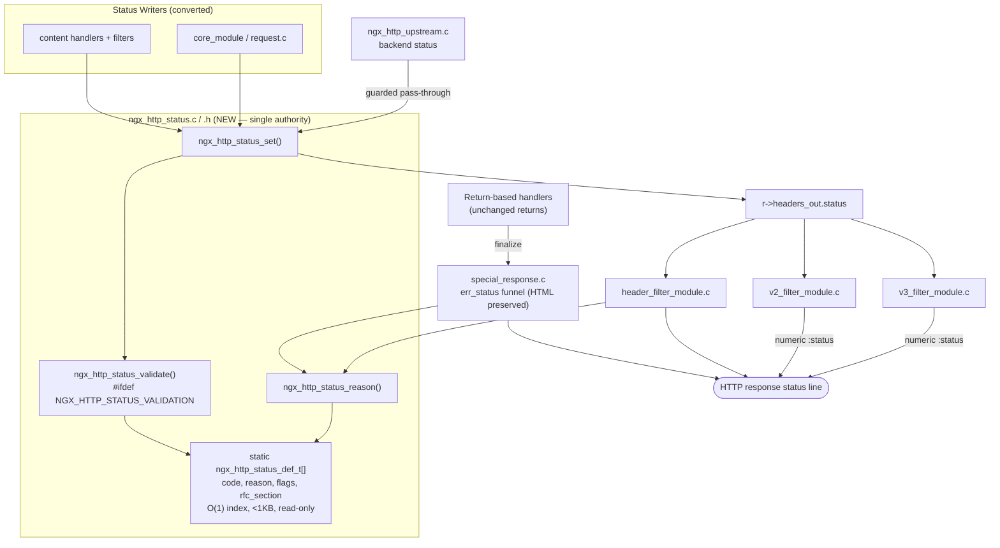

# Status Code API Migration Guide

This guide describes how HTTP response status handling changes with the status
code registry refactor. The refactor centralizes all HTTP response status
writes through `ngx_http_status_set()` and all reason-phrase lookups through
`ngx_http_status_reason()`, both backed by a single static registry (the
`ngx_http_status_def_t` table) that carries each code's reason phrase, class
flags, and RFC 9110 section 15 reference. One authoritative module now
owns status metadata; callers no longer touch the raw `r->headers_out.status`
field or a private reason table directly. The new RFC 9110 compliance
validation is opt-in and disabled by default, so the default build behaves
exactly as before (see [Backward Compatibility](#backward-compatibility)).

## The Status API

The status API exposes five public functions, declared in
`src/http/ngx_http_status.h` and made visible to every HTTP translation unit
through `src/http/ngx_http.h`:

```c
ngx_int_t    ngx_http_status_set(ngx_http_request_t *r, ngx_uint_t status);
ngx_int_t    ngx_http_status_validate(ngx_uint_t status);
ngx_str_t    ngx_http_status_line(ngx_uint_t status);
ngx_str_t    ngx_http_status_reason(ngx_uint_t status);
ngx_int_t    ngx_http_status_register(void);
ngx_uint_t   ngx_http_status_is_cacheable(ngx_uint_t status);
```

- `ngx_http_status_set()` — the single sanctioned write seam; sets
  `r->headers_out.status` after optional validation. Returns `NGX_OK` on
  success (always, in the default build for the normal path).
- `ngx_http_status_validate()` — RFC 9110 range/class check; a no-op returning
  `NGX_OK` unless the validation feature is compiled in.
- `ngx_http_status_line()` — the single wire-status-line lookup (for example,
  `200` yields the full `200 OK`); returns an empty `ngx_str_t` for codes with
  no registry entry (the caller then renders the numeric code). The HTTP/1.x
  header filter emits this precomputed line with a single copy — no per-response
  formatting.
- `ngx_http_status_reason()` — the single **bare** reason-phrase lookup (for
  example, `200` yields `OK`, with no numeric prefix), derived from the combined
  line by skipping the `"NNN "` prefix; returns an empty `ngx_str_t` for codes
  with no registry phrase. Consumed by the error-page diagnostic.
- `ngx_http_status_register()` — config-phase seeding/finalization of the
  registry (runs once before workers fork; no runtime mutation).
- `ngx_http_status_is_cacheable()` — returns non-zero if the code is flagged
  cacheable in the registry.

The full API reference — parameter semantics, return values, and the complete
seeded status set — lives in the [status code API reference](../api/status_codes.md).

## Before and After

Every direct write to `r->headers_out.status` is converted to a mediated call
through `ngx_http_status_set()`. The canonical conversion is shown first.

Old (direct assignment):

```c
r->headers_out.status = NGX_HTTP_NOT_FOUND;
```

New (mediated through the API):

```c
if (ngx_http_status_set(r, 404) != NGX_OK) {
    /* log error */
    return NGX_HTTP_INTERNAL_SERVER_ERROR;
}
```

The same pattern applies across every status code. Two further examples:

`NGX_HTTP_OK` (200) — old:

```c
r->headers_out.status = NGX_HTTP_OK;
```

New:

```c
if (ngx_http_status_set(r, NGX_HTTP_OK) != NGX_OK) {
    return NGX_HTTP_INTERNAL_SERVER_ERROR;
}
```

`NGX_HTTP_PARTIAL_CONTENT` (206) — old:

```c
r->headers_out.status = NGX_HTTP_PARTIAL_CONTENT;
```

New:

```c
if (ngx_http_status_set(r, NGX_HTTP_PARTIAL_CONTENT) != NGX_OK) {
    return NGX_HTTP_INTERNAL_SERVER_ERROR;
}
```

Notes on the conversion:

- Either a numeric literal (for example, `404`) or the existing `NGX_HTTP_*`
  constant (for example, `NGX_HTTP_NOT_FOUND`) may be passed to
  `ngx_http_status_set()`. They are equivalent because the constants are
  retained (see [Backward Compatibility](#backward-compatibility)).
- The failure branch (`!= NGX_OK`) is only reachable when validation is
  compiled in and rejects an out-of-range code. In the default build the call
  always succeeds on the normal (non-upstream) path, so the branch is a
  no-cost safeguard.
- Status-line rendering is now automatic: after `ngx_http_status_set()`, the
  header filter obtains the full wire status line from `ngx_http_status_line()`
  (a single precomputed copy). Callers must not set a private reason phrase.

## Backward Compatibility

The refactor is additive at the symbol level and preserves observable behavior:

- All **45** existing `NGX_HTTP_*` numeric status constants (for example,
  `NGX_HTTP_OK` = 200, `NGX_HTTP_NOT_FOUND` = 404,
  `NGX_HTTP_INTERNAL_SERVER_ERROR` = 500) are **retained** — not renamed, not
  removed. They remain defined in `src/http/ngx_http_request.h`.
- **Direct assignment still works.** `r->headers_out.status = CODE;` continues
  to compile and function. `ngx_http_status_set()` is the sanctioned path, but
  the raw field was not removed, so source-level backward compatibility is
  preserved.
- The **validation layer is opt-in** via the new `--with-http_status_validation`
  configure switch, which is **OFF by default**. With validation off, the
  compiled binary produces **byte-identical** wire output to the pre-refactor
  build.
- **Third-party modules need no changes to keep compiling.** Because the
  `NGX_HTTP_*` constants and direct field assignment are preserved, existing
  modules are unaffected. Adopting `ngx_http_status_set()` is recommended for
  new code but is not required for continued compilation.

## For Third-Party Module Authors

External modules should adopt the API for new code as follows:

- Replace direct writes to `r->headers_out.status` with
  `ngx_http_status_set(r, CODE)`, handling the `!= NGX_OK` return exactly as
  shown in [Before and After](#before-and-after).
- **No new `#include` lines are required.** The API is declared through
  `src/http/ngx_http.h`, which every HTTP `.c` translation unit already
  includes transitively (via the `ngx_config.h` -> `ngx_core.h` ->
  `ngx_http.h` chain). Therefore only **call-site edits** are needed — no
  per-file include changes.
- Return-based handlers (those that `return NGX_HTTP_*` codes) do **not** need
  to change their `return` statements. Those codes are validated centrally at
  the choke-points — `ngx_http_status_set()`, the special-response `err_status`
  funnel, and the header filter — not at each return site.
- The upstream/proxy pass-through guarantee is preserved: status codes copied
  from a proxied backend are **never** validated away or transformed — they
  pass through byte-for-byte, because `ngx_http_status_set()` guards on
  `r->upstream`. Module authors proxying backend responses need not worry about
  the validation layer rejecting non-standard backend codes.

## Architecture: Before and After

This refactor changes both the structure and the state of status handling, so
both the current (before) and target (after) architectures are shown below.

### Current State — Decentralized Status Handling (Diagram 0.3.2-A)



Legend:

- Solid arrows show status data flow.
- The dotted arrow shows independent reason-phrase knowledge held by the error
  funnel.
- The core problem: three independent owners of status/reason logic and no
  validation seam.

### Target State — Centralized Registry (Diagram 0.3.3-B)



Legend:

- All writes converge on `ngx_http_status_set()`.
- Textual reason lookups (HTTP/1.x header filter and the error-page funnel)
  converge on `ngx_http_status_reason()`, which resolves against the static
  registry table.
- The HTTP/2 and HTTP/3 serializers read the numeric `r->headers_out.status`
  field directly and emit a numeric-only `:status` pseudo-header; HPACK/QPACK
  carry no reason phrase, so these paths never call `ngx_http_status_reason()`.
- Validation is compiled in only when `--with-http_status_validation` is set.
- The upstream path is a guarded pass-through, so backend codes pass through
  unvalidated.

## See Also

- [Status code API reference](../api/status_codes.md) — full function
  reference and the complete seeded status set.
