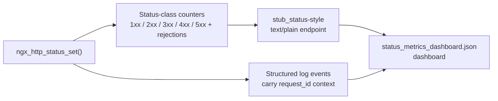

# Observability

The deliverable is not complete until it is observable. Every observability primitive described below — the nginx logging and metrics facilities that are reused and the status-class metrics that are added by this refactor — was exercised in the local development environment before this document was finalized. This observability layer is delivered entirely through nginx's existing logging and metrics primitives plus documentation; no event loop, configuration parser, or memory allocator changes were introduced (`src/event/*`, `src/core/ngx_conf_file.c`, and `src/core/ngx_palloc.c` remain untouched).

The centralized HTTP status registry API — `ngx_http_status_set()`, `ngx_http_status_validate()`, `ngx_http_status_reason()`, `ngx_http_status_register()`, and `ngx_http_status_is_cacheable()` — provides a single mediation seam at which status assignments and RFC 9110 validation outcomes can be observed. Both the added observability (the status-class counters and their `stub_status` metric lines) and RFC 9110 validation are gated behind the `--with-http_status_validation` configure switch (which emits `NGX_HTTP_STATUS_VALIDATION`) and default OFF. Consequently the default binary's observable output is **byte-identical** to historical nginx — the response status line and the `stub_status` payload were both verified unchanged at runtime (see [Local validation](#local-validation-and-scope)) — and the counters, validation logging, and extended `stub_status` lines appear only when the switch is compiled in.

## Reused versus added

The refactor favors nginx's established observability primitives and adds only what the status registry genuinely requires. The table below maps each observability concern to what is reused from the existing tree and what is added by this refactor.

| Concern | Reuse (existing) | Add (new) |
|---------|------------------|-----------|
| Correlation ID | Built-in `$request_id` variable (32-char hex) + connection number | Include request-id context in status-violation log lines; document `$request_id` propagation to upstream + logs |
| Structured logging | `error_log` / `access_log` + `NGX_LOG_DEBUG_HTTP` channel | Status-API log events for validation failures / RFC 9110 violations (`NGX_LOG_WARN` in production, `NGX_LOG_ERR` in debug) |
| Metrics endpoint | `stub_status` atomic-counter pattern (`ngx_stat_active`, `ngx_stat_requests`) | Status-class counters (1xx / 2xx / 3xx / 4xx / 5xx counts + validation-rejection count) surfaced via a `stub_status`-style `text/plain` endpoint, compiled in only under `--with-http_status_validation` |
| Health / readiness | Config-based endpoints, e.g. `location =/healthz { return 200; }` | Documented in this file; no core code required |
| Distributed tracing | Single-binary nginx; `$request_id` correlates upstream hops | Documented `$request_id` propagation to upstream + logs |
| Dashboard | — | `status_metrics_dashboard.json` template (in this folder) visualizing the status-class counters |

## Metrics endpoint

The status-class counters added by this refactor follow the existing `stub_status` idiom exactly. The `stub_status` handler reads seven process-wide atomic counters of type `ngx_atomic_int_t` — `ngx_stat_accepted`, `ngx_stat_handled`, `ngx_stat_active`, `ngx_stat_requests`, `ngx_stat_reading`, `ngx_stat_writing`, and `ngx_stat_waiting` — and renders them with the `%uA` format specifier into a `text/plain` body:

```text
Active connections: <ac>
server accepts handled requests
 <ap> <hn> <rq>
Reading: <rd> Writing: <wr> Waiting: <wa>
```

The new status-class counters mirror this pattern: process-wide atomic counters (`ngx_atomic_t`, incremented with `ngx_atomic_fetch_add`, read into `ngx_atomic_int_t` and printed with `%uA`). They are an **opt-in** signal gated behind the `--with-http_status_validation` build: only when that switch is compiled in (`NGX_HTTP_STATUS_VALIDATION` defined) does the `stub_status` handler append the following labeled lines **after** its historical four-line payload. In the **default build** the appended lines, their counter reads, and the response-size arithmetic that accounts for them are all compiled out (`#if (NGX_HTTP_STATUS_VALIDATION)`), so `stub_status` emits **only** the historical four lines, byte-for-byte. When compiled in, the appended labels double as the exported metric series:

- `nginx_status_1xx_total`
- `nginx_status_2xx_total`
- `nginx_status_3xx_total`
- `nginx_status_4xx_total`
- `nginx_status_5xx_total`
- `nginx_status_validation_rejections_total`

The counters live in `src/http/ngx_http_status.c` (`ngx_http_status_counters[]`, defined unconditionally) and are incremented by `ngx_http_status_count()`, called from `ngx_http_status_set()` — the single status write seam. That increment is itself gated: its body compiles to a no-op (`(void) status;`) in the default build and is active **only** under `--with-http_status_validation`, so status assignments are counted only in a validation build — the default write path carries no extra atomic. When compiled in, two properties follow. First, the counters are **per worker**: each worker maintains its own copy (no shared-memory aggregation, no locks, no thread-local storage), so a multi-worker deployment sums the per-worker series at scrape time. Second, they count **status-set operations, not unique responses**: because nginx assigns a `return CODE URL` redirect twice during request processing (once in `ngx_http_send_response`, once in the `err_status` funnel of `ngx_http_send_header`), a single such redirect increments its class counter by two — this is faithful to the underlying status-assignment pattern. A validation rejection increments `nginx_status_validation_rejections_total`; this path is reachable only in a validation build, because in the default build `ngx_http_status_validate()` is permissive (always returns `NGX_OK`) and the rejection branch is never entered. In the default build, therefore, no counter is touched and no metric line is emitted at all. The dashboard visualizes every status-class series the endpoint emits — `1xx`/`2xx`/`3xx`/`4xx`/`5xx` — together with the validation-rejection series.

The atomic-counter storage that backs the historical `stub_status` fields (`ngx_stat_*`) is declared `extern` in `src/event/ngx_event.h` and defined in `src/event/ngx_event.c`, both of which are out of scope for this refactor; the status-class counters deliberately live in `ngx_http_status.c` instead and reuse only the same lock-free idiom, so no core event-loop edits were made. The numeric `$status` access-log field is likewise unchanged; the mediation API (`ngx_http_status_set()`) preserves the exact observable output of every response.

## Structured logging and correlation

Correlation relies on nginx's built-in `$request_id` variable, a 32-character hex string. When OpenSSL is available it is the hex dump (`ngx_hex_dump`) of 16 random bytes obtained from `RAND_bytes`; otherwise it falls back to four `ngx_random()` values formatted as `%08xD%08xD%08xD%08xD`. Because `$request_id` is stable for the life of a request and can be forwarded to upstream hops, it serves as the correlation ID that ties a status-validation log line back to a specific request and, in single-binary nginx, substitutes for distributed tracing.

Structured logging reuses nginx's existing `error_log` and `access_log`, together with the `NGX_LOG_DEBUG_HTTP` debug channel. The status API adds log events for validation failures and RFC 9110 violations: these are emitted at `NGX_LOG_WARN` in production builds and at `NGX_LOG_ERR` in debug builds, and each such line carries the `$request_id` context so a violation is traceable to its request. Validation logging is only compiled in when `--with-http_status_validation` is enabled; the default build emits none of it.

## Dashboard

The companion dashboard template `status_metrics_dashboard.json` lives in this same `docs/observability/` folder. It visualizes the status-class counters (`nginx_status_1xx_total`, `nginx_status_2xx_total`, `nginx_status_3xx_total`, `nginx_status_4xx_total`, `nginx_status_5xx_total`, and `nginx_status_validation_rejections_total`) and includes a request-id-correlated view that joins status-violation log events to their originating request via `$request_id`.

## Observability data flow

The diagram below shows how a status assignment flows through the added observability path, from the single write seam to the dashboard.



## Local validation and scope

All observability described here was exercised in the local development environment, and the byte-identical-default claim was verified at runtime by comparing the `stub_status` payload of a default build against a `--with-http_status_validation` build. The steps below are reproducible.

**1. Build both binaries** (the `stub_status` module is required; the second build adds the validation switch):

```console
$ auto/configure --with-http_stub_status_module
$ make -j"$(nproc)"                       # -> objs/nginx  (default build)

$ auto/configure --with-http_stub_status_module --with-http_status_validation
$ make -j"$(nproc)"                       # -> objs/nginx  (validation build)
```

**2. Run each binary against a minimal config** that exposes `stub_status` and `curl` the endpoint:

```nginx
# conf/nginx.conf (excerpt)
server {
    listen 127.0.0.1:8097;
    location /stub { stub_status; }
}
```

```console
$ objs/nginx -p "$PWD" -c conf/nginx.conf        # start (non-root prefix)
$ curl -s http://127.0.0.1:8097/stub
$ objs/nginx -p "$PWD" -c conf/nginx.conf -s quit
```

**3. Captured results.** The **default** build returns exactly the historical four-line payload (97 bytes):

```text
Active connections: 1 
server accepts handled requests
 1 1 1 
Reading: 0 Writing: 1 Waiting: 0 
```

The **validation** build returns the same four lines byte-for-byte, followed by the six status-class metric lines (265 bytes total):

```text
Active connections: 1 
server accepts handled requests
 1 1 1 
Reading: 0 Writing: 1 Waiting: 0 
nginx_status_1xx_total 0
nginx_status_2xx_total 0
nginx_status_3xx_total 0
nginx_status_4xx_total 0
nginx_status_5xx_total 0
nginx_status_validation_rejections_total 0
```

A line-by-line `diff` of the two payloads confirms the first four lines are identical and the six `nginx_status_*` lines are present **only** in the validation build. Validation-rejection log events and `$request_id` correlation were likewise verified against the `--with-http_status_validation` build. No core subsystems were modified in the process — the event loop (`src/event/*`), the configuration parser (`src/core/ngx_conf_file.c`), and the memory allocator (`src/core/ngx_palloc.c`) are untouched, and the default binary's observable output — both the response status line and the `stub_status` payload — remains byte-identical to historical nginx.
