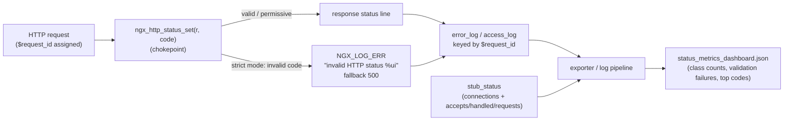

# Status-Code Observability

This document describes the observability story for the **HTTP status-code registry
refactor** — what is **REUSED** from nginx-native primitives (so nothing is
reinvented) and what is **ADDED** by this refactor. It is mandated by **Rule 1
(Observability)** and is the companion to the dashboard template
[`status_metrics_dashboard.json`](status_metrics_dashboard.json).

The refactor centralizes every `r->headers_out.status = NGX_HTTP_*` assignment
behind a single chokepoint, `ngx_http_status_set()`, and adds an opt-in
`--with-http_status_validation` build mode. That single chokepoint is what makes
consistent status-code logging and metrics possible without touching 20 call
sites individually.

## At a glance



Legend: solid arrows are runtime/data paths. `stub_status` and the structured
logs are **reused**; the chokepoint logging and the dashboard are **added**.

## REUSED — nginx-native primitives (do not reinvent)

### 1. Structured `error_log` keyed by the `$request_id` correlation id

nginx already provides a per-request correlation id via the `$request_id`
variable, implemented entirely in `src/http/ngx_http_variables.c`:

- **Declaration:** `src/http/ngx_http_variables.c:110`
  (`ngx_http_variable_request_id`).
- **Variable table entry:** `src/http/ngx_http_variables.c:315-316`
  (`{ ngx_string("request_id"), ... }`).
- **Implementation:** `src/http/ngx_http_variables.c:2298`. It allocates a
  **32-character** id (`ngx_pnalloc(r->pool, 32)`, `v->len = 32`). When nginx is
  built with OpenSSL the id is filled from `RAND_bytes()` and hex-encoded
  (`ngx_hex_dump`), i.e. randomized; without OpenSSL it falls back to a
  deterministic `ngx_sprintf(id, "%08xD%08xD%08xD%08xD", ...)` (still 32 chars).

This refactor **reuses `$request_id` as the correlation id for the strict-mode
invalid-status error records**. Those records are emitted through the core
module's `ngx_http_log_invalid_status()` helper
(`src/http/ngx_http_core_module.c`), which embeds the id directly in the
`error.log` line (`"invalid HTTP status %ui, request_id: \"%V\""`, falling back to
`-` when the variable is unavailable), so a validation failure can be pivoted to
the exact request. The status-set **debug traces** (`"http status set: %ui"`) are
correlated by **connection** via `r->connection->log` at `NGX_LOG_DEBUG_HTTP`,
not by `$request_id` — see the per-build table below for the precise contract.
The numeric response code is likewise already exposed via the `$status` variable
(`src/http/ngx_http_variables.c:319-320`), which is the value the dashboard's
class-count and top-codes panels conceptually aggregate.

> Recommended log format: include `$request_id` (and `$status`) so the
> correlation id is present on every line, e.g.
> `log_format obs '$request_id $status $request';`.

### 2. `stub_status` metrics endpoint

The `ngx_http_stub_status_module`
(`src/http/modules/ngx_http_stub_status_module.c`) already serves coarse,
process-wide counters in `text/plain`:

```
Active connections: <n>
server accepts handled requests
 <accepts> <handled> <requests>
Reading: <r> Writing: <w> Waiting: <w>
```

These map to `Active connections`, the `accepts`/`handled`/`requests` counters,
and the `Reading`/`Writing`/`Waiting` connection states. This refactor reuses the
endpoint as-is — note that `stub_status` itself is migrated to
`ngx_http_status_set(r, 200)` like every other module, but its **output is
byte-identical**.

> **Gap that motivates the added dashboard:** `stub_status` does **not** break out
> responses by **status class (1xx/2xx/3xx/4xx/5xx)** or by individual code. It
> only reports connection states and the accepts/handled/requests counters.
> Per-class and per-code visibility therefore comes from log-derived metrics or an
> exporter, surfaced by `status_metrics_dashboard.json`.

### 3. Debug logging at `NGX_LOG_DEBUG_HTTP`

The HTTP debug log level `NGX_LOG_DEBUG_HTTP` is the established channel for
request-lifecycle tracing, e.g. in `src/http/ngx_http_request.c:382`, `:681`, and
`:701`. The refactor reuses this exact level for non-error status-set tracing, so
the new logging blends into existing `debug_http` output and adds **zero** lines
unless debug logging is enabled.

## ADDED — by this refactor

### 1. Status-set debug/validation logging at the `ngx_http_status_set()` chokepoint

Because every status assignment now flows through one function, status logging is
defined in exactly one place:

| Build / path | Behavior |
|---|---|
| **Default build** (no `--with-http_status_validation`) | `ngx_http_status_set()` reduces to the original field write. **No extra log lines; zero overhead.** |
| **Strict build, invalid code** | Emits a single `NGX_LOG_ERR` line `"invalid HTTP status %ui"`, then falls back to `NGX_HTTP_INTERNAL_SERVER_ERROR` (500). This is the one event the dashboard's validation-failure panels count. |
| **Strict build, upstream/permissive path** | Proxied/upstream status is passed through (never strict-validated); unknown codes are traced at `NGX_LOG_DEBUG_HTTP`, not errored. |

The **strict-build invalid-status error line** carries the `$request_id`
correlation id when it is emitted through the core module's
`ngx_http_log_invalid_status()` helper (used by the core write sites in
`ngx_http_send_response` and the header-send path), so that validation failure is
traceable to a specific request. The per-module invalid-status fallbacks (the
`ngx_log_error(... "invalid HTTP status %ui")` form in the migrated modules) and
the status-set **debug traces** in both builds are correlated by **connection**
(`r->connection->log`), not by `$request_id`; operators who want `$request_id` on
every line add it to their `log_format` as recommended above.

### 2. Status-code metrics dashboard

The added [`status_metrics_dashboard.json`](status_metrics_dashboard.json) is a
self-contained, environment-agnostic Grafana-style template. It uses template
variables (`${DS_METRICS}` data source, `$instance`, and a `$request_id` textbox
for correlation drill-down) and references **generic** metric names that an
exporter or log-derived pipeline supplies (nginx-core ships no native per-status
exporter). Its panels cover the three required views:

- **Counts by status class (1xx–5xx)** — a stacked timeseries plus a distribution
  pie, from `nginx_http_status_class_total{class=...}`.
- **Validation failures** — a stat and a rate timeseries of strict-mode invalid
  codes, from `nginx_http_status_validation_failures_total` (the count of the
  `NGX_LOG_ERR "invalid HTTP status"` events above). Always zero in default
  builds.
- **Top status codes** — a table and a bar gauge of the most frequent individual
  codes (including nginx extensions 444 and 494–499), from
  `nginx_http_status_code_total{status=...}`.

The `.json` is a dashboard template only; it is intentionally **not** part of the
MkDocs navigation.

## Health & readiness

This refactor introduces **no new health endpoint**. Health and readiness are
assessed by reusing `stub_status` together with the added dashboard:

- **Liveness/throughput:** `stub_status` connection states and the
  accepts/handled/requests counters confirm the worker is accepting and
  processing connections.
- **Service health:** status-class trends from the dashboard — a sustained spike
  in **5xx** indicates server-side degradation; a spike in **4xx** indicates
  client/route problems.
- **Refactor health:** any non-zero **validation-failure** count in strict mode
  means a module emitted an out-of-registry code and the request fell back to
  500 — an actionable signal unique to this refactor. In default builds this
  count is always zero, so a non-zero value in a strict canary is a clear
  pre-promotion gate.

These signals are derived entirely from existing primitives plus the new
chokepoint logging; no additional runtime surface is added.

## Limitation — distributed tracing

**nginx-core has no distributed-tracing primitive.** The `$request_id`
correlation id is per-instance: it correlates log lines and metrics **within a
single nginx instance**, but it does **not** propagate or join a trace across
service boundaries (no span context, no W3C `traceparent` handling, no exporter).
Full distributed-trace propagation and correlation require an **external module**
(for example an OpenTelemetry/ngx_http modules integration) and are therefore
**out of scope** for this refactor.

This limitation, and the decision to rely on `$request_id` correlation rather than
introduce tracing, is recorded in the decision log:
[`../decisions/status_code_refactor.md`](../decisions/status_code_refactor.md).

## Source references

| Primitive | File:line |
|---|---|
| `$request_id` declaration | `src/http/ngx_http_variables.c:110` |
| `$request_id` variable entry | `src/http/ngx_http_variables.c:315-316` |
| `$request_id` implementation (32-char, OpenSSL-randomized) | `src/http/ngx_http_variables.c:2298` |
| `$status` variable | `src/http/ngx_http_variables.c:319-320` |
| `stub_status` handler/output | `src/http/modules/ngx_http_stub_status_module.c` |
| `NGX_LOG_DEBUG_HTTP` usage | `src/http/ngx_http_request.c:382`, `:681`, `:701` |
| Dashboard template | [`status_metrics_dashboard.json`](status_metrics_dashboard.json) |
| Decision log | [`../decisions/status_code_refactor.md`](../decisions/status_code_refactor.md) |
