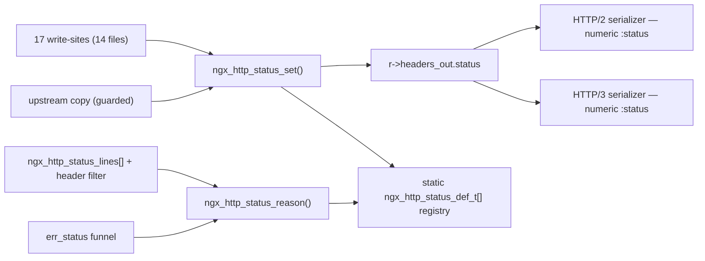

# Source → Target Traceability Matrix

This document provides a **bidirectional** traceability matrix for the nginx 1.29.5 HTTP status-code registry refactor, which centralizes every status write and reason lookup behind the new registry API in `src/http/ngx_http_status.c` and `src/http/ngx_http_status.h`. It records a **forward mapping** — every source construct traced to the target implementation that replaces it — and a **reverse mapping** — every target traced back to its originating source construct(s) — so that no change is unexplained and no target is orphaned. A **coverage summary** then asserts 100% coverage with no gaps, and a **changed-file inventory cross-check** reconciles the mappings against the complete set of files the refactor touches. Every source and file reference is written as inline code (never as a hyperlink) so this page renders cleanly under `mkdocs build --strict`.

> **Line-number convention.** Every `Lnnn` reference in the tables below points to the construct's **current** location in the post-refactor source tree (with the F-PERF-1 status-line-render and Info-1 fallback fixes applied), so the matrix can be used to navigate the shipped code directly. Where a construct was retired by the refactor (for example the private `ngx_http_status_lines[]` table), that is stated explicitly and the original location is noted for provenance.

## Forward Mapping

### Direct status write-sites → ngx_http_status_set()

17 assignments across 14 files; the OLD pattern `r->headers_out.status = CODE;` becomes `if (ngx_http_status_set(r, CODE) != NGX_OK) { /* log + fail */ }`.

| Source File | Line(s) | Old Construct | Target |
| --- | --- | --- | --- |
| `src/http/ngx_http_core_module.c` | L1781 | `r->headers_out.status = status;` | `ngx_http_status_set(r, status)` |
| `src/http/ngx_http_core_module.c` | L1863 | `r->headers_out.status = r->err_status;` | `ngx_http_status_set(r, r->err_status)` — a QA follow-up (see `decision_log.md`, Info-1) adds a uniform-500 fallback at L1873 so a rejected local `err_status` never reaches the wire as a degenerate status line |
| `src/http/ngx_http_request.c` | L2849 | `mr->headers_out.status = rc;` | `ngx_http_status_set(mr, rc)` |
| `src/http/ngx_http_request.c` | L3930 | `r->headers_out.status = rc;` | `ngx_http_status_set(r, rc)` |
| `src/http/ngx_http_upstream.c` | L3171 | `r->headers_out.status = u->headers_in.status_n;` (and the `status_line` copy) | **guarded** `ngx_http_status_set()` — upstream pass-through, unvalidated |
| `src/http/modules/ngx_http_static_module.c` | L229 | `r->headers_out.status = NGX_HTTP_OK;` | `ngx_http_status_set(r, 200)` |
| `src/http/modules/ngx_http_autoindex_module.c` | L258 | `r->headers_out.status = NGX_HTTP_OK;` | `ngx_http_status_set(r, 200)` |
| `src/http/modules/ngx_http_not_modified_filter_module.c` | L94 | `r->headers_out.status = NGX_HTTP_NOT_MODIFIED;` | `ngx_http_status_set(r, 304)` |
| `src/http/modules/ngx_http_range_filter_module.c` | L234 | `r->headers_out.status = NGX_HTTP_PARTIAL_CONTENT;` | `ngx_http_status_set(r, 206)` |
| `src/http/modules/ngx_http_range_filter_module.c` | L621 | `r->headers_out.status = NGX_HTTP_RANGE_NOT_SATISFIABLE;` | `ngx_http_status_set(r, 416)` |
| `src/http/modules/ngx_http_slice_filter_module.c` | L176 | `r->headers_out.status = NGX_HTTP_OK;` | `ngx_http_status_set(r, 200)` |
| `src/http/modules/ngx_http_gzip_static_module.c` | L227 | `r->headers_out.status = NGX_HTTP_OK;` | `ngx_http_status_set(r, 200)` |
| `src/http/modules/ngx_http_image_filter_module.c` | L594 | `r->headers_out.status = NGX_HTTP_OK;` | `ngx_http_status_set(r, 200)` |
| `src/http/modules/ngx_http_mp4_module.c` | L678 | `r->headers_out.status = NGX_HTTP_OK;` | `ngx_http_status_set(r, 200)` |
| `src/http/modules/ngx_http_flv_module.c` | L187 | `r->headers_out.status = NGX_HTTP_OK;` | `ngx_http_status_set(r, 200)` |
| `src/http/modules/ngx_http_dav_module.c` | L296 | `r->headers_out.status = status;` (variable) | `ngx_http_status_set(r, status)` |
| `src/http/modules/ngx_http_stub_status_module.c` | L174 | `r->headers_out.status = NGX_HTTP_OK;` | `ngx_http_status_set(r, 200)` |

Count: `ngx_http_core_module.c` (2) + `ngx_http_request.c` (2) + `ngx_http_upstream.c` (1) + 11 module files (12 assignments, `ngx_http_range_filter_module.c` has 2) = **17 assignments across 14 files**.

### Reason-phrase and error funnel → ngx_http_status_reason(); protocol serializers (numeric :status)

| Source File | Line(s) | Old Construct | Target |
| --- | --- | --- | --- |
| `src/http/ngx_http_header_filter_module.c` | L58 (original; now retired) | `static ngx_str_t ngx_http_status_lines[]` (private class-offset table of combined `"NNN reason"` literals) | migrated/retired — the combined wire status-line literals now live in the `ngx_http_status_def_t` registry (`ngx_http_status.c`) and are served by `ngx_http_status_line()`; the private table no longer exists in the header filter |
| `src/http/ngx_http_header_filter_module.c` | L173 (lookup); L133–L135 (fast-path); L347–L365 (render) | offset-index lookup `ngx_http_status_lines[status]` (with `NGX_HTTP_OFF_3XX` etc.) | `ngx_http_status_line(status)` returns the full precomputed `"NNN reason"` wire line, emitted with a single `ngx_copy` (L355) exactly as the original table did — no per-response formatting; the caller-supplied `status_line.len` fast-path (L133–L135) is retained, and the `"%03ui "` numeric writer (L365) remains the fallback for gap/unknown codes. `ngx_http_status_reason()` remains the single source of the **bare** phrase (derived by skipping the four-character `"NNN "` prefix) and is consumed by the `special_response` diagnostic |
| `src/http/ngx_http_special_response.c` | L416–L830 (handler L416; reason lookup L435; dispatch L685) | `err_status` funnel (`r->err_status = error;`) + offset math `r->err_status - NGX_HTTP_MOVED_PERMANENTLY + NGX_HTTP_OFF_3XX` | funnel delegates the default reason to `ngx_http_status_reason()` (debug diagnostic); per-code HTML tables (`ngx_http_error_301_page` … `ngx_http_error_507_page`, L60–L332) preserved verbatim |
| `src/http/v2/ngx_http_v2_filter_module.c` | L173, L206, L425, L434 | status `switch` + `ngx_sprintf(pos, "%03ui", r->headers_out.status)` serialization | unchanged behavior — the serializer keeps emitting a numeric-only `:status` pseudo-header from `r->headers_out.status`. HPACK carries no reason phrase, so it does **not** call `ngx_http_status_reason()`; the only edit is a clarifying comment recording this invariant |
| `src/http/v3/ngx_http_v3_filter_module.c` | L123–L152, L332–L342 | status reads + `%03ui` serialization | **unchanged in this refactor (empty diff)** — QPACK likewise carries no reason phrase, so the HTTP/3 serializer emits a numeric-only `:status` from `r->headers_out.status` and does **not** call `ngx_http_status_reason()` |

The custom error-page HTML tables are preserved verbatim and the header filter's `status_line.len` fast-path is retained; only the *source* of the default reason phrase is centralized, so the wire output is byte-identical when validation is disabled.

### Registry/API core, declarations, and build wiring

| Target File | Transformation | Source / Origin | Notes |
| --- | --- | --- | --- |
| `src/http/ngx_http_status.h` | CREATE | modeled on `src/http/ngx_http_request.h` | defines the compact `ngx_http_status_def_t { const char *line; uint16_t line_len; uint16_t code; uint16_t flags; uint16_t rfc_section; }` (16 bytes/row, keeping the table < 1 KB/worker — see `decision_log.md`), where `line`/`line_len` form the full precomputed wire status line (`"NNN reason"`, e.g. `"200 OK"`) exposed as an `ngx_str_t` by `ngx_http_status_line()` — `ngx_http_status_reason()` derives the bare phrase (`"OK"`) by skipping the invariant four-character `"NNN "` prefix — and `rfc_section` packs the RFC 9110 §15 reference as `(subsection << 8) | item`; plus the `NGX_HTTP_STATUS_*` flag macros (`CACHEABLE`, `CLIENT_ERROR`, `SERVER_ERROR`, `INFORMATIONAL`) and the API prototypes |
| `src/http/ngx_http_status.c` | CREATE | generalizes the `ngx_http_status_lines[]` idiom from `src/http/ngx_http_header_filter_module.c` | static registry array (O(1) index, <1 KB, read-only after init) + `ngx_http_status_set` / `ngx_http_status_validate` / `ngx_http_status_line` / `ngx_http_status_reason` / `ngx_http_status_register` / `ngx_http_status_is_cacheable` (each ≤ 50 lines) |
| `src/http/ngx_http.h` | UPDATE | itself | add the include/declaration so every HTTP translation unit sees the API (no per-module `#include` needed) |
| `src/http/ngx_http_request.h` | UPDATE | itself | additive-only ABI/source-compatibility retention: **retain** `status` (L269), `status_line` (L270), `err_status` (L460), and all 45 `NGX_HTTP_*` constants (no field reorder), and add a terse comment noting the registry maintains the status metadata; the `ngx_http_status_def_t` type and the `NGX_HTTP_STATUS_*` flag macros are defined in `src/http/ngx_http_status.h` (the CREATE row above), not here |
| `src/http/ngx_http_request.c` | UPDATE | itself | registry initialization (configuration phase, pre-fork) + write-site conversions at L2849 and L3930 |
| `auto/options` | UPDATE | itself | add the `HTTP_STATUS_VALIDATION=NO` default, the `--with-http_status_validation` case arm (sets `YES`), and help text — distinct from the pre-existing `HTTP_STATUS` variable |
| `auto/sources` | UPDATE | itself | define the grouping variables `HTTP_STATUS_SRCS=src/http/ngx_http_status.c` and `HTTP_STATUS_DEPS=src/http/ngx_http_status.h`, following the existing `HTTP_FILE_CACHE_SRCS` / `HTTP_HUFF_SRCS` idiom; these variables only *name* the source pair and are consumed by `auto/modules` (they do not themselves wire it into a build list) |
| `auto/modules` | UPDATE | itself | consume the grouping variables — append `$HTTP_STATUS_SRCS` to the HTTP-core `ngx_module_srcs` and `$HTTP_STATUS_DEPS` to `ngx_module_deps`, and emit the `NGX_HTTP_STATUS_VALIDATION` define into `objs/ngx_auto_config.h` when `HTTP_STATUS_VALIDATION=YES` — **deviation (c)**: the AAP literally named `auto/sources` for the effective wiring, but in this tree the HTTP-core srcs/deps are wired in `auto/modules` (see `decision_log.md`) |

## Reverse Mapping

This direction confirms that no target implementation is orphaned: every symbol and file introduced or modified by the refactor traces back to a concrete source construct, or is explicitly marked **NEW** where no prior construct existed.

| Target (symbol / file) | Originating Source Construct(s) | Notes |
| --- | --- | --- |
| `ngx_http_status_set()` | the 17 direct write-sites across 14 files (Phase 2) + the upstream copy | single sanctioned write seam (Mediator); the upstream path is guarded/unvalidated. A QA follow-up (Info-1) adds one further sanctioned call — the uniform-500 fallback at `ngx_http_core_module.c` L1873 — which reuses this same seam rather than touching the field directly |
| `ngx_http_status_line()` | `ngx_http_status_lines[]` combined `"NNN reason"` literals (the wire status-line portion of the original table) | single wire-status-line seam consumed by the HTTP/1.x header filter, which emits the precomputed line with one `ngx_copy`. Restores the original table's single-copy hot path (F-PERF-1 fix — see `decision_log.md`) while keeping the registry the single authority |
| `ngx_http_status_reason()` | `ngx_http_status_lines[]` table (the reason-phrase portion) + the `err_status` funnel | single read seam (Facade) for the **bare** reason phrase, derived from the combined registry line by skipping the `"NNN "` prefix; consumed by the `special_response` diagnostic. Seeds identical phrases so wire output is unchanged. The HTTP/2 and HTTP/3 serializers are **not** sources here — they emit a numeric-only `:status` and never call this function |
| `ngx_http_status_validate()` | **NEW** — no prior source construct (validation did not previously exist) | compile-time gated by `#ifdef NGX_HTTP_STATUS_VALIDATION`; strict vs. standard mode |
| `ngx_http_status_is_cacheable()` | **NEW** — consolidates ad-hoc, per-module cacheability checks | flag test (`NGX_HTTP_STATUS_CACHEABLE`) against the registry |
| `ngx_http_status_register()` | **NEW** — no prior construct | seeds the registry during the configuration phase only (no runtime mutation) |
| static `ngx_http_status_def_t[]` registry | generalizes the `ngx_http_status_lines[]` offset-index idiom | O(1) direct index, <1 KB/worker, read-only after init, lock-free |
| `src/http/ngx_http_status.h` / `src/http/ngx_http_status.c` | new files modeled on `ngx_http_request.h` and `ngx_http_header_filter_module.c` | the registry/API core |
| `NGX_HTTP_STATUS_VALIDATION` compile define | `auto/options` (switch) + `auto/sources` (grouping variables) + `auto/modules` (consumes the variables, emits the define) | emitted into `objs/ngx_auto_config.h`; default OFF |

## Coverage Summary

**Coverage is 100% with no gaps.** All 17 direct write-sites, the `ngx_http_status_lines[]` reason-phrase table, and the `err_status` funnel are mapped in the forward direction and are accounted for in the reverse direction. The HTTP/2 and HTTP/3 serializers are also mapped in the forward direction, recorded as numeric-only `:status` emitters that deliberately do **not** consume `ngx_http_status_reason()` (HTTP/2 gains only a clarifying comment; HTTP/3 is unchanged). Every new symbol that has no antecedent — `ngx_http_status_validate()`, `ngx_http_status_is_cacheable()`, and `ngx_http_status_register()` — is explicitly labelled **NEW** rather than left unmapped, so the reverse mapping is complete.

### Changed-file inventory cross-check

The full refactor touches **39 files = 14 created + 25 updated**. The forward and reverse mappings above reference the code-affecting subset of this inventory; the remaining entries are documentation, test, and rule-mandated deliverables. Note that `src/http/v3/ngx_http_v3_filter_module.c` is **not** among the changed files — the HTTP/3 serializer already emitted a numeric-only `:status` and required no edit; it is listed in the forward mapping only to record that its behavior is deliberately unchanged.

**Created (14):**

- `src/http/ngx_http_status.c`
- `src/http/ngx_http_status.h`
- `docs/api/status_codes.md`
- `docs/migration/status_code_api.md`
- `CHANGES`
- `CODE_REVIEW.md`
- `docs/refactor/decision_log.md`
- `docs/refactor/traceability_matrix.md`
- `docs/presentation/executive_summary.html`
- `docs/observability/observability.md`
- `docs/observability/status_metrics_dashboard.json`
- `t/unit/ngx_http_status_test.c`
- `t/unit/Makefile`
- `t/unit/.gitignore`

**Updated (25):**

- `src/http/ngx_http.h`
- `src/http/ngx_http_request.h`
- `src/http/ngx_http_request.c`
- `src/http/ngx_http_core_module.c`
- `src/http/ngx_http_upstream.c`
- `src/http/modules/ngx_http_static_module.c`
- `src/http/modules/ngx_http_autoindex_module.c`
- `src/http/modules/ngx_http_not_modified_filter_module.c`
- `src/http/modules/ngx_http_range_filter_module.c`
- `src/http/modules/ngx_http_slice_filter_module.c`
- `src/http/modules/ngx_http_gzip_static_module.c`
- `src/http/modules/ngx_http_image_filter_module.c`
- `src/http/modules/ngx_http_mp4_module.c`
- `src/http/modules/ngx_http_flv_module.c`
- `src/http/modules/ngx_http_dav_module.c`
- `src/http/modules/ngx_http_stub_status_module.c`
- `src/http/ngx_http_header_filter_module.c`
- `src/http/ngx_http_special_response.c`
- `src/http/v2/ngx_http_v2_filter_module.c`
- `auto/options`
- `auto/sources`
- `auto/modules`
- `auto/install`
- `mkdocs.yml`
- `README.md`

The build wiring spans two files: `auto/sources` defines the `HTTP_STATUS_SRCS` / `HTTP_STATUS_DEPS` grouping variables, and `auto/modules` consumes them — appending `$HTTP_STATUS_SRCS` to the HTTP-core `ngx_module_srcs` and `$HTTP_STATUS_DEPS` to `ngx_module_deps` — and emits the `NGX_HTTP_STATUS_VALIDATION` define. This is **deviation (c)**: the AAP literally named `auto/sources` for the effective wiring, but in this tree the HTTP-core srcs/deps are wired in `auto/modules`, as recorded in `decision_log.md`.

The test deliverable comprises `t/unit/ngx_http_status_test.c`, `t/unit/Makefile`, and `t/unit/.gitignore`, which map to the unit-testing requirement in **AAP §0.7.2** (100% unit coverage of `validate`, `set`, `reason`, `register`, and worker-safety); the compiled test binary is gitignored and never committed. Its `make check` entry point is wired through `auto/install`, which generates the repository-root `Makefile` with a `check:` target that delegates to `t/unit` — which is why `auto/install` appears in the Updated inventory.

## Overview Diagram

