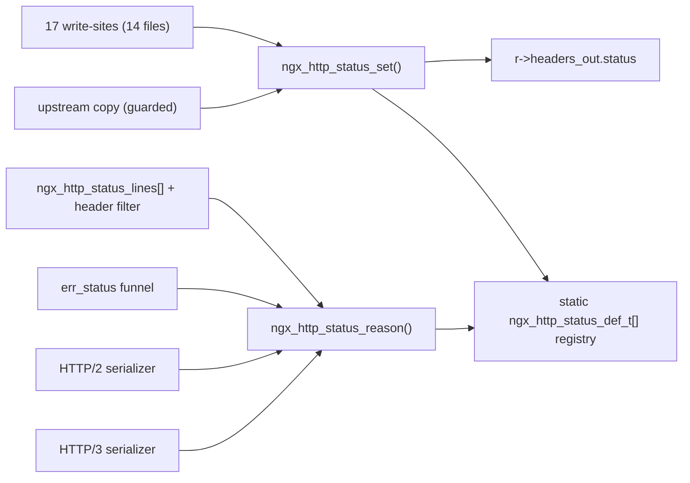

# Source → Target Traceability Matrix

This document provides a **bidirectional** traceability matrix for the nginx 1.29.5 HTTP status-code registry refactor, which centralizes every status write and reason lookup behind the new registry API in `src/http/ngx_http_status.c` and `src/http/ngx_http_status.h`. It records a **forward mapping** — every source construct traced to the target implementation that replaces it — and a **reverse mapping** — every target traced back to its originating source construct(s) — so that no change is unexplained and no target is orphaned. A **coverage summary** then asserts 100% coverage with no gaps, and a **changed-file inventory cross-check** reconciles the mappings against the complete set of files the refactor touches. Every source and file reference is written as inline code (never as a hyperlink) so this page renders cleanly under `mkdocs build --strict`.

## Forward Mapping

### Direct status write-sites → ngx_http_status_set()

17 assignments across 14 files; the OLD pattern `r->headers_out.status = CODE;` becomes `if (ngx_http_status_set(r, CODE) != NGX_OK) { /* log + fail */ }`.

| Source File | Line(s) | Old Construct | Target |
| --- | --- | --- | --- |
| `src/http/ngx_http_core_module.c` | L1781 | `r->headers_out.status = status;` | `ngx_http_status_set(r, status)` |
| `src/http/ngx_http_core_module.c` | L1859 | `r->headers_out.status = r->err_status;` | `ngx_http_status_set(r, r->err_status)` |
| `src/http/ngx_http_request.c` | L2838 | `mr->headers_out.status = rc;` | `ngx_http_status_set(mr, rc)` |
| `src/http/ngx_http_request.c` | L3915 | `r->headers_out.status = rc;` | `ngx_http_status_set(r, rc)` |
| `src/http/ngx_http_upstream.c` | L3165–L3166 | `r->headers_out.status = u->headers_in.status_n;` (and the `status_line` copy) | **guarded** `ngx_http_status_set()` — upstream pass-through, unvalidated |
| `src/http/modules/ngx_http_static_module.c` | L229 | `r->headers_out.status = NGX_HTTP_OK;` | `ngx_http_status_set(r, 200)` |
| `src/http/modules/ngx_http_autoindex_module.c` | L258 | `r->headers_out.status = NGX_HTTP_OK;` | `ngx_http_status_set(r, 200)` |
| `src/http/modules/ngx_http_not_modified_filter_module.c` | L94 | `r->headers_out.status = NGX_HTTP_NOT_MODIFIED;` | `ngx_http_status_set(r, 304)` |
| `src/http/modules/ngx_http_range_filter_module.c` | L234 | `r->headers_out.status = NGX_HTTP_PARTIAL_CONTENT;` | `ngx_http_status_set(r, 206)` |
| `src/http/modules/ngx_http_range_filter_module.c` | L618 | `r->headers_out.status = NGX_HTTP_RANGE_NOT_SATISFIABLE;` | `ngx_http_status_set(r, 416)` |
| `src/http/modules/ngx_http_slice_filter_module.c` | L176 | `r->headers_out.status = NGX_HTTP_OK;` | `ngx_http_status_set(r, 200)` |
| `src/http/modules/ngx_http_gzip_static_module.c` | L227 | `r->headers_out.status = NGX_HTTP_OK;` | `ngx_http_status_set(r, 200)` |
| `src/http/modules/ngx_http_image_filter_module.c` | L594 | `r->headers_out.status = NGX_HTTP_OK;` | `ngx_http_status_set(r, 200)` |
| `src/http/modules/ngx_http_mp4_module.c` | L678 | `r->headers_out.status = NGX_HTTP_OK;` | `ngx_http_status_set(r, 200)` |
| `src/http/modules/ngx_http_flv_module.c` | L187 | `r->headers_out.status = NGX_HTTP_OK;` | `ngx_http_status_set(r, 200)` |
| `src/http/modules/ngx_http_dav_module.c` | L296 | `r->headers_out.status = status;` (variable) | `ngx_http_status_set(r, status)` |
| `src/http/modules/ngx_http_stub_status_module.c` | L137 | `r->headers_out.status = NGX_HTTP_OK;` | `ngx_http_status_set(r, 200)` |

Count: `ngx_http_core_module.c` (2) + `ngx_http_request.c` (2) + `ngx_http_upstream.c` (1) + 11 module files (12 assignments, `ngx_http_range_filter_module.c` has 2) = **17 assignments across 14 files**.

### Reason-phrase, error funnel, and protocol serializers → ngx_http_status_reason()

| Source File | Line(s) | Old Construct | Target |
| --- | --- | --- | --- |
| `src/http/ngx_http_header_filter_module.c` | L58 | `static ngx_str_t ngx_http_status_lines[]` (private class-offset table) | migrated/retired — reason text served by `ngx_http_status_reason()` |
| `src/http/ngx_http_header_filter_module.c` | L240–L254 | offset-index lookup `ngx_http_status_lines[status]` (with `NGX_HTTP_OFF_3XX` etc.) | `ngx_http_status_reason(status)`; the `status_line.len` fast-path at L214–L216 is retained |
| `src/http/ngx_http_special_response.c` | L426–L806 (handler L666) | `err_status` funnel (`r->err_status = error;`) + offset math `r->err_status - NGX_HTTP_MOVED_PERMANENTLY + NGX_HTTP_OFF_3XX` | funnel delegates the default reason to `ngx_http_status_reason()`; per-code HTML tables (`ngx_http_error_301_page` … `ngx_http_error_411_page`) preserved verbatim |
| `src/http/v2/ngx_http_v2_filter_module.c` | L166, L199, L419, L427 | status `switch` + `ngx_sprintf(pos, "%03ui", r->headers_out.status)` serialization | status text sourced from the registry via `ngx_http_status_reason()` |
| `src/http/v3/ngx_http_v3_filter_module.c` | L123–L152, L332–L342 | status reads + `%03ui` serialization | status text sourced from the registry via `ngx_http_status_reason()` |

The custom error-page HTML tables are preserved verbatim and the header filter's `status_line.len` fast-path is retained; only the *source* of the default reason phrase is centralized, so the wire output is byte-identical when validation is disabled.

### Registry/API core, declarations, and build wiring

| Target File | Transformation | Source / Origin | Notes |
| --- | --- | --- | --- |
| `src/http/ngx_http_status.h` | CREATE | modeled on `src/http/ngx_http_request.h` | defines `ngx_http_status_def_t { code, reason, flags, rfc_section }`, the `NGX_HTTP_STATUS_*` flag macros (`CACHEABLE`, `CLIENT_ERROR`, `SERVER_ERROR`, `INFORMATIONAL`), and the API prototypes |
| `src/http/ngx_http_status.c` | CREATE | generalizes the `ngx_http_status_lines[]` idiom from `src/http/ngx_http_header_filter_module.c` | static registry array (O(1) index, <1 KB, read-only after init) + `ngx_http_status_set` / `ngx_http_status_validate` / `ngx_http_status_reason` / `ngx_http_status_register` / `ngx_http_status_is_cacheable` (each ≤ 50 lines) |
| `src/http/ngx_http.h` | UPDATE | itself | add the include/declaration so every HTTP translation unit sees the API (no per-module `#include` needed) |
| `src/http/ngx_http_request.h` | UPDATE | itself | add the status-definition type + flag macros; **retain** `status` (L263), `status_line` (L264), `err_status` (L454), and all 45 `NGX_HTTP_*` constants |
| `src/http/ngx_http_request.c` | UPDATE | itself | registry initialization (configuration phase, pre-fork) + write-site conversions at L2838 and L3915 |
| `auto/options` | UPDATE | itself | add the `HTTP_STATUS_VALIDATION=NO` default, the `--with-http_status_validation` case arm (sets `YES`), and help text — distinct from the pre-existing `HTTP_STATUS` variable |
| `auto/modules` | UPDATE | itself | `HTTP_SRCS += src/http/ngx_http_status.c`; `HTTP_DEPS += src/http/ngx_http_status.h` in the core HTTP module block — **deviation (c)**: the AAP literally named `auto/sources`, but this tree wires the HTTP core srcs/deps in `auto/modules` (see `decision_log.md`) |

## Reverse Mapping

This direction confirms that no target implementation is orphaned: every symbol and file introduced or modified by the refactor traces back to a concrete source construct, or is explicitly marked **NEW** where no prior construct existed.

| Target (symbol / file) | Originating Source Construct(s) | Notes |
| --- | --- | --- |
| `ngx_http_status_set()` | the 17 direct write-sites across 14 files (Phase 2) + the upstream copy | single sanctioned write seam (Mediator); the upstream path is guarded/unvalidated |
| `ngx_http_status_reason()` | `ngx_http_status_lines[]` table + header-filter offset lookup (L240–L254) + `err_status` funnel + HTTP/2 serializer + HTTP/3 serializer | single read seam (Facade); seeds identical phrases so wire output is unchanged |
| `ngx_http_status_validate()` | **NEW** — no prior source construct (validation did not previously exist) | compile-time gated by `#ifdef NGX_HTTP_STATUS_VALIDATION`; strict vs. standard mode |
| `ngx_http_status_is_cacheable()` | **NEW** — consolidates ad-hoc, per-module cacheability checks | flag test (`NGX_HTTP_STATUS_CACHEABLE`) against the registry |
| `ngx_http_status_register()` | **NEW** — no prior construct | seeds the registry during the configuration phase only (no runtime mutation) |
| static `ngx_http_status_def_t[]` registry | generalizes the `ngx_http_status_lines[]` offset-index idiom | O(1) direct index, <1 KB/worker, read-only after init, lock-free |
| `src/http/ngx_http_status.h` / `src/http/ngx_http_status.c` | new files modeled on `ngx_http_request.h` and `ngx_http_header_filter_module.c` | the registry/API core |
| `NGX_HTTP_STATUS_VALIDATION` compile define | `auto/options` (switch) + `auto/modules` (source wiring) | emitted into `objs/ngx_auto_config.h`; default OFF |

## Coverage Summary

**Coverage is 100% with no gaps.** All 17 direct write-sites, the `ngx_http_status_lines[]` reason-phrase table, the `err_status` funnel, and both the HTTP/2 and HTTP/3 serializers are mapped in the forward direction and are accounted for in the reverse direction. Every new symbol that has no antecedent — `ngx_http_status_validate()`, `ngx_http_status_is_cacheable()`, and `ngx_http_status_register()` — is explicitly labelled **NEW** rather than left unmapped, so the reverse mapping is complete.

### Changed-file inventory cross-check

The full refactor touches **35 files = 11 created + 24 updated**. The forward and reverse mappings above reference the code-affecting subset of this inventory; the remaining entries are documentation and rule-mandated deliverables.

**Created (11):**

- `src/http/ngx_http_status.c`
- `src/http/ngx_http_status.h`
- `docs/api/status_codes.md`
- `docs/migration/status_code_api.md`
- `CHANGES`
- `CODE_REVIEW.md`
- `docs/refactor/decision_log.md`
- `docs/refactor/traceability_matrix.md`
- `docs/presentation/executive_summary.html`
- `docs/observability/observability.md`
- `docs/observability/status_metrics_dashboard.json`

**Updated (24):**

- `src/http/ngx_http.h`
- `src/http/ngx_http_request.h`
- `src/http/ngx_http_request.c`
- `src/http/ngx_http_core_module.c`
- `src/http/ngx_http_upstream.c`
- `src/http/modules/ngx_http_static_module.c`
- `src/http/modules/ngx_http_autoindex_module.c`
- `src/http/modules/ngx_http_not_modified_filter_module.c`
- `src/http/modules/ngx_http_range_filter_module.c`
- `src/http/modules/ngx_http_slice_filter_module.c`
- `src/http/modules/ngx_http_gzip_static_module.c`
- `src/http/modules/ngx_http_image_filter_module.c`
- `src/http/modules/ngx_http_mp4_module.c`
- `src/http/modules/ngx_http_flv_module.c`
- `src/http/modules/ngx_http_dav_module.c`
- `src/http/modules/ngx_http_stub_status_module.c`
- `src/http/ngx_http_header_filter_module.c`
- `src/http/ngx_http_special_response.c`
- `src/http/v2/ngx_http_v2_filter_module.c`
- `src/http/v3/ngx_http_v3_filter_module.c`
- `auto/options`
- `auto/modules`
- `mkdocs.yml`
- `README.md`

The build-wiring file is `auto/modules` (**deviation (c)**); the AAP literally named `auto/sources`, but this tree wires the HTTP core srcs/deps in `auto/modules`, as recorded in `decision_log.md`.

## Overview Diagram

