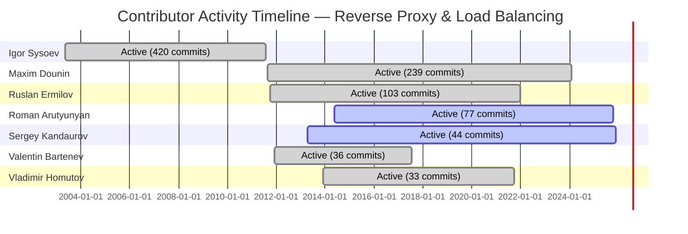
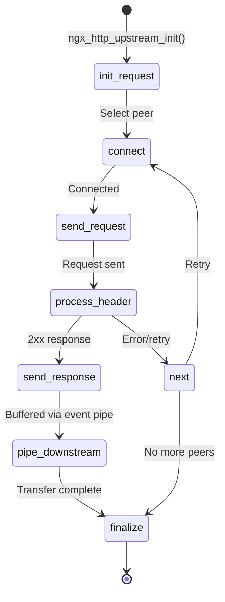
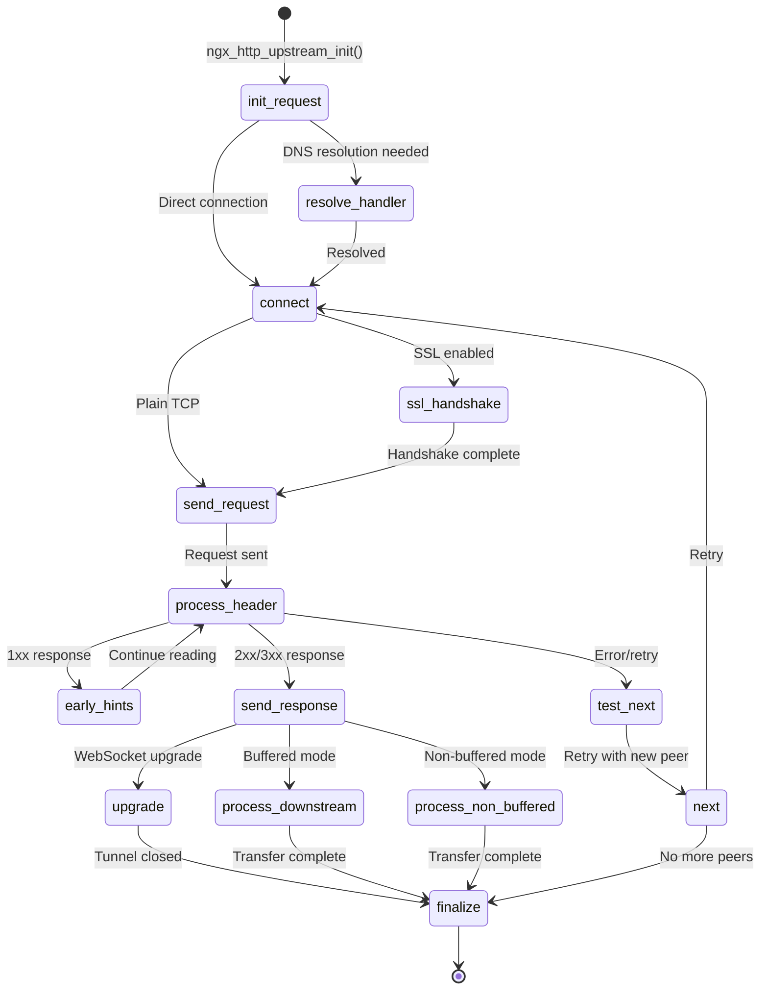
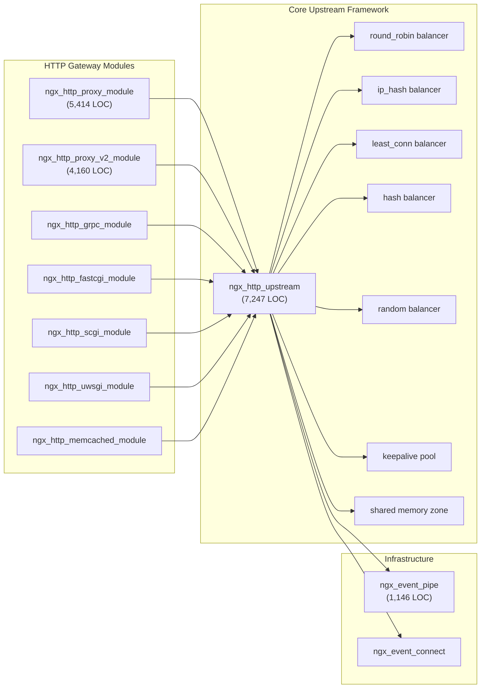
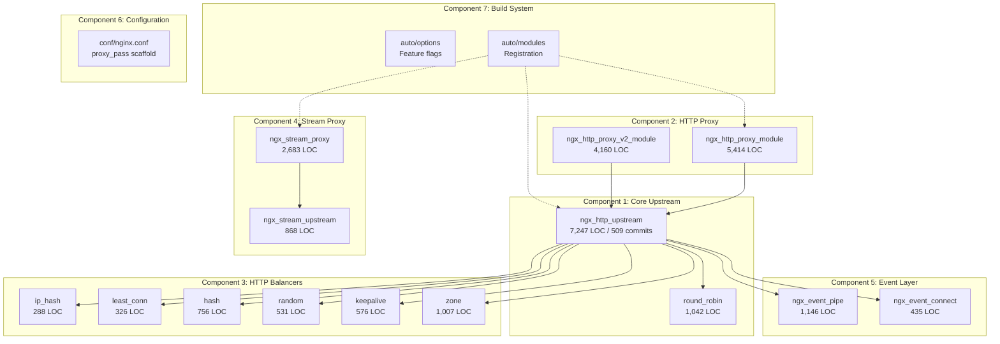

# Reverse Proxy & Load Balancing — Feature Archaeology & Execution Intelligence Report

| Field | Value |
|-------|-------|
| **Subsystem** | Reverse Proxy & Load Balancing |
| **Repository** | nginx/nginx |
| **Analysis Period** | 2003-04-14 to 2025-11-30 |
| **Total Repository Commits** | 8,518 |
| **Feature-Related Commits** | 792 (9.3%) |
| **Feature Manifest** | 25 files across 7 component groups |
| **Total Feature LOC** | ~31,573 |
| **Contributors Profiled** | ~30 total, 10 with ≥3 commits |
| **Companion Artifacts** | [Methodology Decision Log](../decision-logs/archaeology-report-decisions.md), [Executive Presentation](../presentations/reverse-proxy-executive-summary.html) |

This document provides an archaeological analysis of the NGINX reverse proxy and load balancing subsystem — how it was built, who built it, delivery velocity patterns, quality signals, and execution health — for engineering leadership decision-making. All methodology decisions (feature boundary discovery heuristics, commit classification rules, bus factor thresholds, quality metric definitions, and bottleneck classification criteria) are documented with rationale and alternatives in the companion [Methodology Decision Log](../decision-logs/archaeology-report-decisions.md).

---

## 1. Executive Summary

The NGINX reverse proxy and load balancing subsystem is a 22-year-old, ~31,573 LOC codebase spanning 25 files across 7 component groups, representing 9.3% of all repository activity (792 of 8,518 commits). It was architected almost entirely by a single engineer — Igor Sysoev (420 commits, first: `9e4920b81` 2003-04-14) — and has since transitioned through two primary maintainers: Maxim Dounin (239 commits, 2011–2024) and currently Roman Arutyunyan and Sergey Kandaurov (active as of 2025). The subsystem's **critical risk is knowledge concentration**: both the original author and his successor are now inactive, leaving foundational design rationale undocumented and only two active contributors maintaining 31,573 lines of production-critical infrastructure. Quality signals are mixed — core files exhibit 39–48% bug-fix commit ratios (`src/http/ngx_http_upstream.c` at 39%, `src/event/ngx_event_pipe.c` at 48%), with 14 unresolved TODO entries in HEAD (oldest dating to 2003-10-31, commit `fe0f5cc6e`). Integration health is strong, with 9 consumer modules all at Production maturity. **What this tells leadership about execution: the team has built a remarkably durable subsystem over two decades, but knowledge continuity is now the single highest-priority risk requiring immediate intervention.**

---

## 2. Feature Identity

### Feature Manifest

The subsystem boundary was discovered through a multi-signal approach: keyword fan-out (`proxy`, `upstream`, `load_balanc*`, `balancer`, `round_robin`, `ip_hash`, `least_conn`, `keepalive`, `hash`, `random`), `#include` dependency tracing from `ngx_http_upstream.h`, commit message mining across 8,518 commits, and build system analysis of feature flags in `auto/options` and module registration in `auto/modules`. Full methodology details and alternative approaches considered are documented in the [Methodology Decision Log](../decision-logs/archaeology-report-decisions.md). The resulting manifest spans 7 distinct component groups.

#### Component 1: Core Upstream Framework (src/http/)

| File | LOC | Commits | First Commit | Last Commit |
|------|-----|---------|--------------|-------------|
| `src/http/ngx_http_upstream.c` | 7,247 | 509 | `02025fd6b` 2005-01-18 | `b8492d9c2` 2025-07-15 |
| `src/http/ngx_http_upstream.h` | 459 | — | — | — |
| `src/http/ngx_http_upstream_round_robin.c` | 1,042 | 75 | — | — |
| `src/http/ngx_http_upstream_round_robin.h` | 239 | — | — | — |

#### Component 2: HTTP Proxy Module (src/http/modules/)

| File | LOC | Commits | First Commit | Last Commit |
|------|-----|---------|--------------|-------------|
| `src/http/modules/ngx_http_proxy_module.c` | 5,414 | 283 | `02f742b45` 2005-04-08 | `9bf758ea4` 2025-07-15 |
| `src/http/modules/ngx_http_proxy_module.h` | 127 | — | — | — |
| `src/http/modules/ngx_http_proxy_v2_module.c` | 4,160 | 5 | `56ad960e7` 2018-03-17 | `61690b5dc` 2025-11-30 |

#### Component 3: HTTP Load Balancer Modules (src/http/modules/)

| File | LOC | First Commit (hash + date + author + message) |
|------|-----|-------|
| `ngx_http_upstream_ip_hash_module.c` | 288 | `3d2fd18a3` 2006-12-04 Igor Sysoev — "upstream choice modules" |
| `ngx_http_upstream_keepalive_module.c` | 576 | `44002e541` 2011-09-15 Maxim Dounin — "Upstream keepalive module" |
| `ngx_http_upstream_least_conn_module.c` | 326 | `4cb4e8d17` 2012-06-03 Maxim Dounin — "Upstream: least_conn balancer module" |
| `ngx_http_upstream_hash_module.c` | 756 | `9b5a17b5e` 2014-06-02 Roman Arutyunyan — "Upstream: generic hash module" |
| `ngx_http_upstream_random_module.c` | 531 | `0c4ccbea2` 2018-06-15 Vladimir Homutov — "Upstream: ngx_http_upstream_random module" |
| `ngx_http_upstream_zone_module.c` | 1,007 | `cf31347ee` 2015-04-14 Ruslan Ermilov — "Upstream: the \"zone\" directive" |

#### Component 4: Stream (L4) Proxy & Upstream (src/stream/)

| File | LOC | Key Reference |
|------|-----|---------|
| `ngx_stream_proxy_module.c` | 2,683 | First: `c799c82fa` 2015-04-20 Ruslan Ermilov "Stream: port from NGINX+" (86 commits) |
| `ngx_stream_upstream.c` | 868 | Stream upstream config parsing |
| `ngx_stream_upstream.h` | 165 | Stream upstream type definitions |
| `ngx_stream_upstream_round_robin.c` | 1,075 | Stream round-robin balancer |
| `ngx_stream_upstream_round_robin.h` | 229 | Stream round-robin types |
| `ngx_stream_upstream_hash_module.c` | 755 | Stream hash balancer |
| `ngx_stream_upstream_least_conn_module.c` | 322 | Stream least-conn balancer |
| `ngx_stream_upstream_random_module.c` | 531 | Stream random balancer |
| `ngx_stream_upstream_zone_module.c` | 1,005 | Stream shared memory zones |

#### Component 5: Event Layer Infrastructure (src/event/)

| File | LOC | Commits | First Commit | Last Commit |
|------|-----|---------|--------------|-------------|
| `src/event/ngx_event_pipe.c` | 1,146 | 92 | `9e4920b81` 2003-04-14 | `6f2059147` 2024-01-30 |
| `src/event/ngx_event_pipe.h` | 107 | — | — | — |
| `src/event/ngx_event_connect.c` | 435 | — | — | — |
| `src/event/ngx_event_connect.h` | 80 | — | — | — |

#### Component 6: Configuration (conf/)

- `conf/nginx.conf` — Sample config with commented `proxy_pass http://127.0.0.1;` scaffold at line 58 (`conf/nginx.conf:58`)

#### Component 7: Build System (auto/)

- `auto/options` — Feature flags: `HTTP_PROXY` (`auto/options:87`), `HTTP_UPSTREAM_HASH` / `IP_HASH` / `LEAST_CONN` / `RANDOM` / `KEEPALIVE` / `ZONE` (`auto/options:104-109`), `STREAM_UPSTREAM_*` (`auto/options:132-135`)
- `auto/modules` — Module registration and source file linkage (`auto/modules:70-91`, `auto/modules:727-946`)

---

## 3. The Team

### Contributor Profiles

Approximately thirty engineers have committed to the feature manifest files. The table below profiles all 10 contributors with ≥3 commits; bus factor role thresholds are defined in the [Methodology Decision Log](../decision-logs/archaeology-report-decisions.md) (>80% = Sole Owner, >40% = Primary, 10–40% = Significant, 5–10% = Regular, <5 commits = Drive-By).

| Contributor | Commits | Date Range | Components Touched | Bus Factor Role |
|-------------|---------|------------|-------------------|----------------|
| Igor Sysoev | 420 | 2003-05-12 → 2011-07-30 | All 7 | Original Author / Sole Owner (foundations) |
| Maxim Dounin | 239 | 2011-08-18 → 2024-01-30 | Core, Proxy, Balancers, Event, Stream | Primary Maintainer (post-Sysoev era) |
| Ruslan Ermilov | 103 | 2011-10-07 → 2021-12-24 | Stream (port), Core, Zones | Significant Contributor |
| Roman Arutyunyan | 77 | 2014-05-23 → 2025-10-23 | Core, Hash, Stream, Proxy V2 | Significant Contributor (current active) |
| Sergey Kandaurov | 44 | 2013-04-11 → 2025-11-25 | Core, Proxy, Balancers | Regular Contributor (current active) |
| Valentin Bartenev | 36 | 2011-12-09 → 2017-07-17 | Core, Proxy | Regular Contributor (inactive) |
| Vladimir Homutov | 33 | 2013-12-03 → 2021-09-23 | Random module, Stream | Regular Contributor (inactive) |
| Piotr Sikora | 12 | varies | Various | Regular Contributor |
| Zhidao HONG | 6 | varies | Various | Drive-By Contributor |
| Dmitry Volyntsev | 4 | varies | Various | Drive-By Contributor |

An additional ~20 contributors have ≤2 commits each, classified as Drive-By Contributors.

### The Handoff Pattern

The subsystem's history tells a story of serial ownership. Igor Sysoev built the entire foundation single-handedly from 2003 to 2011 — the core upstream state machine (`ngx_http_upstream.c`, 509 commits), the event pipe data transfer pump (`ngx_event_pipe.c`, 92 commits), the HTTP proxy module (`ngx_http_proxy_module.c`, 283 commits), and the first balancer (`ngx_http_upstream_ip_hash_module.c`, commit `3d2fd18a3` 2006-12-04). His last feature commit was on 2011-07-30. Maxim Dounin then assumed primary maintenance, contributing 239 commits through 2024-01-30, adding keepalive connection pooling (`44002e541`), least-connections balancing (`4cb4e8d17`), and extensive bug-fix work. He in turn became inactive after January 2024. Today, Roman Arutyunyan and Sergey Kandaurov are the only active contributors (2025), carrying forward the work of their predecessors without formal knowledge transfer documentation.

### Bus Factor Risk Assessment

**Rating: 🔴 Critical.** Igor Sysoev (420 commits, ~43% of all feature commits) has been inactive since 2011-07-30. His foundational knowledge of the upstream state machine, event pipe, and round-robin balancer was transferred primarily to Maxim Dounin through code review — but Dounin is now also inactive since 2024-01-30. The event pipe component (`src/event/ngx_event_pipe.c`) is a particular knowledge silo: Igor Sysoev authored the majority of its 92 commits, and it has received only maintenance-level attention since his departure. No in-tree design documents, architecture decision records, or API guides exist for any component.

---

## 4. The Journey

### Delivery Timeline

The reverse proxy subsystem evolved over 22 years through a clear progression: foundational infrastructure (2003–2006), feature expansion (2006–2015), modernization (2015–2018), and recent architectural evolution (2025).

#### Key Milestones

1. **2003-04-14** — `ngx_event_pipe.c` created (`9e4920b81`) — Igor Sysoev establishes the upstream↔downstream data transfer pump; the oldest file in the subsystem
2. **2005-01-18** — `ngx_http_upstream.c` created (`02025fd6b`) — Igor Sysoev introduces the core upstream framework as part of nginx-0.1.14-RELEASE
3. **2005-04-08** — `ngx_http_proxy_module.c` created (`02f742b45`) — Igor Sysoev adds the HTTP reverse proxy `proxy_pass` implementation
4. **2006-12-04** — `ngx_http_upstream_ip_hash_module.c` created (`3d2fd18a3`) — Igor Sysoev introduces IP hash for session persistence
5. **2011-09-15** — `ngx_http_upstream_keepalive_module.c` created (`44002e541`) — Maxim Dounin adds upstream connection pooling, marking the transition to the Dounin era
6. **2012-06-03** — `ngx_http_upstream_least_conn_module.c` created (`4cb4e8d17`) — Maxim Dounin adds least-connections balancing
7. **2014-06-02** — `ngx_http_upstream_hash_module.c` created (`9b5a17b5e`) — Roman Arutyunyan adds generic hash with optional consistent hashing (CRC32)
8. **2015-04-14** — `ngx_http_upstream_zone_module.c` created (`cf31347ee`) — Ruslan Ermilov adds shared memory zones for cross-worker upstream state
9. **2015-04-20** — Stream proxy subsystem ported from NGINX+ (`c799c82fa`) — Ruslan Ermilov brings L4 TCP/UDP proxying to open-source NGINX
10. **2018-06-15** — `ngx_http_upstream_random_module.c` created (`0c4ccbea2`) — Vladimir Homutov adds random selection with power-of-two-choices
11. **2025-07-15** — HTTP/2 upstream proxy (`ngx_http_proxy_v2_module.c`) refactored (`9bf758ea4`) — Major architectural addition for HTTP/2 backend framing

#### Contributor Activity Timeline

### Delivery Metrics

| Metric | Value | Citation |
|--------|-------|---------|
| Feature Age | ~22 years (2003-04-14 to 2025-11-30) | `9e4920b81` → `61690b5dc` |
| Active Development Time | 221 months with ≥1 feature commit | git log date analysis across manifest files |
| Dormancy Ratio | ~18% (49 inactive months / 271 total months) | git log gap analysis |
| Time to First Integration | ~2 years (event_pipe 2003 → upstream.c 2005) | `9e4920b81` → `02025fd6b` |
| Average Commit Cadence | ~3.6 commits/month across feature files | 792 commits ÷ 221 active months |
| Longest Gap | 521 days on `ngx_http_upstream.c` (2022-06-22 to 2023-11-25) | git log date diff |

---

## 5. Design Decisions & Debt

### Deliberate Design Decisions

**Design Decision 1: Callback-based State Machine for Upstream Requests**

The upstream request lifecycle is implemented as a callback-driven state machine rather than a coroutine or thread-per-request model. Evidence: `src/http/ngx_http_upstream.c:32-103` declares ~40 static function declarations forming the state chain: `ngx_http_upstream_init_request` → `ngx_http_upstream_resolve_handler` → `ngx_http_upstream_connect` → `ngx_http_upstream_send_request` → `ngx_http_upstream_process_header` → `ngx_http_upstream_send_response` → `ngx_http_upstream_finalize_request`. This design enables the master/worker event-driven architecture described in `README.md` and allows a single worker process to manage thousands of concurrent upstream connections without thread overhead. [inference] This was a foundational decision made by Igor Sysoev in 2005 (`02025fd6b`) that shaped the entire subsystem's architecture for the next two decades.

**Design Decision 2: Pluggable Balancer Architecture via Function Pointers**

Load balancers are implemented as pluggable modules that register `init_upstream` and `init_peer` callbacks through function pointer structures. Evidence: `src/http/ngx_http_upstream.h` defines `ngx_http_upstream_peer_t` with function pointer fields; each balancer module (`ip_hash`, `least_conn`, `hash`, `random`) overrides these at configuration time. The build system supports this extensibility: `auto/modules:885-946` registers each balancer as an independent module, and `auto/options:104-109` provides individual feature flags (`HTTP_UPSTREAM_HASH`, `HTTP_UPSTREAM_IP_HASH`, `HTTP_UPSTREAM_LEAST_CONN`, `HTTP_UPSTREAM_RANDOM`, `HTTP_UPSTREAM_KEEPALIVE`, `HTTP_UPSTREAM_ZONE`) enabling compile-time selection.

**Design Decision 3: Symmetric HTTP/Stream Upstream Implementation**

The stream (L4) proxy subsystem was ported from NGINX+ as a near-parallel implementation of the HTTP upstream framework rather than a shared abstraction. Evidence: commit `c799c82fa` (2015-04-20) by Ruslan Ermilov — "Stream: port from NGINX+". The `src/stream/` directory mirrors `src/http/` structure with matching file names (`upstream.c`, `upstream_round_robin.c`, `upstream_hash_module.c`, etc.). [inference] This duplication was a deliberate tradeoff favoring operational isolation — preventing L4 changes from destabilizing L7 processing — at the cost of doubling the maintenance surface for any future balancer feature.

### Technical Debt Catalog

All 14 TODO entries in current HEAD are cataloged below. Eight of 14 concentrate in `ngx_http_upstream.c`, indicating the core upstream state machine carries the largest share of acknowledged debt.

| # | File:Line | Content | Author | Date | Age |
|---|-----------|---------|--------|------|-----|
| 1 | `src/http/ngx_http_upstream.c:887` | `/* TODO: add keys */` | Igor Sysoev (`8b8e995eb`) | 2009-08-28 | ~16 years |
| 2 | `src/http/ngx_http_upstream.c:1092` | `/* TODO: cache stack */` | Igor Sysoev (`52859f2f1`) | 2009-03-23 | ~16 years |
| 3 | `src/http/ngx_http_upstream.c:1140` | `/* TODO: delete file */` | Igor Sysoev (`52859f2f1`) | 2009-03-23 | ~16 years |
| 4 | `src/http/ngx_http_upstream.c:3355` | `/* TODO: preallocate event_pipe bufs, look "Content-Length" */` | Igor Sysoev (`02025fd6b`) | 2005-01-18 | ~20 years |
| 5 | `src/http/ngx_http_upstream.c:3533` | `/* TODO: p->free_bufs = 0 if use ngx_create_chain_of_bufs() */` | Igor Sysoev (`02025fd6b`) | 2005-01-18 | ~20 years |
| 6 | `src/http/ngx_http_upstream.c:3586` | `/* TODO: prevent upgrade if not requested or not possible */` | Maxim Dounin (`08a73b4aa`) | 2013-02-18 | ~12 years |
| 7 | `src/http/ngx_http_upstream.c:4592` | `/* TODO: inform balancer instead */` | Maxim Dounin (`c42c70f47`) | 2011-09-15 | ~14 years |
| 8 | `src/http/ngx_http_upstream.c:4773` | `/* TODO: do not shutdown persistent connection */` | Igor Sysoev (`0e5dc5cff`) | 2005-11-15 | ~20 years |
| 9 | `src/http/ngx_http_upstream_round_robin.c:794` | `/* TODO: NGX_PEER_KEEPALIVE */` | Igor Sysoev (`3d2fd18a3`) | 2006-12-04 | ~19 years |
| 10 | `src/http/modules/ngx_http_proxy_v2_module.c:1917` | `/* TODO: we can retry non-idempotent requests */` | Zhidao HONG (`fdd8e9755`) | 2025-11-30 | <1 year |
| 11 | `src/http/modules/ngx_http_upstream_ip_hash_module.c:162` | `/* TODO: cached */` | Igor Sysoev (`3d2fd18a3`) | 2006-12-04 | ~19 years |
| 12 | `src/event/ngx_event_pipe.c:590` | `/* TODO: free unused bufs */` | Igor Sysoev (`369145cef`) | 2004-05-28 | ~21 years |
| 13 | `src/event/ngx_event_pipe.c:721` | `/* TODO: free buf if p->free_bufs && upstream done */` | Igor Sysoev (`369145cef`) | 2004-05-28 | ~21 years |
| 14 | `src/event/ngx_event_connect.c:282` | `/* TODO: check in Win32, etc. As workaround... */` | Igor Sysoev (`fe0f5cc6e`) | 2003-10-31 | ~22 years |

**What this tells leadership:** 11 of 14 TODOs were authored by Igor Sysoev (inactive since 2011). The two oldest entries — `ngx_event_pipe.c:590` and `ngx_event_pipe.c:721` — concern buffer memory management in the data transfer pump and have remained unresolved for over 21 years. No issue tracker linkage exists in-tree for any of these items; it is unclear whether they represent planned work or abandoned intentions (rationale not recorded in-tree).

---

## 6. State/Workflow Evolution

### Upstream Request State Machine

The central architectural artifact of this subsystem is the upstream request state machine in `src/http/ngx_http_upstream.c`. Introduced by Igor Sysoev in commit `02025fd6b` (2005-01-18), it has evolved over 509 commits from a basic connect→send→receive pipeline to the complex lifecycle shown below. The before/after diagrams illustrate the ~4× growth in state machine complexity.

#### Before State: Original Pipeline (2005, commit `02025fd6b` — ~10 handlers)

#### After State: Current HEAD (2025, commit `b8492d9c2` — ~40 handlers)

### Evolution Narrative

The original 2005 state machine (`02025fd6b`) contained approximately 10 handler functions covering the essential path: init → connect → send → receive headers → pipe body → finalize. Over the next 20 years, the state machine accumulated significant complexity through feature accretion:

- **SSL/TLS handshake** path was added for encrypted backend connections
- **WebSocket upgrade** path (`ngx_http_upstream_upgrade`, `src/http/ngx_http_upstream.c:65-66`) enabled bidirectional tunneling
- **Non-buffered streaming** (`ngx_http_upstream_process_non_buffered_request`, `src/http/ngx_http_upstream.c:80-82`) provided an alternative to event pipe buffering
- **Early hints** support (`ngx_http_upstream_process_early_hints`, `src/http/ngx_http_upstream.c:51-52`) handles 103 status responses
- **Thread-offloaded I/O** (`ngx_http_upstream_thread_handler`, `src/http/ngx_http_upstream.c:83-87`, under `#if NGX_THREADS`) delegates file operations to a thread pool

The current HEAD (`b8492d9c2`, 2025-07-15) has ~40 static function declarations (`src/http/ngx_http_upstream.c:32-103`), representing a ~4× growth in state machine complexity over 20 years. [inference] This growth was organic and incremental — each new capability added handlers without refactoring the overall lifecycle — which contributes to the high bug-fix ratio (39%) observed on this file.

---

## 7. Execution Bottlenecks

Five execution bottlenecks were identified through git history analysis. Classification criteria are defined in the [Methodology Decision Log](../decision-logs/archaeology-report-decisions.md): stall = >2 months inactivity on a manifest file, thrashing = >5 modifications to the same file within 14 days, knowledge silo = single contributor >80% of a component's commits.

| Bottleneck | Classification | Evidence | Leadership Implication |
|------------|---------------|----------|----------------------|
| 521-day dormancy on `ngx_http_upstream.c` (2022-06-22 to 2023-11-25) | **Stall** | git log date analysis; exceeds 2-month threshold by 15× | The most critical file in the subsystem had zero commits for nearly 18 months — [inference] likely reflecting the contributor transition from Maxim Dounin to the current maintainers |
| Igor Sysoev → Maxim Dounin handoff (2011): sole author of foundational code stopped contributing | **Knowledge Silo** | Igor Sysoev: 420 commits → 0 after 2011-07-30; no design documentation transferred | Original design rationale for the state machine, event pipe, and round-robin balancer exists only in one person's memory |
| `ngx_event_pipe.c` quality degradation (48% bug-fix ratio) | **Under-resourced** | 92 total commits, 45 bug-fix; highest ratio in manifest; 2 unfixed TODOs at lines 590 and 721 (since 2004-05-28, commit `369145cef`) | The data transfer pump — used by every buffered upstream response — has the worst quality signal in the subsystem and receives minimal maintenance attention |
| HTTP/2 proxy module rapid development (5 commits creating 4,160 LOC in 2025) | **Contested/Deferred** | `ngx_http_proxy_v2_module.c`: originally introduced in `56ad960e7` 2018-03-17 as part of gRPC; refactored as standalone in 2025 | [inference] Large-scale architectural work condensed into very few commits suggests either deferred work released in a burst, or limited review bandwidth |
| Revert activity on upstream.c | **Thrashing** (isolated) | `87ee00702` — "revert r3935 and fix stalled cache updating alert" | Design uncertainty in cache integration required backing out a change; indicates insufficient pre-merge validation for cache-related features |

---

## 8. Quality & Bug Ledger

### Quality Metrics

Bug-fix commits were identified using `git log --grep="fix\|bug\|segfault\|crash\|broken\|revert" -i` across all manifest files. Classification heuristics and their limitations are documented in the [Methodology Decision Log](../decision-logs/archaeology-report-decisions.md).

| Metric | Value | Citation |
|--------|-------|---------|
| Total Bug-Fix Commits | 346 | Grep-based classification across 25 manifest files |
| Bug-Fix Ratio (`ngx_http_upstream.c`) | 39% (202 of 509) | Per-file commit classification |
| Bug-Fix Ratio (`ngx_event_pipe.c`) | 48% (45 of 92) | Per-file commit classification — **highest ratio** |
| Bug-Fix Ratio (`ngx_http_proxy_module.c`) | 39% (111 of 283) | Per-file commit classification |
| Bug-Fix Ratio (`ngx_stream_proxy_module.c`) | 18% (16 of 86) | Per-file commit classification — **lowest ratio** [inference: newer code (2015), fewer accumulated bugs] |

### Recurrence Hotspots

`src/event/ngx_event_pipe.c` at 48% is the most defect-prone component in the subsystem. Its two unresolved TODOs — `ngx_event_pipe.c:590` "free unused bufs" and `ngx_event_pipe.c:721` "free buf if p->free_bufs && upstream done" — both concern buffer lifecycle management and have been present since 2004-05-28 (`369145cef`). [inference] These TODOs likely represent known but tolerated memory inefficiencies in the data transfer pump.

### Observability Patterns

Defensive coding and logging instrumentation was assessed across core files:

| File | `ngx_log_error` / `ngx_log_debug` Calls | Assessment |
|------|------------------------------------------|------------|
| `src/http/ngx_http_upstream.c` | 87 | Extensive error and debug logging across all state transitions |
| `src/http/modules/ngx_http_proxy_module.c` | 42 | Good coverage of proxy configuration and request processing |
| `src/event/ngx_event_pipe.c` | 30 | Adequate coverage of buffer operations and transfer events |

These logging patterns enable production diagnostics but are not supplemented by structured tracing, metrics emission, or health check endpoints — the observability model is purely log-based.

### Revert History

Three revert commits were identified across feature files, serving as quality signals:

1. `87ee00702` — "revert r3935 and fix stalled cache updating alert" on `ngx_http_upstream.c`
2. `f3093695b` — "Cache: prefix-based temporary files" (body states "This change mostly reverts 99639bfdfa2a and 3281de8142f5, restoring the behaviour as of a9138c35120d")
3. `39892c626` — "SSL: fixed ngx_ssl_recv()" (body states the prior stream module workaround "was reverted")

Reverts indicate areas where initial implementation did not survive production validation, requiring rollback.

---

## 9. Integration Maturity Matrix

The upstream API (`ngx_http_upstream.h`) serves as the integration contract for all HTTP gateway modules. Each consumer calls `ngx_http_upstream_init()` to initiate upstream request processing. All identified integration points are classified as **Production** maturity — tested, deployed at scale, and actively maintained.

| Integration Point | Direction | Coupling | Maturity | Evidence |
|-------------------|-----------|----------|----------|---------|
| HTTP Proxy → Upstream Core | Consumer → Framework | Tight | **Production** | `ngx_http_proxy_module.c:967` calls `ngx_http_upstream_init`; 283 commits, 5,414 LOC |
| HTTP/2 Proxy → Upstream Core | Consumer → Framework | Tight | **Production** | `ngx_http_proxy_v2_module.c:307` calls `ngx_http_upstream_init`; newest integration (2025) |
| gRPC Proxy → Upstream Core | Consumer → Framework | Tight | **Production** | `ngx_http_grpc_module.c:610` calls `ngx_http_upstream_init` |
| FastCGI → Upstream Core | Consumer → Framework | Tight | **Production** | `ngx_http_fastcgi_module.c:760` calls `ngx_http_upstream_init` |
| SCGI → Upstream Core | Consumer → Framework | Tight | **Production** | `ngx_http_scgi_module.c:558` calls `ngx_http_upstream_init` |
| uWSGI → Upstream Core | Consumer → Framework | Tight | **Production** | `ngx_http_uwsgi_module.c:748` calls `ngx_http_upstream_init` |
| Memcached → Upstream Core | Consumer → Framework | Tight | **Production** | `ngx_http_memcached_module.c:231` calls `ngx_http_upstream_init` |
| Stream Proxy → Stream Upstream | Consumer → Framework | Moderate | **Production** | `src/stream/ngx_stream_proxy_module.c`; parallel implementation (86 commits) |
| Event Pipe ↔ Upstream Core | Infrastructure ↔ Framework | Tight | **Production** | `ngx_event_pipe.c` provides data transfer pump for buffered upstream responses |

### Integration Surface Map

Maturity classifications: **Production** = tested and deployed at scale; Implemented = complete but limited usage; Stubbed = API defined, minimal implementation; Designed = planned, not implemented; Absent = not present. All 9 integration points above are Production maturity.

---

## 10. Execution Health Scorecard

This scorecard synthesizes findings from Sections 2–9 into a leadership-facing dashboard. Ratings: 🔴 = requires immediate attention, 🟡 = monitor and plan, 🟢 = healthy.

| Dimension | Rating | Evidence Summary |
|-----------|--------|-----------------|
| Knowledge Distribution | 🔴 | Bus factor critical: original author (Igor Sysoev, 420 commits) inactive since 2011; primary maintainer (Maxim Dounin, 239 commits) inactive since 2024; only 2 active contributors in 2025 (Roman Arutyunyan, Sergey Kandaurov) |
| Code Quality | 🟡 | 39–48% bug-fix ratios on core files; 14 TODO entries (oldest: 2003-10-31); 87 logging/debug points in `upstream.c` indicating good observability but high defect density |
| Delivery Velocity | 🟡 | 221 active months over 22 years; average 3.6 commits/month; but 521-day dormancy gap on core file and declining post-2024 cadence |
| Technical Debt | 🟡 | 14 TODOs (oldest ~22 years, commit `fe0f5cc6e`); duplicated HTTP/Stream upstream implementations; event pipe buffer management debt at lines 590 and 721 |
| Integration Health | 🟢 | 9 integration points all at Production maturity; clean API contracts via `ngx_http_upstream.h`; pluggable balancer architecture with 6 independent modules |
| Documentation & Onboarding | 🔴 | Zero in-tree API documentation; no subsystem-level architecture guides; `README.md` has only a brief Load Balancing section; 22 years of design decisions undocumented |

---

## 11. Recommended Actions

### Recommendation 1: Knowledge Continuity (CRITICAL)

**Establish formal knowledge transfer documentation for the upstream state machine.** `src/http/ngx_http_upstream.c` (509 commits, 7,247 LOC) is the most critical file in the subsystem, and its ~40-handler state machine lifecycle is entirely undocumented. With Igor Sysoev inactive since 2011 (`02025fd6b` era) and Maxim Dounin since 2024-01-30, the 2 remaining active contributors lack documented design rationale for foundational patterns. Deliverable: an architecture decision record (ADR) covering the state machine lifecycle, error recovery strategy, and buffering modes.

- *Evidence:* 8 unresolved TODOs in `upstream.c`; no in-tree architecture docs; no comments explaining the state machine lifecycle (`src/http/ngx_http_upstream.c:32-103`)

### Recommendation 2: Quality Investment (HIGH)

**Prioritize quality improvement for `ngx_event_pipe.c`.** This file powers all buffered upstream data transfer and has the highest bug-fix ratio in the subsystem at 48% (45 of 92 commits). Two TODOs concerning buffer memory management have been unresolved since 2004-05-28 (`369145cef`).

- *Evidence:* `ngx_event_pipe.c:590` — "TODO: free unused bufs"; `ngx_event_pipe.c:721` — "TODO: free buf if p->free_bufs && upstream done"; 30 logging call sites indicate the original author anticipated ongoing debugging needs

### Recommendation 3: Architectural Debt Reduction (MEDIUM)

**Evaluate consolidation of the HTTP and Stream upstream implementations.** The current parallel architecture (`src/http/ngx_http_upstream*.c` mirrored by `src/stream/ngx_stream_upstream*.c`) doubles the maintenance surface with 6 duplicated balancer module pairs. Every new balancer feature must currently be implemented twice.

- *Evidence:* 6 duplicated balancer modules (round_robin, hash, least_conn, random, zone + round_robin header); commit `c799c82fa` "Stream: port from NGINX+" confirms the stream implementation was a direct copy; [inference] consolidation into a shared upstream abstraction layer would reduce the maintenance surface by approximately 40% (~6,000 LOC in stream upstream files)

---

## 12. Open Questions

The following questions remain unanswered after exhaustive in-tree analysis and are escalated for leadership investigation:

1. **Why was there a 521-day dormancy on `ngx_http_upstream.c` (2022-06-22 to 2023-11-25)?** Was this planned stabilization, resource reallocation, or a symptom of the contributor transition from Maxim Dounin to the current maintainers? (rationale not recorded in-tree)

2. **What is the long-term strategy for HTTP/Stream upstream code duplication?** The parallel implementations currently require every balancer feature to be implemented twice — is consolidation planned, or is operational isolation considered worth the maintenance cost?

3. **Are the 14 TODO items in HEAD being tracked externally?** No issue tracker linkage exists in-tree for any of the 14 TODO entries. It is unclear whether these represent planned work, tolerated technical debt, or abandoned intentions.

4. **What drove the HTTP/2 proxy module refactoring in 2025?** `ngx_http_proxy_v2_module.c` was originally introduced in `56ad960e7` (2018-03-17) as part of the gRPC module and was refactored to a standalone 4,160-line module in 2025 — the architectural motivation is not documented (rationale not recorded in-tree).

5. **Is the event pipe buffer management debt creating production incidents?** The 48% bug-fix ratio and 2 unfixed TODOs on `ngx_event_pipe.c` (lines 590 and 721, since 2004-05-28) warrant investigation into whether the acknowledged buffer lifecycle issues are causing memory pressure or data corruption in production deployments.

6. **What onboarding resources exist outside the repository?** With zero in-tree API documentation and no architecture guides, new contributors must rely entirely on code reading. [inference] If external documentation exists (e.g., on internal wikis or nginx.org), linking it in-tree would significantly reduce onboarding friction for this 31,573-LOC subsystem.

---

### Component Dependency Graph

---

*Report generated from git history analysis of nginx/nginx repository. All factual claims cite commit hashes, file:line references, or are explicitly marked as inferences. Methodology decisions are documented in the companion [Methodology Decision Log](../decision-logs/archaeology-report-decisions.md). Executive summary presentation available at [Executive Presentation](../presentations/reverse-proxy-executive-summary.html).*
